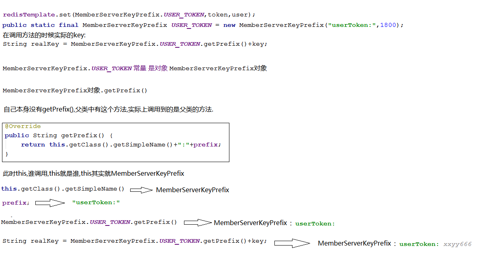

## 分布式session
1. 创建token,将token 保存到redis 中,为了避免key重复,                key=MemberServerKeyPrefix:user_token:token
2. 创建MemberServerKeyPrefix extends BaseKeyPrefix,定义User_token 常量
3. 在member-api 上创建cookieUtil,添加tomcat依赖

相关依赖:
```xml
<!-- tomcat依赖 -->
<dependency>
    <groupId>org.springframework.boot</groupId>
    <artifactId>spring-boot-starter-tomcat</artifactId>
    <!-- 仅仅是在编译时有效，真正打包时不会打包到项目中 -->
    <scope>provided</scope>
</dependency>
```

相关代码如下:
```java
public class BaseKeyPrefix implements KeyPrefix{
   @Override
   public String getPrefix() {
       return this.getClass().getSimpleName()+":"+prefix;   // 前缀设计 : 当前类名 + 前缀 + key
   }
}

//-------------前缀封装-----------------
public class MemberServerKeyPrefix extends BaseKeyPrefix {

    public MemberServerKeyPrefix() {}
    public MemberServerKeyPrefix(String prefix, int expireTime) {
        super(prefix, expireTime);
    }
    // 前缀 ： 当前类名 + user_token
    public static final MemberServerKeyPrefix  USER_TOKEN_PREFIX=new MemberServerKeyPrefix("user_token",30*60);

}

//------------保存用户端信息-----------
public class UserServiceImpl implements IUserService{
  private String createToken(User user) {
     String token=UUID.randomUUID().toString().replace("-","");
     // 保存token到redis中
     redisTemplate.set(MemberServerKeyPrefix.USER_TOKEN_PREFIX,token,user);
     return token;
  }
}
```
**封装cookie操作**
```java
public class CookieUtil  {

    public static final String USER_TOKEN_COOKIE  = "user_token_cookie";
    public static final int USER_COOKIE_AGE  = 30*60; //设置时间

    // 添加cookie
    public static void addCookie(HttpServletResponse response,String cookieName,int cookieAge,String value){
        Cookie cookie = new Cookie(cookieName, value);
        cookie.setDomain("localhost");// 设置网关的ip地址
        cookie.setPath("/");
        cookie.setMaxAge(cookieAge);
        response.addCookie(cookie);
    }
}
```



