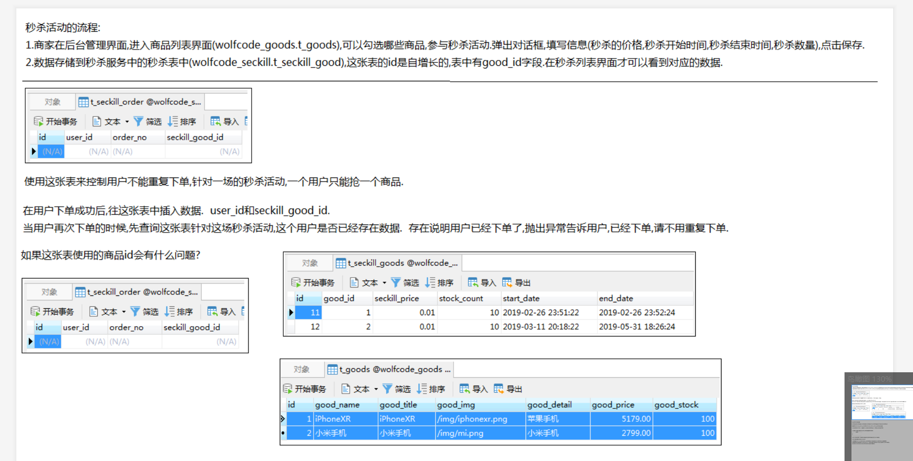
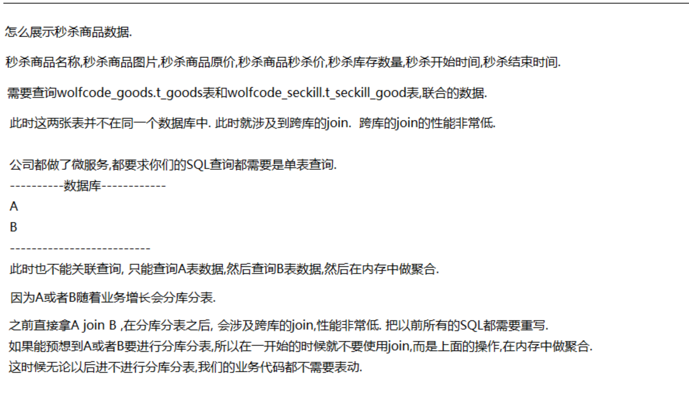
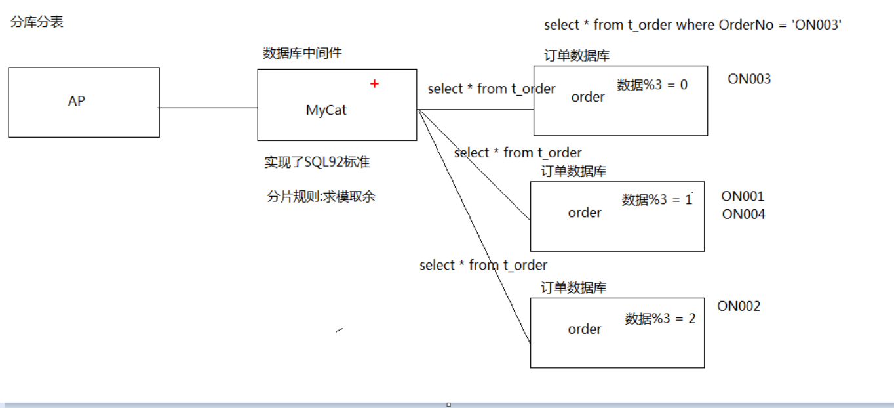

### 秒杀商品列表
秒杀活动的流程:
1. 商家在后台管理界面，进入商品列表界面,可以勾选哪些商品，参与秒杀活动，填写信息(秒杀的价格，秒杀开始时间，秒杀结束时间，秒杀数量)点击保存
2. 数据存储到秒杀服务中的秒杀表中，（t_seckill_good）这张表的id是自增长的，表中有good_id字段,在秒杀表界面才可以看到对应的数据
3. t_seckill_order : 防止重复下单,针对一场的秒杀活动，一个用户只能抢一个商品
* 在用户下单成功后，往这张表中插入数据,user_id和seckill_good_id
* 当用户再次下单的时候，先查询这张表针对这场秒杀活动，这个用户是否已经存在数据，存在说明用户已经下单了，抛出异常告诉用户，已经下单，请不要重复下单

#### 怎么展示秒杀商品数据?
* 秒杀商品名称，秒杀商品图片,秒杀商品原价，秒杀商品秒杀价，秒杀库存数量，秒杀开始时间,结束时间
* 需要查询t_goods表和seckill_good表联合的数据
此时这俩张表并不在同一个数据库中，此时就设计到跨库的join,跨库的join的性能非常低
* 公司都做了微服务，都要求你们sql查询都需要是单表查询
* 因为A或者B随着业务增长会分库分表
* 之前的Ajoin B ，在分库分表之后，会设计跨库的join,性能非常低

#### 分库分表原理:

