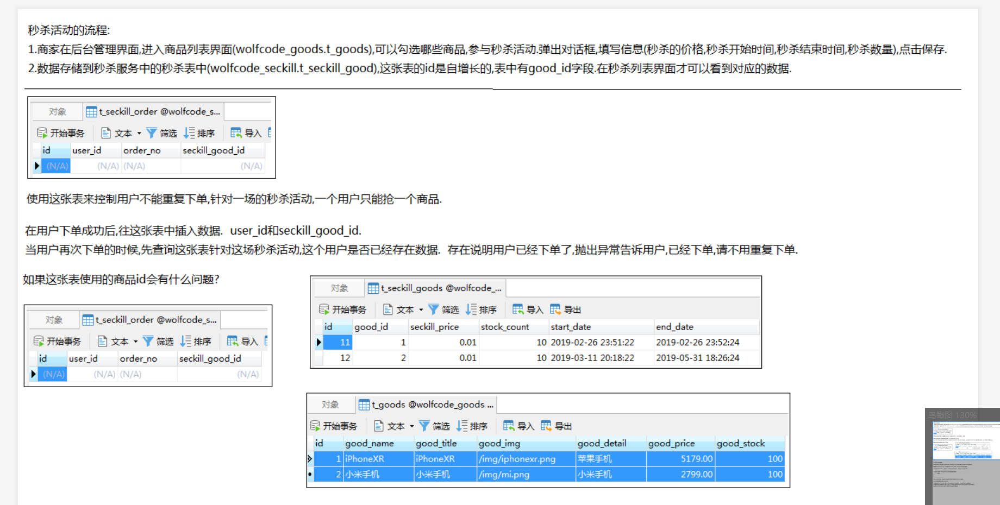
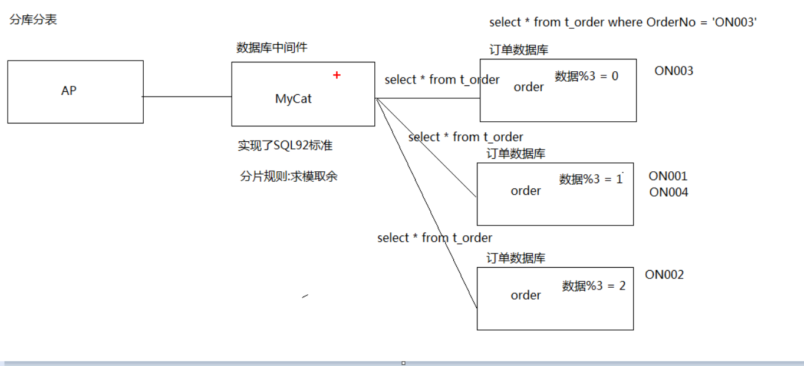
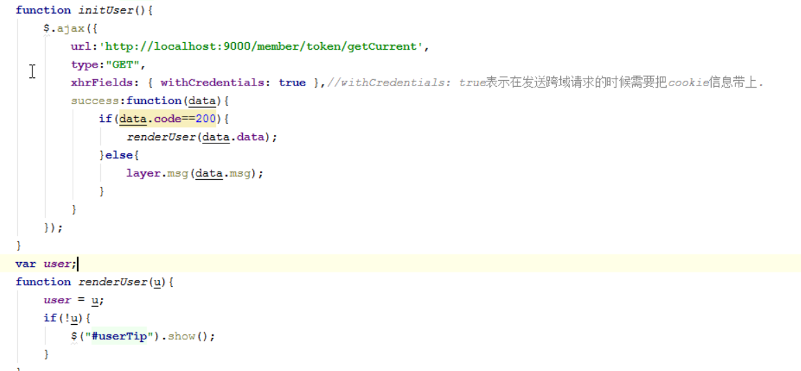

### 秒杀商品列表
秒杀活动的流程:
1. 商家在后台管理界面，进入商品列表界面,可以勾选哪些商品，参与秒杀活动，填写信息(秒杀的价格，秒杀开始时间，秒杀结束时间，秒杀数量)点击保存
2. 数据存储到秒杀服务中的秒杀表中，（t_seckill_good）这张表的id是自增长的，表中有good_id字段,在秒杀表界面才可以看到对应的数据
3. t_seckill_order : 防止重复下单,针对一场的秒杀活动，一个用户只能抢一个商品
* 在用户下单成功后，往这张表中插入数据,user_id和seckill_good_id
* 当用户再次下单的时候，先查询这张表针对这场秒杀活动，这个用户是否已经存在数据，存在说明用户已经下单了，抛出异常告诉用户，已经下单，请不要重复下单





#### 怎么展示秒杀商品数据?
* 秒杀商品名称，秒杀商品图片,秒杀商品原价，秒杀商品秒杀价，秒杀库存数量，秒杀开始时间,结束时间
* 需要查询t_goods表和seckill_good表联合的数据
此时这俩张表并不在同一个数据库中，此时就设计到跨库的join,跨库的join的性能非常低
* 公司都做了微服务，都要求你们sql查询都需要是单表查询
* 因为A或者B随着业务增长会分库分表
* 之前的Ajoin B ，在分库分表之后，会设计跨库的join,性能非常低


#### 分库分表原理:



## 项目搭建

#### 商品项目搭建
1. 创建good-api 和 good-server
2. 添加数据库相关依赖和bootstrap.yml
3. 在码云上添加good-server.yml,从配置中心中读取配置文件
4. 创建seckill-server项目
5. 定义zuul-server的路由规则

### 查询秒杀商品列表

需求分析: 秒杀商品数据显示包括商品数据和秒杀数据俩张表，在这里根据查询秒杀商品(t_seckill_good)查询对应的商品信息(t_good)，定义一个VO类封装俩张表中的信息


实现步骤:
1. 在秒杀服务中创建SeckillGoodController实现query方法
2. service 中查询所有的seckillGood对象
    |-- 根据seckillGood集合，获取对应的goodId集合{1,2}
    |-- 远程调用，把需要查询的商品{1,2}作为参数传递给商品服务，查询对应的Good对象集合
    |-- 循环，把Good和SeckillGood对象封装城seckillGood对象，返回
定义一个SeckillGoodVo 封装集成了Good和SeckillGood

```java
public List<SeckillGoodVo> selectSeckill() {
   //1. 查询秒杀商品数据,获取商品数据的 goodId
   List<SeckillGood> seckillGoods = seckillGoodMapper.selectList();

   //2. 封装 goodId 和 对应的商品信息
   Map<Long, SeckillGood> seckillGoodMap = new HashMap<>();
   for (SeckillGood seckillGood : seckillGoods) {
       seckillGoodMap.put(seckillGood.getId(), seckillGood);
   }

   //3. 远程调用查询商品数据
   Result<List<Good>> result = goodFeignApi.getGoodByIds(new ArrayList<>(seckillGoodMap.keySet()));
   // 如果获取失败则抛出异常
   if(result==null||result.hasError()){
       throw new BussinessException(SeckillServerCodeMsg.PRODUCT_RPC_ERROR);
   }

   //4. 遍历商品数据，将商品数据和秒杀数据封装成VO
   List<SeckillGoodVo> vos = new ArrayList<>();
   SeckillGoodVo vo = null;
   for (Good g : result.getData()) {
       //获取相关秒杀商品
       SeckillGood seckillGood = seckillGoodMap.get(g.getId());
       // 封装数据
       vo = new SeckillGoodVo();
       BeanUtils.copyProperties(g, vo);
       BeanUtils.copyProperties(seckillGood, vo);
       vos.add(vo);
   }
   return vos;
}
```

3. 远程调用good-server服务
  * good-api 定义GoodFeignApi接口
  * 定义hystrix/GoodFeignHystrix降级实现类，如果方法调用失败，返回兜底数据
  * good-server中定义GoodFeignClient远程调用实现类
4. 在good-server中创建server和mapper根据传入秒杀商品的ids查询商品数据

注意: 需要在服务方和调用方的启动类上加上 @EnableFeignClients,指定扫描当前包下的相关注解

```java
//---------服务调用接口----------
@FeignClient(name = "good-server",fallback = GoodFeignHystrix.class)
public interface GoodFeignApi {
    /**
     *  根据商品的 ids 查询商品数据
     */
    @RequestMapping("/good/getGoodByIds")
    Result<List<Good>> getGoodByIds(@RequestParam("ids") List<Long> ids);
}

//-----------定义降级服务方法-----------
@Component
public class GoodFeignHystrix implements GoodFeignApi {
    @Override
    public Result<List<Good>> getGoodByIds(List<Long> ids) {
        // 返回兜底数据
        return null;
    }
}

//------------服务提供实现类----------
@RestController
public class GoodFeignClient implements GoodFeignApi {
    @Autowired
    IGoodService goodService;

    @Override
    public Result<List<Good>> getGoodByIds(List<Long> ids) {
        List<Good> goods = goodService.listByIds(ids);
        return Result.success(goods);
    }
}
```

查询数据时，使用注解方式查询
```java
@Mapper
public interface GoodMapper {

    @SelectProvider(type = GoodSSelectProvider.class,method = "selectByIds")
    List<Good> selectByIds(@Param("ids") List<Long> ids);

    class GoodSSelectProvider{
        // 返回值为需要执行的sql语句
        public String selectByIds(@Param("ids")List<Long> ids){
            StringBuilder sb=new StringBuilder();

            sb.append("select * from t_goods ");
            if(ids!=null&&ids.size()>0){

                sb.append("where id in (");
                for (int i=0;i<ids.size();i++){
                    if(i==0){
                        sb.append(ids.get(i));
                    }else{
                        sb.append(","+ids.get(i));
                    }
                }
                sb.append(")");
            }
            return sb.toString();
        }
    }

}
```


5. 在Result中定义hasError,用于判断是否出现异常,当请求编码不是200时标识出错
    |-- 在seckill-server 定义SeckillCodeMsg封装异常信息
    |-- PRODUCT_RPC_ERROR :  500201 : 商品服务繁忙，请稍后重试
6. 如果调用商品列表为空时抛出异常
7. 在seckillService中定义统一异常 SeckillControllerAdvice
8. 在goods-service中定义统一异常 GoodControllerAdvice


## Cookie 的刷新问题

* 每次访问请求时，都需要携带cookie数据，更新redis 中的token的超时时间，更新浏览器cookie存活时间
* 每个请求都会经过zuul网关，因此自定义网关拦截器，在每次请求后进行token的设置


实现步骤：
1. zuulserver定义一个TokenRefreshFilter,在拦截请求之后进行cookie刷新
2. member 定义一个TokenFeignApi,定义refreshToken() 刷新redis服务器中token的存活时间方法
    * |-- 先判断token是否存在，存在才刷新时间
3. zuulServer需要添加 @EnableFeignClients 注解（服务调用方需要添加）
4. token 在redis 中刷新成功，才需要重新刷新cookie时间


相关代码逻辑如下:

```java
@Component
public class TokenRefreshFilter extends ZuulFilter {

    @Autowired
    TokenFeignApi tokenFeignApi;

    @Override
    public String filterType() {
        // 在每次请求后刷新token
        return POST_TYPE;
    }

    @Override
    public int filterOrder() {
        return 10;
    }

    @Override
    public boolean shouldFilter() {
        // 当浏览器中的cookie包含登陆token时才进行刷新
        RequestContext currentContext = RequestContext.getCurrentContext();
        HttpServletRequest request = currentContext.getRequest();
        String token = CookieUtil.getCookie(request, CookieUtil.USER_TOKEN_COOKIE);
        return !StringUtils.isEmpty(token);
    }

    @Override
    public Object run() throws ZuulException {
        // 远程调用会员服务，刷新token 存活时间
        RequestContext currentContext = RequestContext.getCurrentContext();
        HttpServletRequest request = currentContext.getRequest();
        HttpServletResponse response = currentContext.getResponse();
        String token = CookieUtil.getCookie(request, CookieUtil.USER_TOKEN_COOKIE);
        Result<Boolean> result = tokenFeignApi.refreshToken(token);

        // redis 中的token更新成功后，才更新cookie的时间
        if(result!=null&&result.getData()){
            CookieUtil.addCookie(response,CookieUtil.USER_TOKEN_COOKIE,CookieUtil.USER_COOKIE_AGE,token);
        }
        return null;
    }
}
```

Member 中重新设置redis服务器保存的token的存活时间

```java
public class UserServiceImpl implements IUserService {
  ...
  @Override
  public Boolean refreshToken(String token) {
      //1. 先判断redis中是否存在指定的token,存在才更新
      if(redisTemplate.exist(MemberServerKeyPrefix.USER_TOKEN_PREFIX,token)){
          //2. 更新redis中的token
          return redisTemplate.expire(MemberServerKeyPrefix.USER_TOKEN_PREFIX,token, CookieUtil.USER_COOKIE_AGE)>0;
      }
      return false;
  }
  ...
}
```


## 商品详情
 前端初始化请求
1. 获取商品id,发送请求获取商品数据
2. 初始化查询商品信息数据

商品数据回显
1. SeckillController 中抽取查询商品数据封装方法

### 显示秒杀时间
1. JsonFormat 日期格式化
  * 距离开始时间>0显示秒杀还没开始：秒杀倒计时
  * 距离结束时间>0 显示秒杀中
  * 其他情况，显示秒杀结束
2. 定义计时器: 每隔1s 执行一次
3. 设置立即秒杀按钮是否禁用的效果
    |-- 秒杀还没开始 -> 禁用
    |-- 秒杀中 -> 启用
    |-- 秒杀结束 -> 禁用

```js
var timer;  // 初始化订单数据时创建
var startRemainSecond; // 距离开始时间
var endRemainSecond;  // 距离结束时间
// 初始化距离开始时间和距离结束时间的秒数
function initTime(startTime, endDate) {// 初始化页面数据时调用
    var nowTime = new Date();
    startRemainSecond = parseInt((new Date(startTime).getTime() - nowTime.getTime()) / 1000);
    endRemainSecond = parseInt((new Date(endDate).getTime() - nowTime.getTime()) / 1000);
    showTime();
}

/* 显示倒计时时间 */
function showTime() {
    startRemainSecond--;
    endRemainSecond--;
    // 1. 如果距离开始时间>0---->距离秒杀开始还有xx秒
    //2. 如果距离开始时间<0 && 距离结束时间>0 ---->秒杀中
    //3. 如果距离结束时间< 0 ,----> 秒杀已结束
    if (startRemainSecond > 0) { // 秒杀还没开始
        $("#seckillTip").html("距离秒杀开始还有" + startRemainSecond + "秒");
        $("#buyButton").prop("disabled", true);
    } else if (endRemainSecond > 0) { // 秒杀中
        $("#seckillTip").html("秒杀中");
        $("#buyButton").prop("disabled", false);
    } else {
        clearInterval(timer);
        $("#seckillTip").html("秒杀已结束");
        $("#buyButton").prop("disabled", true);
    }
}
```

### 显示用户是否登陆

1. 页面初始化时，获取用户信息，判断是否有登陆
2. 编写请求getCurrent获取当前用户登陆的信息
    |-- CookieValue的使用,在方法参数中直接获取cookie值的数据
3. 从redis中获取登陆信息
    |-- 使用JsonIgnore忽略json对象重要字段



<br>


```
1.在SpringBoot中怎么配置拦截器?
MVC配置的规范接口WebMvcConfigurer

2.什么是数据库的乐观锁
乐观锁:事务A在操作时,乐观认为其他事务不会进来干扰自己
解决方案:
使用version版本号作为每次修改数据时的条件

3.复习一下MySQL的唯一索引的作用
唯一索引: 同一张表中保证数据字段的唯一性，项目中防止用户重复下单

4.复习redis中的hash数据结构
项目中使用hash 保存订单数据，作为数据缓存，防止多次访问sql数据库

5.提前了解QPS,TPS的概念

6.了解一下ConcurrentHashMap的作用
ConcurrentHashMap 使用分段锁机制，保证线程安全的同时提高开发效率
```
