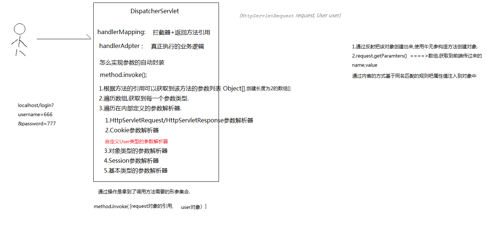
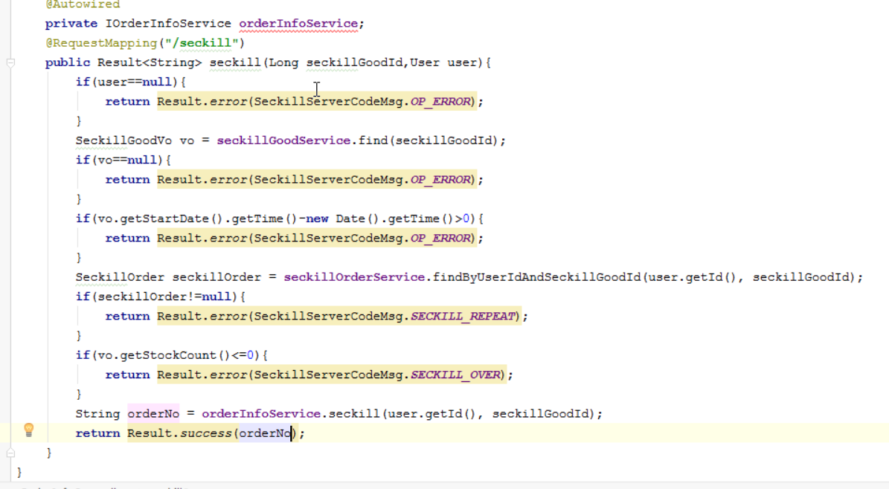
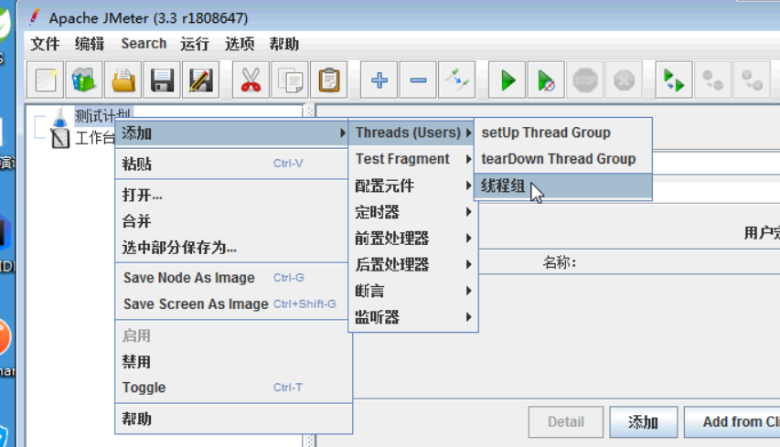
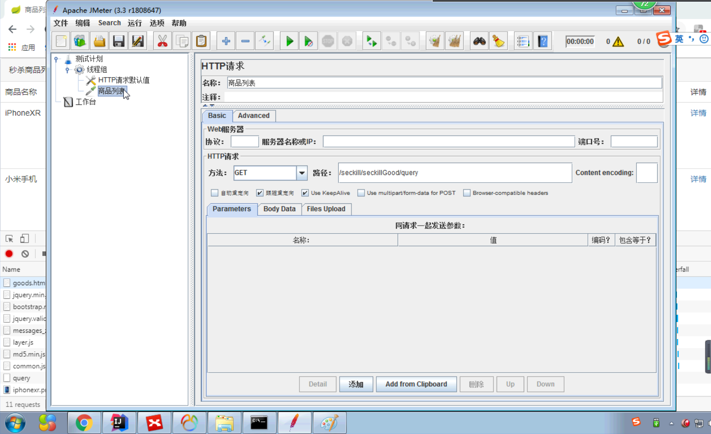
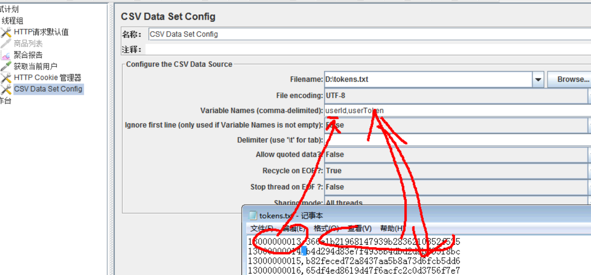
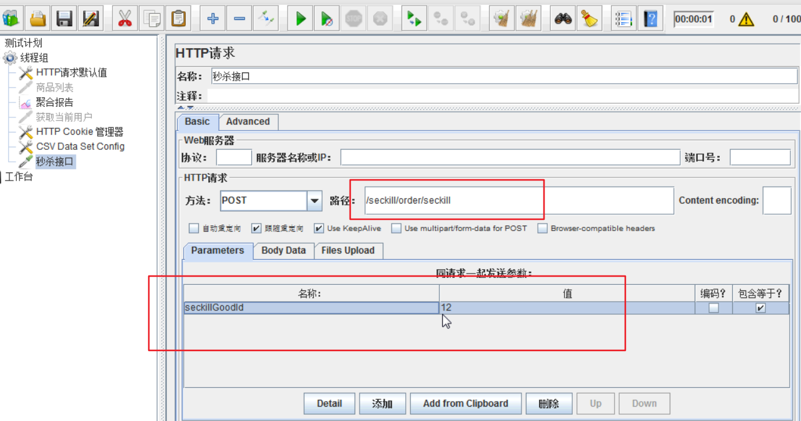

## 秒杀的逻辑分析:
1. 判断用户是否已经登陆
2. 判断秒杀是否已经开始
3. 判断用户是否已经秒杀过该商品了
4. 判断数据库中秒杀商品的库存是否足够
5. 秒杀逻辑(原子操作)
    |-- 对应的库存数量-1
    |-- 创建订单(t_order_info)
    |-- 创建秒杀订单

### 前端实现
```js
function doSeckill(){
  if(!user){
    layer.msg("您没有登陆，请先登陆");
    return;
  }
  $.ajax({
       url:"http://localhost:9000/seckill/order/seckill",
       type:"POST",
       data:{"seckillGoodId":seckillGoodId}
       xhrFields: { withCredentials: true },//withCredentials: true表示在发送跨域请求的时候需要把cookie信息带上.
       success:function(data){
           if(data.code==200){
             // 提示下单成功
           }else{
               layer.msg(data.msg);
           }
       },
       error:function () {
           layer.msg("客户端调用异常");
       }
   })
}
```


## 后端实现
1. 创建OrderInfo,SeckillOrder实体类
2. 创建OrderInfoController,定义seckill


### 自定义参数解析器

需求: 需要在多处地方获取用户登陆信息，可以自定义参数解析器

1. 在member中定义导入web依赖,编译时才有效
2. 创建WebConfig,实现WebMvcConfigurer,添加自定义的参数解析器
3. 自定义参数解析器
    |-- supportParamter ：当Springmvc遍历参数解析器的时候，第一个返回true的参数解析器去处理对应的参数
    |--如果是User类型，返回true
4. resolveArgument方法 : 返回的对象注入到对应处理器映射的方法上
    |-- 从cookie中获取token
    |-- 根据token 从redis中获取用户数据
5. seckill-server中引入redis相关配置

注意: zuulServer需要在启动类设置扫描包为当前项目，避免需要导入redis配置


```java
@Component
public class UserInfoArgumentResolver implements HandlerMethodArgumentResolver {

    @Autowired
    RedisTemplate redisTemplate;


    // 当Springmvc遍历参数解析器的时候，第一个返回true的参数解析器去处理对应的参数
    @Override
    public boolean supportsParameter(MethodParameter methodParameter) {
        return  methodParameter.getParameterType()== User.class;
    }

    // 返回参数对象会注入到对应的映射方法中
    @Override
    public Object resolveArgument(MethodParameter methodParameter, ModelAndViewContainer modelAndViewContainer, NativeWebRequest nativeWebRequest, WebDataBinderFactory webDataBinderFactory) throws Exception {
        HttpServletRequest request = nativeWebRequest.getNativeRequest(HttpServletRequest.class);
        String token = CookieUtil.getCookie(request, CookieUtil.USER_TOKEN_COOKIE);
        if(!StringUtils.isEmpty(token)){
            return redisTemplate.get(MemberServerKeyPrefix.USER_TOKEN_PREFIX,token,User.class);
        }
        return null;
    }
}
```




### 秒杀逻辑实现
1. 在OrderInfoController,如果用户没有登陆，只返回Result.error
2. 根据seckillGoodId 查询vo对象(秒杀商品不存在时，不进入秒杀)
    |-- 对象为空时，返回非法操作
3. 根据vo.startDate-当前时间>0 (秒杀时间还没到)
   |-- 返回非法操作
4. 根据用户id 和秒杀商品id查询用户是否已经下单了
    |-- 提示不能重复下单
5. 查询库存容量是否小于0
    |-- 提示您来晚了，已经被秒杀完了




6. OrderInfoService
    * |-- 设置对应的库存数量-1 reduceStock(seckillGoodId)
    * |-- 创建订单 createOrder
      * |-- 创建orderNO时，不能使用自增长id和uuid,使用雪花算法
      * |-- id 会导致不安全，uuid 不方便管理
    * |-- 创建秒杀订单 createSeckillOrder
    * |-- 方法上添加事务 Transactional

```java
@Transactional
public String createOrder(Long seckillgoodId, Long userId) {
    // 1. 秒杀库存数量-1
    int count=seckillGoodService.reduceStock(seckillgoodId);
    if(count==0){// 数据没有发生改变时回滚事务
        throw new BussinessException(SeckillServerCodeMsg.STOCK_OVER);
    }
    // 2. 创建商品订单
    OrderInfo order =createOrderInfo(seckillgoodId,userId);
    // 3. 创建秒杀订单
    seckillGoodService.createOrder(seckillgoodId,userId,order.getOrderNo());

    return order.getOrderNo();
}

private OrderInfo createOrderInfo(Long seckillgoodId, Long userId) {
    SeckillGoodVo seckillGoodVo = seckillGoodService.selectById(seckillgoodId);
    OrderInfo orderInfo=new OrderInfo();
    orderInfo.setUserId(userId);
    orderInfo.setSeckillPrice(seckillGoodVo.getSeckillPrice());
    orderInfo.setGoodPrice(seckillGoodVo.getGoodPrice());
    orderInfo.setGoodName(seckillGoodVo.getGoodName());
    orderInfo.setGoodImg(seckillGoodVo.getGoodImg());
    orderInfo.setGoodId(seckillGoodVo.getId());
    orderInfo.setGoodCount(1);
    orderInfo.setCreateDate(new Date());
    orderInfo.setOrderNo(""+ IdGenerateUtil.get().nextId());
    orderInfoMapper.insert(orderInfo);
    return orderInfo;
}
```


### 秒杀订单详情页面
前端页面处理:
1. 获取地址栏上的orderNo
2. 发送请求查询订单详情 seckill/order/find?orderNO=xxxxx
3. 回显数据

后端请求
1. 判断当前用户是否登陆，登陆才能查看自己的订单
2. 根据订单号查询订单数据

```java
@RequestMapping("/find")
public Result<OrderInfo> find(String orderNo,User user){
    // 1. 判断用户是否登陆
    if(user==null){
        return Result.error(SeckillServerCodeMsg.LOGIN_ERROR);
    }
    //2. 查询订单信息，判断订单是否是当前用户的订单，如果不是返回操作异常
    OrderInfo orderInfo=orderService.findByOrderNo(orderNo,user.getId());
    if(orderInfo==null){
        return Result.error(SeckillServerCodeMsg.OP_ERROR);
    }
    return Result.success(orderInfo);
}

```


### jmeter压测

官网地址:http://jmeter.apache.org/
下载路径:http://jmeter.apache.org/download_jmeter.cgi/
用户手册:http://jmeter.apache.org/usermanual/index.html

#### 秒杀商品列表测试

1. 添加线程组


2. 添加http 请求默认值
  |-- 需要设置localhost 和 端口号(9000网关)


3. 添加Http请求
  |-- 只需要添加路径和参数即可(网关访问时会比较慢)




4. 添加聚合报告


#### 创建多个用户
* 使用工具类，在TokenController中定义initData方法，批量添加多个用户数据
* initData只执行一次，防止多次创建
* 生成多个用户token数据的配置文件

#### 测试秒杀数据

1. 禁用上一个测试
2. 清除上一次聚合报告
3. 添加cookie管理器


4. 读取生成的token的配置文件





5. 访问秒杀接口



问题:
* 请求超时;
* 重复下单;
* 库存出现负数


结果:
有可能会出现超卖现象:多线程并发会出现条件判断失效


### 优化商品列表

**需求:**
查询商品的列表
根据秒杀商品id 查询对应的商品信息

**解决方案:**
1. 商家发布秒杀活动，将商品放入到Redis中(商品预热)
2. 没有后台页面，自己定义一个接口，一访问就将数据保存到redis中

##### 使用什么样的数据结构：-->hash


步骤:
1. 在自定义redis-start 中定义hash 相关操作方法 hset,hget,hgetall

```java
public <T> void hset(KeyPrefix prefix,String key,String field,T data){
   try(  Jedis jedis = jedisPool.getResource();){
       String realKey=prefix.getPrefix()+":"+key;
       String value=beanToJson(data);
       jedis.hset(realKey,field,value);
   }catch (Exception e){
       e.printStackTrace();
   }
}

public <T> T hget(KeyPrefix prefix,String key,String field,Class<T> clazz){
   try(  Jedis jedis = jedisPool.getResource();){
       String realKey=prefix.getPrefix()+":"+key;
       String value = jedis.hget(realKey,field);
       return stringToBean(value,clazz);
   }catch (Exception e){
       e.printStackTrace();
   }
   return null;
}

public <T> Map<String,T> hgetAll(KeyPrefix prefix, String key, Class<T> clazz){
   try(  Jedis jedis = jedisPool.getResource();){
       String realKey=prefix.getPrefix()+":"+key;
       Map<String, String> values = jedis.hgetAll(realKey);
       Map<String,T> data=new HashMap<>();
       for(Map.Entry<String, String> map:values.entrySet()){
           data.put(map.getKey(),stringToBean(map.getValue(),clazz));
       }
       return data;
   }catch (Exception e){
       e.printStackTrace();
   }
   return null;
}
```

2. SeckillGoodController中定义一个initData方法,预热商品数据
    |-- 查询List<SeckillGoodVO> 数据，将商品数据保存到redis中
3. redis key 设计
    |-- key : seckill_goods_hash
    |-- field : vo的id
    |-- value : vo对象数据


4. 查询秒杀列表时,获取秒杀商品数据列表时从redis中获取
    |-- SeckillGoodController定义queryByCache

```java
@Override
public List<SeckillGoodVo> queryCache() {
    Map<String, SeckillGoodVo> data = redisTemplate.hgetAll(SeckillServerKeyPrefix.SECKILL_GOOD_HASH, "", SeckillGoodVo.class);
    return new ArrayList<>(data.values());
}
```

5. 查询的单个秒杀商品数据，使用hget从redis中获取

```java
public SeckillGoodVo selectById(Long goodId) {

   return redisTemplate.hget(SeckillServerKeyPrefix.SECKILL_GOOD_HASH,"",goodId+"",SeckillGoodVo.class);
}
```

6. 进行压测

## 秒杀订单的优化
分析:
1. 在商品预热的时候把商品库存读取到redis中
2. 关于查询都存放在redis中，提高查询的性能

#### 预热数据初始化
1. 在创建秒杀订单的时候，把秒杀订单放入到redis中
2. 获取秒杀订单数据时，从redis中获取，提高查询性能


#### 控制下单人数
问题: 多线程并发访问,存在多人下单的问题

解决方案:


步骤分析
* 利用redis的原子性控制下单人数，redis 是单线程不会存在并发问题
  * |-- 初始化时，保存所有订单数据的预库存数据到redis中（string类型）
  * |-- 每次下单时，decr操作减去redis中的库存
  * |-- 库存预热在initData方法上进行初始化


#### 使用乐观锁控制数据库不会进行超卖

```java
@Transactional
public String createOrder(Long seckillgoodId, Long userId) {
    // 1. 秒杀库存数量-1
    int count=seckillGoodService.reduceStock(seckillgoodId);
    if(count==0){// 数据没有发生改变时回滚事务
        throw new BussinessException(SeckillServerCodeMsg.STOCK_OVER);
    }
    // 2. 创建商品订单
    OrderInfo order =createOrderInfo(seckillgoodId,userId);
    // 3. 创建秒杀订单
    seckillGoodService.createOrder(seckillgoodId,userId,order.getOrderNo());

    return order.getOrderNo();
}
```


```java
// stock_count>0 使用数据库乐观锁 , 只有库存大于0才能减去数据库中的库存数据
@Update("update t_seckill_goods set stock_count=stock_count-1 where id=#{id} and stock_count>0")
int updateStock(Long seckillgoodId);
```


### 解决重复下单问题
1. 利用数据库的唯一索引特点,索引user_id+seckill_id,不能同时插入一条 user_id+seckill_id 都相同的数据


## 相关知识点

#### Redis 为什么性能高?
1. 基于内存的操作
2. 数据结构简单
3. 单线程
4. IO多路复用:消息发送时才启动一个线程


* Redis 操作是原子性不会出现多线程修改
* 在redis中的库存叫做预库存
* 在数据库中的库存叫做真实库存


### QPS 和 TPS 的相关概念


* QPS : 每秒能处理的查询数
* TPS : 每秒钟能处理的事务数

#### QPS 简介
QPS : 每秒查询率QPS是对一个特定的查询服务器在规定时间内所处理流量多少的衡量标准

因特网上，经常用每秒查询率来衡量域名系统服务器的机器的性能，其即为QPS。

#### 计算关系：
QPS = 并发量 / 平均响应时间
并发量 = QPS * 平均响应时间


QPS != 并发数
有可能并发数很大服务器响应慢,QPS很低
如下:
并发 1w  --> 处理100q/s
并发 1w(每个请求0.1s就能完成)---> 10w q/s

面试:
1. 你们做微服务有多少台服务器?
只是在测试的时候进行部署，后期交给运营人员发布
Docker 容器化技术类似于VMware可以创建多个虚拟机这样

2. 目前用户量有多少?活跃用户有多少
上线半年有100w用户，活跃用户大概是10%

3. 项目的并发数有多少，QPS有多大
1w/s


了解一下webSocket
