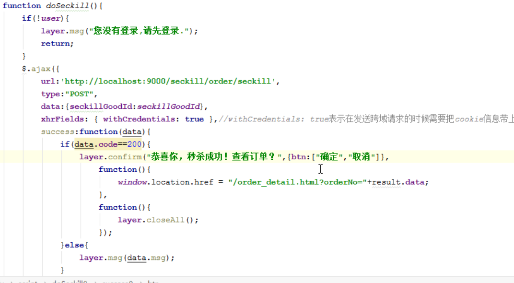
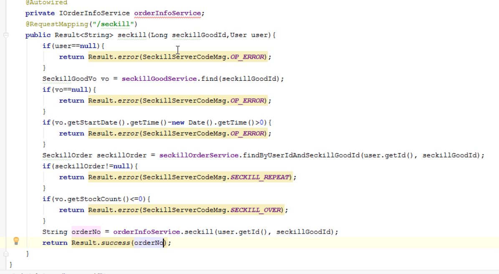

## 秒杀的逻辑分析:
1. 判断用户是否已经登陆
2. 判断秒杀是否已经开始
3. 判断用户是否已经秒杀过该商品了
4. 判断数据库中秒杀商品的库存是否足够
5. 秒杀逻辑(原子操作)
    |-- 对应的库存数量-1
    |-- 创建订单(t_order_info)
    |-- 创建秒杀订单

### 前端实现
```js
function doSeckill(){
  if(!user){
    layer.msg("您没有登陆，请先登陆");
    return;
  }
  $.ajax({
       url:"http://localhost:9000/seckill/order/seckill",
       type:"POST",
       data:{"seckillGoodId":seckillGoodId}
       xhrFields: { withCredentials: true },//withCredentials: true表示在发送跨域请求的时候需要把cookie信息带上.
       success:function(data){
           if(data.code==200){
             // 提示下单成功
           }else{
               layer.msg(data.msg);
           }
       },
       error:function () {
           layer.msg("客户端调用异常");
       }
   })
}
```


## 后端实现
1. 创建OrderInfo,SeckillOrder实体类
2. 创建OrderInfoController,定义seckill


### 自定义参数解析器

需求: 需要在多处地方获取用户登陆信息，可以自定义参数解析器

1. 在member中定义导入web依赖,编译时才有效
2. 创建WebConfig,实现WebMvcConfigurer,添加自定义的参数解析器
3. 自定义参数解析器
    |-- supportParamter ：当Springmvc遍历参数解析器的时候，第一个返回true的参数解析器去处理对应的参数
    |--如果是User类型，返回true
4. resolveArgument方法 : 返回的对象注入到对应处理器映射的方法上
    |-- 从cookie中获取token
    |-- 根据token 从redis中获取用户数据
5. seckill-server中引入redis相关配置

注意: zuulServer需要在启动类设置扫描包为当前项目，避免需要导入redis配置


```java
@Component
public class UserInfoArgumentResolver implements HandlerMethodArgumentResolver {

    @Autowired
    RedisTemplate redisTemplate;


    // 当Springmvc遍历参数解析器的时候，第一个返回true的参数解析器去处理对应的参数
    @Override
    public boolean supportsParameter(MethodParameter methodParameter) {
        return  methodParameter.getParameterType()== User.class;
    }

    // 返回参数对象会注入到对应的映射方法中
    @Override
    public Object resolveArgument(MethodParameter methodParameter, ModelAndViewContainer modelAndViewContainer, NativeWebRequest nativeWebRequest, WebDataBinderFactory webDataBinderFactory) throws Exception {
        HttpServletRequest request = nativeWebRequest.getNativeRequest(HttpServletRequest.class);
        String token = CookieUtil.getCookie(request, CookieUtil.USER_TOKEN_COOKIE);
        if(!StringUtils.isEmpty(token)){
            return redisTemplate.get(MemberServerKeyPrefix.USER_TOKEN_PREFIX,token,User.class);
        }
        return null;
    }
}
```

原理分析:


### 秒杀逻辑实现
1. 在OrderInfoController,如果用户没有登陆，只返回Result.error
2. 根据seckillGoodId 查询vo对象(秒杀商品不存在时，不进入秒杀)
    |-- 对象为空时，返回非法操作
3. 根据vo.startDate-当前时间>0 (秒杀时间还没到)
   |-- 返回非法操作
4. 根据用户id 和秒杀商品id查询用户是否已经下单了
    |-- 提示不能重复下单
5. 查询库存容量是否小于0(存在超卖问题，使用redis原子性减一防止超卖)
    |-- 提示您来晚了，已经被秒杀完了




6. OrderInfoService
    * |-- 设置对应的库存数量-1 reduceStock(seckillGoodId)
    * |-- 创建订单 createOrder
      * |-- 创建orderNO时，不能使用自增长id和uuid,使用雪花算法(分布式情况下生成id)
      * |-- id 会导致不安全，暴漏每天的订单量;uuid 会影响性能，索引变得比较庞大
    * |-- 创建秒杀订单 createSeckillOrder
    * |-- 方法上添加事务 Transactional

```java
@Transactional
public String createOrder(Long seckillgoodId, Long userId) {
    // 1. 秒杀库存数量-1
    int count=seckillGoodService.reduceStock(seckillgoodId);
    if(count==0){// 数据没有发生改变时回滚事务
        throw new BussinessException(SeckillServerCodeMsg.STOCK_OVER);
    }
    // 2. 创建商品订单
    OrderInfo order =createOrderInfo(seckillgoodId,userId);
    // 3. 创建秒杀订单
    seckillGoodService.createOrder(seckillgoodId,userId,order.getOrderNo());

    return order.getOrderNo();
}

private OrderInfo createOrderInfo(Long seckillgoodId, Long userId) {
    SeckillGoodVo seckillGoodVo = seckillGoodService.selectById(seckillgoodId);
    OrderInfo orderInfo=new OrderInfo();
    orderInfo.setUserId(userId);
    orderInfo.setSeckillPrice(seckillGoodVo.getSeckillPrice());
    orderInfo.setGoodPrice(seckillGoodVo.getGoodPrice());
    orderInfo.setGoodName(seckillGoodVo.getGoodName());
    orderInfo.setGoodImg(seckillGoodVo.getGoodImg());
    orderInfo.setGoodId(seckillGoodVo.getId());
    orderInfo.setGoodCount(1);
    orderInfo.setCreateDate(new Date());
    orderInfo.setOrderNo(""+ IdGenerateUtil.get().nextId());// 使用雪花算法
    orderInfoMapper.insert(orderInfo);
    return orderInfo;
}
```


### 秒杀订单详情页面
前端页面处理:
1. 获取地址栏上的orderNo
2. 发送请求查询订单详情 seckill/order/find?orderNO=xxxxx
3. 回显数据

后端请求
1. 判断当前用户是否登陆，登陆才能查看自己的订单
2. 根据订单号查询订单数据

```java
@RequestMapping("/find")
public Result<OrderInfo> find(String orderNo,User user){
    // 1. 判断用户是否登陆
    if(user==null){
        return Result.error(SeckillServerCodeMsg.LOGIN_ERROR);
    }
    //2. 查询订单信息，判断订单是否是当前用户的订单，如果不是返回操作异常
    OrderInfo orderInfo=orderService.findByOrderNo(orderNo,user.getId());
    if(orderInfo==null){
        return Result.error(SeckillServerCodeMsg.OP_ERROR);
    }
    return Result.success(orderInfo);
}

```
