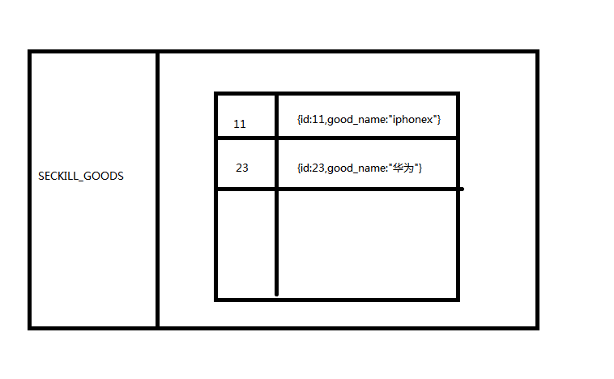
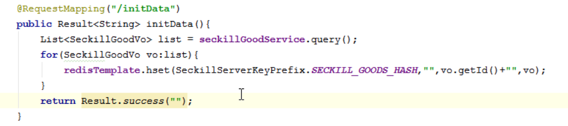

### 优化商品列表

**需求:**
查询商品的列表
根据秒杀商品id 查询对应的商品信息

**解决方案:**
1. 商家发布秒杀活动，将商品放入到Redis中(商品预热)
2. 没有后台页面，自己定义一个接口，一访问就将数据保存到redis中

##### 使用什么样的数据结构：-->hash



步骤:
1. 在自定义redis-start 中定义hash 相关操作方法 hset,hget,hgetall

```java
public <T> void hset(KeyPrefix prefix,String key,String field,T data){
   try(  Jedis jedis = jedisPool.getResource();){
       String realKey=prefix.getPrefix()+":"+key;
       String value=beanToJson(data);
       jedis.hset(realKey,field,value);
   }catch (Exception e){
       e.printStackTrace();
   }
}

public <T> T hget(KeyPrefix prefix,String key,String field,Class<T> clazz){
   try(  Jedis jedis = jedisPool.getResource();){
       String realKey=prefix.getPrefix()+":"+key;
       String value = jedis.hget(realKey,field);
       return stringToBean(value,clazz);
   }catch (Exception e){
       e.printStackTrace();
   }
   return null;
}

public <T> Map<String,T> hgetAll(KeyPrefix prefix, String key, Class<T> clazz){
   try(  Jedis jedis = jedisPool.getResource();){
       String realKey=prefix.getPrefix()+":"+key;
       Map<String, String> values = jedis.hgetAll(realKey);
       Map<String,T> data=new HashMap<>();
       for(Map.Entry<String, String> map:values.entrySet()){
           data.put(map.getKey(),stringToBean(map.getValue(),clazz));
       }
       return data;
   }catch (Exception e){
       e.printStackTrace();
   }
   return null;
}
```

2. SeckillGoodController中定义一个initData方法,预热商品数据
    |-- 查询List<SeckillGoodVO> 数据，将商品数据保存到redis中
3. redis key 设计
    |-- key : seckill_goods_hash
    |-- field : vo的id
    |-- value : vo对象数据



4. 查询秒杀列表时,获取秒杀商品数据列表时从redis中获取
    |-- SeckillGoodController定义queryByCache

```java
@Override
public List<SeckillGoodVo> queryCache() {
    Map<String, SeckillGoodVo> data = redisTemplate.hgetAll(SeckillServerKeyPrefix.SECKILL_GOOD_HASH, "", SeckillGoodVo.class);
    return new ArrayList<>(data.values());
}
```

5. 查询的单个秒杀商品数据，使用hget从redis中获取

```java
public SeckillGoodVo selectById(Long goodId) {

   return redisTemplate.hget(SeckillServerKeyPrefix.SECKILL_GOOD_HASH,"",goodId+"",SeckillGoodVo.class);
}
```

6. 进行压测
