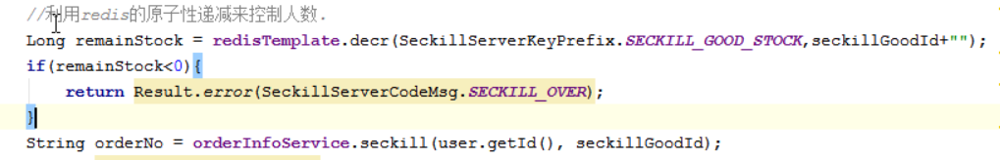

## 秒杀订单的优化
分析:
1. 在商品预热的时候把商品库存读取到redis中
2. 关于查询都存放在redis中，提高查询的性能

#### 预热数据初始化
1. 在创建秒杀订单的时候，把秒杀订单放入到redis中
2. 获取秒杀订单数据时，从redis中获取，提高查询性能


#### 控制下单人数
问题: 多线程并发访问,存在多人下单的问题

解决方案:


步骤分析
* 利用redis的原子性控制下单人数，redis 是单线程不会存在并发问题
  * |-- 初始化时，保存所有订单数据的预库存数据到redis中（string类型）
  * |-- 每次下单时，decr操作减去redis中的库存
  * |-- 库存预热在initData方法上进行初始化



#### 使用乐观锁控制数据库不会进行超卖

```java
@Transactional
public String createOrder(Long seckillgoodId, Long userId) {
    // 1. 秒杀库存数量-1
    int count=seckillGoodService.reduceStock(seckillgoodId);
    if(count==0){// 数据没有发生改变时回滚事务
        throw new BussinessException(SeckillServerCodeMsg.STOCK_OVER);
    }
    // 2. 创建商品订单
    OrderInfo order =createOrderInfo(seckillgoodId,userId);
    // 3. 创建秒杀订单
    seckillGoodService.createOrder(seckillgoodId,userId,order.getOrderNo());

    return order.getOrderNo();
}
```


```java
// stock_count>0 使用数据库乐观锁 , 只有库存大于0才能减去数据库中的库存数据
@Update("update t_seckill_goods set stock_count=stock_count-1 where id=#{id} and stock_count>0")
int updateStock(Long seckillgoodId);
```


### 解决重复下单问题
1. 利用数据库的唯一索引特点,索引user_id+seckill_id,不能同时插入一条 user_id+seckill_id 都相同的数据


## 相关知识点

#### Redis 为什么性能高?
1. 基于内存的操作
2. 数据结构简单
3. 单线程
4. IO多路复用:消息发送时才启动一个线程


* Redis 操作是原子性不会出现多线程修改
* 在redis中的库存叫做预库存
* 在数据库中的库存叫做真实库存


### QPS 和 TPS 的相关概念


* QPS : 每秒能处理的查询数
* TPS : 每秒钟能处理的事务数

#### QPS 简介
QPS : 每秒查询率QPS是对一个特定的查询服务器在规定时间内所处理流量多少的衡量标准

因特网上，经常用每秒查询率来衡量域名系统服务器的机器的性能，其即为QPS。

#### 计算关系：
QPS = 并发量 / 平均响应时间
并发量 = QPS * 平均响应时间


QPS != 并发数
有可能并发数很大服务器响应慢,QPS很低
如下:
并发 1w  --> 处理100q/s
并发 1w(每个请求0.1s就能完成)---> 10w q/s

面试:
1. 你们做微服务有多少台服务器?
只是在测试的时候进行部署，后期交给运营人员发布
Docker 容器化技术类似于VMware可以创建多个虚拟机这样

2. 目前用户量有多少?活跃用户有多少
上线半年有100w用户，活跃用户大概是10%

3. 项目的并发数有多少，QPS有多大
1w/s


了解一下webSocket
