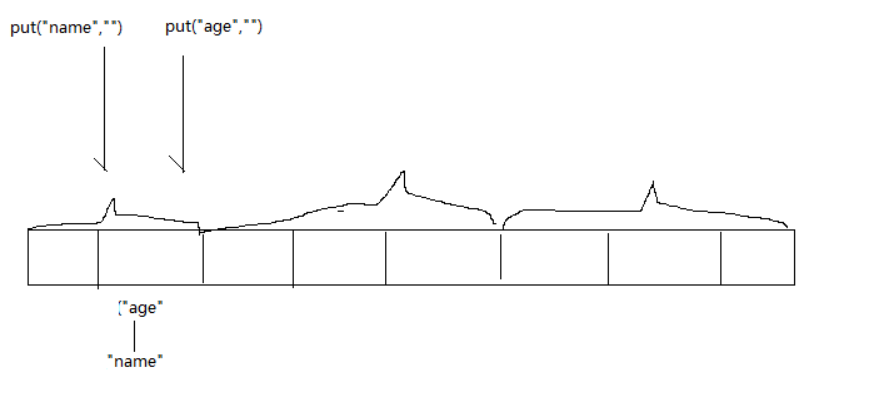
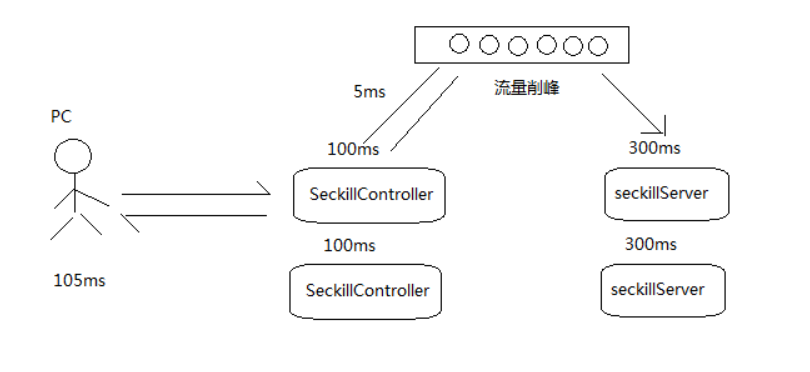
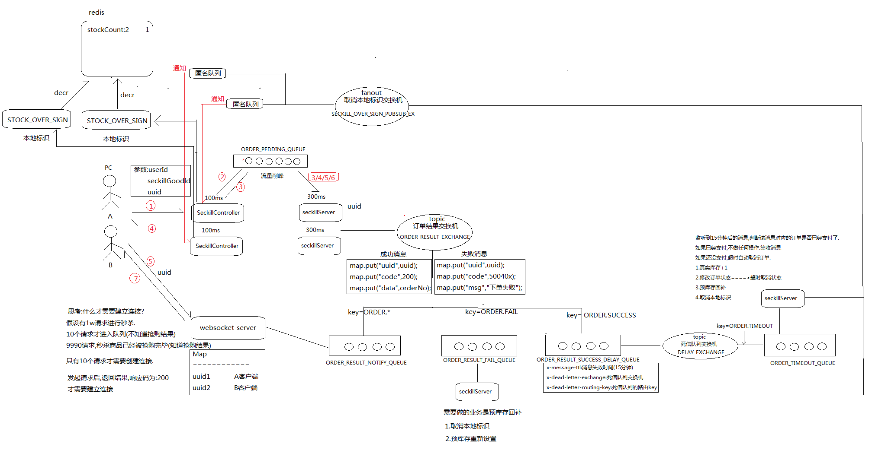
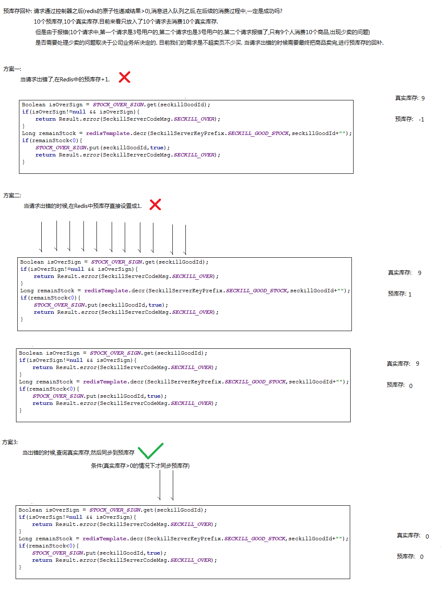

## 本地标识优化
**步骤分析：**
1. 秒杀过程中使用map 保存库存容量
2. key=订单号 ， value= 是否已经库存为0 (true: 该商品已经没有库存)
3. 在秒杀方法上根据订单号查询是否已经库存为0，是则不走秒杀逻辑,避免多次查询redis
4. 在库存容量为0时，将数据保存在本地缓存(避免查询远程缓存)

**实现方式:**
* 使用ConcurrentHashMap 实现本地标志优化
* ConcurrentHashMap: 使用分段锁，能实现多线程访问并且性能比较高



**相关代码:**
```java

public static ConcurrentHashMap<Long, Boolean> STOCK_OVER_SIGN=new  ConcurrentHashMap<>();

seckill(){
   Boolean goodStockOverSign = STOCK_OVER_SIGN.get(seckillgoodId);
   if(goodStockOverSign!=null&&goodStockOverSign){//该商品已经没有库存
       return Result.error(SeckillServerCodeMsg.STOCK_OVER);
   }
   ...

   Long count = redisTemplate.desr(SeckillServerKeyPrefix.SECKILL_STOCK_COUNT, vo.getId() + "");
  if(count<0){ // 返回redis 中秒杀库存的剩余数量
      STOCK_OVER_SIGN.put(seckillgoodId,true);// 设置商品已经没有库存信息，不需要再去查询数据库
      throw new BussinessException(SeckillServerCodeMsg.STOCK_OVER);
  }
}
```

## MQ 实现流量削峰
场景：
1. 处理订单业务时等待服务处理业务的时间较长;
2. 多个请求同时访问服务时，会导致服务器垮掉(可以使用集群处理，但还是有可能会有负载情况)

分析:
1. 使用消息队列异步处理请求消息，不需要等待业务处理





#### 怎么通知用户处理结果？
1. 在前端发送不断发送ajax轮询redis服务器查询响应结果(消耗性能)
2. 使用websocket 实现服务器主动向浏览器推送数据

#### 怎么将消息推送给不同的客户端数据？
传递参数:userId,seckillGoodId,uuid关联对应的客户端


#### 什么时候才需要建立连接?
* 只有抢购业务中，只有前10个请求才需要建立连接
* 发起请求后，返回响应结果，状态码为200才建立连接


#### 本地标识交换机
  |-- 集群环境下一个服务对应一个本地标识


#### 怎么区分订单成功还是失败?
订单失败时发送 key=ORDER.FAIL 给订单结果交换机
订单成功时发送 key=ORDER.SUCCESS 给订单结果交换机


#### 怎么做到一对多的通知?
使用fanous订阅模式的交换机,使用匿名队列，一个服务对应一个队列,将消息同时发送给集群模式下多个秒杀服务

#### 如果订单超过15分钟，订单失效?
* 过15分钟的消息发送到死信队列交换机
* 死信队列交换机监听到15分钟的消息，判断消息对应的订单是否已经支付了
  * |-- 如果已经支付，不做任何操作，签收消息
  * |-- 如果没有支付，超时自动取消订单
  * |-- 真实库存+1
  * |-- 修改订单状态--> 超时取消状态
  * |-- 预库存回补，取消本地标识

### 预库存回补
* 请求通过控制器之后(redis的原子性递减结果>0),消息进入队列之后，在后续的消费过程中，不一定是成功的,如
>10 个预库存，10个真实库存，目前看来只放入了10个真实库存
但是由于报错(10个请求中，第一个请求是3号用户的，第二个请求也是3号用户的，第二个请求报错了，只有9个人消费10个商品，出现少卖的问题)

* 是否需要处理少买的问题取决于公司的业务决定
    |-- 目前我们的需求是不超卖也不少卖，当请求出错的时候需要最终把商品面完，进行预库存的回补

**方案一:(不可行)**
当请求出错了，在redis中的预库存+1
原因: 有可能会多个请求导致预库存是-2,这是+1依旧是负数

**方案二:(不可行)**
当请求出错的时候，在redis预库存直接设置成1
原因: 极端情况下，有可能会请求比较少，设置成1的话，变成只放入一个请求

**方案三：**
当出错的时候查询真实库存，同步到预库存中
条件:真实库存大于0的情况下，才同步预库存



