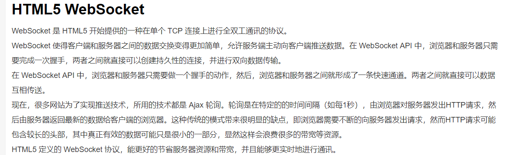
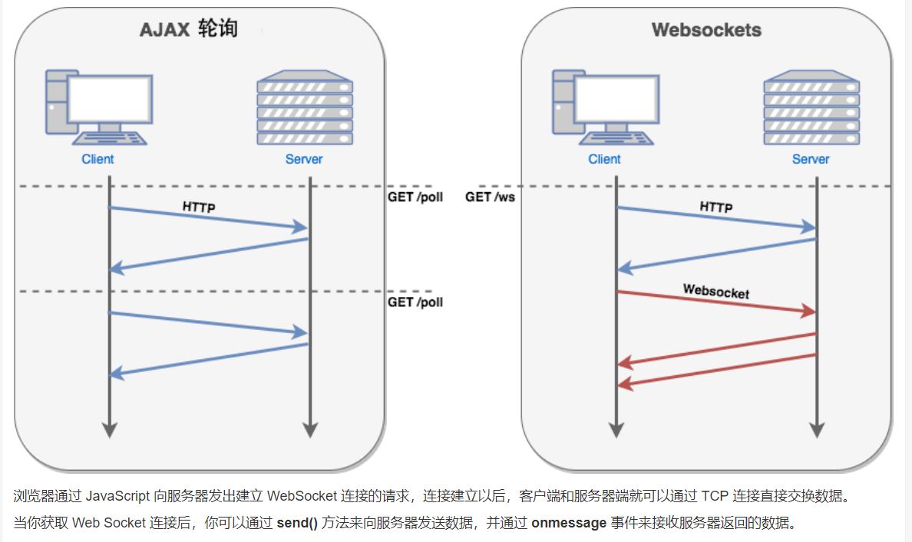
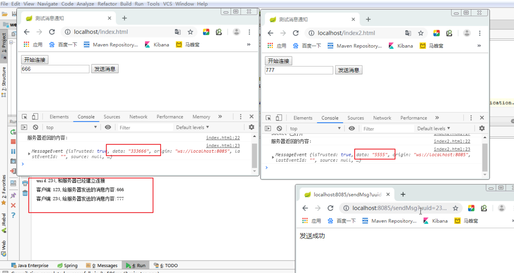

## websocket 测试案例

参考网站: https://www.runoob.com/html/html5-websocket.html





### 前端项目 fronted-server
步骤:
1. 创建index.html,index2.html,导入jquery
2. 复制socket.js的方法
3. 定义开始连接stratConnection(),点击创建socket
4. 定义发送消息sendMsg(),调用socket.send(msg)

```html
<script>
    function createScoket(uuid){
        var socket;
        if(typeof(WebSocket) == "undefined") {
            console.log("您的浏览器不支持WebSocket");
        }else{
            //实现化WebSocket对象，指定要连接的服务器地址与端口  建立连接
            socket = new WebSocket("ws://localhost:8085/"+uuid);
            //打开事件
            socket.onopen = function() {
                console.log("Socket 已打开");
                //socket.send("这是来自客户端的消息" + location.href + new Date());
            };
            //获得消息事件
            socket.onmessage = function(data) {
                console.log("接收到websocket服务端发送的消息:");
                console.log(data);
            };
            //关闭事件
            socket.onclose = function() {
                console.log("Socket已关闭");
            };
            //发生了错误事件
            socket.onerror = function() {
                console.log("Socket发生了错误");
            }
            //窗口关闭
            $(window).unload(function(event){
                socket.close();
            });
        }
        return socket;
    }

    // 连接对象
    var socket;
    /* 开始连接 */
    function openSocket() {
        socket=createScoket("decade");
    }

    // 发送消息到websocket服务器
    function sendMsg() {
        var msg=$("#msg").val();
        socket.send(msg);
    }
</script>

</head>
<body>

<input type="button" value="开始连接" onclick="openSocket()">
<input type="text" id="msg">
<input type="button" value="发送消息" onclick="sendMsg()">
</body>
```

### 后端项目 websocket-server
1. 导入web-socket依赖
```xml
<!-- websocket依赖 -->
 <dependency>
     <groupId>org.springframework.boot</groupId>
     <artifactId>spring-boot-starter-websocket</artifactId>
 </dependency>
```
2. 定义WebSocketConfig配置类,定义了一个bean扫描对应的ServerEnpoint注解，发布websocket服务

```java
@Configuration
public class WebSocketConfig {
    // 扫描ServerEndpoint,启动连接
    @Bean
    public ServerEndpointExporter getServerEndpointExporter(){
        return new ServerEndpointExporter();
    }
}
```

2. 定义WebSocketServer类
    * |-- @ServerEndpoint("/{uuid}")--> 注解接收地址栏传参
    * |-- onOpen() : 与客户端连接时触发
      * |-- session : 建立会话
    * |-- onMessage() : 前端发送消息时触发
    * |-- onClose() :  连接关闭时触发
    * |-- onError() : 出现异常时触发
3. 建立连接时，将客户端和对应的socket对象存放ConcurrentHashMap
4. 关闭连接时，ConcurrentHashMap中移除客户端
5. 提供session对象的set/get方法

```java
@ServerEndpoint("/{uuid}")  // 访问路径参数占位符
@Component
public class WebSocketServer {

    // 会话对象
    private Session session;
    public static ConcurrentHashMap<String,WebSocketServer> clients = new ConcurrentHashMap<>();
    @OnOpen
    public void onOpen(Session session, @PathParam( "uuid") String uuid){
        System.out.println("uuid:"+uuid+",和服务器已经建立连接");
        this.session = session;
        clients.put(uuid,this);// 开始连接时，将当前对象和用户唯一标识匹配起来
    }

    @OnMessage
    public void onMessage(@PathParam( "uuid") String uuid,String msg){
        System.out.println("客户端:"+uuid+",给服务器发送的消息内容:"+msg);
    }

    @OnClose
    public void onClose(@PathParam( "uuid") String uuid){
        clients.remove(uuid);
    }
    @OnError
    public void onError(Throwable error) {
        error.printStackTrace();
    }

    public Session getSession() {
        return session;
    }

    public void setSession(Session session) {
        this.session = session;
    }
}
```

5. 定义SendMsgController
  |-- 获取客户端,通过客户端获取uuid对应的WebSocketServer对象
  |-- 通过客户端获取session对象,发送消息到客户端

相关代码
```java
@RestController
public class SendMsgController {
    @RequestMapping("sendMsg")
    public String sendMsg(String uuid,String msg) throws IOException {
        // 根据当前uuid查询对应的websocket服务对象
        WebSocketServer webSocketServer = WebSocketServer.clients.get(uuid);
        if(webSocketServer!=null){
            webSocketServer.getSession().getBasicRemote().sendText(msg);
        }
        return "发送成功";
    }
}
```


