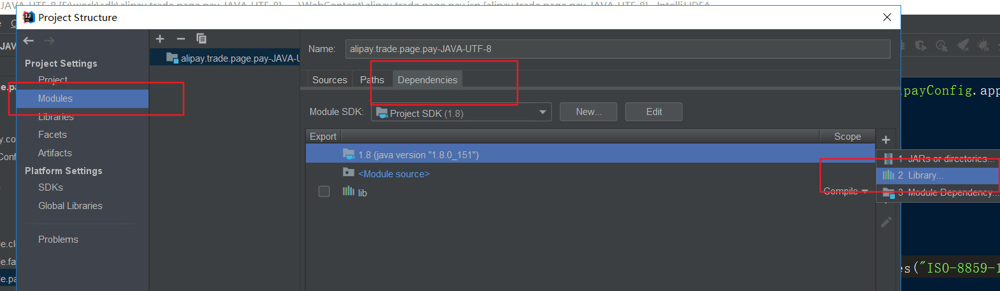
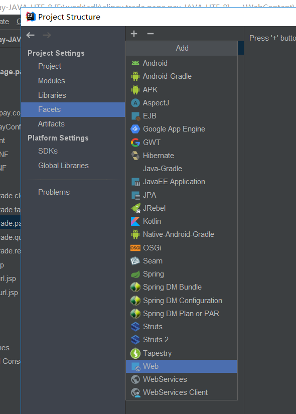
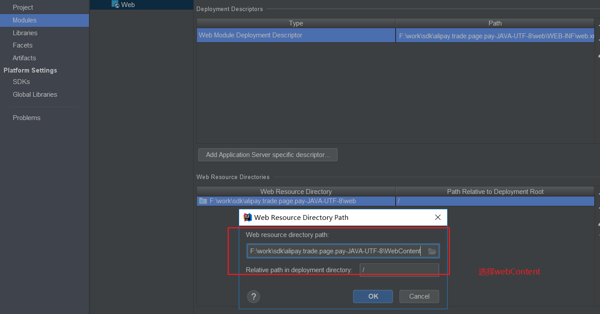
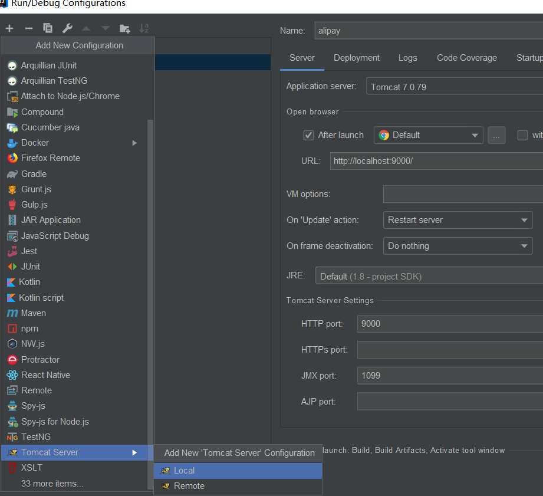
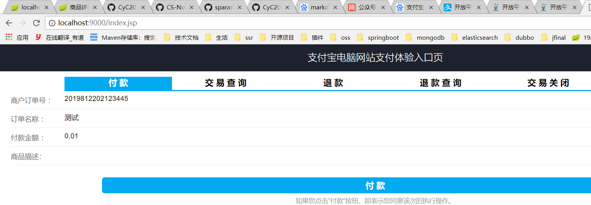
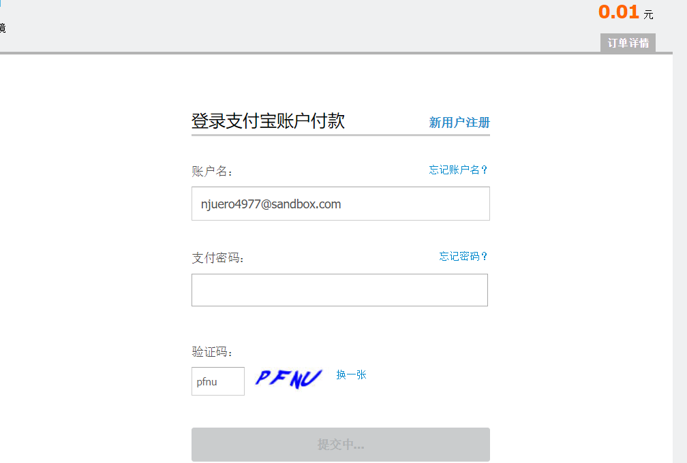
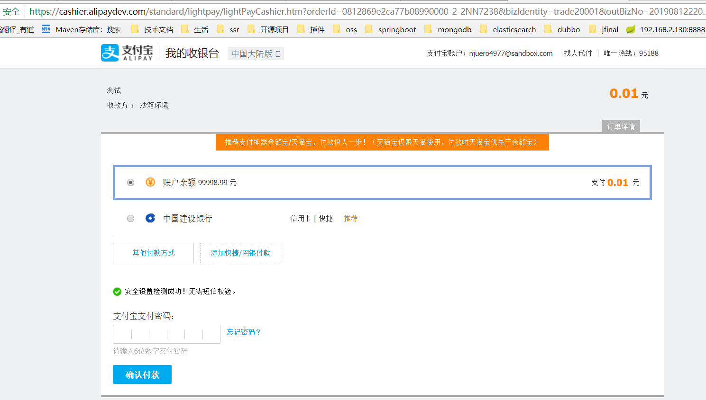
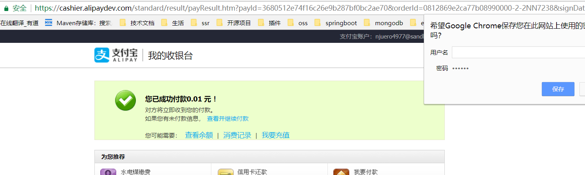
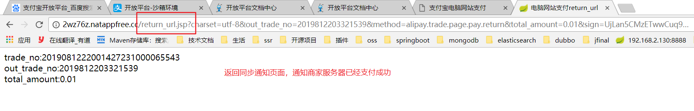

## 支付宝开发平台配置
支付宝开放平台: https://docs.open.alipay.com/270


1. 使用沙箱环境提供的AppID
    管理中中心 --> 开发服务 --> 沙箱应用

2. 配置密钥(在沙箱模式中生成)
    |-- 下载软件生成应用的公钥和私钥
    参考官网: https://docs.open.alipay.com/291/105971

3. 集成配置sdk
4. 导入项目
    |-- 导入已经存在的项目


沙箱账户信息
```
买家账号 njuero4977@sandbox.com
登录密码 111111
支付密码 111111
用户名称 沙箱环境
证件类型身份证 (IDENTITY_CARD)
证件号码 839439191908091841
账户余额
99999.00充值
```


## 导入项目
1. 在AlipayConfig中配置相关配置信息
2. 修改配置文件的编码--> utf-8无BOM编码格式
3. 在项目中导入lib
    project structure--> problem-->fix
4. 添加tomcat依赖,在project structure->Module中配置\



5. 将web-inf设置成web文件夹
      |-- project structure-->Facets + web -->创建artify
      |-- 选择web资源路径是webContext





6. 配置本地tomcat(端口设置9000)



7. 启动项目-->访问index.jsp


8. 使用沙箱账户进行登陆支付

**输入沙箱账号和密码**


**输入支付密码**


**支付成功**


**重定向同步通知页面**

