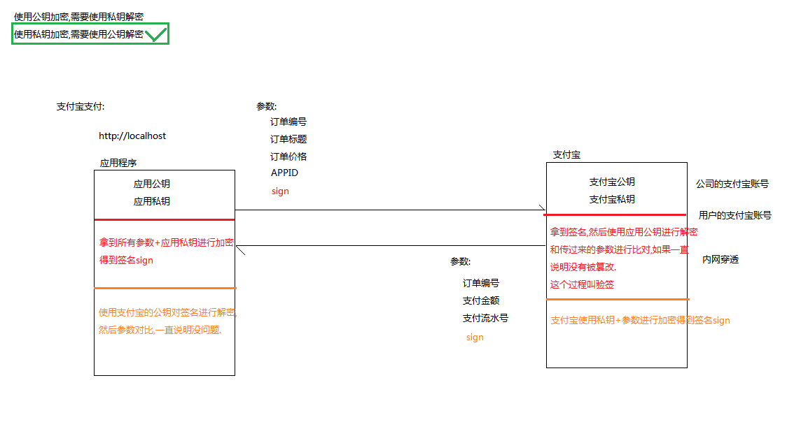
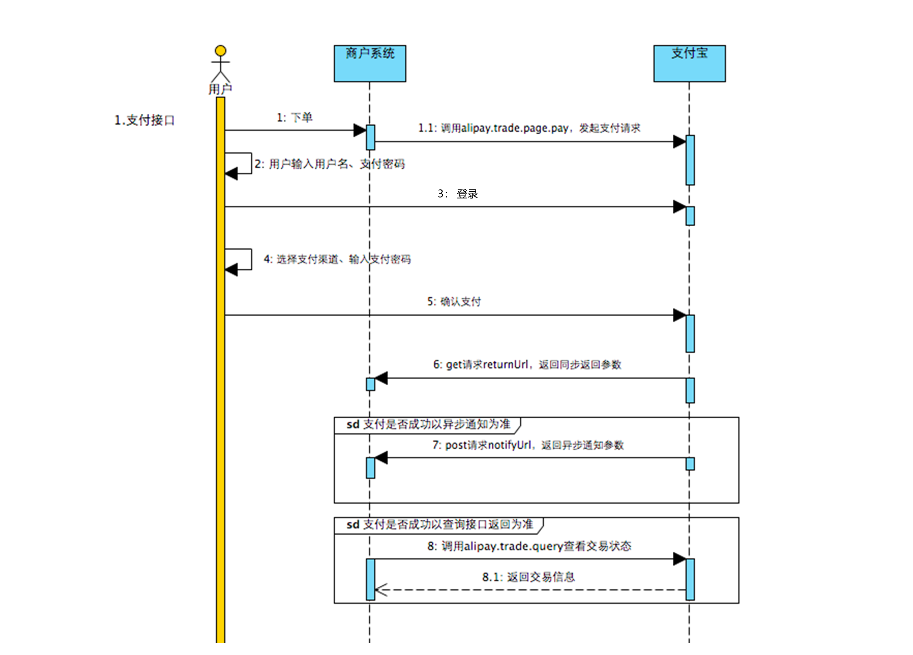
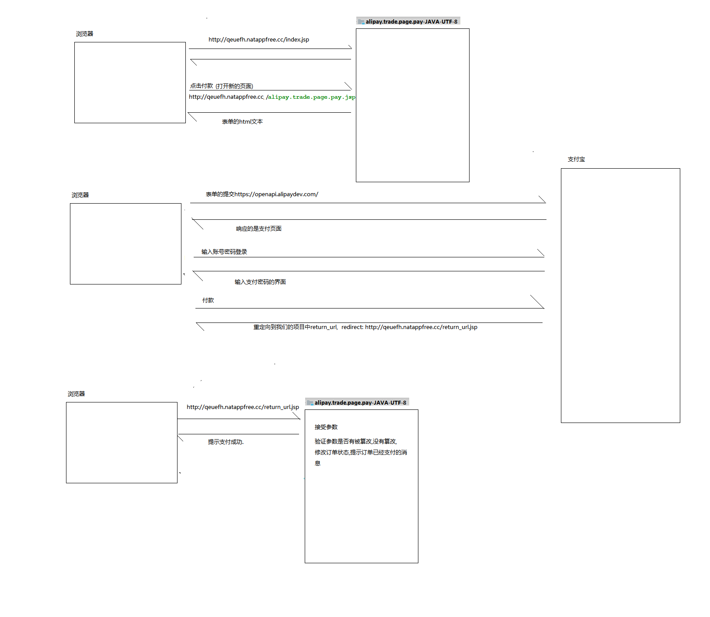

## 支付流程分析
流程分析:
1. 在应用程序发送订单编号，订单标题，订单价格,APPID,签名
2. 用户操作支付宝进行支付
3. 支付宝返回订单编号，支付金额，支付流水号,通知商家服务器已经支付成功
4. 商家服务接收通知，根据支付结果处理页面逻辑
    |-- 如果处理成功，修改订单状态

支付宝接口调用时序图如下:

调用顺序如下：

1. 商户系统请求支付宝接口 alipay.trade.page.pay，支付宝对商户请求参数进行校验，而后重新定向至用户登录页面。

2. 用户确认支付后，支付宝通过 get 请求 returnUrl（商户入参传入），返回同步返回参数。

3. 交易成功后，支付宝通过 post 请求 notifyUrl（商户入参传入），返回异步通知参数。

4. 若由于网络等问题异步通知没有到达，商户可自行调用交易查询接口 alipay.trade.query 进行查询，根据查询接口获取交易以及支付信息（商户也可以直接调用查询接口，不需要依赖异步通知）。

开放平台网站 : https://docs.open.alipay.com/270

## 支付宝密钥分析

支付宝使用私钥加密，再使用公钥解密
原因:
1> 如果使用公钥加密，那所有人都可以模仿一个公钥请求给支付进行解密，不安全
2> 使用私钥加密，客户端用公钥解密之后也只能得到一些无关紧要的订单参数，不会影响业务安全

## 支付宝签名验证
客户端发送订单付款时，需要发送订单编号+标题+价格+APPID+sign签名
  * |-- 客户端拿到所有的参数+应用私钥进行加密得到签名sign
  * |--  支付宝需要拿到签名，然后使用应用公钥进行解密和传过来的参数进行比对，如果一致说明没有被篡改，这个过程叫做验签

在付款成功后，同步响应携带参数信息回客户端
  * |-- 支付宝使用私钥+参数进行加密得到签名sign
  * |-- 商家服务器使用支付宝的公钥对签名进行验证参数对比，一致说明没问题
