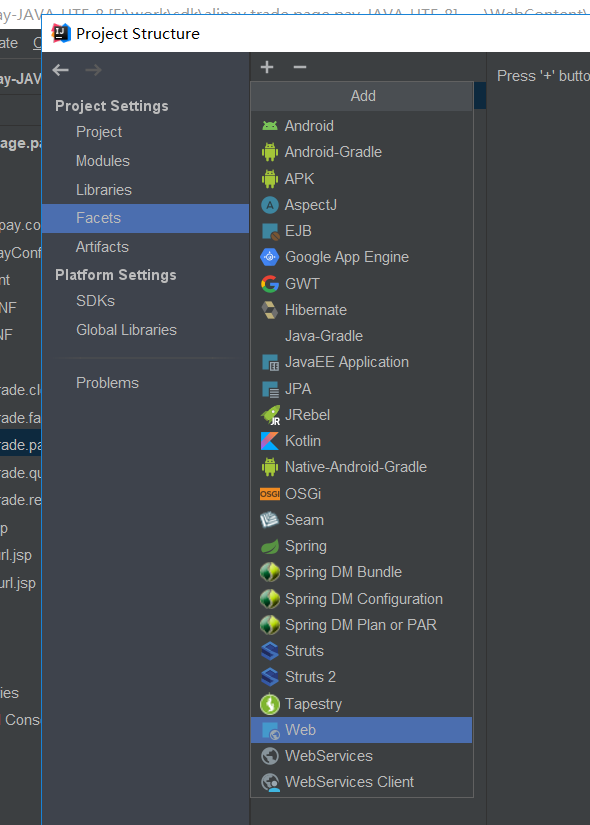
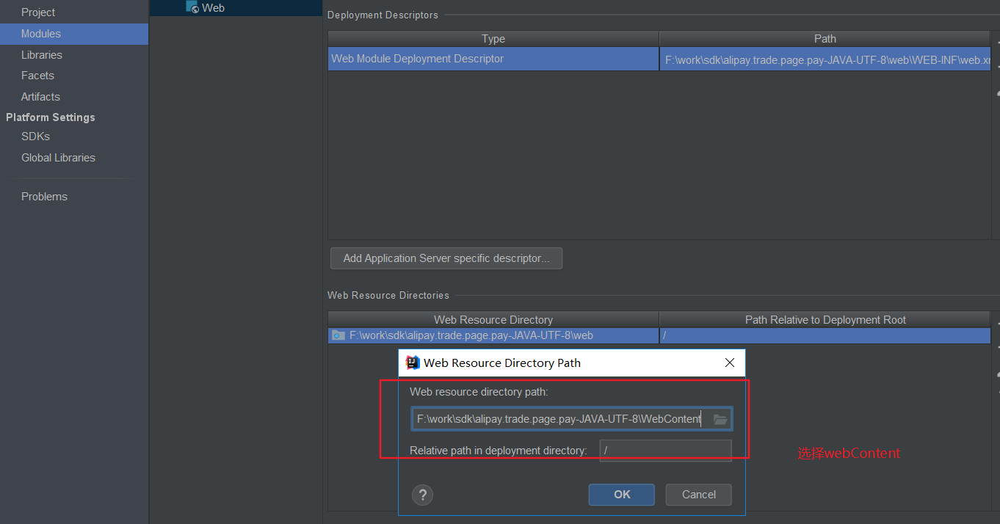
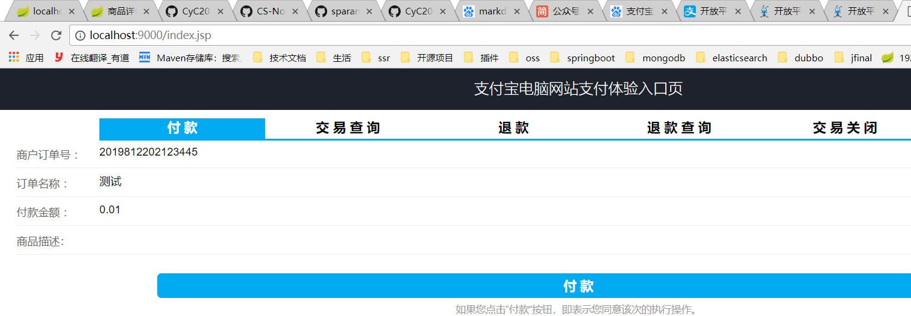
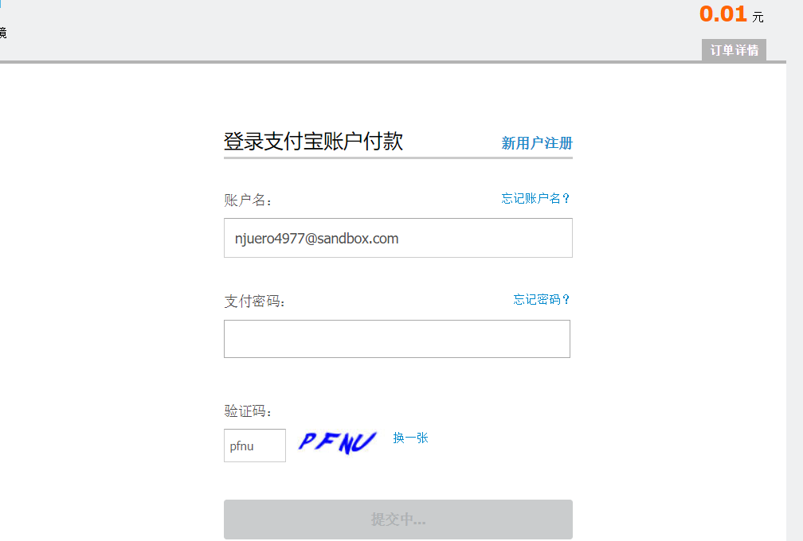
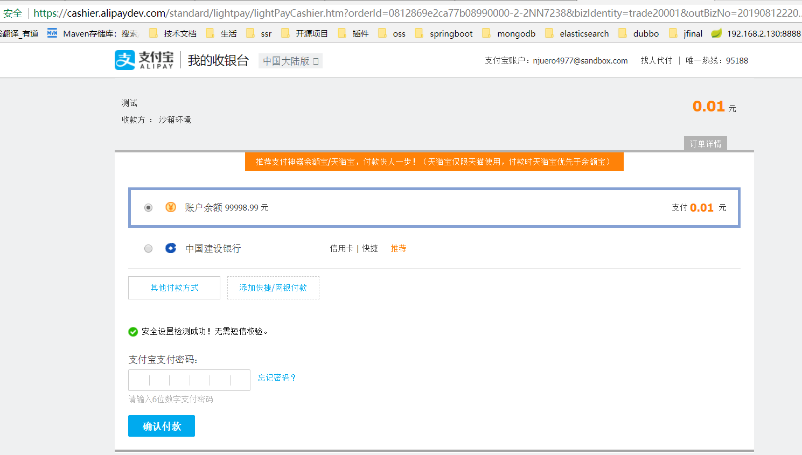
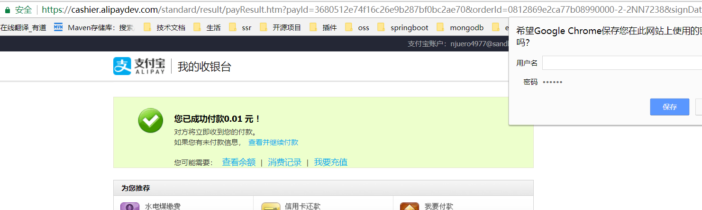
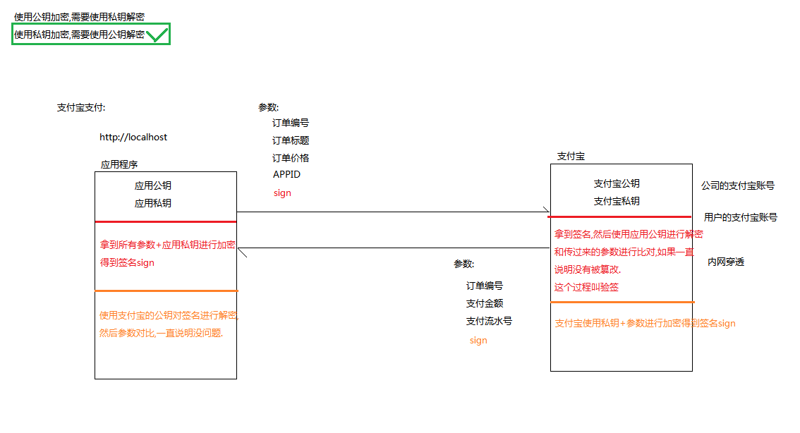
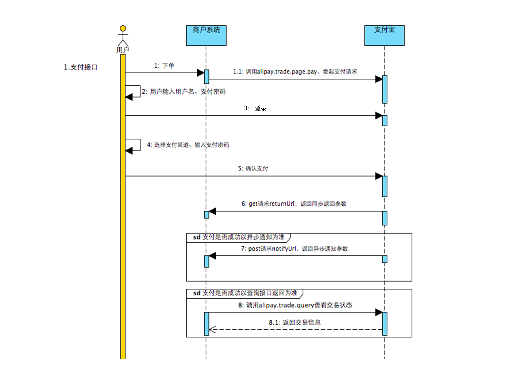

- [内网穿透](#内网穿透)
- [支付宝开发平台配置](#支付宝开发平台配置)
- [导入项目](#导入项目)
- [支付流程分析](#支付流程分析)
- [支付宝密钥分析](#支付宝密钥分析)
- [支付宝签名验证](#支付宝签名验证)
- [支付的异步回调](#支付的异步回调)
- [同步通知:](#同步通知)        
- [异步通知:](#异步通知)
- [支付宝集成](#支付宝集成)        
    - [前端页面](#前端页面)        
    - [后端实现](#后端实现)

## 内网穿透

netapp 官网 : https://natapp.cn/tunnel/lists

1. 内网可以进行外网访问
2. 修改隧道配置
3. 下载客户端，修改config.ini文件
4. 通过配置文件启动，能拿到一个域名


## 支付宝开发平台配置
支付宝开放平台: https://docs.open.alipay.com/270


1. 使用沙箱环境提供的AppID
    管理中中心 --> 开发服务 --> 沙箱应用

2. 配置密钥(在沙箱模式中生成)
    |-- 下载软件生成应用的公钥和私钥
    参考官网: https://docs.open.alipay.com/291/105971

3. 集成配置sdk
4. 导入项目
    |-- 导入已经存在的项目


沙箱账户信息
```
买家账号 njuero4977@sandbox.com
登录密码 111111
支付密码 111111
用户名称 沙箱环境
证件类型身份证 (IDENTITY_CARD)
证件号码 839439191908091841
账户余额
99999.00充值
```


## 导入项目
1. 在AlipayConfig中配置相关配置信息
2. 修改配置文件的编码--> utf-8无BOM编码格式
3. 在项目中导入lib
    project structure--> problem-->fix
4. 添加tomcat依赖,在project structure->Module中配置\


5. 将web-inf设置成web文件夹
      |-- project structure-->Facets + web -->创建artify
      |-- 选择web资源路径是webContext





6. 配置本地tomcat(端口设置9000)


7. 启动项目-->访问index.jsp


8. 使用沙箱账户进行登陆支付

**输入沙箱账号和密码**


**输入支付密码**


**支付成功**


**重定向同步通知页面**


## 支付流程分析
流程分析:
1. 在应用程序发送订单编号，订单标题，订单价格,APPID,签名
2. 用户操作支付宝进行支付
3. 支付宝返回订单编号，支付金额，支付流水号,通知商家服务器已经支付成功
4. 商家服务接收通知，根据支付结果处理页面逻辑
    |-- 如果处理成功，修改订单状态




支付宝接口调用时序图如下:




调用顺序如下：

1. 商户系统请求支付宝接口 alipay.trade.page.pay，支付宝对商户请求参数进行校验，而后重新定向至用户登录页面。

2. 用户确认支付后，支付宝通过 get 请求 returnUrl（商户入参传入），返回同步返回参数。

3. 交易成功后，支付宝通过 post 请求 notifyUrl（商户入参传入），返回异步通知参数。

4. 若由于网络等问题异步通知没有到达，商户可自行调用交易查询接口 alipay.trade.query 进行查询，根据查询接口获取交易以及支付信息（商户也可以直接调用查询接口，不需要依赖异步通知）。


开放平台网站 : https://docs.open.alipay.com/270


## 支付宝密钥分析
支付宝使用私钥加密，再使用公钥解密
原因:
1> 如果使用公钥加密，那所有人都可以模仿一个公钥请求给支付进行解密，不安全
2> 使用私钥加密，客户端用公钥解密之后也只能得到一些无关紧要的订单参数，不会影响业务安全


## 支付宝签名验证
客户端发送订单付款时，需要发送订单编号+标题+价格+APPID+sign签名
  * |-- 客户端拿到所有的参数+应用私钥进行加密得到签名sign
  * |--  支付宝需要拿到签名，然后使用应用公钥进行解密和传过来的参数进行比对，如果一致说明没有被篡改，这个过程叫做验签

在付款成功后，同步响应携带参数信息回客户端
  * |-- 支付宝使用私钥+参数进行加密得到签名sign
  * |-- 商家服务器使用支付宝的公钥对签名进行验证参数对比，一致说明没问题


## 支付的异步回调

#### 同步通知:
支付成功后可能自己项目的服务器会关闭,或者是当前页面关闭时，导致支付同步通知没有及时通知到，不可靠

#### 异步通知:
* 不依赖浏览器，支付宝调用商家服务器的接口，返回相关参数给
 * |-- 收到"success"表示已经接收到支付成功的信息，支付宝不会再发送请求
 * |-- 否则，支付宝会每隔一段时间发送一次请求(在25小时之内，最多发送8次请求)
 * |-- 一直没有只能通过人工通道去交易查询

* 测试关闭同步通知，此时只会走异步通知
    * |-- 同步通知用于显示提示下单支付成功
    * |-- 修改订单状态应该在异步通知中


## 支付宝集成

#### 前端页面
```java
// 订单支付逻辑：点击支付-->访问支付订单接口
 function pay() {
     window.location.href="http://localhost:9000/seckill/pay?orderNo="+orderNo;
 }
```

#### 后端实现

开发步骤:
1. 在maven 中集成支付宝sdk
```xml
<!-- 支付宝依赖 -->
<dependency>
   <groupId>com.alipay.sdk</groupId>
   <artifactId>alipay-sdk-java</artifactId>
   <version>3.7.4.ALL</version>
</dependency>
```
2. 在码云上定义alipay.yml配置文件
```yml
alipay:
  app_id: 2016101000654719
  merchant_private_key: 应用私钥
  alipay_public_key: 支付宝公钥
  notify_url: http://2wz76z.natappfree.cc/seckill/notify_url
  return_url: http://2wz76z.natappfree.cc/seckill/return_url
  sign_type: RSA2
  charset: utf-8
  gatewayUrl: https://openapi.alipaydev.com/gateway.do
```

3. 定义AlipayProperties用于读取保存配置文件相关配置
    |-- 属性名使用驼峰命名
4. 定义AlipayConfig创建alipayClient对象
5. 定义一个PayController
    |-- pay()方法中设置请求参数配置订单信息
    |-- 输出时需要设置返回类型是html
    |-- setContentType需要设置在输出内容之前
6. 定义returnUrl方法(用于显示的页面,不处理业务逻辑)
    |-- 进行签名校验
    |-- 获取订单参数
7. 定义notifyUrl
  * |-- 支付成功后需要设置接口的幂等性(修改一次和修改n次结果应该是一样的)
  * |-- 因为如果有积分操作，可能会导致多次添加
    * |-- 设计支付表，使用支付流水号作为唯一索引，不能重复插入
  * |-- **修改订单状态为已支付状态**
  * |-- 将消息放入mq,监听器监听到消息，给后端管理人员/客服，实现订单退款


相关代码逻辑:

定义AlipayProperties用于读取保存配置文件相关配置
```java
@Setter@Getter
@Component
@ConfigurationProperties(prefix = "alipay")
public class AlipayProperties {
    // 应用ID,您的APPID，收款账号既是您的APPID对应支付宝账号
    private  String appId;
    // 商户私钥，您的PKCS8格式RSA2私钥
    private  String merchantPrivateKey;
    // 支付宝公钥,
    private  String alipayPublicKey;
    // 服务器异步通知页面路径
    private  String notifyUrl;
    // 页面跳转同步通知页面路径
    private  String returnUrl;
    // 签名方式
    private  String signType;
    // 字符编码格式
    private  String charset;
    // 支付宝网关
    private  String gatewayUrl ;
}
```
定义AlipayConfig创建alipayClient对象
```java
@Configuration
public class AlipayConfig {
    @Autowired
    AlipayProperties properties;

    @Bean
    public AlipayClient getAlipayClient(){
        return new DefaultAlipayClient(properties.getGatewayUrl(), properties.getAppId(), properties.getMerchantPrivateKey(), "json", properties.getCharset(), properties.getAlipayPublicKey(), properties.getSignType());
    }
}
```
pay()方法中设置请求参数配置订单信息,发送相关参数给浏览器访问支付包接口
```java
// 调用支付接口
    @RequestMapping("/pay")
    public void pay(String orderNo, HttpServletResponse resp) throws Exception {
        // 查询订单数据
        OrderInfo orderInfo = orderService.findByOrderNo(orderNo, user.getId());
        if(orderInfo==null){
            throw new BussinessException(SeckillServerCodeMsg.OP_ERROR);
        }
        //设置请求参数
        AlipayTradePagePayRequest alipayRequest = new AlipayTradePagePayRequest();
        alipayRequest.setReturnUrl(alipayProperties.getReturnUrl()); // 同步通知路径
        alipayRequest.setNotifyUrl(alipayProperties.getNotifyUrl()); // 异步通知路径


        //商户订单号，商户网站订单系统中唯一订单号，必填
        String out_trade_no =orderInfo.getOrderNo();
        //付款金额，必填
        String total_amount =orderInfo.getSeckillPrice()+"" ;
        //订单名称，必填
        String subject = "秒杀订单";

        //商品描述，可空
        String body = orderInfo.getGoodName();

        alipayRequest.setBizContent("{\"out_trade_no\":\""+ out_trade_no +"\","
                + "\"total_amount\":\""+ total_amount +"\","
                + "\"subject\":\""+ subject +"\","
                + "\"body\":\""+ body +"\","
                + "\"product_code\":\"FAST_INSTANT_TRADE_PAY\"}");

        //请求
        String result = alipayClient.pageExecute(alipayRequest).getBody();

        resp.setContentType("text/html;charset=utf-8");
        //输出
        resp.getWriter().println(result);

    }
```
同步通知:
同步通知商家服务器支付成功--> 需要对签名进行校验--> 只做页面显示，不做修改订单逻辑
```java
// 同步通知商家服务器支付成功--> 需要对签名进行校验--> 只做页面显示，不做修改订单逻辑
  @RequestMapping("/return_url")
  public void returnUrl(@RequestParam Map<String,String> params, HttpServletResponse resp) throws Exception {
      // 验证签名
      boolean signVerified = AlipaySignature.rsaCheckV1(params, alipayProperties.getAlipayPublicKey(), alipayProperties.getCharset(), alipayProperties.getSignType()); //调用SDK验证签名

      if(signVerified) {
          //商户订单号
          String orderNo = params.get("out_trade_no");
          //校验成功，返回订单详情页面进行显示
          resp.sendRedirect("http://localhost/order_detail.html?orderNo="+orderNo);
          return;
      }
      // 校验失败跳转到500页面
      resp.sendRedirect("http://localhost/50x.html");
  }
```

异步通知商家服务器支付成功--> 每隔一段时间支付宝发送一次请求直到执行成功
```java
// 异步通知商家服务器支付成功--> 每隔一段时间执行一次知道执行成功
   @RequestMapping("/notify_url")
   public String notifyUrl(@RequestParam Map<String,String> params, HttpServletResponse response) throws Exception {

       boolean signVerified = AlipaySignature.rsaCheckV1(params, alipayProperties.getAlipayPublicKey(), alipayProperties.getCharset(), alipayProperties.getSignType()); //调用SDK验证签名

       if(signVerified) {//验证成功
           //商户订单号
           String out_trade_no = params.get("out_trade_no");
           //交易状态
           String trade_status = params.get("trade_status");

           if(trade_status.equals("TRADE_FINISHED")){// 交易结束，不可退款

           }else if (trade_status.equals("TRADE_SUCCESS")){ //交易支付成功
               // 修改订单状态，注意订单的幂等性，修改一次和修改一次应该是相同的
               try {
                   orderService.updateOrderStatus(out_trade_no,OrderInfo.STATUS_ACCOUNT_PAID);
               } catch (BussinessException e) {
                   e.printStackTrace();
                   //将消息放入mq,监听器监听到消息，给后端管理人员/客服，实现订单退款（调用支付宝退款）
               }
           }
           return "success";
       }else {//验证失败
           return "fail";
       }
   }
```

修改订单状态
```java
@Override
public int updateOrderStatus(String orderNo, Integer orderStatus) {
    // 查询订单的状态，如果是未支付||用户手动取消订单，不进行订单状态的修改
    Integer status = orderInfoMapper.selectOrderStatus(orderNo);
    if(!OrderInfo.STATUS_ARREARAGE.equals(status)){// 如果不是未支付，不需要再进行订单修改
        throw new BussinessException(SeckillServerCodeMsg.PAY_ERROR);
    }
    //修改订单状态--> 超时状态
    int count=orderInfoMapper.updateStatus(orderNo,orderStatus);
    if(count==0){ // 订单的状态发生修改不是未支付
        throw new BussinessException(SeckillServerCodeMsg.PAY_ERROR);
    }
    return count;
}
```
