## Rebbit MQ
### 高并发业务

高并发:在短时间内，突然引入很高流量，出现很多用户进行访问
抢购业务: 1s 中有10w个请求时

redis 缓存:将商品的库存预读到redis中，itemNum 设置成10，如果数量<=0,返回已经抢购完的页面,原子性递减，不需要考虑高并发问题(提高系统性能)

消息中间件: 保存多个请求，分发给服务器，服务器从消息队列中获取请求

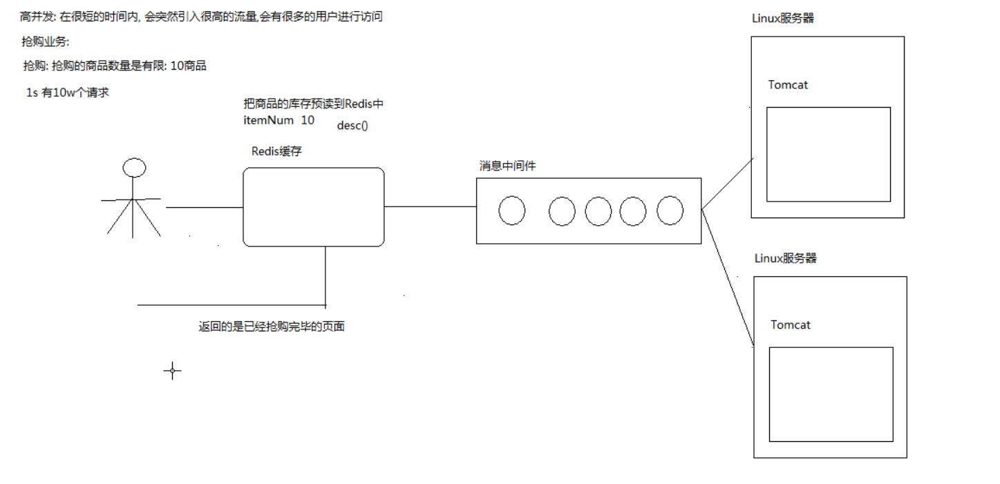

### 耗时业务

下订单业务:
如果订单业务时间过长，多个业务会出现业务积压

消息中间件:
写入消息保存请求操作，避免用户等待时间过长

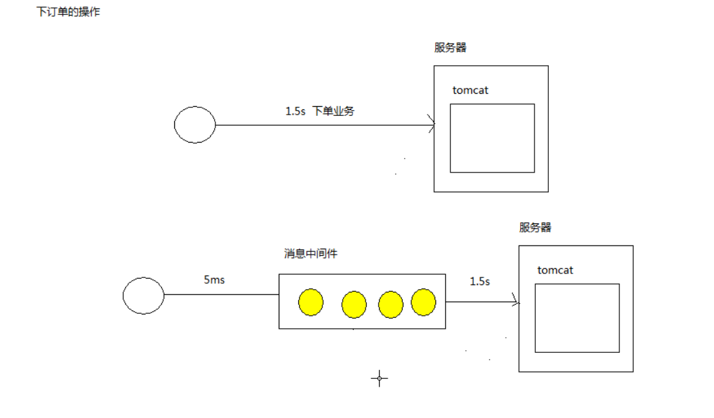


### 耦合度高的业务
耦合度高的业务 : 如短信，邮件发送等操作

需求: 加入需要去注册一个淘宝的用户账号
 注册功能 ---> 发送邮件 -----> 发送短信

问题:
注册和发送邮件紧密联系，发送邮件可能会失败，导致注册功能也失败，业务的耦合性太高，必须降低业务和业务之间的耦合度？

消息中间件:
可以保证系统的低耦合度，也可以减少等待时间
用户先实现注册功能，注册后，将注册消息发送到消息中间件,发送邮件的服务器去消息中间件对应的消息进行消费，实现发送邮件的功能

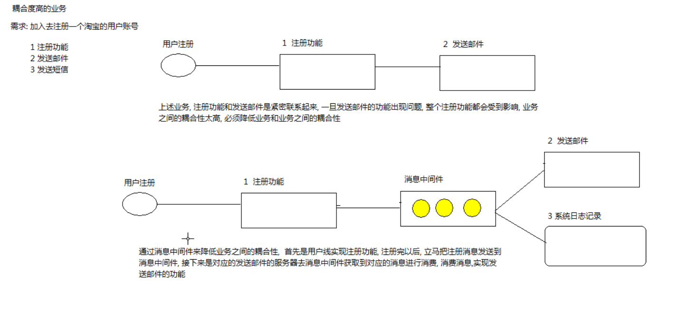

### 消息中间件
ActiveMQ
KafKa :可以做日志处理，性能好，数据易丢失
Rocket MQ:
RabbitMQ: SpringBoot 天然支持的消息中间件


## AMQP高级消息队列协议


定义：Advanced Message Queueing Protocol
是面向消息的中间件的开放标准应用层协议,AMQP的特征是消息导向，排队，路由（包括点对点和发布和订阅），可靠性和安全性。
AMQP要求消息传递提供商和客户端的行为在不同供应商实现可互操作的情况下，以与SMTP，HTTP，FTP等相同的方式创建了可互操作的系统。
AMQP协议是具有现代特征的二进制协议。一个提供统一消息服务的应用层标准高级消息队列协议，是应用层协议的一个开发标准，为面向消息的中间件设计。基于此协议的客户端与消息中间件可传递消息，并不受客户端/中间件不同产品，不同开发语言等条件的限制。
AMQP是一种二进制应用层协议，旨在有效地支持各种消息应用和通信模式。


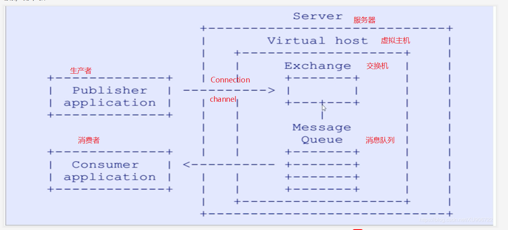


### RabbitMQ 安装运行
vi /etc/hostname

访问15672
密码都是guest guest

开启远程*从新

## RabbitMQ 的使用

### helloworld 模式：
创建俩个springboot 项目
1. 在提供方和消费端添加amqp-client依赖
2. 拷贝send.java 生产者
  |-- queue_name : 队列名称
  |-- connectionFactory : 创建连接工厂
  |-- setHost : 设置连接mq的地址
  |-- 定义一个队列，如果已经存在，则不会重复创建
      |-- 参数1 ：队列的名称
      |-- 参数2 : 队列是否需要持久化，没有持久化时如果重启队列就不存在了(只针对队列)
      |-- 参数3 ： 唯一性(排他性),true时，只有当前的connection可以连接这个队列进行消费
      |-- 参数4： 自动删除，队列的最后一个消费者断开连接，就会自动删除
  |-- 消息  + 发送消息
      |-- basicPublish
          |-- 第二个参数可以配置消息的相关属性,如消息是否持久化,MessageProperties.Text...
3. 拷贝消费者
  |-- 实时处理消息的程序
  |-- 准备接收消息


hello 模式没有定义交换机
    |-- 默认交换机时AMQP dedault
    |-- 默认时路由模式的全部匹配模式 direct
    |-- 默认的路由器是hello


### Worker模式
生产者: 一个生产者生产多条数据
消费者: 多个消费者-->均匀分配消息

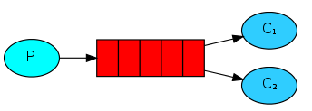


怎么设置成能者多劳模式
* basicQos(1)设置每次预读取的数量为1,只有读取完才能再次读取 (默认是取250个)
* 还需要设置签收模式为手动签收,单个签收

```java
// -----------生产者-----------
public class NewTask {
    // 队列名称
    private static final String TASK_QUEUE_NAME = "task_queue";

    public static void main(String[] argv) throws Exception {
        ConnectionFactory factory = new ConnectionFactory();
        factory.setHost("192.168.182.200");
        try (Connection connection = factory.newConnection(); Channel channel = connection.createChannel()) {
            //定义一个队列，如果已经存在，则不会重复创建
            channel.queueDeclare(TASK_QUEUE_NAME, true, false, false, null);
            String message = "tasequeue";
            for(int i=0;i<20;i++){
                channel.basicPublish("", TASK_QUEUE_NAME,
                        MessageProperties.PERSISTENT_TEXT_PLAIN,
                        (message+i).getBytes("UTF-8"));
            }

            System.out.println(" [x] Sent '" + message + "'");
        }
    }
}

//-------------消费者-------------
// 设置每次读取1个数据，处理完1个数据课后才能再次读取
channel.basicQos(1);
// 实时处理消息的程序
DeliverCallback deliverCallback = (consumerTag, delivery) -> {
    String message = new String(delivery.getBody(), "UTF-8");
    try {
        TimeUnit.SECONDS.sleep(1);
    } catch (InterruptedException e) {
        e.printStackTrace();
    }finally {
        // 需要业务处理完后才进行签收
        // 设置tag--签收的标记   单个签收
        channel.basicAck(delivery.getEnvelope().getDeliveryTag(), false);
    }
    System.out.println(" [x] Received '" + message + "'");
};
// 设置手动签收
channel.basicConsume(TASK_QUEUE_NAME, false, deliverCallback, consumerTag -> { });
```

### 消息签收机制
消费者:
// 设置tag--签收的标记  单个签收--
  channel.basicAck(delivery.getEnvelope().getDeliveryTag(), false);
autoAck : 是否自动签收，如果为true则自动签收,否则需要手动签收

问题: 为什么需要手动签收?
需要在消费端业务处理结束后才确认签收
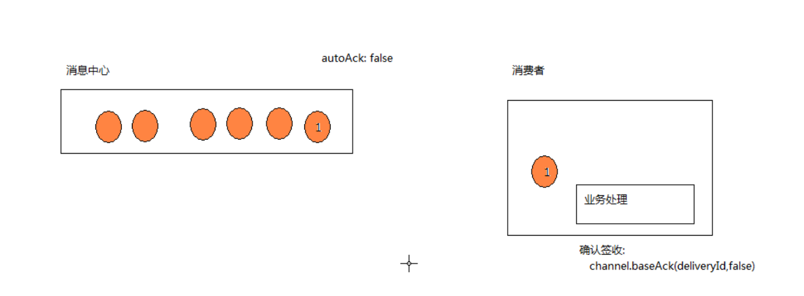

### 发布订阅者模式

* 发送消息时会将消息发送给交换机所有绑定的队列
* 发送一个消息会往俩个队列中同时发送
* 消费者都会接收到相同的消息

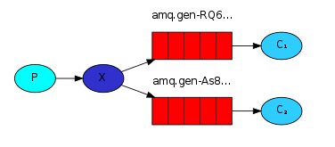

接收端；
  |-- channel.exchangeDeclare()
      |-- 创建交换机 : fanout广播类型 只要发送给到交换机的消息，都会转发到所有绑定的队列上面
  |-- 获取一个默认的名字
  |-- 绑定交换机和队列之间的绑定关系

生产者
```java
public class EmitLog {
    private static final String EXCHANGE_NAME = "logs";

    public static void main(String[] argv) throws Exception {
        ConnectionFactory factory = new ConnectionFactory();
        factory.setHost("localhost");
        try (Connection connection = factory.newConnection();
             Channel channel = connection.createChannel()) {
            // 创建交换机 : 使用fanout广播类型
            channel.exchangeDeclare(EXCHANGE_NAME, "fanout");

            String message = "info: Hello World!";
            // 发送消息
            channel.basicPublish(EXCHANGE_NAME, "", null, message.getBytes("UTF-8"));
            System.out.println(" [x] Sent '" + message + "'");
        }
    }

}

//----------------消费者----------------
public class ReceiveLogs {
    // 交换机的名字
    private static final String EXCHANGE_NAME = "logs";

    public static void main(String[] argv) throws Exception {
        ConnectionFactory factory = new ConnectionFactory();
        factory.setHost("localhost");
        Connection connection = factory.newConnection();
        Channel channel = connection.createChannel();

        //创建交换机 : fanout广播类型 只要发送给到交换机的消息，都会转发到所有绑定的队列上面
        channel.exchangeDeclare(EXCHANGE_NAME, "fanout");
        //获取一个默认的队列名字,创建队列
        String queueName = channel.queueDeclare().getQueue();
        // 绑定交换机和队列之间的绑定关系
        channel.queueBind(queueName, EXCHANGE_NAME, "");


        DeliverCallback deliverCallback = (consumerTag, delivery) -> {
            String message = new String(delivery.getBody(), "UTF-8");
            System.out.println(" [x] Received '" + message + "'");
        };
        channel.basicConsume(queueName, true, deliverCallback, consumerTag -> { });
    }
}


```

运行结果:


## 路由模式

路由模式:
* 一个生产者发送的消息和过滤条件信息给交换机,交换机根据过滤条件，将不同消息分发给绑定不同过滤条件的队列
* 一个队列可以绑定多个过滤条件
* 同一个消息可以发送给多个符合过滤条件的队列

```
生产端:
    |-- 指定routeKey作为过滤的条件
消费端:
    |-- 一个只记录错误日志
    |-- 一个记录全部的日志
        |-- 需要声明定义一个交换机，交换机类型direct
        |-- 默认一个队列名称
        |-- 绑定队列和交换机的过滤条件
```

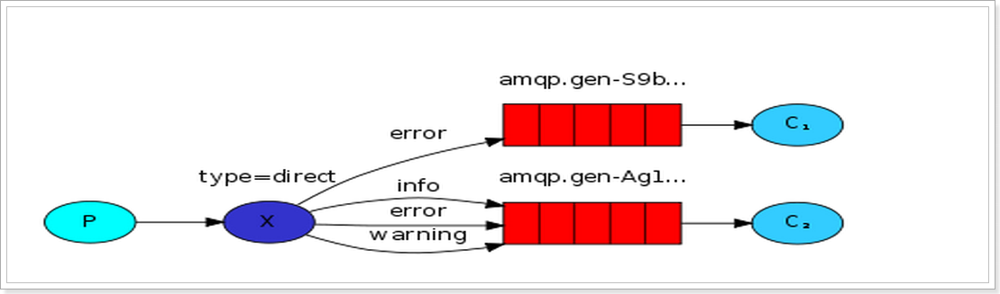
应用场景:
日志记录 (按照路由信息进行过滤消息,C1只记录错误日志，C2记录全部日志)


```java
//----------生产者-----------
public class EmitLogDirect {
    private static final String EXCHANGE_NAME = "direct_logs";

    public static void main(String[] argv) throws Exception {
        ConnectionFactory factory = new ConnectionFactory();
        factory.setHost("localhost");
        try (Connection connection = factory.newConnection();
             Channel channel = connection.createChannel()) {
            //创建一个交换机,交换类型为direct
            channel.exchangeDeclare(EXCHANGE_NAME, BuiltinExchangeType.DIRECT);

            String routeKey = "info"; // 过滤的条件
            String message = "directMsg";
            //发送消息: 指定routeKey作为过滤的条件
            channel.basicPublish(EXCHANGE_NAME, routeKey, null, message.getBytes("UTF-8"));
            System.out.println(" [x] Sent '" + severity + "':'" + message + "'");
        }
    }
}

//------------------消费者---------------
public class ReceiveLogsDirect {
    // 交换机的名字
    private static final String EXCHANGE_NAME = "direct_logs";

    public static void main(String[] argv) throws Exception {
        ConnectionFactory factory = new ConnectionFactory();
        factory.setHost("localhost");
        Connection connection = factory.newConnection();
        Channel channel = connection.createChannel();

        // 定义交换机,交换机类型是dirrect
        channel.exchangeDeclare(EXCHANGE_NAME, BuiltinExchangeType.DIRECT);
        //创建队列,默认一个队列名称
        String queueName = channel.queueDeclare().getQueue();

        //绑定队列和交换机的过滤条件
        channel.queueBind(queueName, EXCHANGE_NAME, "info");
        channel.queueBind(queueName, EXCHANGE_NAME, "error");
        channel.queueBind(queueName, EXCHANGE_NAME, "warning");


        DeliverCallback deliverCallback = (consumerTag, delivery) -> {
            String message = new String(delivery.getBody(), "UTF-8");
            System.out.println(" [x] Received '" + delivery.getEnvelope().getRoutingKey() + "':'" + message + "'");
        };
        channel.basicConsume(queueName, true, deliverCallback, consumerTag -> {
        });
    }
}


```

运行结果:
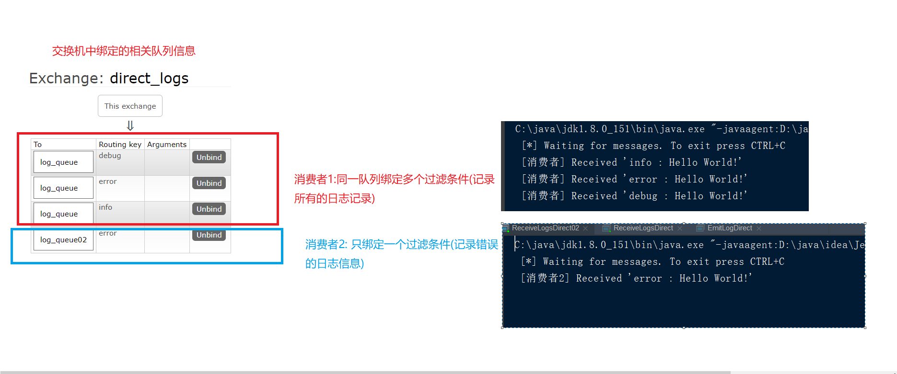


## Topic 模式(模糊匹配)

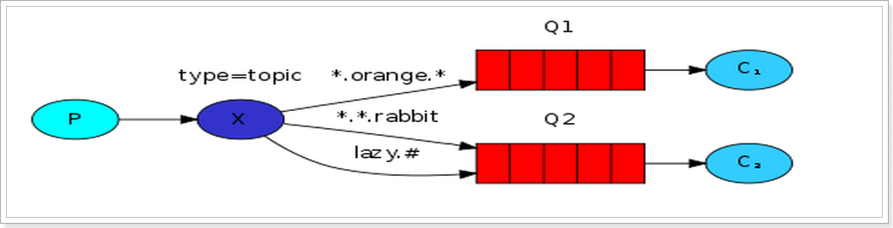

```
所有发送到Topic Exchange的消息被转发到所有关心RouteKey中指定的Topic的Queue上

Exchange将RouteKey和某个Topic进行模糊匹配,此时队列需要绑定一个Topic

可以使用通配符进行模糊匹配
符号 "#" 匹配一个或多个词
符号 "* "  只是匹配一个词
例如: "log.#" 能够匹配到 "log.info.crm"
	   "log.* " 只能匹配到"log.info"

```

生产者
  |-- 发送消息
      |--指定routeKey作为过滤的条件,交换机根据routeKey选择发送消息的队列
消费者
  |-- 创建交换机
  |-- 定义一个默认的队列
  |-- 建立队列和交换机的绑定关系
  |-- 查看交换机的绑定(绑定多个)


```java
//--------------生产者-------------
public class EmitLogTopic {
    private static final String EXCHANGE_NAME = "topic_logs";

    public static void main(String[] argv) throws Exception {
        ConnectionFactory factory = new ConnectionFactory();
        factory.setHost("localhost");
        try (Connection connection = factory.newConnection();
             Channel channel = connection.createChannel()) {

            channel.exchangeDeclare(EXCHANGE_NAME, "topic");

            //  指定routeKey作为过滤的条件,交换机根据routeKey选择发送消息的队列
            String routingKey = "order1.save";
            String message = "topicMsg";

            channel.basicPublish(EXCHANGE_NAME, routingKey, null, message.getBytes("UTF-8"));
            System.out.println(" [x] Sent '" + routingKey + "':'" + message + "'");
        }
    }


}

//-------------消费者-------------
public class ReceiveLogsTopic {
    private static final String EXCHANGE_NAME = "topic_logs";

    public static void main(String[] argv) throws Exception {
        ConnectionFactory factory = new ConnectionFactory();
        factory.setHost("localhost");
        Connection connection = factory.newConnection();
        Channel channel = connection.createChannel();

        // 创建交换机-->指定为  topic 模糊匹配类型
        channel.exchangeDeclare(EXCHANGE_NAME, "topic");
        //定义一个默认的队列
        String queueName = channel.queueDeclare().getQueue();
        //建立队列和交换机的绑定关系
        channel.queueBind(queueName, EXCHANGE_NAME, "order.*");

        System.out.println(" [*] Waiting for messages. To exit press CTRL+C");
        DeliverCallback deliverCallback = (consumerTag, delivery) -> {
            String message = new String(delivery.getBody(), "UTF-8");
            System.out.println(" [x] Received '" + delivery.getEnvelope().getRoutingKey() + "':'" + message + "'");
        };
        channel.basicConsume(queueName, true, deliverCallback, consumerTag -> { });
    }
}


```

#### 运行结果:
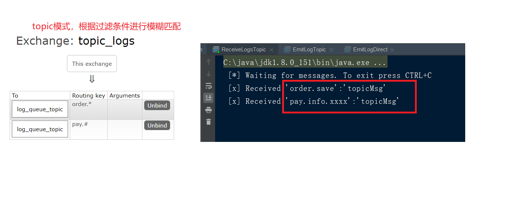


## springboot 集成开发
1. 导入sprigboot 依赖
```xml
<dependency>
	<groupId>org.springframework.boot</groupId>
	<artifactId>spring-boot-starter-amqp</artifactId>
</dependency>
```

2. 消费者和生产者设置端口和(5672)域名
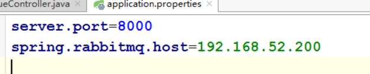

#### 简单Queue模式

生产者:
```java
//定义QueueController,用于发送消息
@Controller
public class QueueController {
    //定义RabbitTemplate
    @Autowired
    private RabbitTemplate rabbitTemplate;

    @RequestMapping("/queue")
    @ResponseBody
    public String sendMsg(String msg){
        //发送消息--> 指定队列名
        rabbitTemplate.convertAndSend("","boot_queue",msg);
        return "发送成功";
    }
}
```

消费者:
```java
@Compoment
QueueListener{
  // 指定队列名
  @RabbitListener(queuesToDeclare=@Queue(name="boot_queue"))
  void receive(String msg){
    System.out.print("消费者收到消息:"+msg);
  }
}

```

### 签收模式

1. 在消费者的配置文件中配置,设置为手动签收
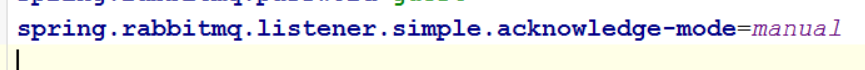

消费者:
```java
@Compoment
QueueListener{

  @RabbitListener(queuesToDeclare=@Queue(name="hello"))
  void receive(String msg,@Header(AmqpHeaders.DELIVERY_TAG) long tag,Channel channel){
    System.out.print("消费者收到消息:"+msg);
    try {
      // 消息确认
      channel.basicAck(tag,false);
    } catch(Exception e) {

    }
  }
}

```
如果业务方法出现异常,将消息重新放到一个死信队列中
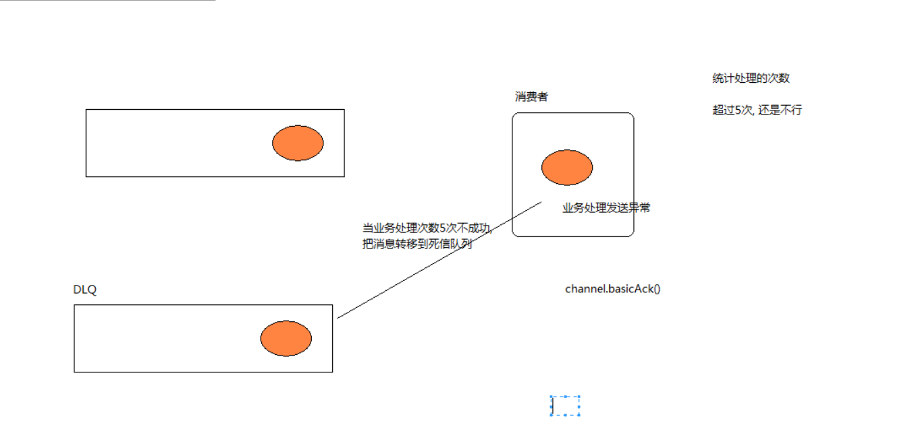


### Worker模式
能者多劳设置:  设置预读取数量 prefectch=1
spring.rabbitmq.listener.simple.prefetch=1

1. 生产者

```java
@Autowired
private RabbitTemplate rabbitTemplate;

@RequestMapping("/worker")
@ResponseBody
public String sendMsg(){
    for(int i= 0;i<20;i++){
        rabbitTemplate.convertAndSend("worker","msg:"+i);
    }
    return "发送成功";
}
```

2. 消费者

```java
@Component
public class Worker {
    @RabbitListener(queuesToDeclare = @Queue("worker"))
    public void receiveMsg(String msg, @Header(AmqpHeaders.DELIVERY_TAG) long deliveryTag, Channel channel) throws IOException {
        System.out.println("工作者1:"+msg);
         TimeUnit.SECONDS.sleep(1);
    }
}
```

运行结果:
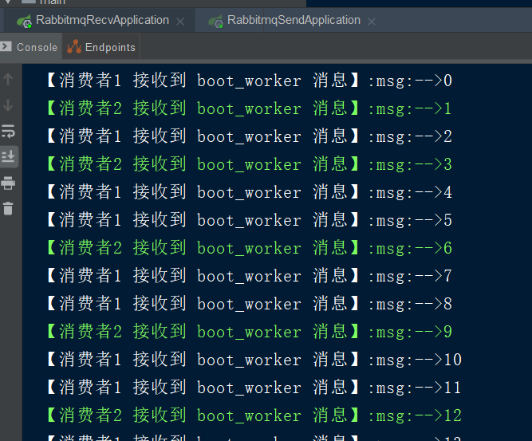


### Pub/Sub模式

```java
//--------生产者：
@Controller
public class PubSubController {
    @Autowired
    private RabbitTemplate rabbitTemplate;
    @RequestMapping("/pubsub")
    @ResponseBody
    public String sendMsg(String msg){
        rabbitTemplate.convertAndSend("boot_pubsub","","广播消息");
        return "发送成功";
    }
}
//---------- 消费者-------------


@Component
public class PubSubReceiver {
    @RabbitListener(bindings = @QueueBinding(value = @Queue,exchange = @Exchange(name = "boot_pubsub",type = "fanout")))
    public void receiveMsg(String msg, @Header(AmqpHeaders.DELIVERY_TAG)long deliveryTag, Channel channel) throws Exception {
        System.out.println("收到消息1:"+msg);
        channel.basicAck(deliveryTag,false);
    }
}

```


### Routing模式

```java
//--------------生产者----------
@Controller
public class RountingController {

    @Autowired
    private RabbitTemplate rabbitTemplate;

    @RequestMapping("/rounting")
    @ResponseBody
    public String sendMsg(String key){
        rabbitTemplate.convertAndSend("boot_rounting_exchange",key,"rounting消息");
        return "发送成功";
    }
}

//-------------消费者------------

@Component
public class RountingReceiver {
    @RabbitListener(bindings = @QueueBinding(
             value = @Queue(name = "boot_rounting_queue01"),
            exchange = @Exchange(name = "boot_rounting_exchange",type = "direct"),
            key = {"error","info"}
    ))
    public void receiveMsg(String msg, @Header(AmqpHeaders.DELIVERY_TAG)long deliveryTag, Channel channel) throws Exception {
        System.out.println("error&info 收到消息:"+msg);
        channel.basicAck(deliveryTag,false); //设置手动签名
    }
}
```


## Topic 模式

生产者
```java
@Controller
public class TopicController {
    @Autowired
    private RabbitTemplate rabbitTemplate;

    @RequestMapping("/topic")
    @ResponseBody
    public String sendMsg(String key){
        rabbitTemplate.convertAndSend("boot_topic_exchange",key,"topic消息");
        return "发送成功";
    }
}
```

消费者
```java
@Component
public class TopicReceiver01 {
    @RabbitListener(bindings = @QueueBinding(
            value = @Queue("boot_topic_queue01"),
            exchange = @Exchange(name = "boot_topic_exchange",type = "topic"),
            key = "order.*"
    ))
    public void receiveMsg(String msg, @Header(AmqpHeaders.DELIVERY_TAG)long deliveryTag, Channel channel) throws Exception {
        System.out.println("topic收取消息:"+msg);
        channel.basicAck(deliveryTag,false);
    }
}

```
