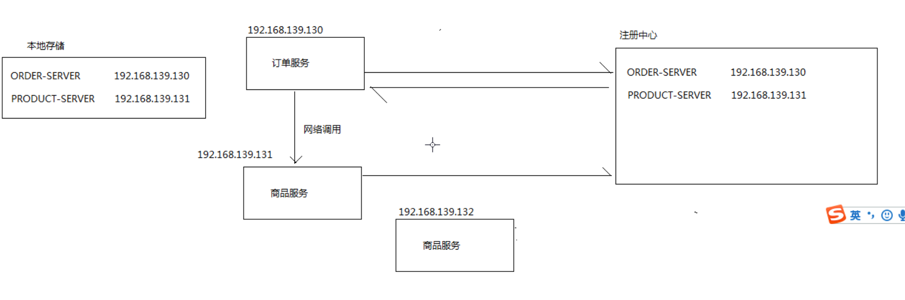
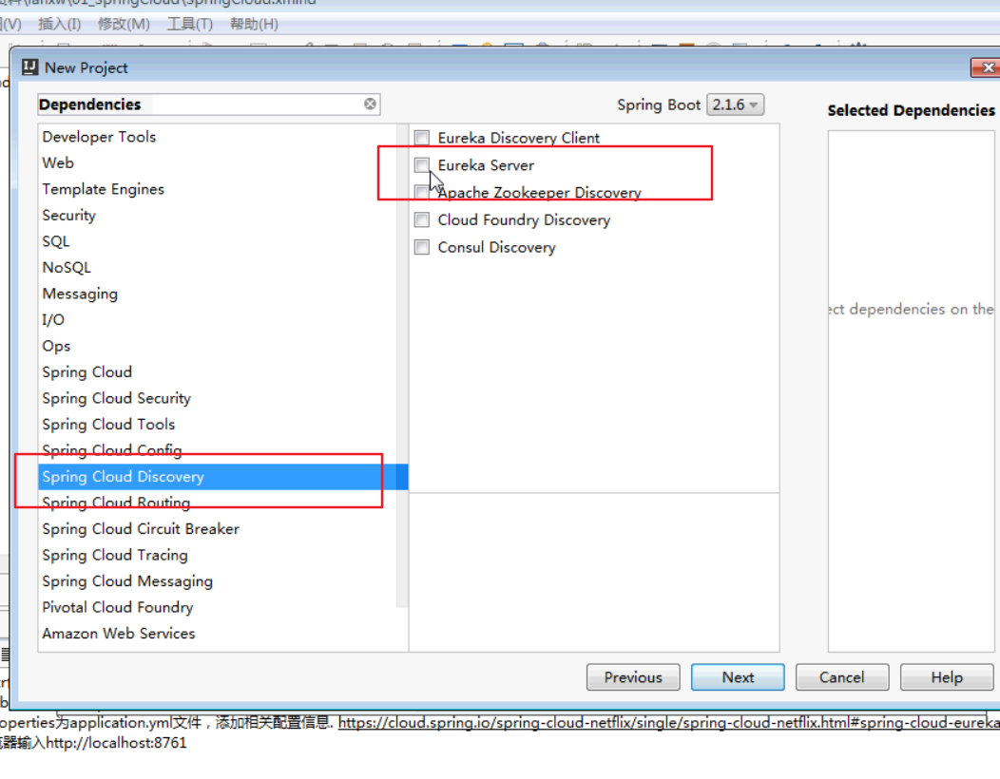
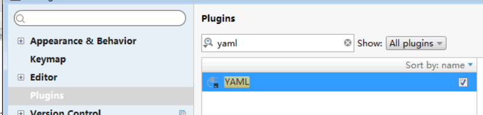

### 注册中心的作用
* 对于服务提供者Provider的作用： 启动的时候向注册中心上报自己的网络信息
* 对于服务消费者Consumer的作用： 启动的时候向注册中心上报自己的网络信息，拉取provider的相关网络信息



### Spring-Cloud Euraka介绍
SpringCloud Euraka是SpringCloud集合中一个组件，它是对Euraka的集成，用于服务注册和发现。Eureka是Netflix中的一个开源框架。它和 zookeeper、Consul一样，都是用于服务注册管理的.

## 项目搭建

#### 注册中心eureka-server搭建

* 创建spring boot 项目,引入依赖 Cloud Discover->Eureka Server
* 启动类上贴上@EnableEurekaServer注解
* 使用application.yml 添加相关配置信息. https://cloud.spring.io/spring-cloud-netflix/single/spring-cloud-netflix.html#spring-cloud-eureka-server
* 运行测试，打开浏览器输入http://localhost:8761
  集群才需要配置城true





#### 商品服务接口product-api搭建
步骤:
* 创建product-api，
* 创建domain : Product类
    |--- id , name ,price ,stock

#### 商品服务product-server搭建
步骤:

*  创建SpringBoot项目，选择Spring Cloud Discover->Eureka Discover 和 Web->Web
*  导入 eureka client + web +api 依赖
*  mapper,service,ProductController : 定义 list() , get(id) 方法
*  修改yml 文件，配置eureka 客户端的端口,配置信息 https://cloud.spring.io/spring-cloud-netflix/single/spring-cloud-netflix.html#netflix-eureka-client-starter

* 启动测试，会在Eureka注册中心控制台页面中看到product-server实例
* 启动多个实例，在注册中心管控台页面也可以看到.（在idea启动配置中添加-Dserver.port=8082参数，可以覆盖配置文件中的配置）
* 添加mapper,service,controller类.

```yml
server:
  port: 8081
spring:
  application:
    name: product-server
eureka:
  client:
    serviceUrl:
      defaultZone: http://localhost:8761/eureka/
```


### SpringCloud Eureka 自我保护机制

参考文档:https://github.com/Netflix/eureka/wiki/Server-Self-Preservation-Mode

Eureka Server 在运行期间会去统计心跳失败比例在 15 分钟之内存活率是否低于 85%，如果低于 85%，Eureka Server 会将这些实例保护起来，让这些实例不会过期，但是在保护期内如果服务刚好这个服务提供者非正常下线了，此时服务消费者就会拿到一个无效的服务实例，此时会调用失败，对于这个问题需要服务消费者端要有一些容错机制，如重试，断路器等。

我们在单机测试的时候很容易满足心跳失败比例在 15 分钟之内低于 85%，这个时候就会触发 Eureka 的保护机制，一旦开启了保护机制，则服务注册中心维护的服务实例就不是那么准确了，此时我们可以使用eureka.server.enable-self-preservation=false来关闭保护机制，这样可以确保注册中心中不可用的实例被及时的剔除（不推荐）

* 存活率=挂掉的服务器/所有的服务器
* 在eureka 设置关闭保护机制
```
eureka.server.enable-self-preservation=false
```
