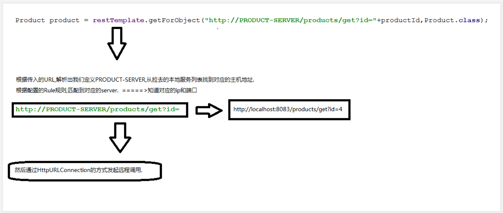
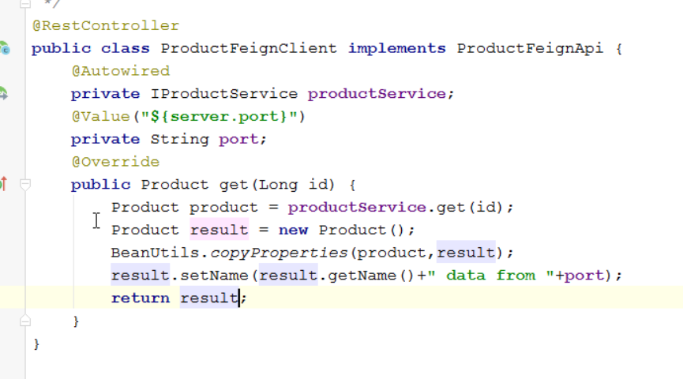

## 微服务调用方式Ribbon

#### 订单服务order-server搭建
步骤:
1. 使用Spring Initializr创建SpringBoot项目，选择Cloud Discover->Eureka Discover , Web->Web , Cloud Routing->Robbin
2. 在项目的pom.xml文件添加product-api的依赖
3. 添加相关依赖配置
4. controller类定义创建订单(Order)的功能，获取商品信息

appication.yml 配置如下:
```yml
server:
  port: 8090
spring:
  application:
    name: order-server
eureka:
  client:
    serviceUrl:
      defaultZone: http://localhost:8761/eureka/
```

相关java类定义
```java
@Component
@Setter
@Getter@AllArgsConstructor@NoArgsConstructor
public class Order implements Serializable {
    private String orderNo;
    private Date createTime;
    private String productName;
    private int productPrice;
    private Long userId;
}
```

#### 使用Ribbon来实现远程调用
步骤:
1. 在配置文件中添加RestTemplate的bean
2. 使用restTemplate.getForObject获取远程接口的信息.

```java
//-------- 启动类中创建 RestTemplate  的bean类
@SpringBootApplication
public class OrderServerApplication {

    public static void main(String[] args) {
        SpringApplication.run(OrderServerApplication.class, args);
    }
    @Bean
    public RestTemplate getRestTemplate(){
        return new RestTemplate();
    }
}

//-----------订单服务: 通过restTemplate调用 product 接口,底层也是使用httpURLConnection --------
@Service
public class OrderService {

    @Autowired
    RestTemplate restTemplate;

    public Order save(Long productId, Long userId){
        Product product = null;//远程获取
        Order order = new Order();
        product=restTemplate.getForObject("http://localhost:8081/product/get?id="+productId,Product.class);
        order.setOrderNo(UUID.randomUUID().toString().replace("-",""));
        order.setCreateTime(new Date());
        order.setUserId(userId);
        order.setProductName(product.getName());
        order.setProductPrice(product.getPrice());
        System.out.println("执行保存订单操作");
        return order;
    }
}
```


### 集群处理

步骤:
1. 请求地址不写具体ip和端口，而是使用远程服务id
    |-- 修改getForObject("http://PRODUCT-SERVER/getProject?id")
2.  RestTemplate 需要具备负载均衡时,在RestTemplate的bean上贴上@LoadBalanced注解

原理:
* 查看LoadBalancerClient的具体实现类
* RibbonlOadBanacerClient中的execute方法


1.  根据传入的URL,解析定义的PRODUCT-SERVER，从拉去的本地服务列表找到对应的主机地址
2.  根据配置的Rule规则，匹配对应的server （知道对应的ip和端口）
3.  然后通过HttpURLConnection发送请求封装数据




测试不同集群下的处理


### 负载均衡调整

官网相关配置:
https://cloud.spring.io/spring-cloud-static/Greenwich.RELEASE/single/spring-cloud.html#_customizing_the_ribbon_client_by_setting_properties

问题描述: 默认轮询到一个服务器没有响应，出现异常, 会统计异常次数，如果多次访问出错，就会避免访问没有响应的服务器,切换另一种策略

解决 : 如果轮询到一个服务器没有响应，切换另一种策略

配置在order服务中
```yml
Product-SERVER:
  ribbon:
    NFLoadBalancerRuleClassName: com.netflix.loadbalancer.WeightedResponseTimeRule

# -------------IRule 接口的子类-----------------
# RoundRobinRule : 默认单纯轮询，一次成功一次失败
# RandomRule ： 随机轮询 ， 随机切换服务
# WeightedResponseTimeRule : 按照权重进行轮询，权重值越大被轮询的机会越大(默认使用)
```
