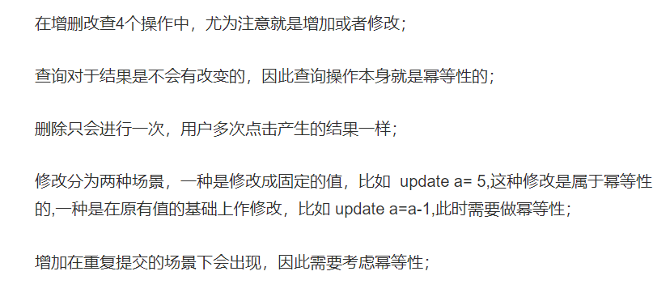
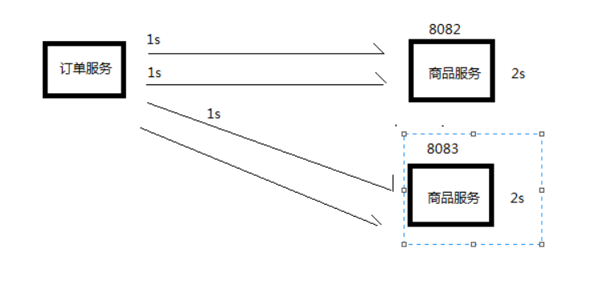

### Feign 超时连接次数设置(重试)

问题 :  A 服务访问如果超时后报错，会重新访问一次,导致B服务会多次执行

幂等性操作:业务执行一次和执行多次的结果是一样的
f(x)=f(f(x))



幂等性参考网站 : https://www.jianshu.com/p/5d58ab259c9d


相关配置 : https://github.com/Netflix/ribbon/wiki/Getting-Started#the-properties-file-sample-clientproperties

```xml
# Max number of retries on the same server (excluding the first try)
# 同一服务器上的最大重试次数
sample-client.ribbon.MaxAutoRetries=0  

# Max number of next servers to retry (excluding the first server)
# 下一个服务器的最大重试次数, n -> 向下n 个服务器重试
sample-client.ribbon.MaxAutoRetriesNextServer=1

```

默认配置
MaxAutoRetries=1 : 最多重试1次
MaxAutoRetriesNextServer=0 : 只在当前服务器下重试

1,1 : 下一台服务器也会被调用重试多1次



解决方法: 设置不连接,失败时也不重试
```
# 指定负载均衡策略 : 当服务器出现异常时，使用哪一种轮询规则
PRODUCT-SERVER:
  ribbon:
    NFLoadBalancerRuleClassName: com.netflix.loadbalancer.RandomRule
    MaxAutoRetries: 0
    MaxAutoRetriesNextServer: 0
```
