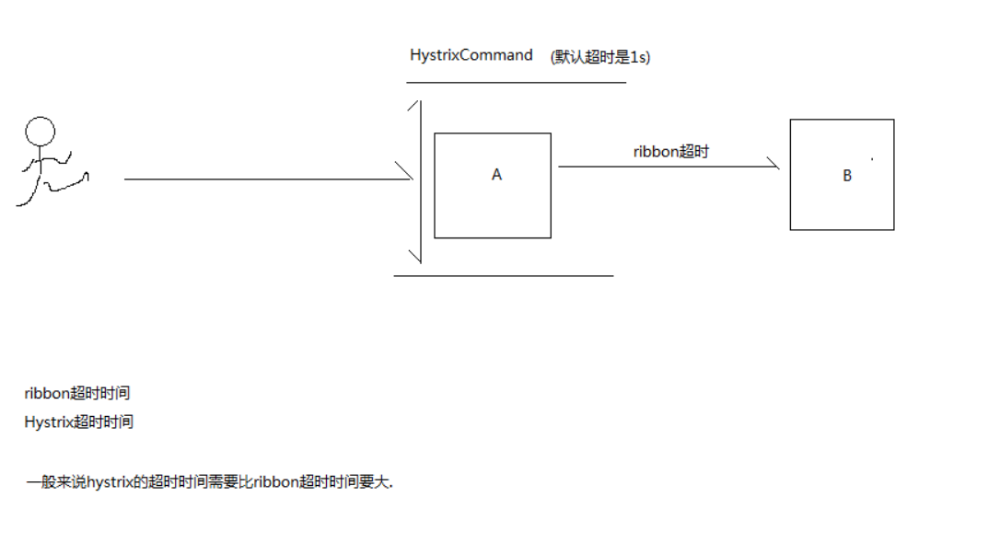
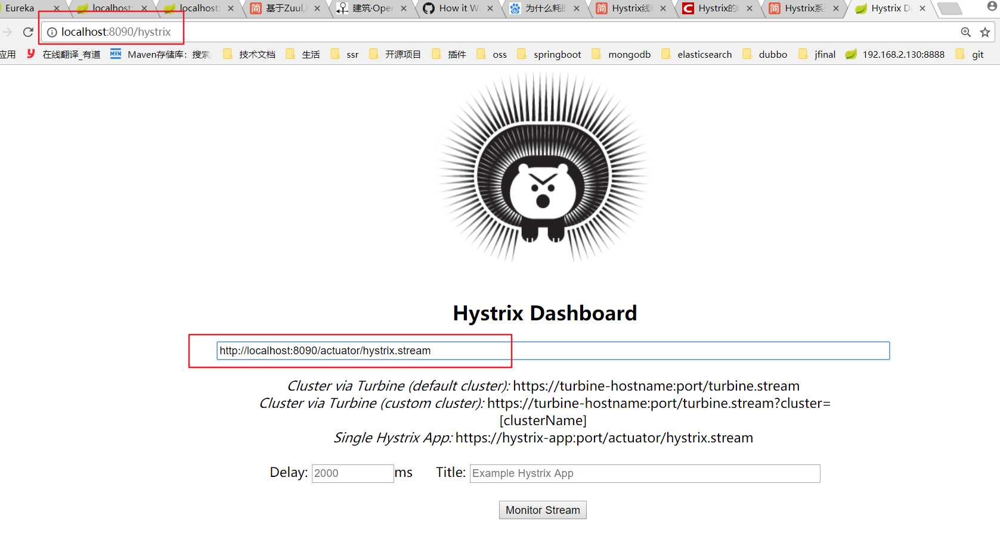
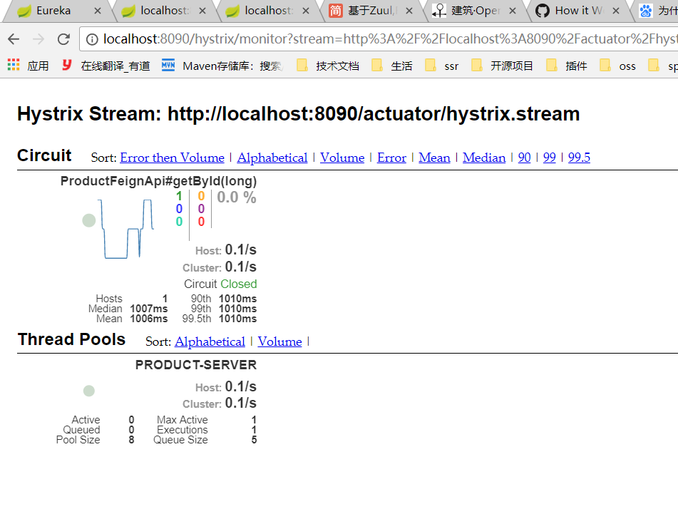
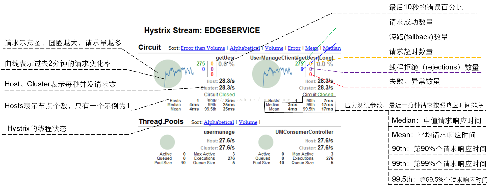

### 超时时间调整

* 一般来说hystric的超时时间应该比ribbon 超时时间要大，因为hystric会做一些比ribbon 更多的业务耗时操作

* hystric默认超时时间为1s,会覆盖rigion的超时时间

测试超时
1. order设置 product -server的超时时间为2000




```yml
# 是否开启超时限制 （一定不要禁用）
hystrix:
  command:
    default:
      execution:
        timeout:
          enabled:

# 超时时间调整
hystrix:
  command:
    default:
      execution:
        isolation:
          thread:
            timeoutInMilliseconds: 4000
```


### 断路器Dashboard监控仪表盘

它主要用来实时监控Hystrix的各项指标信息。通过Hystrix Dashboard反馈的实时信息，可以帮助我们快速发现系统中存在的问题。

集成步骤:
1. 添加dashboard和actuator依赖
2. 在启动类上贴@EnableHystrixDashboard
3. 在配置文件中添加开发监控地址配置
4. 访问入口：http://localhost:启动端口/hystrix，然后再地址栏上输入:http://localhost:启动端口/actuator/hystrix.stream

```yml
management:
  endpoints:
    web:
      exposure:
        include: "*"
```

依赖配置:
```xml
<dependency>
	<groupId>org.springframework.cloud</groupId>
	<artifactId>spring-cloud-starter-netflix-hystrix-dashboard</artifactId>
</dependency>

<dependency>
 <groupId>org.springframework.boot</groupId>
 <artifactId>spring-boot-starter-actuator</artifactId>
</dependency>
```

监控页面如下:





参数讲解:


