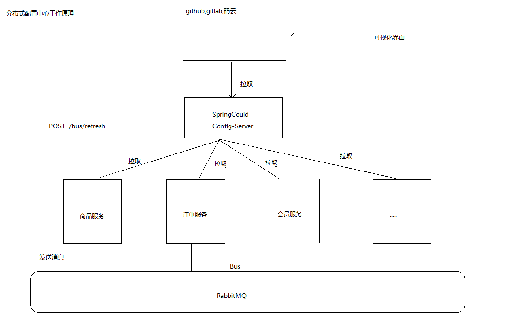

## 分布式配置中心

### 配置中心的作用和好处
统一管理配置, 快速切换各个环境的配置

　在微服务体系中，服务的数量以及配置信息的日益增多，比如各种服务器参数配置、各种数据库访问参数配置、各种环境下配置信息的不同、配置信息修改之后实时生效等等，传统的配置文件方式或者将配置信息存放于数据库中的方式已无法满足开发人员对配置管理的要求，如：

安全性：配置跟随源代码保存在代码库中，容易造成配置泄漏
时效性：修改配置，需要重启服务才能生效
局限性：无法支持动态调整：例如日志开关、功能开关


在实际开发过程中，多环境的配置需要经常发生修改,配置已修改，项目就需要重启
#### 分布式配置中心工作原理

* 版本配置存放在云仓库中，云仓库发生改变,自动更新到springCloud
* 版本发生改变时，通过消息中间件通知服务重新拉取配置



#### 搭建配置中心 config-server

步骤:
1. 使用Spring Initializr创建SpringBoot项目，选择Cloud Discover->Eureka Discover , Cloud Config -> Config Server
2. 在启动类中添加@EnableConfigServer注解
3. 修改yml配置信息
4. 需要添加github的url
5. 在github 地址上添加配置文件   product-server.yml , order-server.yml
6. 启动测试

```yml
server:
  port: 9000
spring:
  application:
    name: config-server
  cloud:
    config:
      server:
        git:
          uri: https://gitee.com/decade123/springclouddemo
          username: decade123
          password: w13640387514
eureka:
  client:
    serviceUrl:
      defaultZone: http://localhost:8761/eureka/
```


访问方式
```
/{name}-{profiles}.properties
/{name}-{profiles}.yml
/{name}-{profiles}.json
/{label}/{name}-{profiles}.yml


name 服务名称
profile 环境名称，开发、测试、生产
lable 仓库分支、默认master分支
```


#### 怎么使用配置中心区分不同环境下的配置文件
```
1. 使用分支来区分不同环境的配置文件
master
    product-server.yml
    order-server.yml
dev
    product-server.yml
    order-server.yml
test    
    product-server.yml
    order-server.yml
如果需要切换分支，只需要修改分支名称
2. 使用profile来区分不同环境的配置文件
master
    product-server.yml
    product-server-dev.yml
    product-server-test.yml
    order-server.yml
    order-server-dev.yml
    order-server-test.yml
```


### 分布式配置中心客户端
步骤:
1. 在order-server中添加config-client的依赖
2. 修改对应服务的配置文件,把application.yml 改为 bootstrap.yml,原因是为了更早地加载配置文件.bootstrap.yml加载时机比较早
3. 把其他配置都放入到git服务器期中管理

```xml
<!-- 配置中心客户端依赖  -->
<dependency>
	<groupId>org.springframework.cloud</groupId>
	<artifactId>spring-cloud-config-client</artifactId>
</dependency>
```
bootstrap.yml
```yml
spring:
  application:
    name: order-server
  cloud:
    config:
      discovery:
        service-id: config-server  # 配置中心服务的名字
        enabled: true
      label: master   # 选用哪一个分支
eureka:
  client:
    serviceUrl:
      defaultZone: http://localhost:8761/eureka/
```


## 消息总线bus
### 为什么使用消息总线bus？
问题: 配置更新了，但是其他系统不知道是否更新
解决方案：使用bus消息总线解决配置更新问题，只需要修改云端仓库配置信息，不需要重新启动服务就可以更新配置


### 项目集成消息总线Bus
步骤:
1. 在order-server和product-server项目中添加actuactor和bus-amqp依赖.

```xml
<dependency>
	<groupId>org.springframework.boot</groupId>
	<artifactId>spring-boot-starter-actuator</artifactId>
</dependency>

<dependency>
	<groupId>org.springframework.cloud</groupId>
	<artifactId>spring-cloud-starter-bus-amqp</artifactId>
</dependency>
```

2. 在order-server.yml和product-server.yml配置文件中增加RabbitMQ依赖
在云仓库配置rabbitmq的相关配置

```yml
spring:
  rabbitmq:
    host: localhost
    port: 5672
    username: guest
    password: guest
```
3. 暴露全部的监控信息

```yml
management:
  endpoints:
    web:
      exposure:
        include: "*"
```
4. 需要刷新配置的地方，增加注解@RefreshScope
5. 访问验证 post方式: http://localhost:8081/actuator/bus-refresh

流程图:


总结: 开发过程可以使用，但是正式环境最好不使用
