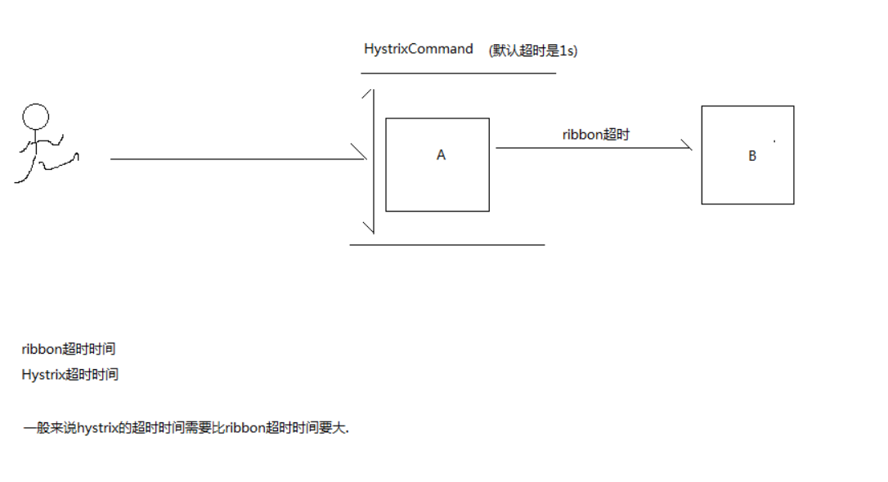
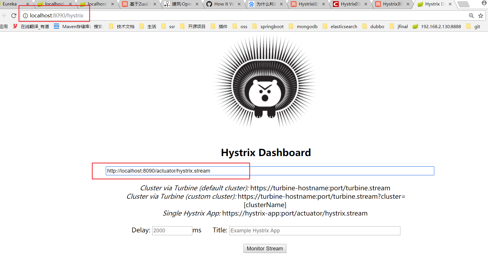
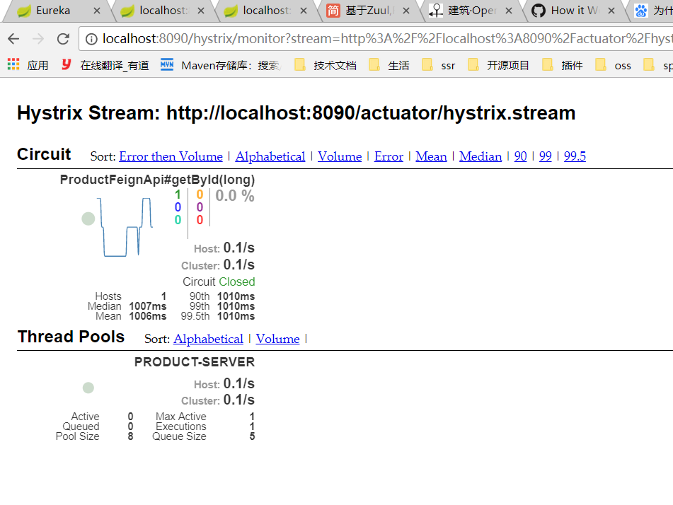
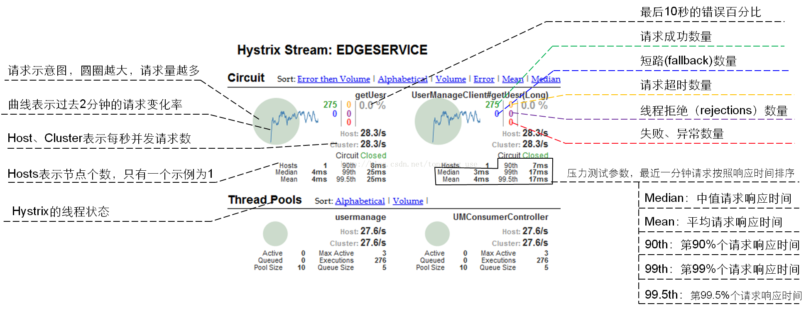
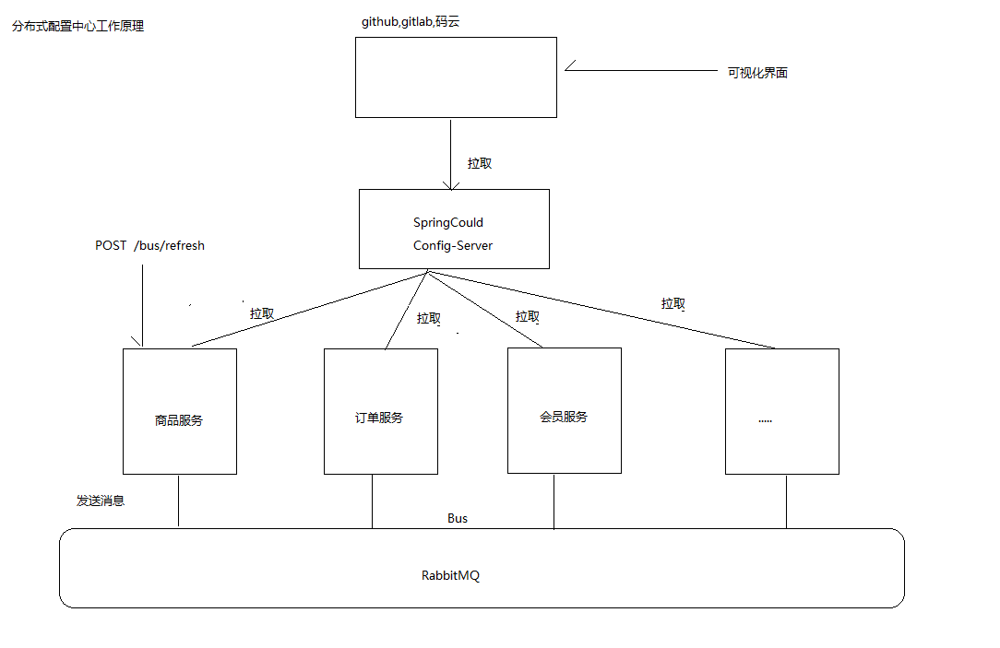
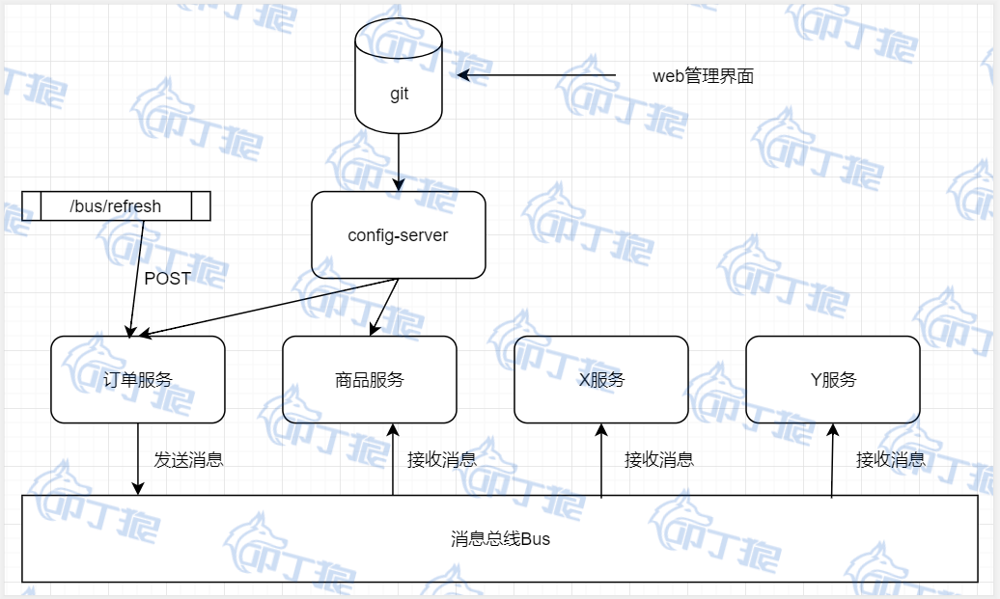

### 服务熔断与降级Hystrix

熔断 : 类似保险丝. 防止整个系统故障，保护自己和下游服务
降级 : 抛弃非核心业务，保障核心页面的正常运行.

#### 雪崩产生的原因:
商品详情展示服务会依赖商品服务， 价格服务，商品评论服务，调用三个依赖服务会共享商品详情服务的线程池，如果其中的商品评论服务不可用（超时，代码异常等等）, 就会出现线程池里所有线程都因等待响应而被阻塞, 从而造成服务雪崩。

概括：大量请求线程同步等待造成的资源耗尽


#### 服务雪崩解决方案

1. 如果一个服务挂了，会导致一直等待，直到服务器资源耗尽，需要设置超时机制
2. 如果非核心业务出现报错，引入降级，返回null，不影响其他业务的正常显示,牺牲非核心业务的资源给核心业务
3. 如果调用服务多次失败时，使用熔断不再调用服务
4. 如果所有的请求都去访问一个服务，会导致资源被一个服务占用，使用限流，将100个资源分配给多个服务，可以避免资源被某个服务占用


* 超时机制
如果我们加入超时机制，例如2s，那么超过2s就会直接返回了，那么这样就在一定程度上可以抑制消费者资源耗尽的问题

* 服务限流
通过线程池+队列的方式或者通过信号量的方式。比如商品评论比较慢，最大能同时处理10个线程，队列待处理5个，那么如果同时20个线程到达的话，其中就有5个线程被限流了，其中10个先被执行，另外5个在队列中

* 服务熔断
当依赖的服务有大量超时时，在让新的请求去访问根本没有意义，只会无畏的消耗现有资源，比如我们设置了超时时间为1s，如果短时间内有大量请求在1s内都得不到响应，就意味着这个服务出现了异常，此时就没有必要再让其他的请求去访问这个服务了，这个时候就应该使用熔断器避免资源浪费

* 服务降级
有服务熔断，必然要有服务降级。
所谓降级，就是当某个服务熔断之后，服务将不再被调用，此时客户端可以自己准备一个本地的fallback（回退）回调，返回一个缺省值。 例如：(备用接口/缓存/mock数据)，这样做，虽然服务水平下降，但好歹可用，比直接挂掉要强，当然这也要看适合的业务场景

### order-server项目集成Hystrix

步骤:
1. 在order-server中添加hystrix依赖
2. 在启动类中添加@EnableCircuitBreaker注解
3. 在最外层添加熔断降级的处理. 在order-server中的控制器中添加@HystrixCommand(fallbackMethod = "saveFail")注解   （注意fallbackMethod需要和原方法一样的签名）

依赖如下:
```xml
<dependency>
 <groupId>org.springframework.cloud</groupId>
 <artifactId>spring-cloud-starter-netflix-hystrix</artifactId>
</dependency>
```


HystrixCommand : 当方法调用失败，调用fallbackMethod走降级方法，返回兜底数据,具备熔断功能，当方法出错了很多次，不会调用当前方法直接走降级方法
fallbackMethod : 指定出现熔断后需要调用的方法,定义的方法一定要和当前方法签名保持一致

```java
@RestController
@RequestMapping("/order")
public class OrderController {

    @Autowired
    OrderService orderService;

    @RequestMapping("/save")
    @HystrixCommand(fallbackMethod = "saveFail")
    // 当方法调用失败，调用fallbackMethod走降级方法，返回兜底数据,具备熔断功能，
    // 当方法出错了很多次，不会调用当前方法直接走降级方法
    public Object save(Long productId,Long uid){
        System.out.println("----调用save方法--");
        int i=1/0;
        return orderService.save(productId, uid);
    }

    public Object saveFail(Long productId,Long uid){
        System.out.println("------- 走 saveFail 降级方法 ------");
        // 返回兜底数据
        return new Order();
    }

}

```

### Feign集成Hystrix

需求: 在被调用服务报错时，使用熔断, 返回正常数据

1. 在ProductFeignApi的@FeignClient(name = "PRODUCT-SERVER",fallback = ProductFeignHystrix.class)
2. 创建一个ProductFeignHystrix implements ProductFeignApi
3. ProductFeignApi 中指定如果方法出错，调用ProductFeignHystrix 实现的方法
4. 开启 feign 允许hystrix功能
5. 调用者根据返回数据做业务处理

yml 依赖配置:
```yml
# 默认是关闭的，需要手动开启一下
feign:
  hystrix:
    enabled: true
```
相关代码逻辑:
```java
//-------------出现异常时，执行fallback 指定的类的降级方法---
@FeignClient(name = "PRODUCT-SERVER",fallback = ProductFeignHystrix.class)
public interface ProductFeignApi {

    @RequestMapping("/product/get")
    Product getById(@RequestParam("id") long id);

}

@Component
public class ProductFeignHystrix implements ProductFeignApi {
    @Override
    public Product getById(long id) {
        System.out.println("----- 执行被服务类 feign 的降级方法 -------");
        // 业务决定返回的数据
        return null;
    }
}
```

### 熔断降级服务异常报警通知

需求: 在订单出现失败后，调用降级方法时，每隔十分钟通知运维人员

实现: 使用redis 实现

步骤:
1. 添加redis 依赖
2. 注入RedisTemplate
3. 在yml文件配置redis 连接信息

```xml
<dependency>
        <groupId>org.springframework.boot</groupId>
        <artifactId>spring-boot-starter-data-redis</artifactId>
</dependency>
```

```java
public Object saveFail(Long productId,Long uid){
       System.out.println("------- 走 saveFail 降级方法 ------");
       // 订单出现异常时，隔20分钟发送短信信息通知管理员需要进行异常处理
       new Thread(new Runnable() {
           @Override
           public void run() {
               String key="order-server";
               // 判断redis中是否保存指定的key
               Object o = redisTemplate.opsForValue().get(key);
               if(o==null){
                   System.out.println("正在发送短信");
                   // 否，保存数据  --> 10s 过时 --> 注意有序列化问题需要解决
                   redisTemplate.opsForValue().set(key,"orderFail", 10,TimeUnit.SECONDS);
               }else{
                   System.out.println("已经通知管理员了，不需要重复发送");
               }
           }
       }).start();
       return new Order();
   }
```


### 熔断隔离策略
参考网站 ： https://github.com/Netflix/Hystrix/wiki/How-it-Works
https://www.jianshu.com/p/df1525d58c20
https://blog.csdn.net/javaer_lee/article/details/87942816
https://www.jianshu.com/p/dc0410558fc9

隔离策略 : 实现不同服务的限流
1. 线程池
  * 为每一个服务分配一个线程池，从线程池中分配一个线程处理每一个请求, 如果请求数超出线程池的maxsize，再请求会再触发fallback接口再进行熔断,用于处理耗时操作，线程之间不会相互影响
  * 服务返回比较耗时使用,线程上下文切换
2. 信号量
  * 在单个线程中处理请求，每接收一个请求，信号量+1,当请求数大于最大请求数时，不再处理请求;
  * 服务响应很快的建议使用信号量.比如访问的缓存服务等.


#### 修改配置
 HystrixCommandProperties中,有一个execution.isolation.strategy,可以进行修改

如果要使用信号量模式，需要配置参数execution.isolation.strategy = ExecutionIsolationStrategy.SEMAPHORE


### 超时时间调整

* 一般来说hystric的超时时间应该比ribbon 超时时间要大，因为hystric会做一些比ribbon 更多的业务耗时操作

* hystric默认超时时间为1s,会覆盖rigion的超时时间

测试超时
1. order设置 product -server的超时时间为2000




```yml
# 是否开启超时限制 （一定不要禁用）
hystrix:
  command:
    default:
      execution:
        timeout:
          enabled:

# 超时时间调整
hystrix:
  command:
    default:
      execution:
        isolation:
          thread:
            timeoutInMilliseconds: 4000
```


### 断路器Dashboard监控仪表盘

它主要用来实时监控Hystrix的各项指标信息。通过Hystrix Dashboard反馈的实时信息，可以帮助我们快速发现系统中存在的问题。

集成步骤:
1. 添加dashboard和actuator依赖
2. 在启动类上贴@EnableHystrixDashboard
3. 在配置文件中添加开发监控地址配置
4. 访问入口：http://localhost:启动端口/hystrix，然后再地址栏上输入:http://localhost:启动端口/actuator/hystrix.stream

```yml
management:
  endpoints:
    web:
      exposure:
        include: "*"
```

依赖配置:
```xml
<dependency>
	<groupId>org.springframework.cloud</groupId>
	<artifactId>spring-cloud-starter-netflix-hystrix-dashboard</artifactId>
</dependency>

<dependency>
 <groupId>org.springframework.boot</groupId>
 <artifactId>spring-boot-starter-actuator</artifactId>
</dependency>
```

监控页面如下:





参数讲解:



## 微服务网关Zuul

Zuul网关是系统的唯一对外的入口，介于客户端和服务器端之间的中间层，处理非业务功能 提供路由请求、鉴权、监控、缓存、限流等功能

#### zuul 作用
1.验证与安全保障: 识别面向各类资源的验证要求并拒绝那些与要求不符的请求。

2.审查与监控: 在边缘位置追踪有意义数据及统计结果，从而为我们带来准确的生产状态结论。

3.动态路由: 以动态方式根据需要将请求路由至不同后端集群处。

4.压力测试: 逐渐增加指向集群的负载流量，从而计算性能水平。

5.负载分配: 为每一种负载类型分配对应容量，并弃用超出限定值的请求。

6.静态响应处理: 在边缘位置直接建立部分响应，从而避免其流入内部集群。

7.多区域弹性: 跨越AWS区域进行请求路由，旨在实现ELB使用多样化并保证边缘位置与使用者尽可能接近。


#### zuul简介：
1. 可以统一做非业务逻辑
2. 做负载均衡
3. zuul 网管也需要注册中心
4. 可以做网络隔离
    |-- 服务都在局域网中,zuul 网关提供外网访问
5. zuul 时servelt 实现，性能不好，需要使用集群和nginx


### 网关项目zuul-server搭建
步骤:
1. 使用Spring Initializr创建SpringBoot项目，选择Cloud Discover->Eureka Discover , Cloud Rounting -> Zuul
2. 添加application.yml配置文件并添加相关的配置信息.
3. 在启动类上贴上@EnableZuulProxy注解
4. 访问 ：
localhost:9000/product-server/product/get?id=1

application.yml 相关配置
```yml
server:
  port: 9000
spring:
  application:
    name: zuul-server
eureka:
  client:
    serviceUrl:
      defaultZone: http://localhost:8761/eureka/
```


### 自定义路由规则
routes :定义多个规则
order-server-route : 规则的名字，不重复即可
path : 重新配置的服务名
serviceId : 配置相关的服务
ignoredPatterns : 忽略以前的配置

访问 ：
localhost:9000/product/product/get?id=1

```yml
zuul:
  ignoredPatterns: /*-server/**
  routes:
    order-server-route:
      path: /order/**
      serviceId: order-server
    product-server-route:
      path: /product/**
      serviceId: product-server
```


### Cookie请求头的问题
1. 在save方法中,通过请求头获取token 和 cookie
2. 获取到的cookie是null,原因是网关默认过滤cookie
3. 修改不过滤cookie
  *  ZuulProperties--> 有一个senstiveHeaders包含了需要过滤的信息


默认情况，网关会把Cookie", "Set-Cookie", "Authorization"这三个请求头过滤掉，下游的服务是获取不到这几个请求头的。
如果不需要过滤这个请求头，可以修改过滤的集合的值.
下面这个属性直接设置：
```yml
zuul:
  sensitive-headers:   # 配置不要过滤cookie请求头
```


### zuul流程分析
参考网站 : https://github.com/Netflix/zuul/wiki/How-it-Works

zuul 实现底层是一个ZuulServlet
ZuulServlet
    |-- 先执行pre --> rounting  --> post
            |-- 出错时 ---> error -->post


### 自定义Zuul过滤器实现登录鉴权
#### 方法解析:
* filterType  :  指定拦截器的类型
* filterOrder : 如果是同类型的过滤器，执行的顺序，数值越小越先执行
* shouldFilter : 需要符合条件才进行拦截,返回true 需要拦截(会执行run方法)，返回false放弃拦截(不会执行run方法)
* run :具体需要执行的业务逻辑

步骤:
1.  继承ZuulFilter实现相关方法
2.  定义
  * filterType=PRE_TYPE
  * filterOrder=1
  * shouldFilter : 只拦截订单模块，订单模块才返回true,只拦截order订单模块
  * run :
      1. 如果token=123 返回null,不做任何拦截
      2. token !=123
        |-- sendZuulResponse(false);// 不再去往后调用远程服务去返回结果
        |-- setResponseStatusCode(401); // 设置没有通过权限认证的状态码
3. 需要交给Spring 管理

相关代码如下:

```java
@Component
public class AuthorZuulFilter extends ZuulFilter {

    @Override
    public String filterType() {
        // 定义过滤器的类型
        return PRE_TYPE;
    }

    @Override
    public int filterOrder() {
        // 在相同拦截类型下的执行顺序，数值越小越先执行
        return 1;
    }

    @Override
    public boolean shouldFilter() {
        //拦截过滤的条件，返回true拦截(调用run方法) ，返回false不拦截(不调用run方法)
        // 这里只对订单模块进行拦截
        RequestContext currentContext = RequestContext.getCurrentContext();
        HttpServletRequest request = currentContext.getRequest();
        if(request.getRequestURI().indexOf("/order")>=0){// 如果是订单模块,才拦截
            return true;
        }
        return false;
    }

    @Override
    public Object run() throws ZuulException {
        // 拦截业务的执行方法
        // 有携带token的才放行，否则不去调用远程服务的方法,响应401状态码
        RequestContext currentContext = RequestContext.getCurrentContext();
        HttpServletRequest request = currentContext.getRequest();
        String token = request.getHeader("token");
        if(!StringUtils.isEmpty(token)&&"123".equals(token)){ // 不做处理
            System.out.println("----token --------"+token);
            return null;
        }
        currentContext.setSendZuulResponse(false);// 不调用远程服务
        currentContext.setResponseStatusCode(HttpStatus.UNAUTHORIZED.value());
        return null;
    }
}

```


## 链路追踪组件

#### 为什么需要链路追踪组件
微服务架构中，必须实现分布式链路追踪，去跟进一个请求到底有哪些服务参与，参与的顺序又是怎样的，从而达到每个请求的步骤清晰可见，出了问题，很快定位。

在微服务系统中，一个来自用户的请求，请求先达到前端A（如前端界面），然后通过远程调用，达到系统的中间件B、C（如负载均衡、网关等），最后达到后端服务D、E，后端经过一系列的业务逻辑计算最后将数据返回给用户。
对于这样一个请求，经历了这么多个服务，怎么样将它的请求过程的数据记录下来呢？这就需要用到服务链路追踪。


* 多个微服务都需要记录日志
  *  一次请求到多个服务器，使用标记当前请求在不同服务器上的日志
  *  可以根据标识定位在其他日志文件中的报错信息

#### 什么是埋点
所谓埋点就是在应用中特定的流程收集一些信息，用来跟踪应用使用的状况，后续用来进一步优化产品或是提供运营的数据支撑，包括访问数（Visits），访客数（Visitor），停留时长（Time On Site），页面浏览数（Page Views）和跳出率（Bounce Rate）。这样的信息收集可以大致分为两种：页面统计（track this virtual page view），统计操作行为（track this button by an event）。

### 集成链路追踪组件Sleuth
Sleuth是一个专门用于记录链路数据的开源组件
https://cloud.spring.io/spring-cloud-static/Greenwich.SR1/single/spring-cloud.html#sleuth-adding-project

方式一:创建log 对象
```java
Logger log=LoggerFactory.getLogger(OrderInfoController.class);
try{
  log.info("hello");
  log.debug("hello");
}catch(){
  log.error(e.getMessage);
}
```

方式二:直接在类上添加 @Slf4j 注解


步骤:
1. 在product-server和order-server中添加sleuth依赖
2. 在需要写日志的类上贴@Slf4j,然后再order-server,product-server中打印日志。

```xml
<dependency>
    <groupId>org.springframework.cloud</groupId>
    <artifactId>spring-cloud-starter-sleuth</artifactId>
</dependency>
```


### 日志格式分析
参数1 ： 服务的名字
参数2 ： 全局唯一ip
参数3 ： 同一个服务下的标志ip
参数4 ： false 是否将该信息输出到zipkin 服务收集和展示


### 什么是zipkin
zipkin是Twitter基于google的分布式监控系统Dapper（论文）的开发源实现，zipkin用于跟踪分布式服务之间的应用数据链路，分析处理延时，帮助我们改进系统的性能和定位故障。

官网:https://zipkin.io/

#### 跟踪操作流程

对程序中的日志记录存储到数据库或es，zh转换成api,形成可视化界面进行展示


#### ZipKin + Sleuth 整合

1. 使用jar 包形式运行zipkin,访问 http://localhost:9411/zipkin/
2. 在微服务项目中添加zipkin依赖(zipkin依赖中已经包含sleuth,所以可以把之前的sleuth依赖删除)
3. 在yml文件配置zipkin 的地址
4. zipkin 只收集10% 的日志数据,可通过配置进行修改日志记录比例


```xml
<!-- zipkin 依赖  -->
<dependency>
	<groupId>org.springframework.cloud</groupId>
	<artifactId>spring-cloud-starter-zipkin</artifactId>
</dependency>
```

```yml
spring:
  zipkin:
    base-url: http://localhost:9411   # zipkin 的地址
  sleuth:
    sampler:
      probability: 1  # 修改记录 10% 的日志
```

访问结果:


## 分布式配置中心

### 配置中心的作用和好处
统一管理配置, 快速切换各个环境的配置

　在微服务体系中，服务的数量以及配置信息的日益增多，比如各种服务器参数配置、各种数据库访问参数配置、各种环境下配置信息的不同、配置信息修改之后实时生效等等，传统的配置文件方式或者将配置信息存放于数据库中的方式已无法满足开发人员对配置管理的要求，如：

安全性：配置跟随源代码保存在代码库中，容易造成配置泄漏
时效性：修改配置，需要重启服务才能生效
局限性：无法支持动态调整：例如日志开关、功能开关


在实际开发过程中，多环境的配置需要经常发生修改,配置已修改，项目就需要重启
#### 分布式配置中心工作原理

* 版本配置存放在云仓库中，云仓库发生改变,自动更新到springCloud
* 版本发生改变时，通过消息中间件通知服务重新拉取配置



#### 搭建配置中心 config-server

步骤:
1. 使用Spring Initializr创建SpringBoot项目，选择Cloud Discover->Eureka Discover , Cloud Config -> Config Server
2. 在启动类中添加@EnableConfigServer注解
3. 修改yml配置信息
4. 需要添加github的url
5. 在github 地址上添加配置文件   product-server.yml , order-server.yml
6. 启动测试

```yml
server:
  port: 9000
spring:
  application:
    name: config-server
  cloud:
    config:
      server:
        git:
          uri: https://gitee.com/decade123/springclouddemo
          username: decade123
          password: w13640387514
eureka:
  client:
    serviceUrl:
      defaultZone: http://localhost:8761/eureka/
```


访问方式
```
/{name}-{profiles}.properties
/{name}-{profiles}.yml
/{name}-{profiles}.json
/{label}/{name}-{profiles}.yml


name 服务名称
profile 环境名称，开发、测试、生产
lable 仓库分支、默认master分支
```


#### 怎么使用配置中心区分不同环境下的配置文件
```
1. 使用分支来区分不同环境的配置文件
master
    product-server.yml
    order-server.yml
dev
    product-server.yml
    order-server.yml
test    
    product-server.yml
    order-server.yml
如果需要切换分支，只需要修改分支名称
2. 使用profile来区分不同环境的配置文件
master
    product-server.yml
    product-server-dev.yml
    product-server-test.yml
    order-server.yml
    order-server-dev.yml
    order-server-test.yml
```


### 分布式配置中心客户端
步骤:
1. 在order-server中添加config-client的依赖
2. 修改对应服务的配置文件,把application.yml 改为 bootstrap.yml,原因是为了更早地加载配置文件.bootstrap.yml加载时机比较早
3. 把其他配置都放入到git服务器期中管理

```xml
<!-- 配置中心客户端依赖  -->
<dependency>
	<groupId>org.springframework.cloud</groupId>
	<artifactId>spring-cloud-config-client</artifactId>
</dependency>
```
bootstrap.yml
```yml
spring:
  application:
    name: order-server
  cloud:
    config:
      discovery:
        service-id: config-server  # 配置中心服务的名字
        enabled: true
      label: master   # 选用哪一个分支
eureka:
  client:
    serviceUrl:
      defaultZone: http://localhost:8761/eureka/
```


## 消息总线bus
### 为什么使用消息总线bus？
问题: 配置更新了，但是其他系统不知道是否更新
解决方案：使用bus消息总线解决配置更新问题，只需要修改云端仓库配置信息，不需要重新启动服务就可以更新配置


### 项目集成消息总线Bus
步骤:
1. 在order-server和product-server项目中添加actuactor和bus-amqp依赖.

```xml
<dependency>
	<groupId>org.springframework.boot</groupId>
	<artifactId>spring-boot-starter-actuator</artifactId>
</dependency>

<dependency>
	<groupId>org.springframework.cloud</groupId>
	<artifactId>spring-cloud-starter-bus-amqp</artifactId>
</dependency>
```

2. 在order-server.yml和product-server.yml配置文件中增加RabbitMQ依赖
在云仓库配置rabbitmq的相关配置

```yml
spring:
  rabbitmq:
    host: localhost
    port: 5672
    username: guest
    password: guest
```
3. 暴露全部的监控信息

```yml
management:
  endpoints:
    web:
      exposure:
        include: "*"
```
4. 需要刷新配置的地方，增加注解@RefreshScope
5. 访问验证 post方式: http://localhost:8081/actuator/bus-refresh

流程图:


总结: 开发过程可以使用，但是正式环境最好不使用
