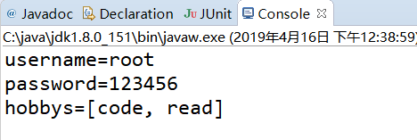

## 请求 & 响应  & jsp

##### HttpServletRequest
* ServletRequest : 表示请求对象，封装了请求的数据和访问请求数据的方法
* HttpServletRequest 接口: ServletRequest接口的子接口，封装了符合http协议的数据的方法

1. 获取请求行数据的信息
  * getMethod():返回请求方式
  * getRequestURI():返回请求行中的资源名字部分 /test/index.html
  * getRequestURL() : 返回浏览器地址栏中的所有信息
  * getContextPath() : 获取当前项目的上下文路径<Context/> 元素的path 属性值
2. 获取网络信息
  * getRemoteAddr() : 返回请求的客户机的IP地址
3. 获取请求头信息
  * getHeader("User-Agent");  获取指定名称的请求头信息
4. 获取表单请求参数
  * getParamter(String name) : 获取请求参数的值
  * getParamterValues(String name); 返回指定名字参数的多个参数值,如多选框
  * Enumeration getParamterNames(); 返回所有参数名的Enumeration
  * Map<String,String[]> getParamterMap(); 将表单数据保存到Map集合中


##### 代码示例
```
@Override
	protected void service(HttpServletRequest req, HttpServletResponse resp) throws ServletException, IOException {

		//获取请求行信息
		System.out.println(req.getMethod());
		//获取上下问路径 Context 下的path
		System.out.println(req.getContextPath());
		//获取 地址栏 上的
		System.out.println(req.getRequestURI());
		System.out.println(req.getRequestURL());

		//获取请求客户端的主机ip
		System.out.println(req.getRemoteAddr());

		System.out.println("---------请求头信息-----------");

		//获取用户浏览器数据
		System.out.println(req.getHeader("User-Agent"));

		System.out.println("-----请求参数-----");
		//获取指定参数名的参数值
		String username=req.getParameter("username");
		System.out.println(username);

		System.out.println("\n-----getParameterValues--------");
		//获取多个参数值
		String[] hobbys = req.getParameterValues("hobby");
		System.out.println(Arrays.toString(hobbys));


		System.out.println("\n---getParameterNames---------");
		//获取所有的参数名
		Enumeration<String> names = req.getParameterNames();
		while (names.hasMoreElements()) {
			String name = (String) names.nextElement();
			String value=req.getParameter(name);
			System.out.println(name+":"+value);
		}

		System.out.println("\n----getParameterMap---------");
		//将参数封装到map中
		Map<String, String[]> parameterMap = req.getParameterMap();
		Set<Entry<String,String[]>> entrySet = parameterMap.entrySet();
		for (Entry<String, String[]> entry : entrySet) {
			String name=entry.getKey();
			String[] value = entry.getValue();
			System.out.println(name+":"+Arrays.toString(value));
		}
		System.out.println();

	}
```


---

#### 注册案例

1. 书写注册表单页面


2. 请求核心代码示例,获取请求参数并打印

```
  @Override
	protected void service(HttpServletRequest req, HttpServletResponse resp) throws ServletException, IOException {
		//获取单个参数
		String name=req.getParameter("username");
		String password=req.getParameter("password");
		//获取多个参数
		String[] hobbys = req.getParameterValues("hobby");

		//打印获取的参数
		System.out.println("username="+name);
		System.out.println("password="+password);
		System.out.println("hobbys="+Arrays.toString(hobbys));

		resp.sendRedirect(req.getContextPath()+"/register.html");
	}
```
3. 运行结果




---

#### 请求的中文乱码的处理
tomcat 服务器在处理get 和post 请求时使用的时ISO-8859-1 编码，
但是此编码不支持中文，所以出现乱码

* 使用get 请求在8.0之后不会乱码，但post 会乱码

##### 解决方案一(使用编码解码)
* 注意:每个参数都需要设置，代码繁琐,但支持get 和post乱码解决

```
String name=req.getParameter("username");
byte[]  bytes=name.getBytes("ISO-8859-1");
name=new String(bytes,"utf-8");
System.out.println("username="+name);
```


##### 解决方案二(修改配置文件参数)
* 在server.xml中 URIEncoding="utf-8" ,8.0之前可以修改此处解决中文乱码
* 只能解决get 请求的中文乱码问题，不能解决post 中文乱码问题

```
<Connector
URIEncoding="utf-8"
connectionTimeout="20000"
port="8080"
protocol="HTTP/1.1"
redirectPort="8443"/>
```


##### 解决方案三
* 使用req 的api 解决乱码问题
 req.setCharacterEncoding("utf-8");
* 方法的调用必须在获取任何参数之前,放在第一行
* 只能解决post请求的中文乱码问题


---

#### HttpServletResponce
* ServletResponce 接口: 响应对象，封装了做响应相关的方法
* HttpServletResponce 接口:ServletResponce接口的子接口,封装了符合http 协议的响应方法


#### 常用方法
* OutputStream getOutputStream() : 获取字节输出流对象
* PrintWriter getWriter() : 获取字符输出流对象
* 注意: 俩个方法不能同时使用


#### 乱码解决

```
方式一:
//通知浏览器给的数据是文本的html
resp.setContentType("text/html");
//单独设置响应的数据编码
resp.setCharacterEncoding("utf-8");

方式二:
//设置响应文本内容和数据编码
resp.setContentType("text/html;chartset=utf-8");
```

---

### --------------------web.xml 映射细节-------------

1. servlet-name 问题
  * servlet-name内容可以配置任意字符，但不能写default，会导致静态文件访问不了

  * tomcat/conf/web.xml中存在一个default的默认配置，作用是用来处理静态资源(html/css/js)
  被覆盖后就不能访问静态资源

  

  

2. 映射路径
  一个Servlet 可以配置多个映射
  * 配置多个  servlet-mapping
  * 配置多个  url-pattern
  * 注意: 映射的名称必须唯一

  

3. 通配符 *

```
* 表示任意个数的任意字符

1. / * : 表示任意个数的任意字符的请求都可以访问到当前的servlet
2. /xxx/ * : 表示任意以 /xxx/ 开头的任意个数字符连接都可以访问
        注意: 必须 以 / 开头
3. * .xxxxx:以 xxx 结尾的任意字符的连接都可以访问
```


4. 欢迎页面的配置

```
conf/web.xml中配置了，修改时直接在项目中的web.xml覆盖
<welcome-file-list>
    <welcome-file>index.html</welcome-file>
    <welcome-file>index.htm</welcome-file>
    <welcome-file>index.jsp</welcome-file>
</welcome-file-list>
```


5. 服务器启动初始化Servlet配置:

```
 如果项目有需求:在项目中有较多初始化代码，会消耗时间
 需要让初始化代码在服务器启动时就执行，第一次请求才执行会导致用户体验差

 *  配置
 在<servlet> 中加入
 <load-on-startup>1</load-on-startup>
 来配置Servlet的启动优先级

 默认值是-1,第一次请求时才初始化
 值是正数或0时，随着项目启动，创建对象,执行初始化
 整数值越小优先级越高
 ```
---

#### ------- servlet3.0 新特性(注解配置) --------

* 使用注解配置。可以解决web.xml中 servlet配置代码臃肿问题

* 注解使用:
   * 在servlet 类上添加一个标签 @WebServlet(path)
   * path相当于 url-pattern 下的path

```
注解需要第三方程序赋予功能:
在web-app中有设置metadata-complete 开启注解功能
metadata-complete = true ： 忽略扫描servlet的注解
metadata-complete = false : 不忽略扫描(默认缺省值)

注解的好处: 解决了代码臃肿问题
缺点:写在java代码中,会导致硬编码
```

---

#### servlet 线程安全
* servlet是tomcat服务器帮助我们创建的对象.而且只会创建一次.在整个应用中,只存在一个servlet对象.
* 所有的浏览器(不同的线程)来访问当前的servlet,其实都是访问的同一个对象.
* 可能出现线程安全问题.

问题:
* 如果在当前servlet中,包含有成员变量的话,那么所有的线程访问的成员变量就是共享数据.就会有线程安全问题
* 解决方法:不使用成员变量


---

#### 简易计算器

```
@WebServlet("/calc")
public class CalcServlet extends HttpServlet{

	@Override
	protected void service(HttpServletRequest req, HttpServletResponse resp) throws ServletException, IOException {

		//1. 获取参数
		String strNum1=req.getParameter("num1");
		String strNum2=req.getParameter("num2");
		String op=req.getParameter("op");


		Integer num1=0;
		Integer num2=0;
		int ret=0;

		//2.首次访问参数不能为空
		if(hasLength(strNum1)&&hasLength(strNum2)){
			//3. 转换数据类型
			num1 = Integer.parseInt(strNum1);
			num2=Integer.parseInt(strNum2);
			//4. 根据操作符，计算结果
			switch (op) {
			case "+":
				ret=num1+num2;
				break;
			case "-":
				ret=num1-num2;
				break;
			case "*":
				ret=num1*num2;
				break;
			case "/":
				ret=num1/num2;
				break;
			}
		}


		//设置响应编码格式
		resp.setContentType("text/html;charset=utf-8");
		PrintWriter out = resp.getWriter();

		//输出结果
		out.print("<form action='/test/calc' method='get'>");
		out.print("<input type='text' name='num1' value='"+num1+"'> &nbsp;");
		out.print("<select name='op'>");
		out.print("<option>+</option>");
		out.print("<option>-</option>");
		out.print("<option>*</option>");
		out.print("<option>/</option>");
		out.print("</select>&nbsp;");
		out.print("<input type='text' name='num2' value='"+num2+"'>&nbsp;");
		out.print("<input type='submit' value='='>&nbsp;");
		out.print("<input type='text' name='ret' value='"+ret+"'>&nbsp;");
		out.print("</form>");
	}

	public boolean hasLength(String str){
		return str!=null&&!"".equals(str);
	}


}

```
* 运算结果


---

### 动态网页 : jsp

servlet职责:
1. 接受请求参数,封装成对象
2. 调用业务方法,处理请求
3. 控制界面跳转.
之所以servlet仅仅是控制界面跳转,而不是自己使用流来输出要个界面,因为servlet不擅长.
需要由jsp 进行页面显示

jsp 的使用:
1. 直接创建jsp文件
  修改默认编码
2. 书写jsp 网页代码
3. 通过查看 tomcat/config/web.xml 可知，访问jsp都交由JspServlet处理


##### jsp的原理:
1. 所有的 .jsp 和 .jspx 的访问都交给JspServlet处理
  * 把jsp 文件转换成java文件
  * 把java文件编译成字节码文件
  * 把转化成的文件保存在tomcat /work目录下
2. 通过源码查看得知jsp的集成体系
    hell_jsp --> HttpJspBase-->HttpServlet
  因此,jsp 本质是servlet
3. 在hello_jsp的service方法中,jsp 网页代码由服务器的out对象输出


##### jsp 的基本语法

```
1. jsp 的注释
作用:注释脚本代码,注释不会编译到servlet
语法:<%--注释--%>

2. jsp 中的java脚本片段
作用:书写java逻辑代码
语法:
<%
  int age=10;
%>
原理:其中的语句会原封不动的被服务器翻译到对应的Servlet的_jspService方法中

3. jsp 的java 脚本表达式
作用：输出数据到页面上
语法：<%=表达式%>(实际上就是调用输出流打印到页面上) out.print(表达式);

4. jsp 的声明
作用:定义类的成员
语法: <%! java代码 %>
<%!
  private String username="";
  public void doWork(){
  }
%>
原理: java 代码会被翻译到 _jspService 方法之外,作为成员变量或成员方法
```


```
标准指令:设定JSP网页的整体配置信息
特点:
    并不向客户端产生任何输出，
    指令在JSP整个文件范围内有效　　
    为翻译阶段提供了全局信息
----------------------------------
JSP 三大指令
 1  page
 2   include
 3   taglib
----------------------------------
page指令:
作用：定义JSP页面的各种属性
属性：
language:指示JSP页面中使用脚本语言。默认值java，目前只支持java。
extends：指示JSP对应的Servlet类的父类。不要修改。
*import：导入JSP中的Java脚本使用到的类或包。（如同Java中的import语句）
JSP引擎自动导入以下包中的类：	javax.servlet.*	 javax.servlet.http.*		javax.servlet.jsp.*
注意：一个import属性可以导入多个包，用逗号分隔。

*sessioin:指示JSP页面是否创建HttpSession对象。默认值是true，创建
*buffer：指示JSP用的输出流的缓存大小.默认值是8Kb。
autoFlush：自动刷新输出流的缓存。
isThreadSafe：指示页面是否是线程安全的（过时的）。默认是true。
    true：不安全的。
    false：安全的。指示JSP对应的Servlet实现SingleThreadModel接口。
*errorPage: 指示当前页面出错后转向（转发）的页面。
    目标页面如果以"/"（当前应用）就是绝对路径。
配置全局错误提示页面：
web.xml
<error-page>
    <exception-type>java.lang.Exception</exception-type>
    <location>/error.jsp</location>
</error-page>
<error-page>
<error-code>404</error-code>
    <location>/404.jsp</location>
</error-page>

*isErrorPage:指示当前页面是否产生Exception对象。
*contentType：指定当前页面的MIME类型。作用与Servlet中的response.setContentType()作用完全一致
*pageEncoding：通知引擎读取JSP时采用的编码（因为要翻译）
    还有contentType属性的作用。
*isELIgnored:是否忽略EL表达式。${1+1}。默认值是false。
page指令最简单的使用方式：<%@ page pageEncoding="UTF-8"%>

2.include（静态包含,开发中能用静的不用动的）
    作用：包含其他的组件。
    语法：<%@include file=""%>file指定要包含的目标组件。路径如果以"/"（当前应用）就是绝对路径。
    原理：把目标组件的内容加到源组件中，输出结果。

    动态包含：
        采用动作元素：<jsp:include page=""/>路径如果以"/"（当前应用）就是绝对路径。


3.taglib
    作用：引入外部的标签
    语法：<%@taglib uri="标签名称空间" prefix="前缀"%>
             <%@ taglib uri="http://java.sun.com/jsp/jstl/core" prefix="c"%>

```


#### 总结:
```
1. HttpServletRequest :
    |--- 请求行信息方法
        |---getMethod : 请求方式
        |---getContextPath : 上下文路径
        |---getRequestURI: 获取地址栏中的资源名部分
        |---getRequestURL: 获取地址栏中的所有信息
    |--- 请求头信息
        |---getHeader(String name) :获取指定请求头信息
    |---请求参数
        |---getParamter(name) ： 获取单个参数值
        |---getParamterValues(name) : 获取多个参数值
        |---getParamterNames() : 获取所有的参数名
        |---getParamterMap(): 将参数封装到Map中
2. 请求乱码解决方案
  * 使用编码解码
  * 在server.xml 中配置URIEncoding=utf-8
      |---只对get 有效
  * req.setCharacterEncoding("post")
      |---只对post 有效
3. HttpServletResponce:
      获取输出对象
        |----getOutputStream 字节输出流
        |----getWriter 字符输出流
        俩个输出对象不能同时使用
      解决中文乱码
            设置文本格式，编码格式
        |--- resp.setContentType("text/html")
             resp.setCharacterEncoding("utf-8")
        |---resp.setContentType("text/html;charset=utf-8")
4. 映射细节
   |--- servlet-name 需要设置相同，
        不能设置成default,设置成default 会导致静态文件访问不了,
        web.xml中的defaultServlet主要用于访问静态文件，不能覆盖
   |--- url-pattern : 配置方式
        |---多个url-pattern
        |---多个<servlet-mapping>
   |---* 通配符
        / * : 任意路径可以访问
        /xxxx/ * : 以/xxxx/为前缀作为拼接的路径都可以访问
        * . xx : 以xx结尾拼接的路径都可以访问
   |---设置欢迎页面
        <welcome-file-list>
          <welcome-file>welcome.jsp</welcome-file>
        <welcome-file-list>
   |---初始化加载:tomcat 启动时创建对象，用于进行初始化操作
      <load-on-startup>0</load-on-startup>

5. 注解配置
  @WebServlet("/path")
  解决代码臃肿，存在硬编码问题

jsp 原理
  web.xml 中配置以 * .jsp 的jspServlet
  当访问jsp时,jspServlet 将jsp 翻译成java文件，存放在 tomcat/work目录下
  java 文件--> HttpJspBase-->HttpServlet
  因此,jsp的本质是servlet ，jsp 页面内容在 java 代码中使用out 输出

jsp 语法:
1. jsp脚本表达式
作用:直接将表达式内容输出，在_jspService中
语法:  <%=表达式 %>
2. jsp 脚本片段
作用: 书写java 代码,java代码会被翻译到 _jspService方法中
语法：
<%  java代码 %>
3. jsp 声明
作用: 用于在java 代码中，声明静态方法
语法:
<%! 成员变量 | 成员方法  %>

```
