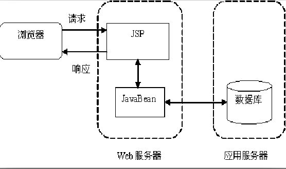
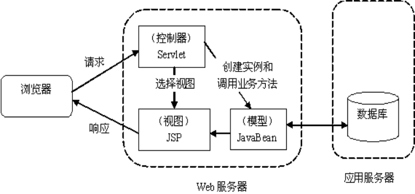
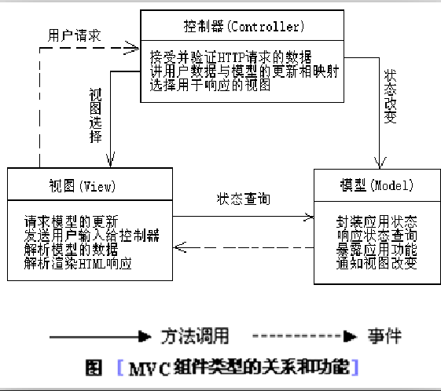
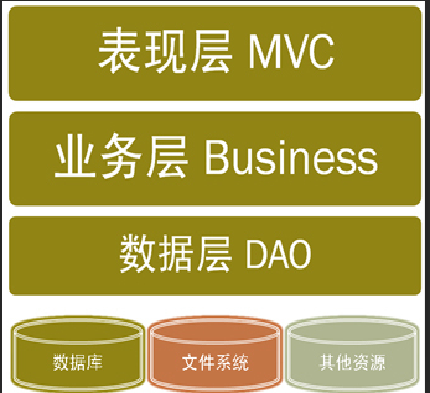

### MVC
---


模型一:
```
主要使用的JSP 来做操作
技术 :  JSP   +  JavaBean

JSP 的作用:
    1 接受请求
    2 处理业务操作
    3 控制跳转
    4 视图显示

缺点:维护麻烦
```



模型二：
```
解决模型一存在的问题，在jsp中完成了所有的操作
把显示交给jsp来做,把请求处理和跳转交给servlet处理

技术: servlet + jsp +  javabean
责任分离:

jsp:只做页面的显示
servlet:
1. 接受请求，封装参数
2. 调用业务方法处理请求
3. 控制试图跳转
javabean:封装了一个数据

```


#### MVC 模式
```
MVC : 体现责任分离的原则
  MVC思想早期是在C/S 中使用比较多
M: Model 模型:封装数据(Student)
V: View 视图 :jsp
C:Controller 控制器:servlet
```



#### 三层架构
* 表示层:位于最外层，用于显示数据和接受用户输入的数据
* 业务逻辑层:表示层和DAO层之间的桥梁，实现业务逻辑，业务逻辑包括:
* 数据访问层:与数据库交互，实现对数据的增删改查，将存储在数据库中的数据提交给
业务层

#### 业务逻辑层
业务逻辑层(service)其实是一个组件(可以重复使用),包括接口和接口实现类

分包规范:
```
com.kiva.oss.util
cn.wolfcode.pss.domain;  // 存放模型
cn.wolfcode.pss.service;     //存放service 接口
cn.wolfcode.pss.service.impl;// 存放业务处理接口的实现类
cn.wolfcode.pss.test;    // 存放业务方法的测试类
```




#### 准备工作:
1. 创建模型包和product模型
2. 创建dao包和dao接口
3. 创建dao.impl包和实现类
4. 创建serice 包和接口
5. 创建service.impl 包和实现类
6. 创建mybatis-cfg.xml核心配置文件

```
@WebServlet("/product")
ProductServlet extends HttpServlet{

  service(req,resp){
    //设置编码 Utf-8 要在参数获取之前
    //根据cmd 的值判断要调用的方法

    //1. 接受请求，封装对象
    //2. 调用业务逻辑方法来处理请求
    //3. 控制跳转
  }


  delete(req,resp){
    1. 接受id 请求参数
    2. 调用业务方法来处理请求
      dao.delete();
    3. 控制跳转，跳转到list
      /product?cmd=list
  }

  edit{
    获取id 的值
    //如果id 是空，添加操作
    //如果id不是空，编辑操作
        |--查询指定id 的product,作为input表单回显
        |--数据设置到req中
    //跳转到 input.jsp(编辑页面)
  }

  saveOrUpdate(){
    //1. 接受id的数据,判断是添加还是修改
        |--有id,修改
        |--没有id,添加
    //接受请求参数封装成对象
    //调用业务逻辑方法处理请求
    //页面跳转到 product?cmd=list
  }

  req2Product(req,product){
    获取请求，将请求转换成product
  }

}
```

查询操作
1. ProductServlet 中list方法查询所有数据
2. 设置共享数据
3. 跳转到list.jsp 去显示数据

删除操作
1. 编写页面的超链接,需要带上数据id
2. 在ProductServlet ->delete 获取id删除数据
3. 跳转/product中查询列表数据


保存操作
1. 书写增加的超链接s
2. 跳转到 prduct?cmd=edit
3. 跳转到input.jsp
4. 提交到 prduct?cmd=saveOrUpdate

编辑操作
1. 修改的超链接，携带要修改的id
2. 在ProductServlet ->edit 中获取id对应的数据，转发到input.jsp
3. 在input.在jsp中做数据回显，需要提交id作为添加或修改的判断条件
4. 在saveOrUpdate中根据id是否为空,调用添加或修改的方法


常见错误
1. 做跳转操作，涉及不需带数据的跳转使用重定向
    req中参数会被携带过去,影响执行


```
总结:
MVC 设计思想：
体现责任分离的原则
M: Model 模型:封装数据(Student)
V: View 视图 :jsp
C:Controller 控制器:servlet

三层架构:
表示层: 用于与用户进行界面上的交互,显示数据，提交数据
逻辑业务层:表示层和数据访问层的中间组件
数据访问层:封装了用于数据库交互的模块


```
