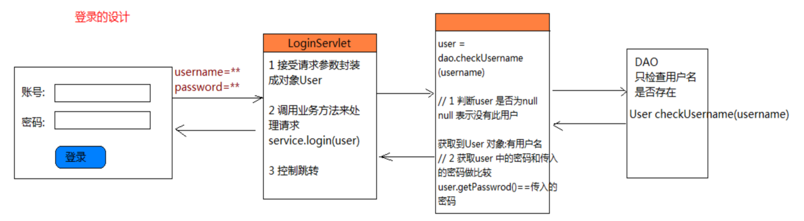
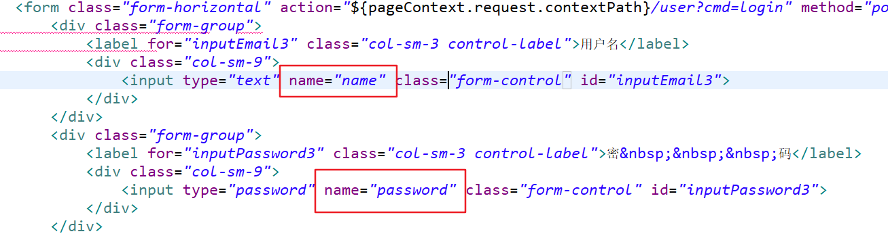
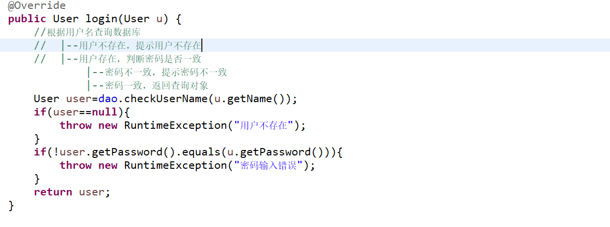
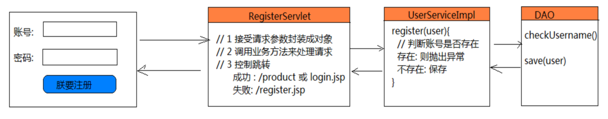

### 综合案例
---

#### 步骤
1. 导包
2. 使用Mybatis完成后台的crud
3. 完成service的书写
4. 书写前端web.crud


6. 拷贝前端项目文件
7. 修改menu.jsp
8. 书写查询操作
9. 书写list.jsp

在input.jsp 列表下，根据p是否为空，修改数据
   ${empty p}?"修改":"保存"


#### 登陆

Loginservlet
```
1. 接受请求参数，封装成对象
2. 调用业务方法处理请求
3. 控制跳转
    |---将用户信息存入session中,供后面的请求去判断是否有登陆操作
    |---判断是否需要记住用户名
    |---在其他servlet中根据session判断
4. 说明异常,登陆失败,跳转到login.jsp,设置异常信息
```
Service
```
1. 调用dao.checkUserName(username)
2. 判断user是否为null
    |---null,表示没有数据
    |---!null,获取到User对象，有用户名
3. 判断user  的密码和传入用户的密码是否一致
    |--不一致，不能登陆,提示密码不一致s
```
dao
```
1. 只检查用户名是否存在
checkUserName(username)
```



代码示例
1. 前端表单

2. servlet 代码

```
@WebServlet("/user")
public class UserServlet extends BaseServlet{

	IUserService service=new UserServiceImpl();

	@Override
	public void defaultMethod(HttpServletRequest req, HttpServletResponse resp) throws ServletException, IOException {
		resp.sendRedirect(req.getContextPath()+"/login.jsp");
	}

	public void login(HttpServletRequest req, HttpServletResponse resp) throws ServletException, IOException {

		//1. 接受用户参数，封装对象
		User user=new User();
		req2User(req,user);
		//2. 调用service,处理登陆逻辑
		try {
			User existUser=service.login(user);
			//3. 判断是否登陆成功,
			Boolean isRemember=Boolean.valueOf(req.getParameter("rememberMe"));
			if(isRemember){
				//如果需要记住账号，将用户名添加到cookie
				Cookie cookie=new Cookie("username", URLEncoder.encode(existUser.getName(), "utf-8"));
				cookie.setMaxAge(60*60);//1小时   单位是s
				resp.addCookie(cookie);
			}
			//如果登陆成功，判断是否需要记住账号
			//    |--登陆成功，保存用户信息到session中,跳转到管理页面
			req.getSession().setAttribute("USER_IN_SESSION", existUser);
			resp.sendRedirect(req.getContextPath()+"/product?cmd=list");
		} catch (Exception e) {
			//    |--登陆失败，提示错误信息，跳转到登陆页面
			req.setAttribute("errorMsg", e.getMessage());
			req.getRequestDispatcher("/login.jsp").forward(req, resp);
		}
	}

	private void req2User(HttpServletRequest req, User user) {
		String name = req.getParameter("name");
		String password = req.getParameter("password");
		if(StringUtil.hasLength(name)){
			user.setName(name);
		}
		if(StringUtil.hasLength(password)){
			user.setPassword(password);
		}
	}

	/**
	 * 注销
	 * @param req
	 * @param resp
	 * @throws ServletException
	 * @throws IOException
	 */
	public void logout(HttpServletRequest req, HttpServletResponse resp) throws ServletException, IOException {
		HttpSession session = req.getSession();
		session.removeAttribute("USER_IN_SESSION");
		session.invalidate();
		resp.sendRedirect(req.getContextPath()+"/login.jsp");
	}

}
```
service 代码



#### 记住账号
```
使用Cookie记住用户名
1. 判断用户是否需要记住用户名
  Cookie cookie=new Cookie("username",username);
  cookie.setMaxAge(60*60*24*7);
  resp.addCookie(cookie);
2. 页面根据是否有cookie,显示用户名
    |--使用EL 内置对象，获取cookie
  ${cookie.username.value}
3. 如果需要处理cookie中文,先使用URLEncoding
    |---loginservlet 中将中文转成非中文
    |---login.jsp中将非中文转化成中文
  解决方案:login.jsp中使用java脚本
```
注销操作(退出登陆需要请求session中的数据,避免product 页面被直接访问)
```
  LogoutServlet操作
  清除session中的用户信息
  req.getSession().removeAttribute("USER__IN_SESSION")
  或销毁session
  req.getSession().invalidate();
  跳转到登陆页面
```

---

#### 注册操作

RegisterServlet
```
1. 接受请求参数封装成对象
2. 调用业务方法来处理请求
   |--成功 : /product 或/login.jsp
    |--跳转 /product (需要设置session)
        |--req.getSession().setAttribute("USER_IN_SESSION",user);
   |--失败 : register.jsp
```

serviceImpl
```
1. 判断账号是否存在
  |--存在抛出异常
  |--不存在保存账号
```

dao
```
1. checkUserName()
2. save(User)
```

---
#### 总结:
```
登陆操作
Servlet
1. 获取登陆信息，封装对象
2. 调用service 登陆方法
3. 判断查询用户是否存在
    |---存在,使用session保存用户数据,跳转到管理页面
          |---需要保存用户信息，使用Cookie记住用户名
          |---在其他需要登陆的地方前使用session判断是否有登陆，没有登陆则跳转到登陆界面
    |---不存在，跳转到login.jsp 提示异常信息

service
1. 调用dao 根据用户名查询用户对象
2. 如果对象不存在，提示用户名不存在
3. 如果对象存在，判断密码是否一致
4. 密码不一致，提示用户
5. 密码一致，返回对象

dao
根据用户名查询用户对象
```
