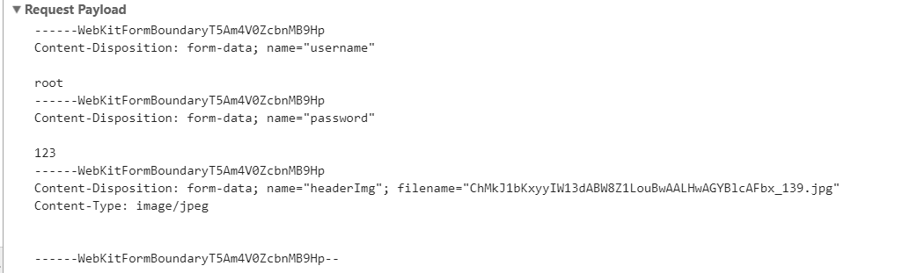
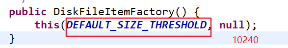
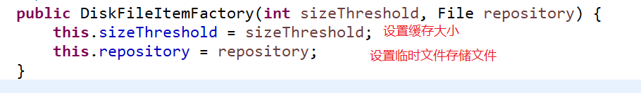
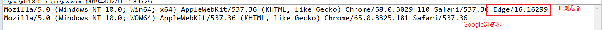

### 文件上传下载&防止表单重复提交
---
准备工作
```xml
1. 表单的提交方式是post,get 提交数据有大小限制
2. 需要有表单提交控件
头像： <input type="file" name="header"/>
3. 表单的数据提交编码格式改成多段式提交
  enctype="multipart/form-data"
  |--如果使用文本提交只能得到文件的名字

注意:表单使用multipart/form-data提交数据时，servlet 不能直接使用req.getParamter获取
```
1. 书写form 表单

```html
<form action="#" method="post" enctype="multipart/form-data">
  账号：<input type="text" name="username"/>
  密码：<input type="password" name="username"/>
  头像： <input type="file" name="header"/>
</form>
```

2. 创建文件上传servlet

```java
@WebServlet("/upload")
class FileUploadServlet extends HttpServlet{

  service(req,resp){
    //文本提交
    req.getParamter("username");
    req.getParamter("password");
    req.getParamter("header");

    //多段式提交
    Scanner sc=new Scanner(req.getInputStream());
    while(sc){
      System.out.print(sc.nextLine());
    }
  }

}
```
多段式文件提交请求信息



#### FileUpload 组件

步骤:
1. 导入俩个jar 包
  * commons-fileupload-1.3.2.jar
  * commons-io-2.5.jar
2. 解析请求，判断是否时文件上传请求 isMultipartContent
3. 创建一个FileItemFactory(一个FileItem 封装一个段式的请求数据)
3. 创建一个文件上传处理器 ServletFileUpload
3. 解析请求
4. 获取表单文本数据
5. 获取表单文件数据

使用Api:

#### DiskFileItemFactory
DiskFileItemFactory implements FileItemFactory
主要方法如下:

方法|解释|
--|:--:|
DiskFileItemFactory()|空参构造器调用有参构造函数<br>
DiskFileItemFactory(int sizeThreshold, File repository)|有参构造参数<br>sizeThreshold:缓存大小，默认10240 B <br>repository：设置临时文件位置<br>
void setSizeThreshold(int sizeThreshold)|设置缓存大小,默认 10240B
void setRepository(File repository)|设置临时文件位置，当文件超过缓存大小时，会保存到临时文件中,复制文件时会剪切到指定的文件夹


#### ServletFileUpload

方法|解释|
--|:--:|
public static final  boolean <br> isMultipartContent(HttpServletRequest request)| 用于判断是否是多段式提交:<br>1.判断是否时post提交 <br> 2. 是否有contentType  <br> 3. conType是否时以Multipart开头


细节:
```
1. 文件名相同时，会出现名字覆盖
  |--使用UUID
  |--使用FileNameUtils.getExtension(name);获取后缀名
2. 修改文件保存到项目下
  文件如果保存在磁盘下,http协议无法访问到，应该将文件保存到项目下
3. 缓存大小和临时目录
  |--文件根据大小判断是否在内存中或者时临时目录中
  |--设置临时目录 : 在tomcat 下的temp目录下
    |--超多指定缓存大小，会将文件保存在临时文件中,文件拷贝时就将文件剪切过去
  |--设置缓存大小 ： 10240 B =10 kb
4. 限制文件上传类型
  |--通过文件后缀名限制
5. 约束文件的大小

```


ServletFileUpload
```java
@WebServlet("/upload")
class FileUploadServlet extends HttpServlet{
  //把所有允许的类型先定义好
  String allow_type="png;jpeg;gif;jpg";

  service(req,resp){
    //不能处理多段式提交乱码
    req.setCharacterEncoding("utf-8");

    //判断是否时post提交
    //是否有contentType
    //conType是否时以Multipart开头
    boolean isMultipart=ServletFileUpload.isMultipartContent(req);

    if(!isMultipart){
        return;
    }
    FileItemFactory factory=new DiskFileItemFactory();
    //设置缓存大小
    factory.setSizeThreadold(1024*30);
    factory.setRepository(new File("临时文件目录"));

    //获取文件上传处理器
    ServletFileUpload upload=new ServletFileUpload(factory);
    //设置单个文件的大小
    upload.setFileSizeMax(1024*10); //只能上传10kb以内
    //设置所有文件
    upload.setSizeMax(1024*30);

    //解析请求,将请求中的数据封装成FileItem
    List<FileItem> items=upload.parseRequest(req);

    for(FileItem item:items){

      item.getFieldName(); //获取表单控件name属性值

      if(item.isFormField()){ //判断是否时普通的表单数据
          //指定编码,防止乱码
          item.getString("utf-8");//获取普通表单控件的数据
      }else{
          items.isInMemory();//是否在内存中

          String fileName=item.getName(); //获取文件的名字
          //动态获取upload的绝对路径
          String baseDir=req.getServletContext().getRealPath("/upload/");
          //设置唯一的文件名
          String extName=FileNameUtils.getExtension(fileName);
          String name=UUID.randomUUID().toString()+"."+extName;

          //通过拓展名来限制是否保存
          boolean isPicture=Arrays.asList(allow_type.split(";")).contain(extName);
          if(isPicture){
            //通过文件的后缀名来限制是否保存文件
            File file=new File(baseDir,name);
            item.write();
          }
      }
    }
  }

}

```

测试 FileNameUtils 类
```java
class FileNameUtilsDemo {
  public void test(){
    String name="decade.jpg";
    FileNameUtils.getBaseName(name);//文件名
    //给ie浏览器使用,IE 浏览器文件名都会携带盘符
    FileNameUtils.getName(name); //全名
    FileNameUtils.getExtension(name); //后缀名
  }
}
```


### 文件下载

* 如果用户知道文件的地址，可以直接通过地址去下载文件，不安全
* 将文件存放到 /WEB-INF 中，就不能直接访问

步骤:

1. 获取文件的下载名称
2. 获取文件所在目录和文件名
3. 根据不同的浏览器来做不同的文件名编码操作
  * |--IE 浏览器: 使用URLEncoding处理乱码
  * |--w3c 浏览器:使用字符编码解码成 ISO-8859-1 给浏览器
4. 给文件起一个推荐名称，下载作为默认名字
5. 使用Files工具类，把源拷贝给目标


```java
<a href="/download?fileName=abc.jpg">点击下载</a>

public class DownloadServlet{

  service(req,resp){
      //1. 获取文件的下载名称
      String fileName=req.getParamter("fileName");
      //业务处理:扣分,判断是否登陆等等操作
      //2. 获取文件所在目录和文件名
      String baseDir=req.getServletContext().getRealPath("/down");
      String filePath=baseDir+"/"+fileName;

      //通知浏览器是否打开文件，而不是直接打开
      resp.setContentType("application/x-msdownload");

      //根据不同的浏览器来做不同的操作
      if(req.getHeader("User-Agent").contains("Trident")){
          //非IE浏览器使用iso-8859-1的编码,程序使用utf-8
          fileName=URLEncoding.encoding(fileName,"utf-8");
      }else{
          //IE浏览器:使用URLEncoding处理乱码
          fileName=new String(fileName.getBytes("utf-8"),"ios-8859-1");
      }

      //给文件起一个推荐名称，下载作为默认名字
      resp.setHeader("Content-Disposition","attachment;filename="+fileName);

      //使用Files工具类，把源拷贝给目标
      Files.copy(Paths.get(filePath),resp.getOutputStream());
  }
}

```

浏览器请求头分类



---

#### 防止表单重复提交(令牌机制)

表单重复提交的原因
1. 服务器缓慢或延迟，重复点击提交按钮
2. 已经提交成功，刷新成功页面(forword)
3. 已经成功，会退后重新提交,金额不变属于重复提交

* 如果回退后，重新刷新界面，就不属于重复提交
* 表单重复提交的根本原因是没有完整的完成: (请求页面+提交数据)俩个请求

解决方案:
1. 再InputServlet 中往session中设置一个令牌token
2. 跳转到transfer.jsp ,在表单隐藏域红加入一个token的数据

3. 把transfer.jsp 中的所有数据。包括token值带到TransferServlet中
4. 判断表单中的token 和session中的token 的值是否相同
  * 相同:俩次完整的请求，可以做业务逻辑
  * 不同:不做处理


1. 编写表单
<form action="/transfer" method="post">
  <input type="hidden" name="token" value="${TOKEN_IN_SESSION}">
  金钱：<input type="text" name="money"/>
      <input type="submit" value="转账"/>
</form>

2. 转账servlet

```
class TransferServlet extends HttpServlet{

  service(req,resp){
    resp.setContentType("text/html;charset=utf-8");
    String money=req.getParamter("money");

    //获取请求中的token和session中的token
    String reqToken=req.getParamter("token");
    String sessionToken=req.getSession().getAttribute("TOKEN_IN_SESSION");
    // token 相同说明俩个请求是完整的 经过 InputServlet-->transfer.jsp
    if(reqToken.equals(sessionToken)){
      System.out.print("转账成功"+money);
      req.getSession().removeAttribute("TOKEN_IN_SESSION");
    }else{
      System.out.print("不能重复提交");
    }

    //模拟网络延迟
    Thread.sleep(1000);

    PrintWriter out=resp.getWriter();
    System.out.print("转账成功"+money);
  }
}
```

3. 拦截Servlet

```
class InputServlet extends HttpServlet{

  service(req,resp){
    req.getSession.setAttribute("TOKEN_IN_SESSION",UUID.randomUUID().toString());
    req.sendRedirect("/transfer.jsp");
  }

}
```

---

#### 验证码
1. 网络的一些门户网站就需要使用验证码
2. 企业管理网站不需要验证码

步骤:
1. 使用UUID 生成随机码
2. 截取5个字符
  * |--保存到session中
  * |--根据用户输入的数据和session中保存的数据比较
3. 使用5个字符去画图

```java
LoginServlet{

  service(req,resp){
      //获取用户输入的验证码
      String reqRandomCode=req.getParamter("randomCode");
      //从session中获取验证码
      Object sessionRanddomCode=req.getSession().getAttribute("RANDOM_IN_SESSION");
      if(!StringUtil.hasLength(reqRandomCode)||!reqRandomCode.equals(sessionRanddomCode)){
          req.setAttribute("msg","亲，验证码错误");
          req.getRequestDispatcher("login.jsp").forword(req,resp);
          return;
      }

      //验证码成功后，需要销毁session的验证码，否则，下一个用户直接使用
      req.getSession().removeAttribute("RANDOM_IN_SESSION");
  }

}
```

验证码切换
* 使用js来替换img中的src,由于本地缓存，需要使用一个时间戳参数(因为浏览器有缓存，只有发现内容不一样才会去请求)

```java
<script>
  function changeRandomCode(){
    document.getElementById("randomCode").src="/randomCode?"+new Date().getTime();
  }
</script>


```

1. 文件上传
FileUtil 工具类
使用Map 封装请求参数
2. 文件下载
3. 防止表单重复提交
4. 验证码
