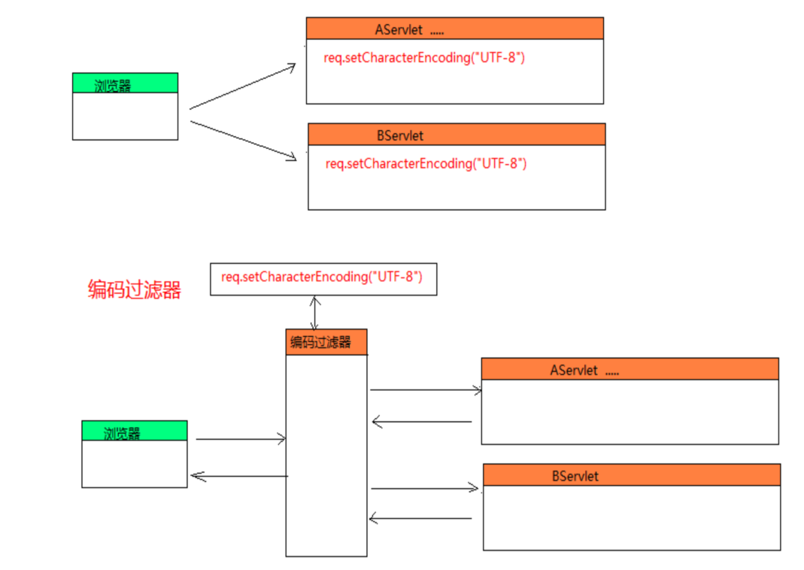
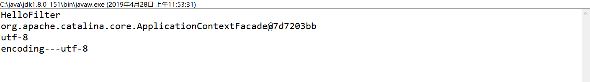
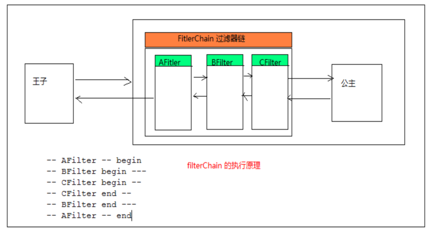
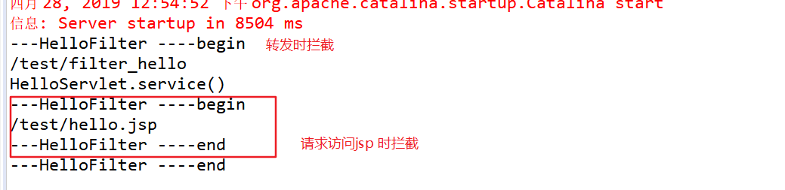
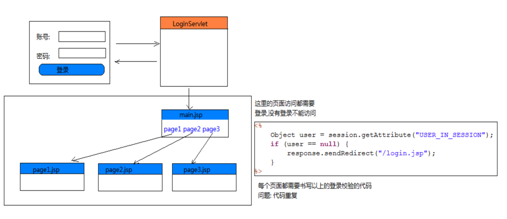
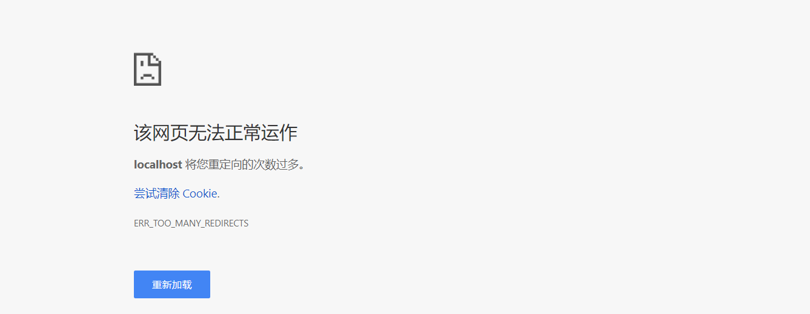
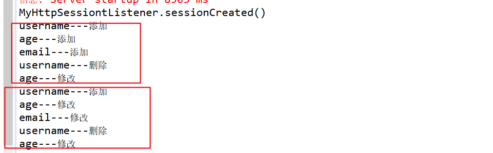

### 过滤器和监听器

---
过滤器概述
* 一个过滤器只做一个事情
* 过滤器是一个web组件，是一个特殊的类,需要去实现 javax.servlet.Filter接口

过滤器的作用
1. 过滤器可以对所有的请求和响应做拦截操作
过滤器所处的位置在浏览器和服务器资源之间
2. 以常规的方式调用资源(Servlet/jsp)--> 不做修改
3. 利用修改后的请求信息调用资源
4. 调用资源之后，但在响应到客户端之前，对响应做出修改
5. 阻止当前的资源调用，代之跳转到其他资源


#### Filter 简单运用
开发中遵循原则:
1. DRY原则 ： 不重复编写代码
2. 责任分离: 处理编码不属于Servlet 的职责


过滤器的应用:
1. 可以做请求字符的编码处理
2. 可以做登陆验证过滤器
3. 做敏感字(非法字符) 过滤
4. 做 MVC 框架的前端控制器(处理请求,进行分发)

编码过滤器


#### Filter 的HelloWorld程序
Filter的创建步骤:
1. 创建一个实现 Filter 接口的类
2. 实现接口的方法
3. 在doFilter中书写代码
4. 通知tomcat服务器管理自定义的Filter(注解/web.xml)


web.xml中的配置
```
<filter>
  <filter-name>简单名称</filter-name>
  <filter-class>完整类名</filter-class>
</filter>
<filter-mapping>
  <filter-name>简单名称</filter-name>
  <url-pattern>/ * </url-pattern>
</filter-mapping>

 * url-pattern配置需要过滤的地址
```

```
public class HelloFilter implements Filter{

	@Override
	public void init(FilterConfig filterConfig) throws ServletException {
		System.out.println("HelloFilter.init()");
	}

	@Override
	public void doFilter(ServletRequest request, ServletResponse response, FilterChain chain)
			throws IOException, ServletException {
		System.out.println("HelloFilter.doFilter()");
		//放行,不拦截
		chain.doFilter(request, response);
	}

	@Override
	public void destroy() {
		System.out.println("HelloFilter.destroy()");
	}

}
```


#### Filter 生命周期
1. 在服务器启动时创建Filter对象并调用init方法
2. 在过滤时调用doFilter方法
3. 服务器正常关闭时调用destory方法做销毁操作

#### FilterConfig 类
当前Filter 的配置信息，获取web.xml中的filter配置信息
* String getFilterName()  : 返回filter-name中的文本
* String getFilterContext() : 返回ServletContext的对象
* String getInitParameter(String name); : 获取初始化参数
* Enumeration<String> getInitParameterNames(); : 获取初始化参数名

代码示例
```
public class HelloFilter implements Filter{

	FilterConfig config;
	@Override
	public void init(FilterConfig filterConfig) throws ServletException {
		this.config=filterConfig;
	}

	@Override
	public void doFilter(ServletRequest request, ServletResponse response, FilterChain chain)
			throws IOException, ServletException {
		//获取<filter-name>的文本
		System.out.println(config.getFilterName());
		//获取到ServletContext
		System.out.println(config.getServletContext());

		//获取初始化参数
		String encoding=config.getInitParameter("encoding");
		System.out.println(encoding);

		//获取所有的初始化参数的名字
		Enumeration<String> initParameterNames = config.getInitParameterNames();
		while (initParameterNames.hasMoreElements()) {
			String name = (String) initParameterNames.nextElement();
			System.out.println(name+"---"+config.getInitParameter(name));
		}
		//放行,不拦截
		chain.doFilter(request, response);
	}

	@Override
	public void destroy() {
	}

}
```
web.xml中的
```
<!-- 配置拦截器 -->
	<filter>
		<filter-name>HelloFilter</filter-name>
		<filter-class>com.kiva.day18.filter.HelloFilter</filter-class>
		<!--配置初始化参数  -->
		<init-param>
			<param-name>encoding</param-name>
			<param-value>utf-8</param-value>
		</init-param>
	</filter>
	<filter-mapping>
		<filter-name>HelloFilter</filter-name>
		<url-pattern>/hello.jsp</url-pattern>
	</filter-mapping>
```
运行结果:




---

### 映射细节
* FilterChain(过滤器链):在开发中有多个过滤器连在一起使用，形成过滤器链
* 执行顺序:
  * web.xml:由filter-mapping 的配置顺序来决定执行的先后顺序
  * 注解使用filter名称的字母的优先顺序来决定

```
可以配置多个filter-mapping
可以配置多个url-pattern
可以使用通配符 * 表示任意的字符
 / * ：所有的资源路径都需要被过滤
 /hello/ * : 带有/hello/ 的资源路径都会被过滤
*.xxx  : 所有以.xxx 作为结尾的都会被拦截
```




### 动作拦截
* 请求转发时默认不会去拦截,需要配置拦截行为

```
<filter-mapping>
  <filter-name>简单名称</filter-name>
  <url-pattern>/ * </url-pattern>
  // 配置哪些动作需要拦截
  //默认动作拦截,手动配置会覆盖REQUEST,如果需要对请求进行拦截，需要添加REQUEST
  <dispatcher>REQUEST</dispatcher>
  //拦截亲求转发的操作
  <dispatcher>FORWARD</dispatcher>
  //拦截错误页面
  <dispatcher>ERROR</dispatcher>
</filter-mapping>
```

代码示例：
```
//请求转发
@WebServlet("/filter_hello")
public class HelloServlet extends HttpServlet{

	@Override
	protected void service(HttpServletRequest req, HttpServletResponse resp) throws ServletException, IOException {
		System.out.println("HelloServlet.service()");
		req.getRequestDispatcher("/hello.jsp").forward(req, resp);
	}

}

//拦截器
public class HelloFilter implements Filter{

	@Override
	public void init(FilterConfig filterConfig) throws ServletException {
	}

	@Override
	public void doFilter(ServletRequest request, ServletResponse response, FilterChain chain)
			throws IOException, ServletException {
		System.out.println("---HelloFilter ----begin");
		//获取请求的资源名称
		HttpServletRequest req=(HttpServletRequest)request;
		System.out.println(req.getRequestURI());
		//放行,不拦截
		chain.doFilter(request, response);
		System.out.println("---HelloFilter ----end");
	}

	@Override
	public void destroy() {
	}

}
```
```
<!-- 配置拦截器 -->
	<filter>
		<filter-name>HelloFilter</filter-name>
		<filter-class>com.kiva.day18.filter.HelloFilter</filter-class>
	</filter>
<filter-mapping>
		<filter-name>HelloFilter</filter-name>
		<url-pattern>/ * </url-pattern>
		<!-- 请求拦截: 默认的拦截行为,以请求访问拦截的资源时，会被拦截，如果写了其他的拦截行为会被覆盖 -->
		<dispatcher>REQUEST</dispatcher>
		<!-- 转发拦截: 如果其他资源以转发的形式，访问指定拦截资源，需要配置拦截的行为是转发  -->
		<dispatcher>FORWARD</dispatcher>
		<!-- 错误拦截: 如果资源出现异常信息被捕获时，会拦截 error-page 的资源-->
		<dispatcher>ERROR</dispatcher>
</filter-mapping>

<error-page>
		<error-code>404</error-code>
		<location>/404.jsp</location>
</error-page>
```

运行结果:



#### 编码过滤器
* 由于每个servlet都会重复写设置编码处理的代码,可以使用过滤器抽取
* 修改编码时，使用配置文件解决硬编码问题
* 如果用户没有在配置文件中设置初始化参数时，需要进行判断
* 如果在过滤器之前已经有过滤器设置了编码
    * |- 如果其他过滤器配置了编码，就不覆盖
    * |- 不管其他过滤器是否配置，都要覆盖

```
CheckCodeFilter extends Filter{

  private FilterConfig config;

  void init(FilterConfig config){
    this.config=config;
  }

  doFilter(req,resp,chain){
    //获取web.xml中配置当前过滤器中的初始化参数的值
    String encoding=config.getInitParameter("encoding");
    //获取是否强制覆盖编码
    Boolean force=Boolean.valueOf(config.getInitParameter("force"));
    //模拟已经设置了编码
    req.setCharacterEncoding("ISO-8859-1");
    String oldEncoding=req.getCharacterEncoding();

    //实现颗已经设置了编码，就不进行编码设置
    // force-->true 直接强制覆盖
    if(encoding!=null&&!"".equals(encoding)&&(oldEncoding==null||force)){
      //设置编码
      req.setCharacterEncoding(encoding);
    }
    //放行
    chain.doFilter(req,resp);
  }
}

@WebServlet("/register")
registerServlet extends HttpServlet{
  service(req,resp){
    String name=req.getParamter("username");
    String password=req.getParamter("password");
    System.out.println(name);
    System.out.println(password);
  }
}

//配置编码过滤器
<filter>
  <filter-name>CheckCodeFilter</filter-name>
  <filter-class>com.kiva.day18.filter.CheckCodeFilter</filter-class>
  <init-param>
    <param-name>encoding</param-name>
    <param-value>utf-8</param-value>
  </init-param>
  //设置强制覆盖
  <init-param>
    <param-name>force</param-name>
    <param-value>true</param-value>
  </init-param>
</filter>
<filter-mapping>
  <filter-name>CheckCodeFilter</filter-name>
  <url-pattern>/ * </url-pattern>
</filter-mapping>
```

---

#### 登陆拦截器

```
* 在开发中很多资源都需要做登陆的校验，没有登陆不能访问，每个检验的资源里会有重复代码
* 如果在if中需要检查的地址很多,需要写很长的一段判断
  |--定义一个字符串存所有不需要检查过滤的uri
* 如果很多资源不需要做登陆的校验，uncheck 配置的数据太多
  |-- 可以将需要登陆校验的页面放在一个同一的目录下，在需要做登陆校验的servlet加上一个目录/check
  |-- url-partern 修改成/check/ *
注意:
* 如果重定向到登陆页面和登陆servlet时，会访问拦截器，导致一直重定向，对不需要登陆校验的资源进行判断
```





问题描述:
如果在登陆校验时，过滤器对登陆页面进行拦截，会导致拦截器一直重定向


登陆拦截器代码实现:
```
class CheckLoginFilter extends Filter{

  private String un_check_uri;

  public init(FilterConfig config){
    //从web.xml 配置文件中获取，防止硬编码
    un_check_uri=config.getInitParameter("un_check_uri");
  }

  doFilter(req,response,chain){
    //做登陆校验
    HttpServletRequest req=(HttpServletRequest)req;
    HttpServletRequest resp=(HttpServletRequest)response;
    String uri=req.getRequestURI();

    Object user=req.getSession().getAttribute("user_in_session")

    //避免一直重定向问题
    //请求不拦截 /login.jsp;/login
    if(!Arrays.asList(un_check_uri.split(";")).contains(uri)){
      if(user==null){
        //没有登陆跳回登陆页面
        resp.sendRedict("/login/login.jsp");
        return;
      }
    }

    chain.doFilter(req,resp);
  }
}

<filter>
  <filter-name>CheckLoginFilter</filter-name>
  <filter-class>com.kiva.day18.filter.CheckLoginFilter</filter-class>
  <init-param>
    <param-name>un_check_uri</param-name>
    <param-value>/login/login.jsp;login</param-value>
  </init-param>
</filter>
<filter-mapping>
  <filter-name>CheckLoginFilter</filter-name>
  <url-pattern>/ * </url-pattern>
</filter-mapping>
```


```
public class LoginServle extends HttpServlet{

  service(req,resp){
    String username=req.getParamter("username");
    System.out.print("登陆操作");
    //保存用户信息
    req.getSession().setAttribute("user_in_session",username);
    req.sendRedicted("/main.jsp");
  }

}
```

main.jsp

```
如果没有拦截器，就需要在每个页面写下面这段代码
<%
  String username=session.getAttribute("user_in_session");
  if(username==nul){
    response.sendRedicted("login.jsp");
  }
%>

<a href="/page1.jsp">page1</a>
<a href="/page2.jsp">page2</a>
<a href="/page3.jsp">page3</a>
```


### Listener(监听器)
Web 中的监听器:主要用于监听作用域对象的创建，监听作用域对象属性的添加/删除/替换

1. 监听作用域对象的创建和销毁
  *  request : ServletRequestListener --> 监听request 作用域对象的创建和销毁
  *  session : HttpSessionListener--> 监听session作用域对象的创建和销毁
  *  servletContext: ServletContextListener-->监听ServletContextListener作用域对象的创建和销毁

2. 监听作用域对象的属性的添加/删除/替换
  * request:ServletRequestAttributeListener--> 监听请求对象属性的增删替换
  * session:HtttpSessionAttributeListener--> 监听session对象属性的增删替换
  * servletContext:ServletContextAttributeListener--> 监听application的属性的增删替换

监听器的使用步骤；
1. 创建一个类去实现监听对象的监听器
2. 在对应的方法里面去对触发的事件处理
3. 配置web.xml通知tomcat服务器去管理监听器


```
public class MyHttpSessiontListener implements HttpSessionListener{
	@Override
	public void sessionCreated(HttpSessionEvent se) {
	  System.out.print("统计当前访问的用户量");
	}

	@Override
	public void sessionDestroyed(HttpSessionEvent se) {
		  System.out.print("session销毁");
	}
}

web.xml中
<listener>
		<listener-class>com.kiva.day18.listener.MyHttpSessiontListener</listener-class>
</listener>
```

Session域属性监听器
```
//使用注解
@WebListener
public class MyHttpSessionAttributeListener implements HttpSessionAttributeListener {

	@Override
	public void attributeAdded(HttpSessionBindingEvent se) {
		System.out.println(se.getName()+"---添加");
	}

	@Override
	public void attributeRemoved(HttpSessionBindingEvent se) {
		System.out.println(se.getName()+"---删除");
	}

	@Override
	public void attributeReplaced(HttpSessionBindingEvent se) {
		System.out.println(se.getName()+"---修改");
	}

}

session.jsp
<%
  session.setAttribute("username","decade");
  session.setAttribute("age",16);
  session.setAttribute("email","xiao8");

  session.removeAttribute("name");
  session.setAttribute("age",18);
%>
```

运行结果:


---

#### 在服务器启动时创建一个管理员账号
* 使用监听器来判断是否启动了项目，启动则创建一个管理员账号
* 首次启动才创建,非首次启动则不创建管理员账号

```
@WebListener
class MyServletContextListener  implements ServletContextListener{

  IUserService service=new UserServiceImpl();

  public void contextInitalized(){
    //创建管理员账号
    service.register();
    System.out.println("MyServletContextListener.contextInitalized()");
  }
  public void contextDestroy(){

  }
}
```

总结:
```
1.过滤器作用
可以对所有资源的请求和响应进行拦截操作,位置在浏览器和需要被拦截的资源之间
  |---拦截器在访问请求资源进行拦截
  |---拦截器在访问资源响应到浏览器之前进行拦截
  |---拦截器可以在访问资源之前，进行资源重定向跳转

2. 常见的拦截器使用场景
  |-- 编码设置拦截器
  |-- 登陆校验拦截器
  |-- 关键字过敏拦截

3. Filter 生命周期
  |-- 程序启动时创建过滤器对象，调用初始化方法
  |-- 访问过滤资源时，调用doFilter()方法
  |-- 程序正常关闭时调用onDestroy()方法

4. 拦截器的实现

  class HelloFilter implements Filter{
    init(FilterConfig config){
      System.out.print("获取初始化参数，执行初始化操作");
    }

    doFilter(req,resp,FilterChain chain){
      System.out.print("执行拦截逻辑");
      //放行
      chain.doFilter(req,resp);
    }
    destroy{}
  }

在web.xml 中进行配置
  <filter>
    <filter-name>拦截器名</filter-name>
    <filter-class>拦截器的完整类名</filter-class>
  </filter>
  <filter-mapping>
    <filter-name>拦截器名</filter-name>
    <url-pattern>/ *</url-pattern>
  </filter-mapping>
  / * : 表示拦截所有资源

编码拦截器
1. 在访问servlet 之前使用拦截器对请求设置编码
  |--使用初始化参数解决硬编码问题
  |--如果已经设置了编码，就不再进行设置
  |--设置参数用来控制是否强制覆盖

监听器
1. 对作用域对象的创建进行监听，对作用域对象属性的增删改进行监听
2. 监听request ，session , ServletContext
3. 实现:
    |---创建一个一个监听器实现监听接口方法
    |--- 书写监听事件逻辑
    |--- 在web.xml 中进行配置

```
