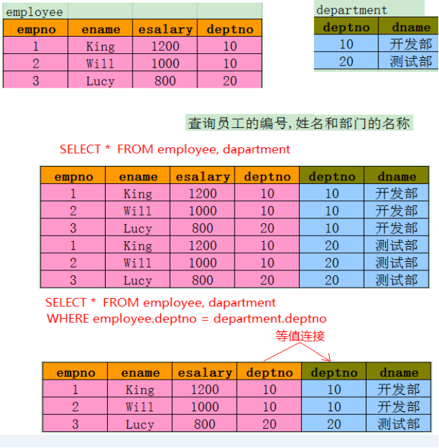

#### Mysql 加强

----
#### 数据库
* 一个按数据结构来存储和管理数据的计算机软件系统

#### 关系型数据库

常见的关系型数据库
1. Oracle：大型企业数据库，支持数据量，速度较快，安全性非常好，提供完善的存储过程支持；新的版本提供了众多新功能；
2. DB2（IBM）：大型企业数据库，支持数据量，速度较快，安全性较好, 恢复性强；
3. SQL Server（MS）：大型企业数据库，支持数据量，速度较快，安全性较好；
4. MySQL（Oracle）：性能不错，使用方便，体积小，易扩展；是目前使用最广的关系型

三范式
```
1NF: 每一列中不能有多个值
2NF: 每一行必须可以唯一的区分，类似于主键,用来区分每一行数据
3NF: 一个数据库表不能包含其他表的非主键信息,外表经常修改时，需要满足3NF;外表需要查询时，将外表数据保存到一张表中
```

---

#### NOSql 非关系型数据库 (not only sql)

1. NoSQL分类：
  1. 键值(Key-Value)存储数据库：这一类数据库主要会使用到一个哈希表，这个表中有一个特定的键和一个指针指向特定的数据；
  2. 列存储数据库：这部分数据库通常是用来应对分布式存储的海量数据。键仍然存在，但是它们的特点是指向了多个列；
  3. 文档型数据库：同第一种键值存储相类似。该类型的数据模型是版本化的文档，半结构化的文档以特定的格式存储；
  4. 图形(Graph)数据库：使用图模型存储；

2. 常见NoSQL数据库：
  1. MongoDB：文档型数据库；功能丰富；查询语言强大；并发效率不高，查询效率不算高；
  2. Hbase ： 高可靠性、高性能、面向列、可伸缩的分布式存储系统；
  3. Redis：key-value存储系统（主要面对内存数据库，也可持久化）


#### sql 查询

##### 单表查询
```sql
-- 查询每月都有500元的餐补和200元交通补助并且年底多发一个月工资的年薪
select (500+200+sal)*12+sal from emp

#要求查询出基本工资高于1500的所有员工信息.
select * from emp where sal>1500

#查询所有员工的年薪((月薪+奖金)*12)
# IFNULL(不为空的值，为空的值)
select *,(sal+IFNULL(comm,0))*12 年薪 from emp

#查询出职位是办事员(CLERK)或者是销售人员(SALESMAN)的全部信息,并且工资在1000以上.
select * from emp where (job='CLERK' or job='SALESMAN') and sal>1000

#查询出雇员姓名任意位置上包含字母A的全部雇员信息.
select * from emp where ename LIKE '%A%'

#查询出雇员姓名第二个字母是M的全部雇员信息
select * from emp where ename LIKE '_M%'
```


#### 多表查询

##### (笛卡尔积)
* 多表查询会产生笛卡尔积:
* 假设集合A={a,b}，集合B={0,1,2}，则两个集合的笛卡尔积为{(a,0),(a,1),(a,2),(b,0),(b,1),(b,2)}。




---

#### 内连接查询

隐式内连接


```sql
语法:
select * from A,B where 条件

-- 等值连接 : 消除笛卡尔积
-- 需求:查询员工编号，员工名称，员工所属部门的编号和名称.
select e.empno,e.ename,d.deptno,d.dname from emp e,dept d
WHERE e.deptno=d.deptno


-- 非等值连接
-- 需求:查询员工的姓名,工资,所在部门的名称,以及工资的等级.
select e.ename,e.sal,d.dname,s.grade  from emp e,dept d,salgrade s
where e.deptno=d.deptdno
and e.sal BETWEEN s.losal AND s.hisal
```

显示内连接:(inner 可以省略)</br>

```sql
语法:
select * from A inner join B on 条件

-- 1：查询员工编号，员工名称，员工所属部门的编号和名称.
select e.empno,e.ename,d.deptno,d.dnamefrom emp e
INNER JOIN dept d
ON e.deptno=d.deptno

-- 2：查询出公司员工工资等级
SELECT e.empno,e.ename,s.grade from emp e
INNER JOIN salgrade s
ON e.sal BETWEEN s.losal AND s.hisal
```

---

#### 外连接

* 左外连接查询(LEFT JOIN) :  查询出JOIN左边表中所有数据,右边表如果不匹配使用NULL填充.
* 右外连接查询(RIGHT JOIN):  查询出JOIN右边表中所有数据,左边表如果不匹配使用NULL填充.


```sql
-- 左外连接 （保持左表的完整性）
-- 1 查询出公司所有员工的姓名和所属部门
select e.empno,e.ename,d.deptno,d.dname from emp e
LEFT JOIN dept d
ON e.deptno=d.deptno

select e.empno,e.ename,d.deptno,d.dname from emp e
RIGHT JOIN dept d
ON e.deptno=d.deptno

-- 2,查询出公司员工的ename,department_name,city
SELECT e.ename,d.dname,d.loc from emp e LEFT JOIN dept d ON e.deptno=d.deptno

-- 3,查询所有有奖金的员工的姓名，部门，城市
SELECT e.ename,d.dname,d.loc from emp e
LEFT JOIN dept d ON e.deptno=d.deptno
WHERE e.comm is NOT NULL
```

---

#### 全外连接查询
* 全连接查询会返回所有右边表中的行和所有左边表中的行，即使在左边的表中没有可对应的列值或者右边的表中没有可对应的列

* mysql 暂不支持全外连接，可以使用union+ 左右连接实现

需要注意:
1. UNION 内部的 SELECT 语句必须拥有相同数量的列
2. 列也必须拥有兼容的数据类型
3. 每条 SELECT 语句中的列的顺序必须相同。

```sql
-- 全外连接
-- 需求:查询所有员工的名字和部门的名称(无论员工有没有部门/部门有没有员工)
SELECT e.ename,d.dname from emp e LEFT JOIN dept d ON e.deptno=d.deptno
UNION
SELECT e.ename,d.dname from emp e RIGHT JOIN dept d ON e.deptno=d.deptno
```

---

#### 自连接
* 自连接查询,将一张表看成是两张表使用别名区分.

```sql
-- 查询员工名称和其对应经理的名称
select e.ename,m.ename from emp e
inner join emp m on e.mgr=m.empno

-- 查询员工和其经理,如果经理为null显示总经理
SELECT e.ename,IFNULL(m.ename,'boss') from emp e
LEFT JOIN emp m ON e.mgr=m.empno
```

#### 单行函数

```
获取当前时间,dual 是内置表
select now() from dual

DAY(date) : 获取日期中的天数
select DAY(now())

HOUR(time): 返回time对应的小时数
select hour(now())

MINUTE(time) 返回time 对应的分钟数
select MINUTE(now())

YEAR(date) : 返回date对应的年份
select YEAR(now())

MONTH(date) : 返回date对应的月份
select MONTH(now())

LAST_DAY(date):获取一个日期，该月最后一天对应的值
select LAST_DAY(now())

DATE_FORMAT(date,format): 按照指定格式输出日期
select DATE_FORMAT(now(),'%Y/%m/%d')

```


#### 聚合函数

```
查询所有员工每个月的平均工资和总工资
select avg(sal),sum(sal) from emp

查询月薪在2000以上的员工总人数
   empno只查询对应列不为空的数据
   * 查询所有的条件
select count(*) from where sal>2000
select count(empno) from where sal>2000

查询员工最高工资和最低工资差距
select max(sal)-min(sal) from emp

```

#### 分组查询
1. 查询字段要么是分组的字段要么是聚合函数的字段
2. 在group by 子句出现的字段，可以不出现在select 列表中
3. 如果没有group by子句，select 子句不能和统计/分组/聚合杉树同时使用
    <br>错误示范: select name,count(*) from user

语法:
```
select 分组字段|统计函数 from 表名
where 条件
group by 分组字段
order by 排序字段
```

错误用法:
1. 不能在where子句中，对分组之后的结果过滤
2. 分组的过滤必须使用having子句
3. 不能在where子句中使用聚合函数

```
需求: 按照职位分组，求出最高工资和最低工资
select job,max(sal),min(sal) from emp group by job

查询每一个部门员工的平均工资
select avg(sal) from emp group by deptno

查询各个部门和岗位的平均工资
select deptno,job,avg(sal) from emp group by deptno,job

查询平均工资高于2000的部门和其平均工资
select deptno,avg(sal) from emp group by deptno having avg(sal)>2000

-- 查询在1980,1981,1982,1983 年各进公司多少人(按照Year(hiredate)分组)
-- where 后可以加单行函数，但不能加聚合函数
SELECT YEAR(hiredate),count(*) from emp
where YEAR(hiredate) in (1980,1981,1982,1983)
GROUP BY YEAR(hiredate)


查询各个管理人员下员工的平均工资,其中平均工资不能低于1300,不计算老板
SELECT mgr,avg(sal) from emp
where mgr is NOT NULL
GROUP BY mgr HAVING avg(sal)>1300

-- 查询每一个部门名称和总人数
select d.deptno,d.dname,COUNT(e.deptno) from dept d
LEFT JOIN emp e
ON d.deptno=e.deptno
GROUP BY d.dname
ORDER BY d.deptno

-- 查询出至少有一个员工的所有部门编号，名称，并统计出这些部门的平均工资
SELECT d.deptno,d.dname,COUNT(e.deptno) count,AVG(sal),min(sal),MAX(sal) from dept d
LEFT JOIN emp e
ON d.deptno=e.deptno
GROUP BY d.dname
HAVING count>0

```

#### 总结:

查询语句顺序:
* select -> from -> where -> group by ->having -> order by -> limit?,?

执行的顺序:
* from -> where -> group by -> having -> select -> order by -> limit?,?

在select 字段中使用别名，在条件中能使用别名，因为查询之前会产生一个临时表
```
select ename e from emp where e='xxx';

select deptno, avg(sal) aa from emp group by deptno
-- 查询出一个临时表, 表里面 已经存在 aa字段
-- having aa > 2000  在之前的临时表中过滤aa字段数据, 最后通过select 操作将需要显示列挑出来,
```

```
三范式:
1NF :一个列中不能包含多个值
2NF :需要主键
3NF :不能包含外键表的其他非主键信息

1. 单行函数：获取时间的某个段
select year(date)
select month(date)

多表查询
1.隐式内连接查询  (不包含inner)
select 字段 from 表1,表2 where 条件

2.显式内连接
select 字段 form 表1 别名 inner join 表2 别名 on 条件

3. 外连接
  左外连接: 保持左表的完整性
  select 字段 form 表1 别名 left join 表2 别名 on 条件
  右外连接: 保持右表的完整性
  select 字段 form 表1 别名 right join 表2 别名 on 条件

4.自连接 : 使用同一张表实现多表查询,使用别名
  select * from 表名 别名1,表名 别名2 where 条件
5:分组函数:   avg sum  count  max min
6:分组查询
  select 分组字段|聚合函数
  from 表名
  where 条件 (不能加聚合函数)
  group by 分组字段
  order by 排序字段
```
