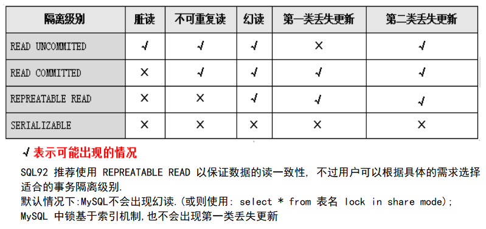
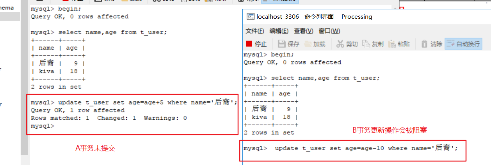
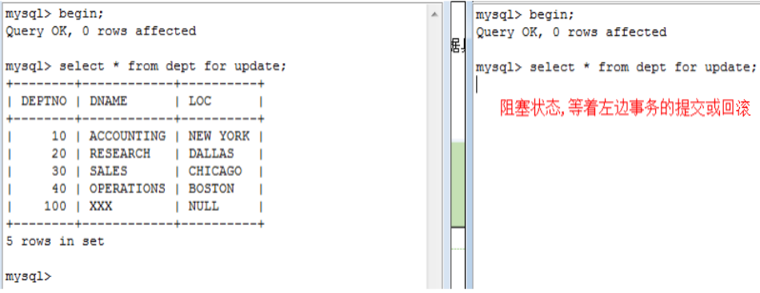
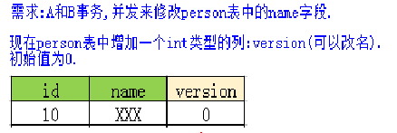
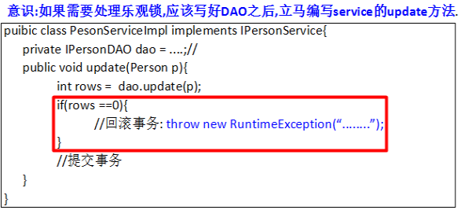
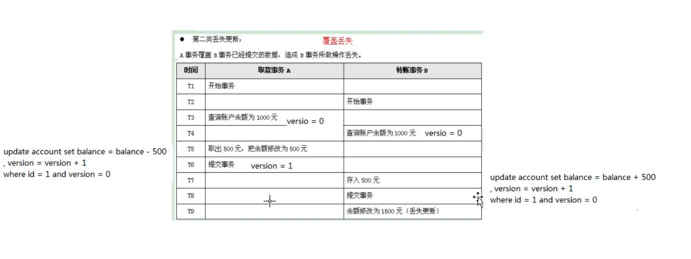

### 子查询&事务

---
#### 子查询
* 子查询指在一个查询语句中嵌套其他查询
* 当where 查询条件中的限制条件不是一个确定的值，来自于另一个查询的结果
* 子查询一般出现在from 和 where


使用子查询注意:
1. 子查询用括号括起来
2. 对单行子查询使用单行运算符
3. 对多行子查询使用多行运算符

语法：
```
select 查询字段 from 表名
where 字段 操作符 (select 子查询字段 from 表名)
```

代码示例:
```
1. 查询大于公司平均工资的员工姓名
select ename,sal from emp
where sal > (select avg(sal) from emp);

2. 查询出工资比martin还要高的全部雇员信息
select * from emp where sal>(select sal from emp where ename='martin')

```

##### 子查询的分类

* 单行单列子查询: 只包含一个字段的查询，放在where
* 多行单列子查询: 得到一个集合,只包含一个字段的查询,放在where
* 多行多列子查询: 得到一个二维表，包含多个字段的返回，相当于一张临时表，放在from 后


##### ------多行单列------
操作符 in: 与列表中的任意一个值相等
```
需求: 查询工资等于任何一个部门经理工资的员工信息
select * from emp
where sal in
(select sal from emp where job='manager')
```


ANY : 与子查询返回的任意一个值比较
  1. =ANY :此时和IN操作符相同
  2. &gt; ANY:大于子查询中最小的数据
  3. &lt; ANY:小于子查询中最大的数据

ALL : 与子查询返回的每一个值比较
  1. &gt;All: 大于子查询中最大的数据
  2. &lt;All: 小于子查询中最小的数据

代码示例
```
1) = ANY:此时和IN操作符相同.
需求:查询工资等于其中任意一个部门经理的员工信息.
SELECT * from emp
where SAL =ANY (SELECT sal FROM emp WHERE JOB='MANAGER')

2) > ANY:大于子查询中最小的数据.
需求:查询工资大于其中任意一个任意部门经理的员工信息.
(简言之:只要工资大于其中任意一个部门经理的员工都查出来)
相当于大于任意一个最小的一个

SELECT * FROM emp
WHERE SAL > ANY (SELECT sal FROM emp WHERE JOB='MANAGER')
相当于
SELECT * FROM emp
WHERE SAL > (SELECT MIN(sal) FROM emp WHERE JOB='MANAGER')


3) < ANY：小于子查询中最大的数据.
需求:查询工资小于其中任意一个部门经理的员工信息.
ALL：与子查询返回的每一个值比较

SELECT * FROM emp
WHERE SAL <ANY(SELECT sal FROM emp WHERE JOB='MANAGER')

SELECT * FROM emp
WHERE SAL <(SELECT MAX(SAL) FROM emp WHERE JOB='MANAGER')
```


```
1) > ALL:大于子查询中最大的数据.
SELECT * from emp WHERE sal> ALL(SELECT sal from emp WHERE JOB='MANAGER')
SELECT * from emp WHERE sal>(SELECT MAX(SAL) from emp WHERE JOB='MANAGER')

2) < ALL:小于子查询中最小的数据.
SELECT * from emp WHERE sal<ALL(SELECT sal from emp WHERE JOB='MANAGER')
SELECT * from emp WHERE sal<(SELECT MIN(sal) from emp WHERE JOB='MANAGER')
```

##### -----------多行多列子查询-----------

```
需求:查询出每个部门的编号、名称、部门人数、平均工资:
1)多表查询(按部门编号分组)
SELECT d.deptno,d.dname,COUNT(e.empno),avg(e.sal) from  dept d
JOIN emp e ON e.deptno=d.deptno
GROUP BY d.deptno,d.dname

2)子查询(多表连接时注意需要连接条件)
temp 作为查询出的临时表
SELECT  d.deptno,d.dname,temp.count,temp.avg from dept d
LEFT JOIN
(SELECT deptno,count(empno) count,avg(sal) avg
from emp e
GROUP BY deptno) temp
on temp.deptno=d.deptno
```


---


#### DML操作
1. INSESRT

```
insert into user values(null,'decade','1'),(null,'kiva','2')
当需要插入多条数据时,一条SQL的长度是有限的，可以通过调整max_allowed_packet参数(可以在my.ini文件中修改);
```

2. UPDATE

```
需求: 将所有有线鼠标价格提升10%
子查询
update product set sal=sal*1.1
where dir_id=
(select id from productdir where dirName='有线鼠标')

隐式内连接
update product p,productdir d
set sal=sal*1.1
where p.dir_id=d.id
and d.dirname='有线鼠标'

显式内连接
update product p join productdir d on p.dir_id=d.id
set sal=sal*1.1
and d.dirname='有线鼠标'
```

3. DELETE

```
delete from product
where dir_id=
(select id from productdir where dirName='有线鼠标')
```


---

#### 数据库的事务控制
事务是指不可分割的多个操作

事务的特性(ACID):

  |1. 原子性:事务包裹的操作是最小不可分割，要么同时成功要么同时失败
  |--
  |2. 一致性:数据在提交之前和提交之后数据总量不应发生变化,事务前后的数据的完整性必须保持一致
  |3. 隔离性:多个事务在并发发生时会出现的问题,脏读，不可重复读等 ,事务的隔离性是指多个用户并发访问数据库时，一个用户的事务不能被其他用户的事务所干扰，多个并发事务之间数据要互相隔离
  |4. 持久性:保证事务提交之后的操作的数据必须保存到存储设备中,事务一旦提交后，它对数据库中的数据的改变是永久性的，接下来即使数据库发生故障也不应该对其有任何影响


#### 事务并发产生的问题
* 第一类丢失更新: (回滚丢失)撤消一个事务时，把其它事务已提交的更新的数据回滚掉
* 第二类丢失更新: (覆盖丢失)提交一个事务时，把其它事务已提交的更新的数据覆盖了。
* 脏读: 一个事务读到另一个事务未提交的更新数据。
* 不可重复读: 俩次连续的读取数据不一致，中间有数据提交更改操作等原因
* 幻读: 一个事务中俩次读取的 [数据的数量] 不一致,要求一个事务多次读取的数据的数量是一致的  --insert  delete


#### 隔离级别
* 不同的隔离级别可能会导致不同的数据库并发问题,隔离级别越高,性能越低.
* MySql 默认的隔离级别是REPREATABLE READ 解决了脏读和不可重复读




* 读未提交:会引起脏读,读取到事务未提交的数据
* 读已提交:(oracle默认的),解决脏读,出现不可重复读
* 可重复读:(mysql 默认级别)无论如何读取的数据都是一致的,解决不可重复读,可能出现幻读
* 串行化:没问题，但性能低，相当于锁表

---

#### ----事务操作sql语句:----
* 开启事务 ： begin;
* 提交事务 : commit;
* 回滚事务 : rollback;

#### 悲观锁和乐观锁(解决覆盖丢失问题)

1. 这里最严重的就是丢失更新问题,解决方案:
  * 方案1: 悲观锁.  事务A在操作时,悲观认为其他事务会进来干扰自己.
  * 方案2: 乐观锁.  事务A在操作时,乐观认为其他事务不会进来干扰自己.


#### 悲观锁: 使用数据库本身的排它锁(写锁)(排斥其他锁)
  * DML操作自动会加上排它锁,A事务未提交,B事务执行DML操作会阻塞
  * DQL 操作需要手动加上排它锁
    * SELECT * FROM 表名 FORM UPDATE.








---

#### 乐观锁
在表中额外增加一个列,用来表示修改的版本号(整数类型),修改一次就将版本号+1




操作步骤:
```
1. 在表中新增一个列,用来表示修改的版本号,类型使用整数类型,初始值为0.
2. 每次在修改数据之前,先发送SELECT语句去查询当前被修改数据的信息(包括版本号).
      SELECT id,name,version FROM person WHERE id = 10;
          查询出来的版本号为0.
3. 发送UPDATE语句去更新数据:版本号修改递增1/判断条件中的版本号必须是刚刚查询出来的版本.
 UPDATE person set name  = 'Java' ,version =  version + 1 WHERE id = 10 AND version = 刚刚查询出来的版本号(0).
4. 判断update语句执行之后的受影响行数(rows),若rows>0则提交事务,否则回滚事务.
```




```
begin；
select balance,version from account where id=1;
update account set balance =balance+500,version=version+1
where id=1 and version=0;
commit;

begin；
select balance,version from account where id=1;
update account set balance =balance-500,version=version+1
where id=1 and version=0;
rollback;

```




----

#### 权限操作
为什么要有权限:限制操作者是否有权利去操作某一个功能,为了系统安全

* 用户：权限的主体，一个用户拥有自己的用户名和密码，并拥有能够操作的权限；
* 操作权限：限制一个用户能够做什么事情，在MySQL中，操作权限可以配置到全局/数据库/表/列上;
* 服务器权限=全局权限，对所有数据库和表的权限操作
* 权限在mysql数据库中db,user,table_prev 表保存

```
权限分布：针对不同的对象能够设置哪些权限；
全局：
数据库：
表权限：'Select', 'Insert', 'Update', 'Delete', 'Create', 'Drop', 'Grant', 'References', 'Index', 'Alter'
列权限：'Select', 'Insert', 'Update', 'References'
过程权限：'Execute', 'Alter Routine', 'Grant'
*references：操作外键
--------------------------------------------------------
创建用户will,并赋予权限.s
--------------------------------------------------------
MySQL中权限的设置也是存储在数据库中的：
mysql.user：用户表，包括用户名，密码，主机，全局权限，性能限制；
mysql.db：数据库权限设置；
mysql.table_priv：表权限设置；
mysql.column_priv：列权限设置；
```

总结:
```
1. 子查询
  当查询语句需要依赖其他查询语句的结果时,需要使用子查询
  分类:
  |----单行单列子查询 : 返回一个字段的一行数据,添加在where 后
    select * from 表名 where 条件=(select 子查询字段 from 表名)
  |----多行单列子查询 : 返回一个字段的多行数据,添加在where 后
    select * from 表名 where 字段 in (select 子查询字段 from 表名)
    in : 与查询集合中任意一个值相等
    ALL: 与查询集合中任意一个值比较
    ANY: 与查询集合中每一个值比较
   |----多行多列子查询 : 返回多列多行，相当于一张临时表，添加在from后

2. 事务有哪些特性
原子性:事务操作是最小的单位，不可分割，要么同时成功，要么同时失败
一致性:事务操作前后数据总量是保持一致的
隔离性:多个事务并发操作是相互隔离的，互不影响
持久性:事务提交之后数据应该持久化到数据库中

3. 数据库事务并发问题
回滚覆盖:A事务在B事务数据提交后，回滚事务，造成B事务数据丢失
提交覆盖:A事务提交事务之后，B事务提交数据覆盖了A事务提交的数据
脏读:事务读取了其他事务没有提交的数据
不可重复读:事务中连续读取俩次数据，数据的内容不一致,读取期间，有其他事务进行修改操作
幻读:事务中连续读取俩次数据，数据的总量不一致,读取期间，有其他事务进行增删操作

3. Mysql 的默认隔离级别是什么
可重复读: 解决了脏读和不可重复读, 默认不会出现幻读

4. 数据库有哪些隔离级别
读未提交: 会有脏读的问题
读已提交: 解决脏读的问题,会有不可重复读的问题
可重复读: 解决不可重复读问题
串行化: 没有并发问题，但性能不好

5.权限管理
主要用来分配不同用户对数据库，表，字段的访问权限
```
