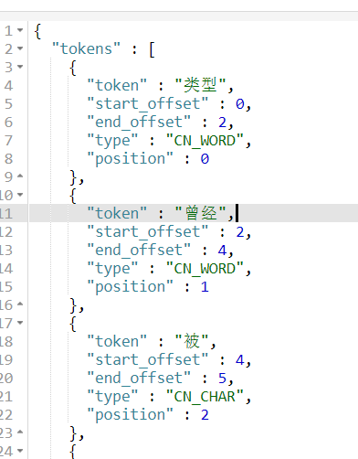

## IK 分词器插件

* 提供了一个词库，通过匹配词库进行分割
* 提供自定义词库的方法


#### 1. 安装
直接把压缩文件中的内容解压，然后放在elasticsearch/plugins下，然后重启即可

#### 2. 使用分词器查询
> IK插件中有2个分词器
ik_max_word：细粒度分词，但凡能组成一个词都会分割
ik_smart：粗粒度分词


```js
GET /rbac/_analyze
{
  "text":"类型曾经被用作索引的逻辑类别或分区",
  "analyzer": "ik_max_word"
}
```
查询结果如下:



#### 3. 查看类型的映射

* 文档中的字段的数据类型和是否分词等信息都是在mapping（映射）中配置的，通过配置mapping来修改文档中字段默认的分词器

```js
GET /esdemo/user/_mapping

------------查询结果--------------
{
  "rbac" : {
    "mappings" : {
      "user" : {
        "properties" : {
          "name" : {
            "type" : "text",
            "analyzer" : "ik_max_word"
          }
        }
      }
    }
  }
}

```

#### 配置分词器

1. 先删除旧的索引
2. 重新创建索引库，并且通过参数指定映射
3. 查看映射类型
3. 索引使用了ik分词器后，再插入数据

```js
---------- 创建索引，指定分词------------
PUT /esdemo
{
  "mappings": {
    "user":{   // 映射属于的类型
     "properties": {  //属性
       "text":{  // 属性的名称
          "type": "text",   // 属性的类型
          "analyzer": "ik_max_word",    // 存到索引库的分词器
          "search_analyzer": "ik_max_word",  // 查询时使用哪个分词器
          "fields": {
              "keyword": {
              "type": "keyword",
              "ignore_above": 256
            }
          }
       }
     }
    }
  }
}

type的类型有以下几种：
double / long / integer / text / keyword / date / binary

text和keyword区别：
1.都是表示字符串类型
2.text会分词，然后再存储到倒排索引库中(分子级)
3.keyword不分词，然后直接存储到倒排索引库中(原子级)
```

#### 根据关键字查询
```js
POST /esdemo/user
{
  "text":"类型曾经被用作索引的逻辑类别或分区"
}

POST /esdemo/user
{
  "text":"文档是可以被索引的基础单元"
}

GET /esdemo/user/_search
{
  "query": {
    "match": {
      "text": "逻辑"
    }
  }
}
```
