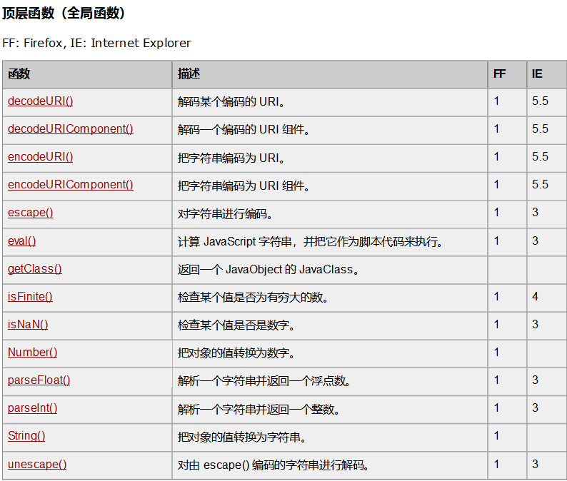
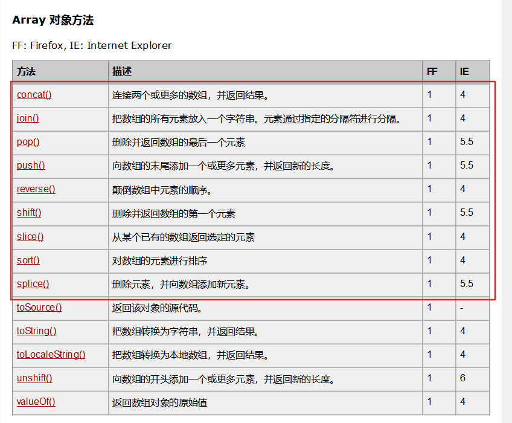
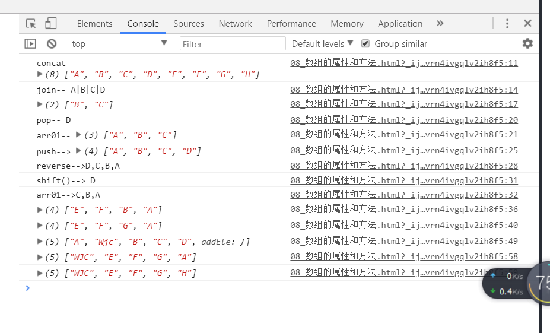

## javaScript ECMAScript

---

### 1. 简介
* javaScript 是一种直译脚本语言,弱类型语言
* 用来给网页增加动态动能
* 由javascript引擎执行,是浏览器的一部分,不同浏览器引擎不一样
* 可以用来操作浏览器网页，对网页元素进行增删改查元素

### 2. 组成
javaScript 的内容，包含以下三部分:
* ECMAScript(核心：javaScript脚本的核心语法，数据类型，关键字，保留字，运算，对象
等，不属于任何浏览器
* DOM (文档对象模型):提供了访问和操作html和xml的接口(Node:Document,Element,Attr,Text)
* BOM (浏览器对象模型):提供与浏览器窗口之间交互的对象和方法

### 3. 在html中使用javascript
第一种方式
```js
<html>
  <head>
      <script type="text/javaScript">
        alert("Hello world");
      </script>
  </head>
</html>
```
第二种方式
```js
// 在html中引入js文件
// src 指定文件的路径
// ../回到上一层
//引入js文件后不能再写js代码  </script>不能去掉
<html>
  <head>
      <script type="text/javaScript" src="index.js的相对路径">
      </script>
  </head>
</html>

-----------index.js---------------
alert("Hello world");
```

第三种方式
* 把 js 代码编写在 a 标签的 href 属性里，点击 a 标签的时候，就会执行里面的代码。

```html
<a href="javascript:alert('hello')">点击</a>
```


### 4. 基本语法
1. javaScript 中的标志符<br>
  * 标识符: 变量，函数名，(字母数组下划线和$组成，不能以数字开头)
2. javaScript严格区分大小写<br>
  * username,userName

### 5. 变量(variable)
1. 声明变量，使用关键字var,没有初始化，默认是undefined
2. 打印变量
  * 方式1: alert(变量名)
  * 方式2：console.log(变量名);

注意:
* 不事先声明变量而直接使用会报错

```js
<script type="text/javaScript">
  //未定义变量是undefied
  var username="decade";
  username=1;
  //再浏览器中打印
  console.log(username);
</script>
```


### 6. 基本类型和常量
  1. Number数值: 整数,实数  NaN,Infinity(特殊常量)
  2. Boolean : true 和 false
  3. string 字符串 (和java不同)
    * 值可以使用单引号和双引号
    * js中没有char类型,'a'也是一个字符串
    * 特殊字符使用/转译
  4. null常量和undified常量(定义但未赋值)
  5. typeof 操作符判断变量的数据类型

```html
<script type="text/javaScript">
  var a=1;
  //查看变量的类型
  console.log(typeof a);
  //默认值是undified ,赋值为null时，
  // 变量不再也能用对象地址,对象会被回收
  a=null;

  var i;
	console.log(i); //打印undefined,默认值
</script>
```

#### NaN常量
> NaN 即 Not a Number ，不是一个数字。 在 JavaScript 中，整数和浮点数都统称为 Number 类型 。除此之外，Number 类型还有一个很特殊的值，即 NaN 。它是 Number 对象上的一个静态属性，可以通过 Number.NaN 来访问 。

1. 在数字类型转换异常时会出现,返回结果是NaN,表示不是数字
2. isNaN() 判断一个值是否不是数字 , NaN常量不是数字

```js
console.log("-------------NAN------------");
//-------NAN-------特殊字符，不是一个数字时会出现
console.log(Number.NaN); //NaN
//---表达式计算出现数字转换失败出现NaN
console.log(1-'10gg'); //NaN

//---isNaN():判断一个值本身是否 不是数字 , NaN 也不是数字
console.log(isNaN('12'));//false
console.log(isNaN('12ab'));//true
console.log(isNaN(NaN));//true
```

### 7. 运算符
#### 1. 比较运算符
= 和 == 以及 === 之间的区别
  * = 赋值符:将常量/变量值赋值给另一个变量
  * == 比较运算符:比较俩个数据是否相等,如果类型不匹配，会强制类型转换
  * === : 先比较类型,再比较数值，不会进行类型转换

```js
<script type="text/javaScript">
  var a=11;
  var b='11';
  comsole.log(a==b);  //true  值相等
  comsole.log(a===b); // false 类型不相等
</script>
```

#### 2. 逻辑运算符
在逻辑运算符中 0,"",false,NaN,undefined,null 表示为false 其他数据都表示true

```
js 返回逻辑运算的返回值  java 返回true或false
&& 短路与，从左往右依次判断，返回第一个为false的值,否则返回最后一个值
|| 短路或,从左往右依次判断，返回第一个为true的值，否则返回最后一个值
```

代码示例
```js

console.log("------逻辑运算符 && ---------");
console.log(true && true); //true
console.log(1 && true); //true
console.log(1 && 2); //2
console.log("A" && 2); //2
console.log("" && 2); // ""
console.log(null && "B");//null
console.log("A" && "B"); //B
console.log(1 && 2 && 3); // 3
console.log(1 && null && 3); //null
console.log("" && null && 0); // ""

console.log("------逻辑运算符 || ---------");

console.log(true || true); //true
console.log(1 || true); //1
console.log(1 || 2); //1
console.log("A" || 2); //A
console.log("" || 2); // 2
console.log(null || "B");//B
console.log("A" || "B"); //A
console.log(1 || 2 || 3); // 1
console.log(1 || null || 3); //1
console.log("" || null || 0); // 0

console.log("------经典应用场景---------");
function func(x) {
  x=x||0;   //设置默认值 ,如果 x是undefined,返回0
  console.log(x);
}
func(18);

var d=1;
d&&alert(1); //结果为true时打印

```

<br>
---

### 函数
#### 为什么使用函数
* 函数外部的代码会在页面加载到当前位置的时候只执行一次
如果程序中有代码需要多次执行或在指定条件下才执行，需要使用函数,
函数只定义一次，可以多次调用

#### 函数定义
* 通过关键字function定义函数
* 函数在调用时执行
* 如果函数中没有显示返回数据，默认返回undefined
* 函数参数如果不传，默认时undefined
* 可以传入多个参数，但只获取指定个数的参数

```js
function 函数名(参数1，参数2){
  //js 代码
  [return 值];
}

* js 是弱类型语言，返回值是var ,所以不声明
```

示例代码:
```js
function addFun(arg1,arg2){
  var ret=arg1+args;
  默认返回的时undefined
  // return ret;
}
//调用函数
var ret =addFun(5,4);
console.log(ret);

addFun(); //不传，默认时undefined
addFun(1,2,3,4);//
```


立即执行函数
```js
var ret=(function addFun(arg1,arg2){
  var ret=arg1+args;
  return ret;
})(2,2);

console.log(ret);
```

函数作为函数的参数
```js
//-----------函数作为回调--------
function fun(callback){
  callback();
}

function fun3(){
  console.log("函数类型的参数");
}

fun(fun3);

//------------使用匿名函数--------
fun(function(){
  console.log("匿名函数");
})

```

完成所有参数相加的运算
```js
// 完成所有参数相加的运算
// arguments : 函数内置的,可以获取调用该方法时传递的实际canshu
function fun4(){
  console.log(arguments);
  var sum=0;
  for(var i=0;i<arguments.length;i++){
    sum+=arguments[i];
  }
  return sum;
}

fun4(1,2,3,4);
```
<br>
---

#### 全局变量和局部变量
* 全局变量: 定义在function 外部的变量
* 局部变量: 定义在function 内部的变量

访问变量遵循就近原则
```js
var name="decade"; //全据变量
function fun(){

  console.log(name);

  var name="kiva";// 局部变量
  console.log(name);  // kiva

//声明变量(不加var):全局变量，不推荐使用
  age=10;
}
fun();
console.log(age);

// window 对象中有name属性，会被修改
console.log(window);
```


变量声明的提前，js 代码的执行流程:
    1. 代码的全局扫描
            将代码中定义的变量和函数提前声明(在当前作用域提前)
    2. 在执行响应的代码

```js
//-------------提前声明后的代码---------
var name;
name="decade"; //全局变量
function fun(){
  var name;
  console.log(name);

  name="kiva";// 局部变量
  console.log(name);  // kiva
}
name();
```

<br>
---

### 全局函数
函数都属于window



```js
window.encodeeURI("http://www.baidu.com");
window.encodeeURICimponent("http://www.baidu.com");// : / 都会被编码
parseInt("123456");  //123456
parseInt("12ab56"); //12(会尽量多得转换)

parstFloat("123456.123");  //123456
parstFloat("12ab.56"); //12(会尽量多得转换)

eval("alert('我是js代码')") //将字符串转换成代码并立即执行

可以在window中添加元素,声明的全局变量给window添加成员
var xxx="ooo";
```
<br>
---

### 面向对象
this 关键字
* 构造函数中:this指向创建的对象
* 方法函数中:函数内部的this,指向调用该函数的对象

```js
// 定义一个构造函数
function Person(name,age){
  // var p=new Person(); js 引擎帮忙创建对象
  // this指向创建的对象
  this.name=name;
  this.age=age;
  //匿名函数
  this.study=function(){
    console.log("我爱学习");
    // 函数内部的this,指向调用该函数的对象
    console.log(this.name);
  }
  //return p;
}
// 使用构造函数+new 关键字创建对象
var p=new Person("decade",20);
console.log(p);

//访问对象的成员(属性/方法)
console.log(p.name,p.age);
p.study();

//给单个对象添加成员
p.className="15计算机1班";
console.log(p["className"]);

//如果名字中有特殊字符使用 []
p.["class-Name"]="15计算机1班";
console.log(p["class-Name"]);
```

### 参数传值(与java相同)
基本类型:作为参数，传递变量的值
引用类型:作为参数，传递变量引用的内存地址

```js
// ----------基本类型------------
function fun(num){
  num=5;
  console.log(num);
}
var n=20;
fun(n);
console.log(n);

//------------引用类型---------------
function fun2(person) {
  person.name="decade";
  person.age=10;
}

function Person(name,age) {
  this.name=name;
  this.age=age;
}
Person p=new Person("kiva",18);
fun2(p); // 传递对象的内存地址值
console.log(p);
```

### 内置对象
1. Object
2. Math
3. Date

```js
//----------Date-------
var date=new Date();
console.log(date.getDate()+''+date.getMonth());

//--------Math-----------
console.log(parseInt(Math.random()*100));

//-------String--------
var str=new String("decade");
console.log(str);

var num=new Number(123);
console.log(num.value+1);// value是Object的属性
console.log(num+1);
```

### 数组的定义
注意: js 中不会出现数组越界问题，因为不是定长的
```js
//----定义数组-----
var arr=new Array(1,2,3);
console.log(arr);

// --- 定义了长度未4的数组
var arr2=new Array(4);
console.log(arr2);

var arr3=[1,2,3];
console.log(arr3);

console.log(arr3[10]);//获取到undefied

//---遍历数组------
for (var i = 0; i < array.length; i++) {
  console.log(array[i]);
}

//---foreach
array.foreach(function(ele,index,array){
  console.log(ele);
})

//-----map-----
// 每次遍历的返回值都添加到数组中
array.map(function(ele,index,array)){
    console.log(ele);
})
//-----foreach----
for(var i in array){  
  console.log(i);
}
//-------遍历对象属性
var obj={name:"decade",age:"18"};
for(var p in obj){
  console.log(obj[p]);//使用中括号获取
  //需要使用[]获取，不能使用p,会将p当成属性名
  // console.log(obj.p);
}
```

### 数组的属性和方法



```js
var arr1=new Array('A','B');
var arr2=new Array('C','D');
//-----不会改变原来的数组，只会返回一个新的数组s
arr1.concat(arr1,arr2);
//-----截取字符串不包括最后一位的索引
arr1.slice(1,3);
//删除并返回数组的最后一个元素
arr.pop();

arr.splice(0,0,'V');//向index=0的位置插入V元素
arr.splice(0,1,'A');//删除index=0的位置元素，插入A元素

// 实现向指定索引位置插入元素
arr.addEle=function(index,ele) {
  this.splice(index,0,ele)
}

//如果需要所有的数组对象都拥有addEle函数，此时需用到原型对象那个
Array.prototype.addEle=function(index,ele){
    this.splice(inde,0,ele);
}
```

代码示例:

```javaScript
var arr01=['A','B','C','D'];
var arr02=['E','F','G','H'];

//连接俩个数组，返回新的数组，
//["A", "B", "C", "D", "E", "F", "G", "H"]
console.log("concat--",arr01.concat(arr02));

//所有元素放入到一个字符串中，使用分隔符分开
console.log("join--",arr01.join("|")); //A|B|C|D

//截取字符串，前开后闭
console.log(arr01.slice(1,3));// ["B", "C"]

//删除数组最后一个元素，并返回这个元素
console.log("pop--",arr01.pop()); // D
console.log("arr01--",arr01); // ["A", "B", "C"]

//向数组的末尾添加一个元素
arr01.push('D');
console.log("push-->",arr01); //["A", "B", "C", "D"]

//颠倒数组中元素的顺序
console.log("reverse-->"+arr01.reverse()); // D,C,B,A

//删除并返回数组的第一个元素
console.log("shift()-->",arr01.shift()); //   D
console.log("arr01-->"+arr01); //C,B,A

// split(index,howmany,eles)-->删除元素，并向数组中添加元素
//删除 0 索引的元素，插入俩个元素
arr01.splice(0,1,'E','F');
console.log(arr01);   //["E", "F", "B", "A"]

//删除位于2的元素，添加一个新的元素
arr01.splice(2,1,'G');
console.log(arr01);  //["E", "F", "G", "A"]


//-------封装一个在数组中添加元素的方法----
var arr04=['A','B','C','D'];
arr04.addEle=function (index,ele) {
    //向指定索引位置插入元素
    this.splice(index,0,ele);
};
arr04.addEle(1,'Wjc');  //["A", "Wjc", "B", "C", "D", addEle: ƒ]
console.log(arr04);


//-------需要在每个数组中设置函数-----
Array.prototype.addEle=function (index,ele) {
    //向指定索引位置插入元素
    this.splice(index,0,ele);
}
//--测试每个数组的添加函数
arr01.addEle(0,'WJC'); // ["WJC", "E", "F", "G", "A"]
arr02.addEle(0,'WJC'); // ["WJC", "E", "F", "G", "H"]
console.log(arr01);
console.log(arr02);

```
执行结果:




总结:
```
javaScript : 用于操作Html网页元素的脚本语言，由js引擎执行代码,js 是弱类型语言
    |-- js 引入的方式
        |-- 在html中 head ,body 中引入 js 元素代码
        |-- 在js文件中书写js 代码，在html中引入js文件
        |-- 在a标签href中书写
    ECMAScript
        |-- 语法:
            |-- 变量
              |-- 定义
                  |-- var arg='decade';
              |-- 基本类型
                  |-- Number String Boolean
                  |-- Null ,Undefined (默认值)
                  |-- NaN ：当表达式不是数字，进行数字运算会出现NaN的结果
              |-- 全局变量和局部变量
              |-- 作用域的提升 : 网页加载时，会扫描网页中的js变量和函数，
                    事先声明了js变量
            |-- 运算符
              |-- 比较
                  == :只比较值，不比较类型
                  ===: 先比较类型，再比较值
              |-- 逻辑运算符
        |-- 函数
            |-- 函数的定义和调用
            |-- 局部变量和成员变量
            |-- 全局函数:window 下的定义的函数
        |-- 面向对象
            |-- 类的定义和对象的创建
            |-- this 关键字
            |-- 内置对象 Date,Math
        |-- 数组
            |-- 数组的定义和遍历
            |-- 数组Array对象的相关方法
                |-- push pop


```
