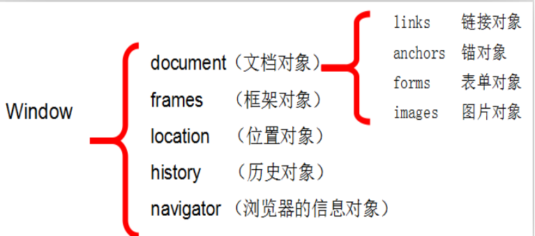
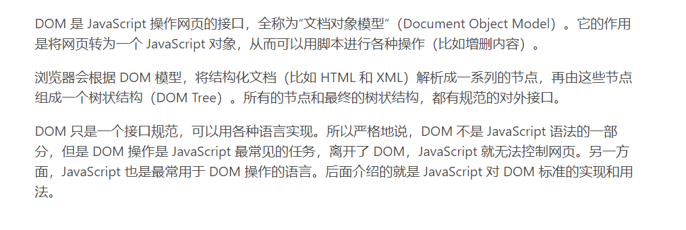
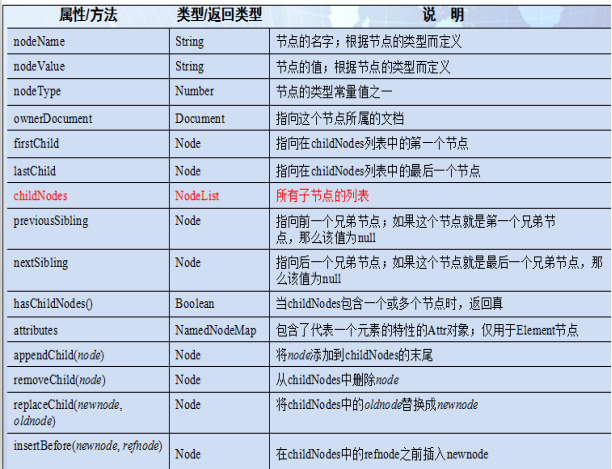
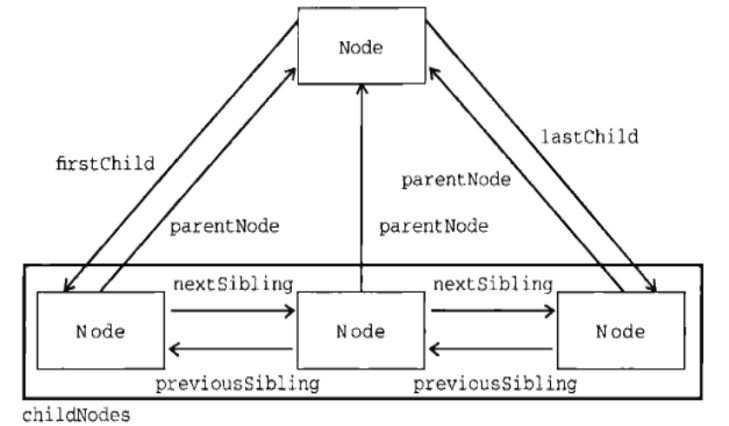

## javaScript BOM 和 DOM

---


参考网站: https://wangdoc.com/javascript/dom/general.html

### BOM(浏览器对象模型)

> JavaScript 是浏览器的内置脚本语言。也就是说，浏览器内置了 JavaScript 引擎，
并且提供各种接口，让 JavaScript 脚本可以控制浏览器的各种功能。一旦网页内嵌了 JavaScript 脚本，浏览器加载网页，就会去执行脚本，从而达到操作浏览器的目的，实现网页的各种动态效果。

<br>
---

#### BOM 中的常用对象

所有浏览器都支持 window 对象。它表示浏览器窗口。

所有 JavaScript 全局对象、函数以及变量均自动成为 window 对象的成员。

全局变量是 window 对象的属性。

全局函数是 window 对象的方法。




window 对象实例代码
```js

//跳转到指定位置
function fun(){
  window.location.href='http://www.baidu.com';
}
// 刷新当前页面
function reload(){
  window.location.reload();
}

//获取页面中所有的表单(页面加载完之后才会获取)
console.log(document.forms);

//需要等页面加载完之后再执行
window.onload=function(){
  console.log(document.getElementById("form1"));
}


//-------------html-------------
<a href="javascript:;" onclick="fun();"></a>
<a href="javascript:;" onclick="reload();"></a>
```

<br>
---
#### 消息框&确认框&输入框
```js

//------消息框----
function message(){
  alert("我是消息框");
}

//-----确认框-----
function funConfirm(){
  //返会true或false
  var ret=window.confirm("是否确认删除当前数据");
  if(ret){
      console.log("删除成功");
  }
  console.log(ret);
}

//--------输入框-------
function funPrompt(){
    var value=window.prompt();
    console.log(value);
}

//-------------html-------------
<a href="javascript:;" onclick="message();">消息框</a>
<a href="javascript:;" onclick="funConfirm();">确认框</a>
<a href="javascript:;" onclick="funPrompt();">输入框</a>
```
<br>
---

### 定时器
1. 第一种: 只执行一次，指定时间之后，执行一个操作
2. 第二种: 周期性执行，间隔一段时间周期执行一个操作

API


函数|定义|
--:|:---:|
setTimeout(fun,time)|返回timer,指定一段时间后执行函数
setInterval(fun,time)|返回timer,用于周期性执行函数

##### 实例代码

```js
//----5 秒之后跳转页面
windon.onload=function(){
  setTimeout(function(){
    window.location.href="http://www.kiva/xin";
  },5000);
}

//----------隔1s 修改时间
var time=document.getElementById("time").innerText;
console.log(time);

var timer=setInterval(function(){
    if(time<=1){
        window.location.href="http://www.kiva/xin";
        clearInterval(timer);//清除缓存
    }
    document.getElementById("time").innerText=--time;
  },1000);

  document.write("向网页写入内容");

//--------------html
<span id="time"> 5</span>秒之后跳转页面
```

<br>
---

### DOM 定义
DOM(Document Object Model)文档对象模型，可以动态修改XML和Html




### DOM 获取元素的三种方式
1. 通过元素id
  * getElementById()
2. 通过标签名字
  * getElementByTagName();
3. 通过class名字(获取使用相同class属性的标签)
  * getElementByClassName();

```js

window.onload=function(){
  //----通过元素id
  console.log(document.getElementById("div1"));

//-----通过标签名
  var divs=document.getElementByTagName("div");
  for (var i = 0; i < divs.length; i++) {
    console.log(divs[i]);
  }

  for (var i in divs) {
    console.log(divs[i]);
  }
  //------获取使用相同class属性的标签----
  var divs=document.getElementByClassName("clz1");
  console.log(divs);
}

//-----------html-------------
<div id="div1">
  <div class="clz1"></div>
</div>
<div class="clz1"></div>
```

<br>
---

### Node 对象的属性和方法



#### 常用属性




#### 实例代码:

```js

window.onload=function () {
     //--测试父节点的相关方法
     var parent=document.getElementById("span1");
     if(parent.hasChildNodes()){//是否有子节点
         console.log(parent.firstChild);//子节点列表的第一个子节点   换行-->text
         console.log(parent.lastChild);//子节点列表的最后一个子节点
         console.log(parent.childNodes); //所有子节点列表

         //根据标签名从父元素中获取子元素
         console.log(parent.getElementsByTagName("div"));

         //--------测试子标签的方法
         var div2=document.getElementById("div2");
         console.log(div2.parentNode);//获取父节点
         console.log(div2.previousSibling);//获取上衣个兄弟节点
         console.log(div2.nextSibling);//获取下一个兄弟节点
     }
 }

//-----------html-------------
<span id="span1">
    <div id="div1">《数据结构》</div>
    <div id="div2">《操作系统》</div>
    <div id="div3">《java核心技术卷》</div>
</span>
```

<br>
---

### 元素节点属性操作
1. 标准属性

```
获取属性值
元素对象[“属性名”]
元素对象.属性名
元素对象.getAttribute("属性名")

设置属性值：
元素对象[”属性名”] = 值
元素对象.属性名 = 值
元素对象.setAttribute("属性名", 值)
```
2. 自定义属性

```
获取属性值：
元素对象.getAttribute("属性名")

设置属性值：
元素对象.setAttribute("属性名", 值)
```

#### 实例代码:

```js
window.onload=function(){
  // 获取属性
  var parent=document.getElementById("parent");
  console.log(parent.id);
  console.log(parent["id"]);//只能获取标准属性

  console.log(parent.getAttribute("id"));
  console.log(parent.getAttribute("xxx")); //获取自定义属性

  //设置属性
  parent.id="child";
  //设置自定义属性
  parent.setAttribute("name","decade");

  //--------------特殊属性操作---------------

  // 属性名和属性值相等的元素,获取属性 结果是true|false
  var box=document.getElementById("box");
  console.log(box.checked);
  // class 属性是js的关键字，获取时使用className
  console.log(box.className);

  // 属性名存在 - 字符时的处理方式
  var text=document.getElementById("text");
  console.log(text.style["backgroup-color"]);
  console.log(text.style.backgroupColor);

  //返回结果是  true| false
  console.log(box.readOnly);
}

// --------html------
<span id="parent" xxx="xxx"></span>
<input type="checkbox" checked="checked" id="box"
class="clz" readonly="readonly"></input>

<input type="text" id="text" style="backgroup-color:red"></input>
```

<br>
---

### 元素的增删改

```js

function addEle(){
  //在div2中填加一个元素
  var div2=document.getElementById("div2");
  var div1=document.getElementById("div1");
  div2.appendChild(div1);//添加子元素
}

function deleteEle(){
  //根据元素找到它的父元素
  var div1=document.getElementById("div1");
  //var parent=document.body;
  var parent=div1.parentNode;
  parent.removeChild(div1);//删除子元素
}

function replaceEle(){
  // 获取 旧元素 ，创建新元素  ，获取父元素替换
  var div1=document.getElementById("div1");

  //创建新元素
  var newDiv=document.createElement("div");
  newDiv.style.backgroupColor="porper";
  newDiv.innerText="新元素";
  //获取父元素替换元素
  div1.parentNode.replaceEle(newDiv,div1);
}


//-----------------html---------------
<body>
    <div backgroup-color="" id="div1"></div>
    <div backgroup-color="" id="div2"></div>

    // 加 ; 表示在书写js代码已经结束
    <button onClick="addEle();">添加元素</button>
    <button onClick="deleteEle();">删除元素</button>
    <button onClick="replaceEle();">替换元素</button>
</body>
```
<br>
---
### 事件绑定
事件驱动编程的核心对象
* 事件源:发出事件通知
* 事件名称:发出事件通知的名称
* 事件响应函数:事件发生时要执行的操作
* 事件对象:描述事件的对象

绑定事件的三种方式:
1. 在标签上使用 onclick 属性配置（只能绑定一个处理函数）
2. 在 js 代码中，使用 "元素.onclick=响应函数"进行事件监听（只能绑定一个处理函数）
3. 使用方法来完成对元素事件监听（能绑定多个处理函数）

```js

//------------不能为同一个元素绑定相同的事件------------
window.onload=function(){
  // div1 :事件源
  // onClick ：事件名称
  //function() : 事件响应函数
  //event: 事件对象
  var div1=document.getElementById("div1");
  div1.onClick=function(event){
    alert("点击了div1");
    console.log(event);
    console.log(this); // 获取事件源
  }
}

//------------第二种方式: 在js代码中设置
function clickFun(ele,event){
  //获取当前绑定事件的元素
  console.log(ele);
  console.log(event);
}

//-------使用方法来完成对元素事件的监听-----
// 非IE
var div3=document.getElementById("div3");
div3.addEventListener('click',function(event){
  console.log("绑定了一次");
});

div3.addEventListener('click',clickFun);

var clickFun=function(event){
  console.log("绑定了俩次");
  this.removeEventListen('click',clickFun);
}

//---------浏览器兼容做法----------
function addEvent(srcEle, name, fun) {
    if(srcEle.attachEvent){ // IE 浏览器
        //绑定事件监听
        srcEle.attachEvent("on"+name,fun);
    }else{  //chrome 浏览器
        srcEle.addEventListener(name,fun);
    }
}

function eventFunction() {
    console.log("打印方法");
}
addEvent(div3,"click",eventFunction);

// ---------------------html-------------------
<div style="backgroup-color" id="div1"></div>
<div style="backgroup-color" id="div2" onclick="clickFun(this,event)"></div>
<div style="backgroup-color" id="div3"></div>
```

<br>
---

### 综合练习

实现全选/全不选
```js
checkbox.js
//----------全选----------
function checkAll(checked){
  //1. 获取所有name=hobby的元素
  var hobbies=document.getElementByName("hobby");
  hobbies.forEach(function(checkbox){
      //2. 为每一个元素添加checked=checked 属性
    checkbox.checked=checked;
  });
}
//---------反选----------
function checkAll(){
  //1. 获取所有name=hobby的元素
  var hobbies=document.getElementByName("hobby");
  hobbies.forEach(function(checkbox){
    // 原本为true 设置为false
    checkbox.checked=!checkbox.checked;
  });
}
//-------------全选/全不选-------------
function checkChange(parent){
  //1. 获取所有name=hobby的元素
  var hobbies=document.getElementByName("hobby");
  hobbies.forEach(function(checkbox){
      //2. 跟选中都有的复选框保持一致
    checkbox.checked=parent.checked;
  });
}

```

### 选择列表案例
```js
//------------从源列表移动子元素到目标列表---------
function moveAll(srcSelect,distSelect){
  //1. 获取左边所有的元素
  var select01=document.getElementById(srcSelect);
  var options=select01.getElementByTagName("option");
  var select02=document.getElementById(distSelect);
  //将每个获取到的option添加到右边下拉框
  for(int i=0;i<options.length;i++){
      select02.appendChild(option[i]);
      i--;//操作数组会发生索引变化
  }
}

//-------
function moveSelected(srcSelect,distSelect){
  //1. 获取左边所有的元素
  var select01=document.getElementById(srcSelect);
  var options=select01.getElementByTagName("option");
  var select02=document.getElementById(distSelect);
  //将每个获取到的option添加到右边下拉框
  for(int i=0;i<options.length;i++){
      if(options[i].selected){
        select02.appendChild(option[i]);
        i--;//操作数组会发生索引变化
      }
  }
}
```

### 用户增删改查操作
```js
window.onload=function(){
  document.getElementById("btn_submit").onclick=function(){
    // 1. 获取用户名/邮箱/电话元素的值
    var username  =document.getElementById("username").value;
    var email  =document.getElementById("email").value;
    var tel  =document.getElementById("tel").value;
    //2. 创建一个tr 元素,4个td元素
    var tr=document.createElement("tr");

    // 为tr元素设置唯一的id属性
    var id=new Date().getTime();
    tr.id=id;

    var usernameTd=document.createElement("td");
    var emailTd=document.createElement("td");;
    var telTd=document.createElement("td");
    var deleteTd=document.createElement("td");

    //3. 为td 设置文本
    usernameTd.innerText=username;
    emailTd.innerText=email;
    telTd.innerText=tel;
    deleteTd.innerHtml="<a href='javascript:delRow("+id+");'>删除</a>";
    //4. 将td 添加到tr中，将tr添加到tbody中
    tr.appendChild(usernameTd);
    tr.appendChild(emailTd);
    tr.appendChild(telTd);
    tr.appendChild(deleteTd);

    var userTbody  =document.getElementById("userTbody");
    userTbody.appendChild(tr);
  }


    document.getElementById("btn_removeAll").onclick=function(){
        //设置表格体的标签为空
        tbody.innerHtml="";
    });

}

function delRow(id){
  var tr  =document.getElementById(id);
  var userTbody  =document.getElementById("userTbody");
  userTbody.removeChild(tr);
}

```

总结:
```
BOM
  |---简介:(浏览器对象模型)JavaScript 脚本可以控制浏览器的各种功能
  |--- 提供的对象
      |--所有 JavaScript 全局对象、函数以及变量均自动成为 window 对象的成员。
  |---消息框&确认框&输入框
      |-- alert
      |-- confirm
      |-- prompt
  |---定时器
      |-- setTimeout(fun,time)只执行一次，指定时间之后，执行一个操作
      |---setInterval(fun,time)周期性执行，间隔一段时间周期执行一个操作


DOM(Document Object Model)文档对象模型，可以动态修改XML和Html
作用是将网页转为一个javascript对象，使用脚本对网页进行操作
  |--- 获取元素的方式
        |--  元素id : getElementById()
        |--  通过标签名字 getElementByTagName();
        |--  通过class名字(获取使用相同class属性的标签)getElementByClassName();
  |--- Node对象的属性和方法
        |-- 父标签: firstChild  , lastChild , childNodes
        |-- 子标签: parentNode,previousSibling,nextSibling
  |--- 元素节点的属性操作
        |-- 标准属性的获取
                |-- 对象["属性名"]    对象.属性名    对象.getAttribute("属性名")
        |--- 标准属性的设置
                |-- 对象["属性名"] =值 对象.属性名=值  对象.setAttribute("属性名",值)
        |--- 自定义属性
               |--  获取属性值：元素对象.getAttribute("属性名")
               |--  设置属性值：元素对象.setAttribute("属性名", 值)
  |--- 元素节点的常用方法
        |--- appendChild
        |--- removeChild
        |--- replaceChild
  |---- 事件绑定的方式
        |---  在标签上使用 onclick 属性配置（只能绑定一个处理函数）
        |---  在 js 代码中，使用 "元素.onclick=响应函数"进行事件监听（只能绑定一个处理函数）
        |--- 使用方法来完成对元素事件监听（能绑定多个处理函数）
```
