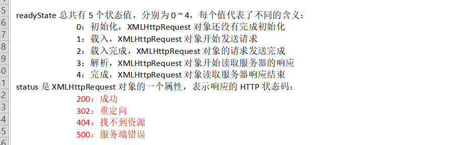
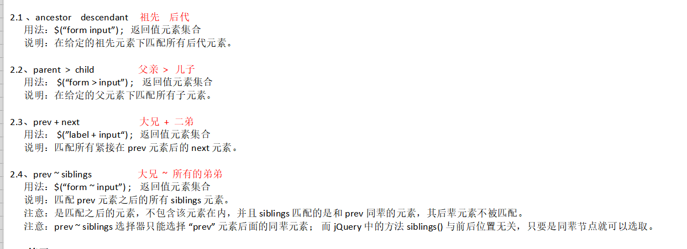

## Ajax

---
### ajax 概述（Asynchronous JavaScript and XML）
* AJAX 不是一种新的编程语言，一种不用刷新整个页面就可以实现和服务器交互,能够更新部分网页的技术

* Ajax 核心只不过是要在 Javascript 中调用一个叫 XMLHttpRequest 类，这个类可以与 Web 服务器使用 HTTP 协议进行交互，程序不通过浏览器发出请求，而是用这个特殊的 JavaScript 对象发送请求和接收响应。

* XMLHttpRequest 对象在网络上的俗称为 Ajax 对象。


##### ajax 的特点
1. 能同时发送多个请求(异步请求)
2. 实现网页内容的局部更新

##### ajax 的缺陷
1. 浏览器的兼容性
2. ajax 不支持跨域访问
3. ajax 请求数据，需要提示用户已经更新
4. ajax 请求后不能使用浏览器回退，返回上一个ajax 请求


##### ajax 不能回退上一个请求的原因
> 在我们浏览不同网页的时候，我们可以通过浏览器的前进、后退键来去到我们前后访问过的页面。这都有一个共同点，就是 浏览器地址栏的地址改变了。浏览器自身维护了一个记录用户访问页面历史的栈，栈中记录了用户访问不同页面的先后顺序。
但是在开发中，我们经常会用到ajax技术去提升网页的用户体验。但是ajax本身并不改变浏览器地址栏中的url，是在同一个网页内部操作的，这时，浏览器并不会记录ajax请求的记录。在这种情况下，用户在一个页面触发的5次ajax请求后，点了后 退按钮，浏览器不会再次请求之前的ajax请求，而是返回了上一页。

<br>
---
### 获取服务端时间(实例)

步骤:
1. 创建ajax 对象
2. 创建请求  
    * ajax.open(请求方式,访问资源url,是否异步)  
3. 发送请求
    * ajax.send();
4. 接收响应数据
    * 对readytState 属性值改变进行监听
    * ajax.readytState==4时,数据接收完毕
    * 通过responseBody和responseText获取完整的回应数据

网页代码
```js
window.onload=function(){
  document.getElementById("btn").onclick=function(){
    // 1. 创建ajax对象
    var ajax=new XMLHttpRequest();
    // 2. 创建请求(url/request)
    ajax.open("get","/getTime",true);

    //对readytState 属性值改变进行监听
    ajax.onreadtstateChange=function(){
      //当响应信息结束后再接收数据
      if(ajax.readytState==4&& ajax.status =200){
        // 4. 接收响应数据
        var time=ajax.responseText;
        document.getElementById("time").innerText=time;
      }
      console.log(ajax.readytState);
    }
    // 3. 发送请求
    ajax.send();
  };
}

//-------------html--------------

当前时间:<span id="time"></span>
<button id="btn_01">发送异步请求</button>
```

后台代码
```java
@Controller
public class GetController{

  //给浏览器响应当前的时间
  @RequestMapping("/getTime")
  public void getTime(HttpServletResponse resp){
    //指定响应数据的格式和编码格式
    resp.setContentType("text/plain;charset=utf-8");
    PrintWriter writer=resp.getWriter();
    writer.print(new Date().toLocalString());
  }
}
```
<br>
---

### Ajax常见问题

##### 浏览器兼容问题
* 绝对多数浏览器都增加了对XMLHttpRequest的支持，
  * IE中使用ActiveXObject方式创建XmlHttp对象，
  * 其他浏览器如：通过window.XMLHttpRequest来创建xmlhttp对象

```js
//--------创建ajax对象
function createAjax(){
  var ajax=null;
  try {
    ajax=new XMLHttpRequest();
  } catch (e) {
    ajax=new ActiveXOject();
  }
}
return ajax;
```

##### 404错误问题

```js
ajax.onreadystatechange=function () {
  var readyState=ajax.readyState;
  var status=ajax.status;//响应状态码
  if(readyState==4){// 接收数据结束
      if(status==200){
          console.log("数据接收成功");
      }else if(status==404){
          console.log("资源找不到");
      }else if(status==500){
          console.log("服务器异常");
      }
  }
}
```

##### 浏览器缓存问题
```js
//----------------相同请求会被缓存，url后加随机字符串
ajax.open("get","/getTime?new Date().getTime",true);
```
<br>
---
### Ajax 用户登陆案例(post请求)

步骤:
1. 创建ajax 对象
2. 创建请求,设置请求方式为post
3. 发送请求，需要配置请求参数和Content-Type
      * ajax.send(请求参数); //设置请求参数
      * ajax.setRequestHeader("Content-Type","application/x-www-form-urlencoded");
4. 处理响应数据
    * 条件: readyState=4 && ajax.status=200


```html
<input type="text" name="username" id="username"/><br>
<input type="text" name="password" id="password"/><br>
<input type="button" value="登陆" onclick="login()"/>
```

js 代码
```js
window.onload=function(){
  document.getElementById("btn").onclick=function(){

    //获取账号和密码
    var username=document.getElementById("username").value;
    var password=document.getElementById("password").value;

    var ajax=new XMLHttpRequest();
    ajax.open("post","/login",true);

    ajax.onreadystatechange=function(){
      if(ajax.readytState==4&& ajax.status =200){
        // 4. 接收响应数据
        var msg=ajax.responseText;
        document.getElementById("msg").innerText=msg;
      }
    }
    //如果是post请求，再send方法中传递参数
    // 参数格式 : 参数1=参数值1&参数2=参数值2
    var param="username="+username+"&password="+password；
    //设置请求头，告诉服务器数据类型和
    ajax.setRequestHeader("Content-Type","application/x-www-form-urlencoded");
    ajax.send(param);
  };
}
```


后台代码
```java
@Controller
public class LoginController{

  //给浏览器响应当前的时间
  @RequestMapping("/login")
  public void getTime(HttpServletResponse resp,String username,String password){
    //指定响应数据的格式和编码格式
    resp.setContentType("text/plain;charset=utf-8");
    if("root".equals(username)&&"root".equals(password)){
        writer.print("登陆成功");
    }else
        writer.print("账号或密码出错");
    }
  }
}
```

<br>
---

### JQuery

##### 1. JQuery介绍
  * jQuery 是一个优秀的 Javascript 框架,是一个 JavaScript 函数库，简化了JavaScript编程
  * jQuery 是轻量级的 JS 库 ，它兼容 CSS3，还兼容各种浏览器
  * jQuery 是一个兼容多浏览器的 Javascript 函数库，核心理念是 write less，do more（写得更少，做得更多）。

##### 2. jQuery 文件
* jQuery1.x.js：jQuery 源文件;学习 jQuery 或者 debug 的时候使用。
* jQuery1.x.min.js：jQuery 压缩之后的文件；正常项目中使用。

### jquery 引入
1. 将jquery.js文件拷贝到项目中(webapp/js)
2. 在html中引入
3. alert($); 测试是否引入成功

```js
<!--引入jquery-->
<script src="../js/jquery-2.1.4.js"></script>
<!--测试是否引入成功-->
<script type="text/javascript">
  alert($);
</script>
```

<br>
---

### jquery HelloWorld
需求:点击按钮，显示和隐藏文本

html内容
```html
<button id="btn">点击按钮</button>
<div id="content" style="display:none;">
  测试文本
</div>
```

原生js 实现
```js
window.onload=function(){
    document.getElementById("btn").onclick=function(){
      var div=document.getElementById("content");
      var display=div.style.display;
      if(display=="none"){
        div.style.display="block";
      }else{
        div.style.display="none";
      }
    }
}
```

jquery实现
```js
$(function(){
  $("#btn").click(function(){
    $("#content")toggle();
  })
})
```

<br>
---
### jquery 对象
1. dom对象和jquery对象
  * 通过jquery 方法获取的页面元素，都时jquery对象
  * jQuery 对象其实就是对 DOM 对象进行了包装，增强相关了方法
  * jQuery 对象包装了 DOM 对象但是两种不能混用,jquery 底层代码也是调用dom
2. $ 与 jQuery
  * $表示jquery对象,即 $===jQuery
3. dom对象和jquery可以相互转换

### dom对象和jquery的转换

```js
    //  js----> jquery  :  jQuery=$(DOM 对象)
    var domObj=document.getElementById("username"); //dom对象
    console.log($(domObj).val()); //jQuery 对象

    //  jQuery--->js      DOM 对象=jquery[0]
    // jQuery 对象是一个伪数组,不能增删改元素
    var jQueryObj=$("#username");
    console.log(jQueryObj.get(0));
    console.log(jQueryObj[0]);
```


### jquery 常用的方法

| 方法名          | 描述    |
| :------------- | :------------- |
| jQuery.size()      | 获取jQuery中包含DOM的个数 |
| jQuery.val()       | 操作元素的value属性       |
| jQuery.html()      | 操作元素内的HTML代码      |
| jQuery.text()      | 操作元素内的文本,忽略HTML标签|


<h1 id="h1">做人<i>要低调</i></h1>
<input type="text" id="username" value="wolfcode"/><br/><br/>
<div></div>

js代码
```js
// 1. 获取jQuery 中包含的DOM的个数
console.log($(div).size());

//2. 获取id 为username元素的value属性值
console.log($("#username").val());

//3. 设置id 为username元素的value属性值
$("#username").val("decade");

//4. 对比h1元素的内容和纯文本的区别
console.log($("h1").text());
console.log($("h1").html()); //包含标签

//5. 把h1元素内容的颜色改为红色
$("h1").css("color","red");
```

<br>
---

### jQuery 选择器
1. 选择器的用法和 CSS 的语法非常相似，可以快速地定位页面中任何元素，并为其添加响应的行为。
2. 选择器的组成
由 "特殊符号"+"字符串"组成,如 #username 代表 查找id=username 的元素
3. 使用选择器获取元素
  * 语法: ${"选择器"} 如 ${"#username"}
  * 注意：如果通过 jQuery 方法获取页面中元素，没有查找到，返回值不是 null，返回值为一个空数组 []，所以判断是否获取到元素，通过 jQuery.length != 0 来判断。


#### 基本选择器
```js
// 1.获取id 为msg的元素的内容
console.log($("#msg").text());

//2. 获取所有的li元素并打印数量
console.log($("li").size());

// 3. 获取所有class为selected的元素，字体颜色改成红色
console.log($(".selected"))

// 4. 获取id 为myul 元素由多少个li
console.log($("#myul li"));
console.log($("#myul li").selector);//获取选择器
console.log($("#myul li").get(0));//获取dom 对象

console.log("*");  // 获取所有的元素
console.log(".selected,div");//通过多个选择器获取
```

<br>
---

#### 层次选择器

使用场景:
* 通过 DOM 元素之间的层次关系来获取特定元素，例如后代元素，子元素， 相邻元素，兄弟元素等， 则需要使用层次选择器。

层次选择器:

| 选择器 | 用法     |
| :------------- | :------------- |
| ancestor descendant      |在给定的祖先元素下匹配所有的后代       |
| parent > child      | 匹配给定的父元素下的子元素      |
| prev + next       | 匹配所有紧接在prev元素后的Next元素      |
| prev ~ siblings    | 匹配prev元素之后所有的spliding 元素     |



```js
// 1. 获取所有ul 下的所有li元素，并分析结果
console.log($("ul li")); // 不会包含相同的

//2.  获取myul下的所有子li元素，并分析结果
console.log($("#myul>li")); //获取子元素

//3. 问题3:获取所有label元素后的input元素,并分析结果
console.log($("label~input")); // 获取兄弟同级下，后面的所有元素

// 问题4:获取紧跟着label元素后的input元素,并分析结果
console.log($("label+input"));//获取兄弟同级下，后面紧跟的元素
```

<br>
---
#### 过滤选择器
| 选择器 | 描述    |jquery代码|
| :------------- | :------------- |:---------|
|:first     | 获取第一个元素      |$('li:first');|
|:even      | 匹配所有索引值为偶数的元素，从 0 开始计数 | $("tr:even") |
|:odd     | 匹配所有索引值为奇数的元素，从 0 开始计数   |$("tr:odd")|
|:last     | 获取匹配的最后个元素      |$('li:last')|
|:first-child   | :first匹配第一个元素，但是:first-child选择器<br>可以匹配多个：即为每个父级元素匹配第一个子元素   |$("ul li:first-child")|
|:last-child     |:last 只匹配最后一个元素，而此选择符将为每个<br>父元素匹配最后一个子元素    |$("ul li:last-child")|
|nth-child()     | 匹配其父元素下的第N个子或奇偶元素   |$("ul li:nth-child(2)")|
|[attribute^=value]   |匹配给定的属性是以某些值开始的元素   |$("input[name^='news']")|
```js
//1.问题1:获取ul的第一个li元素(:first)
$("ul>li:first")

//问题2:获取每一个ul的第一个li元素(:first-child)
$("ul>li:first-child")

//问题3:获取ul的最后一个li元素(:last)
$("ul>li:last")

//问题4:获取每一个ul的最后一个li元素(:last-child)
$("ul>li:last-child")

//问题5:表格隔行变色
console.log($("tbody tr:odd").css("background-color","pink"));
console.log($("tbody tr:even").css("background-color","red"));

//问题6:获取所有的奇/偶数的li元素(:odd/:even)
console.log($("ul li:even"));//偶数
console.log($("ul li:odd"));//奇数

//问题7:获取每个ul的奇/偶数的li元素(:nth-child(?))
$("ul>li:nth-child(2)") // 每一个ul下索引为2的li元素
$("ul>li:nth-child(even)") // 每一个ul
$("ul li:eq(2)") //索引为2

//问题8:获取input元素中id以check开头的元素([attr^=value])
$("input[id^=check]")

```
