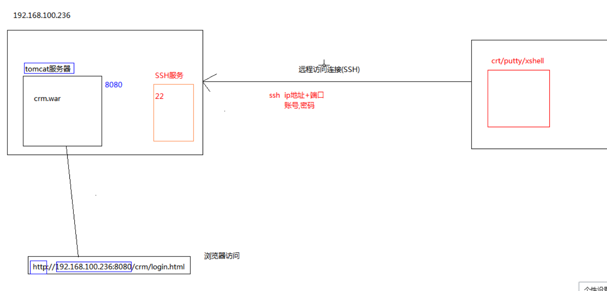

### linux 和window的区别
1. linux 严格区分大小写
2. linux 系统中一切皆文件
3. linux 不靠拓展名区分文件类型
4. windows 下的程序不能直接在linux中安装和运行

### ssh 协议


### 修改虚拟机的ip地址
如果ip 连不上时，可以查看虚拟机是否需要连接
1. 查看本地的虚拟vnet8的网卡地址
      192.168.52.1
2. 修改虚拟机的ip地址

```
---- 查看ip地址-------
ip addr

----修改ipAddr : 改成与虚拟机网卡同一个网段------
vi /etc/sysconfig/network-scripts/ifcfg-ens32

---- 修改相关配置--------
onboot=yes
ipaddr=192.168.52.200   // 修改成同一个字段
gateway=192.168.52.2
dns1=192.168.52.2
```


## linux 管理

linux 系统的目录结构
```
/ (根目录)
  |-- /bin (存放用户可执行文件)
      |-- cd
      |-- ls
      |-- cat
  |-- /sbin (存放系统可执行文件)
      |-- init
      |-- halt
  |-- /etc (配置文件)
      |- sysconfig
  |-- /home
```

绝对路径:从根目录开始查找
    |- cdd /bin
相对路径:
    |-- cd ../bin

## 命令基本格式
[root@localhost:~/test]
  |-- root ：当前登陆用户名
  |--localhost :主机名
  |-- ~/test : 当前所在的目录
