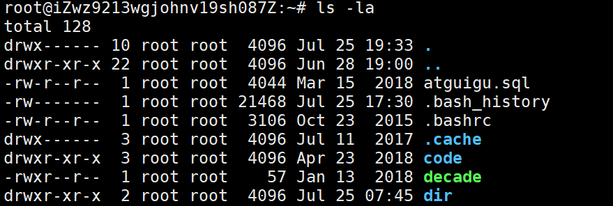

### 文件操作命令


常用的命令如下:
ls: 列出目录
cd：切换目录
touch: 创建文件
pwd：显示目前的目录
mkdir：创建一个新的目录
rmdir：删除一个空的目录
cp: 复制文件或目录
rm: 移除文件或目录
mv: 移动文件与目录，或修改文件与目录的名称


#### ls 命令
查看文件夹下的所有文件
```
ls [选项][参数]
-a  : 显示所有文件，查看隐藏文件
-h  ： 更加人性化显示文件大小
-l  ： 显示详细信息
```
示例:


#### pwd 命令
pwd：显示目前的目录

#### touch 命令
touch: 创建一个文件
touch [文件名]

#### mkdir命令
创建目录 : mkdir -p [目录名]
mkdir -p 1/2 : 递归创建文件夹

#### 切换当前所在的目录

```
cd ~ : 进入当前用户的家目录
cd 		同上
cd -		进入上次目录
cd ..		进入上一级目录
cd .		进入当前目录`
```

#### 删除
删除空目录： rmdir -rf [目录名]
-r	递归删除目录
-f	强制

#### 复制命令:cp
cp 文件 文件名
cp -r 目录 目录名 // 递归拷贝目录

####  剪切或改名命令:mv
mv 源文件名 目的文件名


#### 文件查看命令cat

#### 日志监控命令:tail	 
默认在屏幕上显示指定文件的末尾10行
	 -f  显示文件最新追加的内容。
	 -n 行数   在屏幕上显示指定文件的末尾参数设置的行数
示例:
tail -100f 文件名 ： 实时查看文件的后100行


## 磁盘管理
磁盘使用情况df:		选项-h: 格式化显示输出磁盘使用情况

查看操作历史history:	用于显示执行过的历史命令记录

在显示器输出内容:echo
