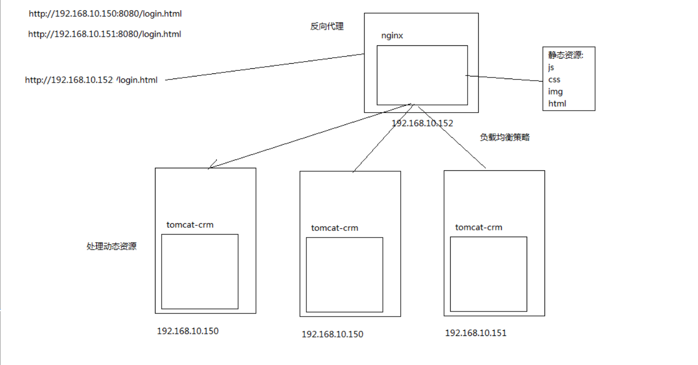

### 服务器
Apache web 服务器
ngnix 服务器

### ngnix 简介

Nginx (engine x) 是一个高性能的HTTP和反向代理服务器，也是一个IMAP/POP3/SMTP服务器。Nginx是由伊戈尔·赛索耶夫为俄罗斯访问量第二的Rambler.ru站点（俄文：Рамблер）开发的，第一个公开版本0.1.0发布于2004年10月4日。

其特点是占有内存少，并发能力强，事实上nginx的并发能力确实在同类型的网页服务器中表现较好，中国大陆使用nginx网站用户有：百度、京东、新浪、网易、腾讯、淘宝等。

### 正向代理和反向代理
正向代理:比如要访问youtube,但是不能直接访问，只能先找个翻墙软件，通过翻墙软件才能访问youtube. 这种方式就叫做正向代理。(代理的是客户端)

反向代理:指的是用户要访问youtube,但是youtube悄悄地把这个请求交给后台N台服务器中的其中一台来做，这种方式就是反向代理了。(代理的是服务端)

### 负载均衡策略
1)使用硬件负载均衡策略,如使用F5,Array等负载均衡器.

2)使用软件进行负载均衡

3)如使用阿里云服务器均衡SLB

4)使用我们今天所学习的Nginx+Keepalived

5)其他软件负载均衡如LVS(Linux Virtual Server),haproxy等技术

## nginx 优点
Nginx 可以在大多数 UnixLinux OS 上编译运行，并有 Windows 移植版。 Nginx 的1.4.0稳定版已经于2013年4月24日发布，一般情况下，对于新建站点，建议使用最新稳定版作为生产版本，已有站点的升级急迫性不高。
Nginx 的源代码使用 2-clause BSD-like license。
Nginx 是一个很强大的高性能Web和反向代理服务器，它具有很多非常优越的特性：
在连接高并发的情况下，Nginx是Apache服务器不错的替代品：Nginx在美国是做虚拟主机生意的老板们经常选择的软件平台之一。能够支持高达 50,000 个并发连接数的响应，感谢Nginx为我们选择了 epoll and kqueue作为开发模型。
