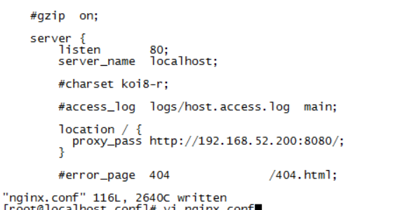

## 反向代理

1. 在tomcat 中启动crm
2. 在ngnix服务器上配置反向代理
3. 重新加载ngnix

location /{
  proxy_pass http://192.168.52.200:8080/;
}


```
配置反向代理:
proxy_pass url;

注意:反向代理之后,获取客户端ip地址为nginx服务器地址,这里需要nginx进行forward,设置真实的ip地址:
#设置客户端真实ip地址
proxy_set_header X-real-ip $remote_addr;
```


