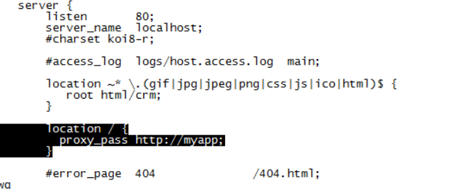

## 动静分离配置

```
配置过滤的静态资源
      location ~* \.(gif|jpg|jpeg|png|css|js|ico)$ {
         root html/crm;
      }

把静态资源拷贝到nginx服务器的指定目录 html/crm
删除原来应用的js和css
```

1. 配置多一个location,将静态资源存放到crm中

2. 复制静态资源到ngnix 中 , /usr/local/nginx/html 目录下

3. 静态页面异步请求会存在跨域问题
