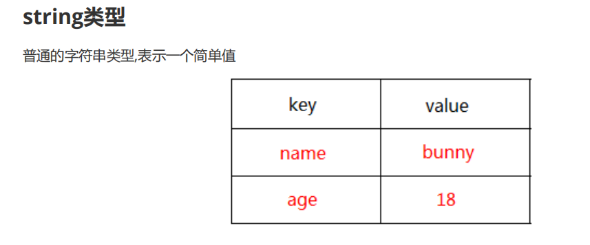
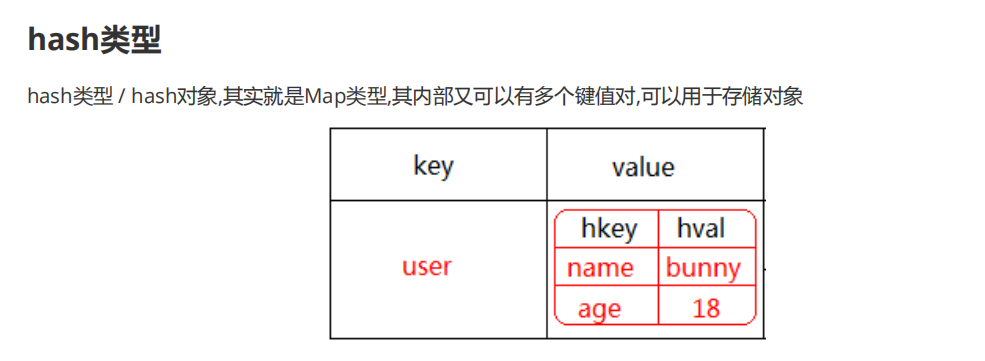
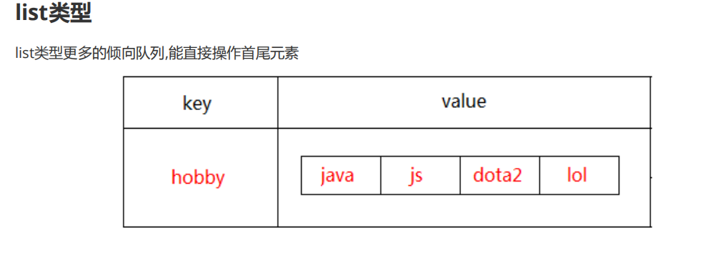

## Redis

官网学习 : https://www.redis.net.cn/tutorial/3501.html

### NOSql 和关系型数据库的区别
* 在关系型数据库数据都是存放在表中，有连接查询，主键，外键等概念
* NoSql 泛指非关系型数据库，主要针对关系型数据库性能瓶颈设计,专门处理关系型数据库不擅长的业务场景,Nosql 大致分为以下几类：

  * 键值存储: Redis 多用于高速缓存
  * 文档存储: MongoDB 广泛用于社交类应用(document)
  * 文件存储: FastDFS 多用于以文件为载体的在线服务，如相册/视频网站
  * 列式存储: HBase主要用于数据分析领域

### Redis 的数据结构
Redis 是提供高性能的键值存储的Nosql的数据库,先将数据存放在内容存中，隔一段时间才持久化到本地
  * Redis 的事务只有同时成功或同时失败
  * 没有表的概念和表相关的操作
  * 单线程执行，没有并发的线程安全问题(操作同一个资源)

#### Redis 支持的数据类型
Redis支持五种数据类型：
7
string（字符串）:
是 redis 最基本的类型,一个 key 对应一个 value

hash（哈希）:
是一个 string 类型的 field 和 value 的映射表，hash 特别适合用于存储对象

list（列表）：
列表是简单的字符串列表，按照插入顺序排序。可以添加一个元素到列表的头部（左边）或者尾部（右边）。

set（集合）:
跟Java中的set集合性质一样,底层使用哈希表实现的,存入的元素是无序不可重复的,我们可以通过Redis提供的命令来取交集,并集,差集

zset(sorted set：有序集合):
* zset 和 set 一样也是string类型元素的集合,且不允许重复的成员。
* 不同的是每个元素都会关联一个double类型的分数。redis正是通过分数来为集合中的成员进行从小到大的排序。
* zset的成员是唯一的,但分数(score)却可以重复

#### Redis 特点:
1. 由于基于内存，性能比较高，能达到10w/s读,8w/s写
2. 具有简单的ACID,没有事务回滚

<br>
---

### 操作string 数据的命令



| 命令     | Header Two     |
| :-------------: | :------------- |
| set key value     | 存入键值对      |
| get key      | 根据键取出值    |
| getset key value     | 返回旧值后存入新值      |
| incr key     | 值递增加1(用于点赞)      |
| decr key     | 值递减1       |
| incrby key num    | 添加指定偏移值(整数或负数)       |
| append key value     | 拼接内容       |
| setnx key value     | 存入键值对，存在时不存入       |
| setex key timeout value     | 存入键值对,timeout表示失效时间,单位s(可以用于短信验证码)            |
| setrange key index value     |   修改键对应的值,index表示开始的索引位置          |
| mset k1 v1 k2 v2    |     批量存入键值对        |
| mget k1 k2 ...     |    批量取出键值         |
| del key     |     根据键删除键值对|       

#### hash类型




```
hset key hashkey hashvalue // 存入一个hash对象
hget key hashkey     // 根据hash对象键取去值

hincrby key hashkey 递增值 -> 递增hashkey对应的值
hexists key hashkey -> 判断hash对象是含有某个键
hlen key -> 获取hash对象键的数量
hkeys key -> 获取hash对象的所有键
hvals key -> 获取hash对象的所有值
hgetall key -> 获取hash对象的所有数据
hdel key hashkey -> 根据hashkey删除hash对象键值对
同样有hsetnx,其作用跟用法和setnx一样
```


#### list 类型
* list 类型类似于队列,能直接操作首尾元素



| Header One     | Header Two     |
| :------------- | :------------- |
|lrange key strat end     | 显示列表范围数据,全部显示是 0 -1      |
| rpush key v1 v2 ..     | 往列表右边添加数据    |
| lpush key v1 v2 ..     | 往列表左边添加数据     |
| lpop key     | 弹出列表左边的数据       |
| rpop key     | 弹出列表右边的数据      |
| linsert key before/after 参考值 插入值    | 在参考值之前插入数据       |
| lset key index value       | 根据索引修改数据       |
| lrem key count value       | 在列表中删除指定个数的数据      |
| ltrim key start end        | 截取指定范围列表       |
| lindex key index     | 根据索引获取列表的数据     |
| llen key       | 获取列表的长度      |


### set 类型
| Header One     | Header Two     |
| :------------- | :------------- |
| sadd key value    | 往set 集合上添加元素     |
| smembers key     | 列出set集合中的元素     |
| srem key value    | 删除set 集合中的元素     |
| spop key     | 随机弹出集合中的元素    |
| sdiff key1 key2    | 返回key1中特有的元素     |
| sdiffstore set集合 key1 key2    | 返回key1中特有的元素并存入到另一个集合中     |
| sinter key1 key2    | 返回俩个set集合的元素     |
| sinterstore set集合 key1 key2    | 返回俩个set集合的元素并保存到另一个集合     |
| smove key1 key2 value|  把key1中的某元素移入key2 |
| scard key |  返回set 集合的元素个数 |
| sismember key value |  判断集合是否包含某个值 |
| srandmember key count |  随机获取set集合中元素 |


### zset 类型

```sql(redis)
zadd key score value  //存入数值和名称
(score: 用于排序)

zrange key start end  // 按照数值升序输出名称

zrangebyscore key min max  [withscores] //按照分值范围升序输出名称

zrevrange key start end   //按照数值降序输出名称
zrevrangebyscore key max   min

zrem key name //删除名称和数值x

zincrby key score name   //偏移名称对应的数值
```

## Redis 的管理命令
#### 管理key

```
exists key :判断某个key是否存在
expire key time: 设置key 的过期时间
persist key ： 取消key 的过期时间
rename oldkey newkey:重命名

select index : 选择数据库分区(0~15个分区)
move key index : 将某个key 移动到其他数据库分区

info : 查看当前服务器的信息
flushdb: 清空当前库中的数据
flushall: 删除所有数据分区中的数据

```
