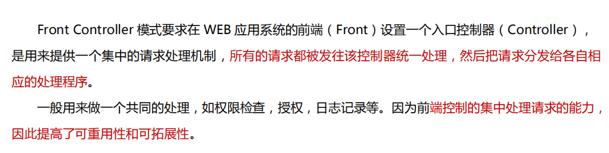
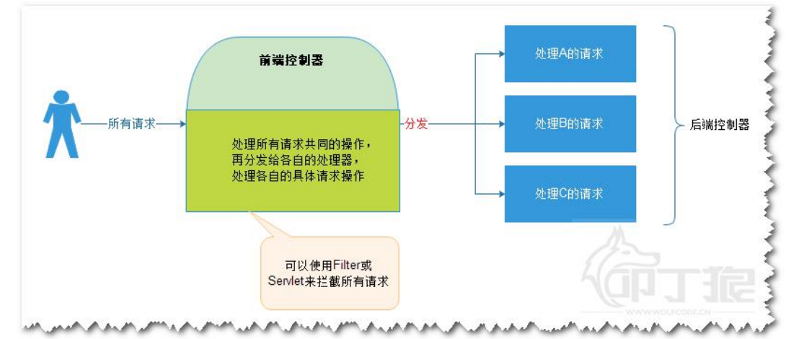
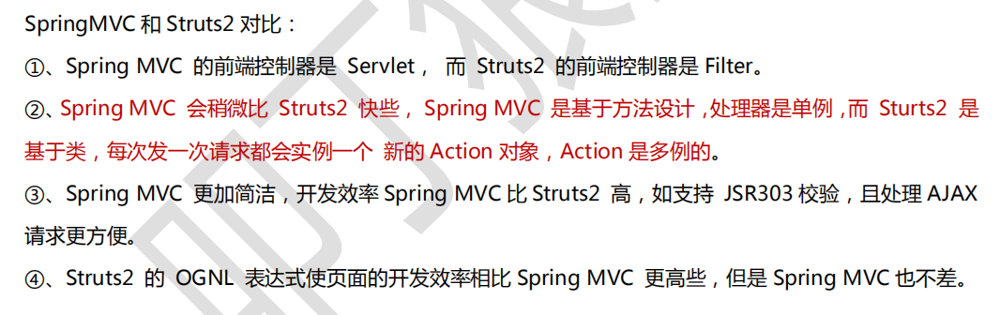
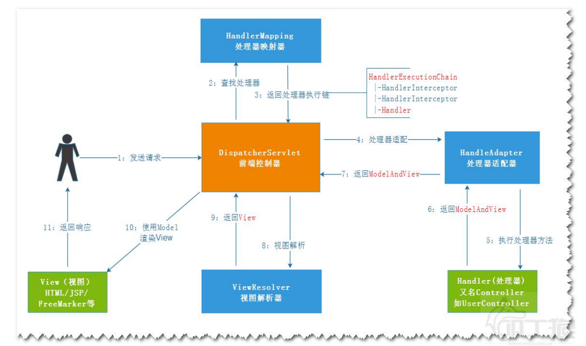

## SpringMVC 入门
---
### 前端控制器





* 处理器 : 处理请求的对象 ,在Spring 中称之为Controller/Handler
* MCV 框架都具有前端控制器，在WEB 开发中都需要在web.xml中设置,Struts 是基于Filter,springMVC是基于Servlet

### SpringMVC
MVC框架:简化控制层开发



<br>
---

### 第一个程序
#### 操作步骤
```
1. 导入 spring-web-mvc , servlet-api
2. 配置前端控制器: DispathcherServlet(提示)
3. 创建一个HelloController implements Controller
4. mvc.xml中配置处理器
    |--- 处理器映射器，把处理器的id或name作为请求的URL, url<-->Controller
    |--- 处理器适配器: 调用Controler 处理请求的方法：handlerRequest
    |--- 视图解析器 : 配置当前使用是什么视图技术
    |--- 处理器:处理请求的对象

注意：
1. pom.xml中servlet 依赖需要配置<scope>provided</scope>，
否则会报错,原因应该是 spring-web包中的jar 包和servlet会冲突
```

#### 书写前端控制器
>init-param : 加载spring mvc 配置文件 <br>
load-on-startup : 设置随着服务器启动，创建对象并调用init方法 <br>
url-pattern : 如果配置成 / ，会覆盖tomcat 的默认静态资源Servlet，解决方案是进行静态资源配置

```xml
--------------web.xml中配置前端控制器------------
	<servlet>
		<servlet-name>springDispatcherServlet</servlet-name>
		<servlet-class>org.springframework.web.servlet.DispatcherServlet</servlet-class>
		<init-param>
			<param-name>contextConfigLocation</param-name>
			<param-value>classpath:mvc.xml</param-value>
		</init-param>
		<load-on-startup>1</load-on-startup>
	</servlet>

	<servlet-mapping>
		<servlet-name>springDispatcherServlet</servlet-name>
		<url-pattern>/</url-pattern>
	</servlet-mapping>
```

```java
public class HelloController implements Controller{

	@Override
	public ModelAndView handleRequest(HttpServletRequest request, HttpServletResponse response) throws Exception {
		System.out.println("hello");
		// 模型和视图
		ModelAndView mv=new ModelAndView();
		mv.addObject("username","decade"); //设置模型数据
		mv.setViewName("/WEB-INF/view/hello.jsp"); //设置需要跳转的视图

		return mv;
	}
}
```

```xml
-------------mvc.xml-------------
<beans>
	<!-- 处理器映射器 : 主要用来映射 id 和 处理器  -->
	<bean class="org.springframework.web.servlet.handler.BeanNameUrlHandlerMapping"></bean>
	<!-- 处理器适配器 : 调用处理器的handler 方法-->
	<bean class="org.springframework.web.servlet.mvc.SimpleControllerHandlerAdapter"></bean>
	<!-- 视图分析器 : 配置当前使用的是什么视图技术 -->
	<bean class="org.springframework.web.servlet.view.InternalResourceViewResolver"></bean>

	<!-- 配置处理器 -->
	<bean id="/hello"  class="com.kiva.hello.xml.HelloController"></bean>
</beans>
```


<br>
---

#### SpringMVC 的执行流程

```
处理器映射器:根据当前请求去查找哪一个Controller 来处理
    |---将拦截器/Controller返回到前端控制器
    |---调用处理器适配器
处理器适配器：执行controller的方法
    |--- 返回ModelAndView --> 适配器--> 前端控制器
视图解析:根据ModelAndView 获取View(物理路径)
    |--- 返回路径给前端控制器
前端控制器使用Model渲染View
```




#### 使用注解配置
开发步骤
1. 导包 spring-mvc , servlet
2. 在web.xml 中书写前端控制器
3. 书写Controller
4. mvc.xml中配置IoC注解解析器，mvc 注解驱动解析器

```java
// Controller : spring IoC 注解
@Controller
public class HelloController{
  //设置访问路径   RequestMapping : mvc注解
  @RequestMapping("/hello")
  public ModelAndView sayHello(){
      System.out.print("hello");
      ModelAndView mv=new ModelAndView();
      mv.addOject("username","decade");
      mv.setViewName("/xxx.jsp");
      return mv;
  }
}
```

```xml
-------applicationContext.xml--------
<?xml version="1.0" encoding="UTF-8"?>
<beans>

	<!-- 配置spring IoC 注解分析器 :扫描指定包下的注解   -->
	<context:component-scan base-package="com.kiva.hello"/>
	<!-- mvc 注解解析器 -->
	<mvc:annotation-driven />

  解决静态资源不能访问的问题:
	<!-- 方式一:将匹配不到的静态资源路径将给tomcat 默认的Servlet处理 -->
	<mvc:default-servlet-handler/>
	<!-- 方式二: 配置指定路径下 -->
	<mvc:resources location="/" mapping="/**"></mvc:resources>
</beans>
```

## 小结

```
web.xml中
初始化参数:配置上下文配置路径
  |--- 去哪里找springmvc的配置文件
  |--- load-on-startup=1 : 在服务器启动时，就初始化前端控制器

在spring-mvc 包下
DispathcherServlet.properties文件中有设置默认的处理器映射器，处理器适配器，视图解析器

mvc 的注解解析器
<mvc:annotation-driver/>

request-mapping 注解:
  |-- 加载处理请求类的方法上，用来匹配当前方法的访问URL, / 可加可不加
  |-- 也可以贴类上,类中的所有方法要以该地址作为前缀
```

### 静态资源访问
url 常见拦截访问方式
```
 *.do ,*.html : 不会导致静态资源被拦截,但是不符合Restful规范
 / : 不能访问静态资源,tomcat 的默认静态资源Servlet 被覆盖了
 /* : 是错误的方式,可以跳转到Controller,不能跳转到jsp
```
解决静态资源被覆盖问题
```
1. 使用<mvc:default-servlet-handler/> (静态资源处理器)
2. 资源映射
  <mvc:resources loacation="classpath:/static/" mapping="/**"/>
```


```
SpringMVC
  1. 前端处理器：处理多个请求处理器共同的操作,请求分发s
      包含多个文件时，使用  classpath:mvc.xml
  2. 使用步骤
      |---  配置jar
      |--- 在web.xml 中配置前端控制器
      |--- 配置文件管理处理器
      |--- 书写控制器(使用注解)
```

<br>
---
### 请求和响应

#### 响应

1. void 返回值 : 此时相当于 Servlet
2. ModelAndView 返回值:
3. 返回string 值

```java
@Controller
@RequestMapping("/response")
public class ResponseController{

  // 一般不用 （文件下载可以使用）
  @RequestMapping("/test1")
  public void test1(HttpServletRequest req,HttpServletResponse resp){
  }

  //返回ModelAndView = Model +view
  //封装了页面路径，和需要共享的数据
  @RequestMapping("/test2")
  public ModelAndView test2(){
    ModelAndView mv=new ModelAndView();
    mv.addObject("username","decade");
    mv.addObject("我的世界");//使用 ${string}获取, 类型首字母小写作为key

    mv.setViewName("/WEB-INF/view/response/result.jsp");//跳转视图的物理路径
    // 物理视图=视图前缀 + 逻辑视图+ 视图后缀
    mv.setViewName("response/result");//逻辑视图 (少了前缀和后主)
    return mv;
  }

  //返回string 类型，返回的逻辑视图名称(view)
  //配合参数Model(共享数据对象)来完成
  @RequestMapping("/test3")
  public String  test3(Model model){
    //设置共享数据
    model.addAttribute("username","decade");
    model.addAttribute("世界很美");
    return "response/result";
  }

  //返回string 类型，做重定向和转发
  @RequestMapping("/test4")
  public String  test4(Model model){
    // 请求转发
    // /： 表示根目录
    // return "forward:/hello.html";
    // URL 重定向
    return "redirect:/hello.html";
  }

}

------------mvc.xml------
<bean class="InternalResourceViewResolver">
  <property name="prefix" value="/WEB-INF/view/"/>
  <property name="suffix" value=".jsp"/>
</bean>

注意: 逻辑视图配置之后，会在所有路径上加上前缀和后缀
```

#### 处理器方法参数的处理

```java
@RequestMapping("/request")
@Controller
public class RequestController{

  //方式一
  @RequestMapping("/test1")
  public void test1(HttpServletRequest req,HttpSession session){
  }


  //获取请求参数: 请求参数和形参需同名
  @RequestMapping("/test2")
  public void test2(String name,int age){
    System.out.print(name+","+age);
  }
  // RequestString ： 设置请求参数名
  @RequestMapping("/test3")
  public void test3(@RequestString("username") String name,int age){
    System.out.print(name+","+age);
  }

  // 获取请求参数，并封装对象，保证对象属性和请求参数名一样
  @RequestMapping("/test4")
  public void test4(User user){
    System.out.print(user);
  }

  // SpringMVC中，会把方法参数放到request中去共享-->
  // request.setAttribute("user",u)--> 取值 ${user}
  // ModelAttribute : 修改 attribut 中的key  ---> ${myUser}
  @RequestMapping("/test5")
  public void test5(@ModelAttribute("myUser")User u){
    System.out.print(u);
  }

  // 指定日期格式
  @RequestMapping("/test6")
  public void test6(@DateTimeFormat(pattern="yyyy-MM-dd")Date date){
    System.out.print(date);
  }

  @Ini
  public void initBinderDate(WebDataBinder binder){
    SimpleDateFormat sdf=new SimpleDateFormat();
    sdf.applyPattern("yyyy-MM-dd");
    binder.registerCustomEditor(Date.class,new Custom);
  }

}


public class User{
  String username;
  Integer age;

  @DateTimeFormat(pattern="yyyy-MM-dd")
  Date date;
}

```

#### post 请求乱码处理

配置post 请求编码过滤器CharacterEncodingFilter
```xml
<!-- 配置编码过滤器 -->
	<filter>
		<filter-name>CharacterEncodingFilter</filter-name>
		<filter-class>org.springframework.web.filter.CharacterEncodingFilter</filter-class>
		<init-param>
			<param-name>encoding</param-name>
			<param-value>utf-8</param-value>
		</init-param>
	</filter>
	<filter-mapping>
		<filter-name>CharacterEncodingFilter</filter-name>
		<url-pattern>/*</url-pattern>
	</filter-mapping>
```

#### ModelAttribute

#### 日期格式

```java
方式一:使用注解 @DateTimeFormat(pattern="yyyy-MM-dd")
    |--- 在方法参数中使用注解
    |--- 在javabean 类型中使用注解

    // 指定日期格式
    @RequestMapping("/test6")
    public void test6(@DateTimeFormat(pattern="yyyy-MM-dd")Date date){
      System.out.print(date);
    }

方式二: 在控制器中定义自定义日期格式编辑器

// 处理日期格式的方式
	@InitBinder
	public void  initBinderDate(WebDataBinder wdb){
		//转换成日期对象
		SimpleDateFormat sdf=new SimpleDateFormat("yyyy-MM-dd");
		//注册自定义的编辑器
		wdb.registerCustomEditor(Date.class, new CustomDateEditor(sdf, true));
	}

方式三: 自定义全局日期类型转换器
/**
 * 日期增强控制，将string-->date
 * @author deku
 *
 */
@ControllerAdvice
public class DateFormatControllerAdvice {

	@InitBinder
	public void  initBinderDate(WebDataBinder wdb){
		//转换日期格式规则
		SimpleDateFormat sdf=new SimpleDateFormat("1996-11-4");
		//注册自定义日期编辑器
		wdb.registerCustomEditor(Date.class, new CustomDateEditor(sdf, true));
	}

}

-----------注意-----------
ControllerAdvice 所在的包需要被IoC扫描器所扫描到
```

<br>
---
#### SpringMVC 和 Spring 集成
1. 配置web.xml,前端控制器和字符过滤器
2. 书写mvc.xml,配置到前端控制器
3. 在mvc.xml 中引入后台的bean的配置(连接池，数据源，事务等)
    |---IoC 注解分析器
    |--- mvc 注解解析器
    |--- 静态资源处理器
    |--- 视图虚拟路径的前缀和后缀
4. 定义UserController

```java

@Controller
@RequestMapping("/user")
public class UserController{

  @AutoWited
  private IUserService userService;

  @RequestMapping("/list")
  public String list(Model model){
    model.addAttribute("users",userService.listAll());
    return "user/list";
  }

  //删除
  @RequestMapping("/delete")
  public String delete(Long id){
    userService.delete(id);
    return "redirect:/user/list/";
  }

  //进入编辑界面
  @RequestMapping("/edit")
  public String edit(Long id,Model model){
    if(id!=null){
      model.addAttribute("user",userService.getUser(id));
    }
    return "user/input";
  }


  //进入编辑界面--- 上传文件参数名不能是user的headerImag
  @RequestMapping("/saveOrUpdate")
  public String saveOrUpdate(User user,MultipartFile pic){

    if(pic!=null&& pic.getSize()>0){
      String dir=servletContext.getRealpath();
      pic.transferTo(new File(dir,pio));
    }

    if(user.getId()==null){
      userService.save(user);
    }else{
      userService.update(user);
    }
    return "redirect:/user/list";
  }

}
```
#### 上传文件
1. 书写java代码
2. 通过ServletContext.getRealPath("upload");的绝对路径
3. 通过MultipartFile .getOriginalFilename(); 获取文件的原名
4. 方法参数名需要和请求的参数名一致
5. 配置文件上传解析器,上传解析器必须有id
6. web.xml中配置文件上传限制

```java
@Controller
public class UploadController {
	@Autowired
	ServletContext servletContext;

	@RequestMapping("/upload")
	public String upload(MultipartFile pic) throws Exception{
		if(pic!=null&&pic.getSize()>0){
			//获取项目下的文件加绝对路径
			String dir=servletContext.getRealPath("/images");
			//获取文件名
			String fileName=pic.getOriginalFilename();

			pic.transferTo(new File(dir,fileName));
		}
		return "redirect:/upload.jsp";
	}
}

-------------上传页面----------
<form action="/upload" method="post" enctype="multipart/form-data">
		<input type="file" name="pic"><br>
		<input type="submit" value="上传">
</form>
```

文件上传解析器

* servlet3解析器配置
* Tomcat 内置的解析器，可以不用配置，但是需要在web.xml的前端控制器中配置配置<multipart-config>,如果不配，该对象为空

```xml
--------------mvc.mlx--------------------
<!-- servlet 3 的文件上传解析器 -->
<bean id="multipartResolver" class="org.springframework.web.multipart.support.StandardServletMultipartResolver"></bean>

--------------在web.xml 前端控制器上配置----------
<multipart-config>
			<max-file-size>1048576</max-file-size>
			<max-request-size>1048576</max-request-size>
			<file-size-threshold>10240</file-size-threshold>
</multipart-config>
```
* 用apache上传组件，需要导fileUpload包

```xml
------------mvc.xml中-------------
<bean id="multipartResolver" class="org.springframework.web.multipart.commons.CommonsMultipartResolver">
  <!-- 设置最大上传1M -->
  <property name="maxUploadSize" value="1048576"></property>
</bean>
```

<br>
---

#### 源码分析
servlet

```
init 初始化
  |--- initFrameworkServlet() 方法可以拓展框架
  |--- initWebApplicationContext()
          |-- wac =findWebApplication
          |-- wac =createWebApplicationcontext
            |-- onRefresh(ApplicationContext ) : 刷新容器,子类调用
                  |---子类 initStrattegies(context)
                        |-- 初始化映射器,适配器，上传文件解析器,事务解析器,处理俩个session之间共享数据


service
    |-- doGet 方法在FrameWorkServlet实现
        |-- proccessRequest() 处理请求
          |-- doService()抽象看子类
              |-- doDispatch() 执行分发
                  |-- HandlerExecutChain getHandler()
                      |-- 封装多个拦截器和当前处理器
                  |-- HandlerAdapter getHandlerAdapter()
                      |-- 迭代所有的适配器(properties问价中的)，找到Adatpter
                  |-- mappedHandler.applyPreHandle() 拦截器先执行
                  |-- ModelAndView mv=ha.handler()执行处理器的方法
                  |-- mappedHandler.applyPostHandler() 执行拦截器post方法
                  |-- processDispatcherResult() : 处理分发结果
                      |-- render (mv) 渲染
                          |-- mv.getViewName(): 得到视图名称，解析渲染
                          |-- renderModel()
                  |-- mappedHandler.afterCompletion();
```

```
1. spring + mybatis 集成
  |-- 连接池
  |-- sqlSessionFactory
  |-- MapperFactoryBean
  测试Mapper对象的操作成功
2. spring + 事务
  |-- 增加service组件和service的bean
  |-- 配置事务
  |-- 测试service操作，是否有回滚
3. spring 注解版
  |-- xml 配置改为注解配置
  |-- 测试service
4. springMVC +SM
  |-- 前端控制器
  |-- mvc.xml 引入applicationContext.xml
  |-- 完成web版的crud
5.日志增强，每次调用service 方法之前将调用信息存储到数据库中(aop)
6.文件上传
  |-- apache需要导包
  |-- common自带
7. 登陆和注销操作,在springMVC中操作session
8.做一个登陆拦截器 (Controller的拦截器)
```
