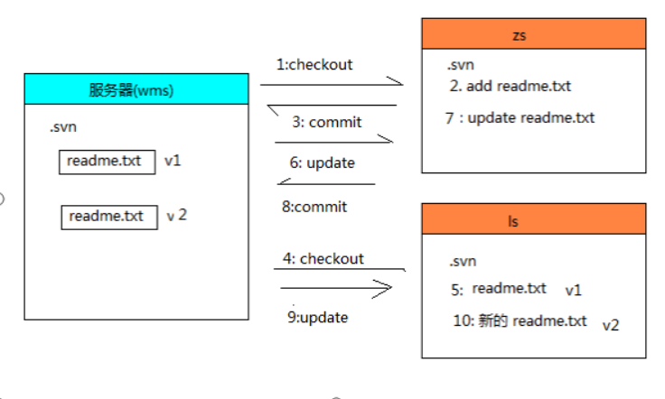
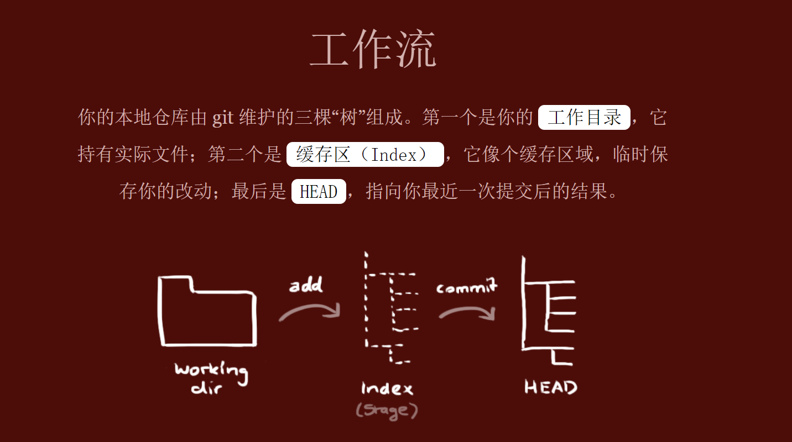
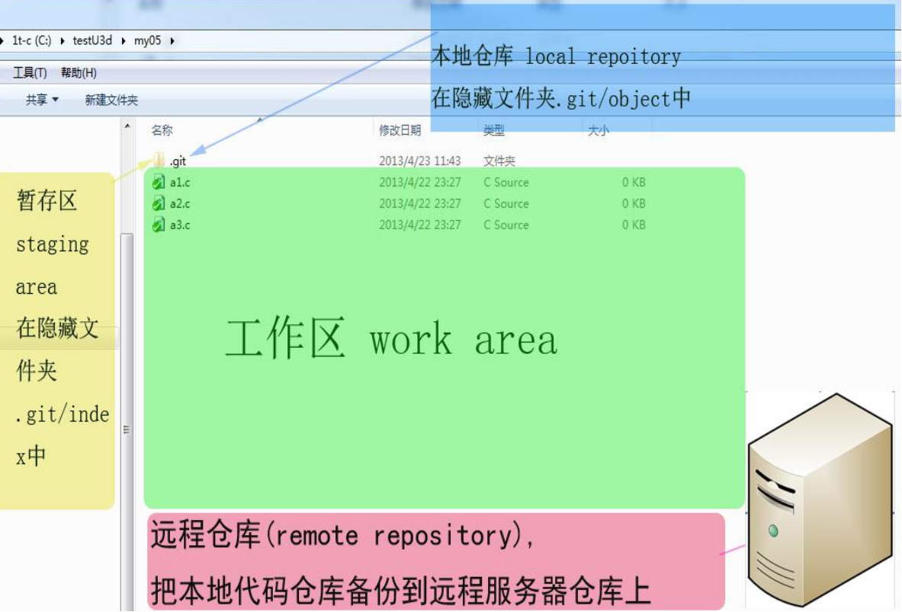
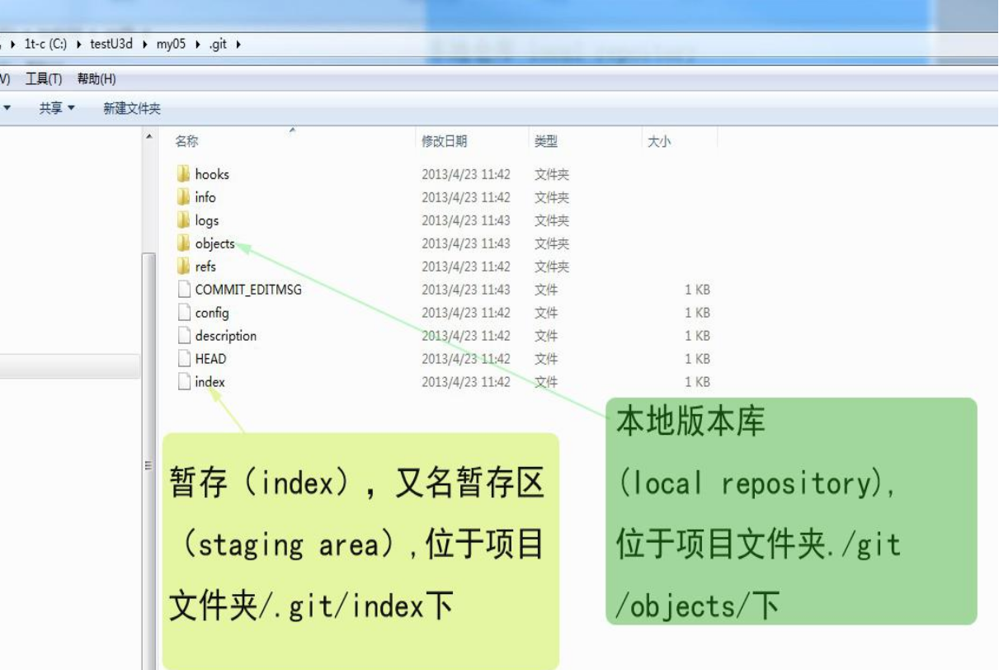
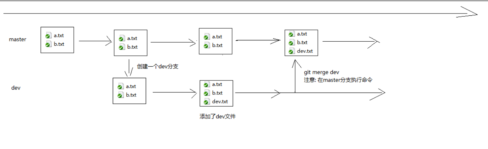
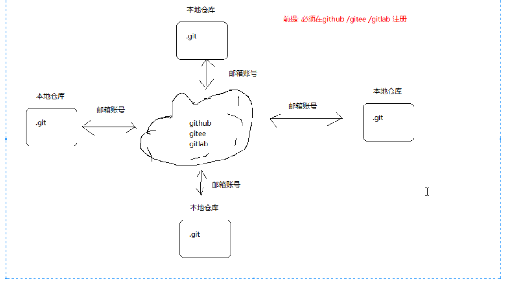
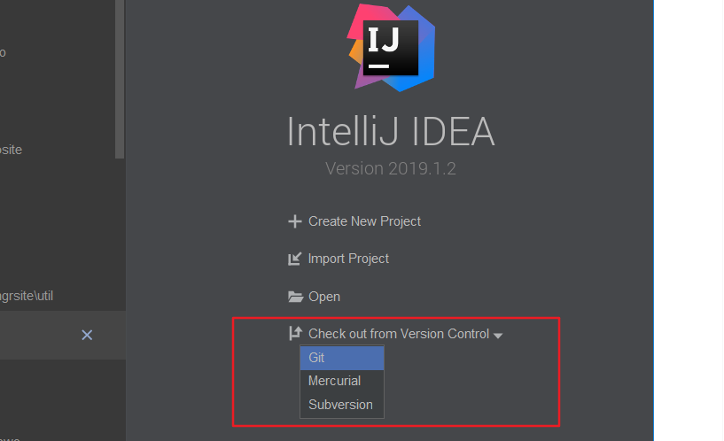
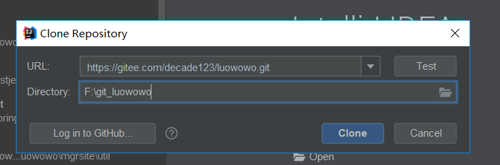
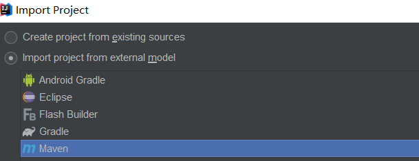
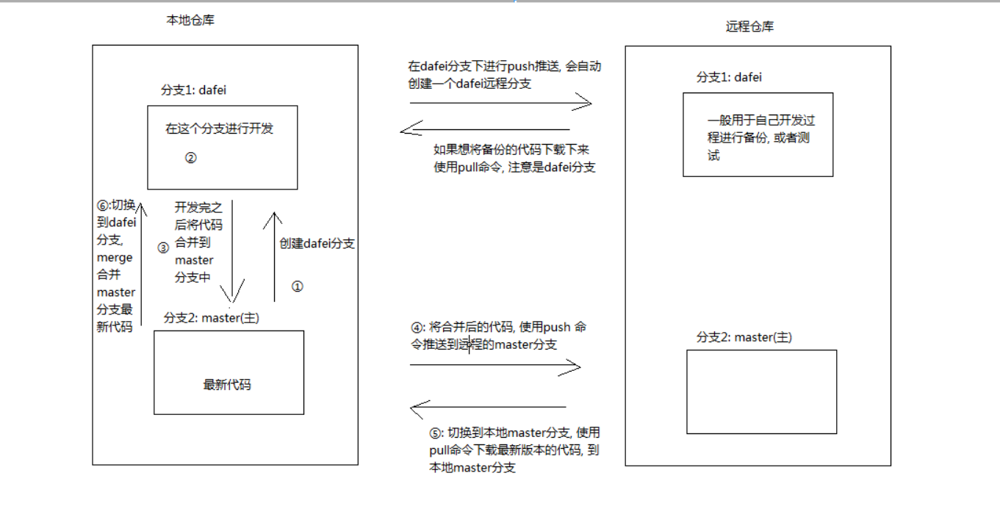

## svn版本控制
1. 备份
2. 代码还原
3. 协同修改:解决冲突
4. 多版本项目文件管理
5. 追溯问题代码的编写人和编写时间
6. 权限控制

### svn 分支
branches : 创建自己的分支进行开发，最后将分支一起合并到trunk上
tags : 用来备份和标记,保存一些重要版本的代码
trunk : 存放主线项目

## crud 流程总结



## 冲突
冲突问题:一个用户修改了文件，提交，又有一个用户没有update又修改了，提交后会出现冲突

## svn 管理项目
不添加.idea,.iml,target

### 集中式vs分布式
集中式: 版本库集中存放在中央服务器
    |-- 必须联网才能工作,网速较慢
分布式: 分布式的版本控制没有中央服务器，每个人的电脑都是一个完整的版本库

<br>

## git相关命令操作

#### 初始化操作
```java
git config -global user.name "your name"
git config -global user.email "邮箱"

初始化仓库
git init : 将当前目录编程git可以管理的
      |-- 运行成功后，可以发现按目录下多了一个.git目录
```

### 添加文件

```
git add 文件
    |-- 添加文件到仓库
git commit -m "备注"
    |-- 将文件提交到仓库
git add .
    |-- 提交当前文件夹下所有的文件
```

### 查看日志
```
git log
输出清晰的日志记录
git log --pretty=oneline
```

### 查看版本库状态
```
git status
    |-- 查看当前git 版本库的状态(缓存区中的文件内容)
```

### 查看差异
```
git diff
    |-- 查看文件版本的差异
```

### 回退版本
```
git reset --hard HEAD^ : 回退上一个版本
git reset --hard HEAD^^ : 回退上上版本
git reset --hard HEAD~100 : 回退上100个版本
git reset --hard 版本号
    |-- 版本号:<commit id>
```

### 工作区和缓存区







### 撤销修改
```
git checkout --file
    |--可以丢弃工作区的修改
让文件回到最近一次git commit 或 git add 状态
```
#### 删除文件
```
git rm 文件
git commit -m "删除文件"
```

#### 分支管理
git 鼓励大量使用分支:
  * 查看分支 : git branch
  * 创建分支: git branch <name>
  * 切换分支: git checkout <name>
  * 创建+切换分支:git checkout -b <name>
  * 合并某分支到当前分支: git merge <name>
  * 删除分支: git branch -d <name>




#### 文件冲突
分支1 中跟其他
分支文件一样，如果同时发生修改,进行合并，就出现文件冲突问题
  |-- 修改冲突文件后再add commit

###  远程仓库

1. 国外 : github ，个人免费，公司收钱
2. 国内: gitee 码云
3. 自己搭建: gitlib


### 相关命令
```
git init
创建一个.gitignore.文件
git add .
git commit -m "项目初始化"

# 设置远程仓库提交路径
git remote add origin "项目路径"

# 将本地master代码推送远程仓库 的 master分支
git push -u origin master
```


### 使用idea 导入git项目

相关步骤如下:







版本控制流程图:

