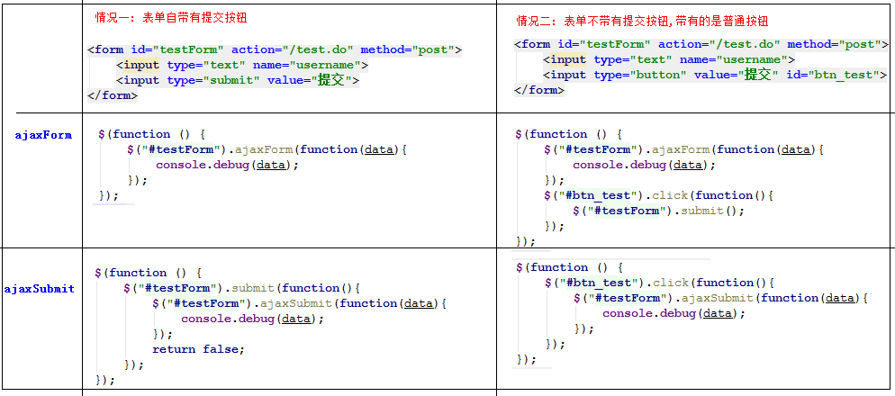

## crm 客户关系管理系统

---

### Freemark 的学习
  * jsp 工作原理
      * |-- jsp  -->java类(servlet)--->字节码文件-->html
  * Freemark
      * |-- 数据+模板=输出(不用编译没有字节码)

##### FreeMark 概述
* FreeMarker是一个模板引擎，一个基于模板生成文本输出的通用工具，使用纯Java编写。
FreeMarker被设计用来生成HTML Web页面，特别是基于MVC模式的应用程序
* 能够生成各种文本：HTML、XML、RTF、Java源代码等等
* 按所需生成文本：保存到本地文件；作为Email发送；从Web应用程序发送它返回给Web浏览器

<br>
---
### 第一个FreeMark 程序

语法:

* 插值：FreeMarker 将会输出真实的值来替换花括号内的表达式，这样的表达式被称为interpolations 插值
    * 语法 :
    ${对象.属性}

* 空值处理
  * 因为FreeMarker无法理解null值。 FreeMarker提供两个运算符来避免空值
  *  !：指定缺失变量的默认值
      *  ${(对象.属性)!}  :默认空字符串
      * ${(对象.属性)!默认值}
  * ??: 判断变量是否存在 : 存在返回true,不存在返回false


开发步骤:
1. 导入jar包/添加maven依赖
2. 项目根目录下，创建一个templates,建立一个test.ftl模板文件
3. 书写测试方法，设置模板文件配置,传入数据输出文件位置

test.ftl
```
海上月是天边月${address}
```

测试方法

```java
public static void main(String[] args) throws Exception {
    Configuration cfg = new Configuration(Configuration.VERSION_2_3_23);
    // 指定模板文件从何处加载的数据源，这里设置成一个文件目录。
    cfg.setDirectoryForTemplateLoading(new File("templates"));

    // 指定模板如何检索数据模型，这是一个高级的主题了…
    // 但先可以这么来用：
    cfg.setObjectWrapper(new DefaultObjectWrapper());
    // 创建根哈希表
    Map root = new HashMap();
    // 在根中放入字符串"user"
    root.put("address", "广州");
    Template temp = cfg.getTemplate("test.ftl");
    Writer out = new OutputStreamWriter(new FileOutputStream("test.html"));
    temp.process(root, out);
    out.flush();
}
```
生成test.html
> 海上月是天边月广州

<br>
---

### FreeWork 和Spring 集成开发
* spring 已经集成了Freemark，只需要配置模型的文件位置和数据提供
* controller 返回的逻辑视图+配置的逻辑视图的前缀和后缀构成生成模型文件的位置,数据依旧使用model传递

操作步骤:
1. 导入依赖 freemarker + spring-context-support
2. 在spring 配置文件中配置
    * 配置freeMarker的模板路径
    * freemarker视图解析
3. 将jsp 文件转换成ftl文件

```xml
<!-- freemarker -->
<dependency>
      <groupId>org.freemarker</groupId>
      <artifactId>freemarker</artifactId>
      <version>2.3.23</version>
</dependency>

<dependency>        
    <groupId>org.springframework</groupId>
    <artifactId>spring-context-support</artifactId>
      <version>${spring.version}</version>
</dependency>

<!--配置freeMarker的模板路径 -->
<bean class="org.springframework.web.servlet.view.freemarker.FreeMarkerConfigurer">
  <!-- 配置freemarker的文件编码 -->
  <property name="defaultEncoding" value="UTF-8" />
    <!-- 配置freemarker寻找模板的路径 -->
  <property name="templateLoaderPath" value="/WEB-INF/views/" />
</bean>

<!--freemarker视图解析器 -->
<bean class="org.springframework.web.servlet.view.freemarker.FreeMarkerViewResolver">  
  <!-- 是否在model自动把session中的attribute导入进去; -->   
 <property name="exposeSessionAttributes" value="true" />
   <!-- 配置逻辑视图自动添加的后缀名 -->
  <property name="suffix" value=".ftl" />   
 <!-- 配置视图的输出HTML的contentType -->  
  <property name="contentType" value="text/html;charset=UTF-8" />
</bean>
```

ftl 模型使用指令:
```html
include 指令
<#include "文件路径">
引用文件时需要使用 文件路径需要使用相对路径

assign指令用于在命名空间中创建变量  key=value
<#assign currentMenu="department">

list指令
<#list 数组 as 元素>
    取索引  ${entity_index+1} //从0开始
</#list>

如果取值为null或没有,freemarker会报错

空值处理运算符
! : 指定默认值
?? : 判断一个对象是否存在

${user!"默认值"} :
${(d.id)!} : 默认空字符串

<#if e??> 不为空时执行
</#if>
<#if !e??> 为空时执行
</#if>
<#if e?? && e.admin??></#if>

boolean 值的获取
$(e.admin)?string("true","false")
```

<br>
---

### 分页插件(PageHelper插件)

* 作用:解决使用不同数据库sql 方言分页操作的不同方言
* 插件原理:
> mysql 中的分页可以使用limit来完成，
此时需要在执行目标sql之前，对sql进行预处理
判断当前数据库是否是mysql,如果是，则在sql语句上拼接limit

操作步骤:
1. 导入依赖
2. mybatis主配置文件中导入插件
3. 在service将查询到的列表数据封装到PageInfo ,设置当前页和页面总数

注意:sql 中不需要加limit

```xml
-----

<!--pom 中添加分页插件-->
<dependency>      		
    <groupId>com.github.pagehelper</groupId>
    <artifactId>pagehelper</artifactId>
    <version>5.1.2</version>
</dependency>

-----------------mybatis.xml添加--------
<plugins>
      <!-- com.github.pagehelper为PageHelper类所在包名 -->
      <plugin interceptor="com.github.pagehelper.PageInterceptor">
          <!--reasonable合理化分页
            pageNum : 当前页
          -->
          <!--当pageNum<=0时，将pageNum设置为1-->
          <!--当pageNum>pages时，将pageNum设置为pages-->
          <property name="reasonable" value="true"/>
      </plugin>
  </plugins>


PageHelper.startPage(currentPage, pageSize);
```
##### 在service中使用
```java
----------service------------
public PageInfo<Department> query(QueryObject qo){
  // 告诉mybatis 去哪里拼接sql
  //后面的第一个方法才会添加Limit
  PageHelper.startPage(qo.getCurrentPage(),qo.getPageSize());
  List<Department> list=mapper.selectForList(qo);
  return new PageInfo<>(list);
}
```

<br>
---

### 模态框插件(bootstrap 模态框)
常用js 插件库

  * jquery 插件库
  * bootstrap --> javascript插件-->模态框

#### 添加模态框
需求分析:
* 点击添加按钮显示模态框
* 设置点击提交表单事件

步骤:
1. 设置添加按钮点击事件，在事件函数中获取表单对象，调用提交方法
2. bootstrap对话框使用参考文档: [https://v3.bootcss.com/javascript/#modals
](https://v3.bootcss.com/javascript/#modals)

核心代码如下:
```js
$(function () {

  //点击添加/编辑显示模态框
  $(".btn-input").click(function () {
      //手动显示模态框
      $('#inputModel').modal('show');
    });

   //点击保存部门信息
   $("#modelBtnSave").click(function () {
       $("#editForm").submit();//提交表单数据
   })
});
```

<br>
---

#### 编辑模态框
##### 需求分析:
* 点击编辑按钮，弹出模态对话框，显示当前记录数据
* 修改数据，点击保存按钮保存

##### 开发步骤:
1. 编辑 a 标签 添加一个属性
    * data-json="后台准备getJson方法",通过给标签设置属性的方式，可以在jquery中获取当前记录数据

2. 后台实体类中添加getJson()方法，返回需要显示数据的以json格式封装

3. 在js 中使用jquery对象.data("json")获取标签属性data-json 的值
   * 正确格式json会直接获取到json对象

4. 将数据填充到表单中
   * 添加时需要判断json
   * 显示模态框之前需要先清空

注意:返回的json 数据有双引号，需要注意标签的""的问题

##### 实体类代码示例:
```java
class Department{
  public String getJson(){
    //将需要的数据转成json字符串返回
    Map<String,Object> params=new HashMap<>();
    map.put("id",id);
    map.put("name",name);
    map.put("sn",sn);
    //使用fastJson
    return JSON.toJSONString(map);
  }
}
```

##### 编辑页面的数据回显

```js
//点击添加/编辑显示模态框
 $(".btn-input").click(function () {

     //4. 每次点击先将数据清空
     $("#editForm input").val("");


     //1. 弹框回显之前获取当前按钮上绑定的数据 --> 不需要去请求数据显示
     var json = $(this).data("json");

     if (json) {  //3. 添加时没有json,判断是否是 undefined
         //2. 填充数据到表单中
         $("input[name=id]").val(json.id);
         $("input[name=name]").val(json.name);
         $("input[name=sn]").val(json.sn);
     }
     //手动显示模态框
     $('#inputModel').modal('show');
 });
```


### 相关知识点:
##### html5 data-* 属性设置和jquery .data()结合使用
* 通过html5 的data-* 设置的值，能够用jquery 的data()方法取到。
* 实现在标签里面设置属性，然后在js里面取对应的属性，这里的规则如下：
    1. 所有的data属性必须以“data-”开头

    2. 属性用“-”隔开，

    3. jquery里面取属性的时候去掉“data”和“-”即可。

<br>
---


### 表单的异步提交(jquery-form插件)
jquery-form插件:代替ajax 进行表单异步请求，可以在请求回调成功后，做回显

需求: 在保存成功之后，获取执行的结果,能得到是否保存成功的信息，在页面上进行显示

实现步骤:
1. 发送异步请求
2. 接收响应数据(json格式)
3. 根据结果给出提示
4. 刷新页面

ajaxSubmit:返回false阻止表单的提交

开发步骤:
1. 导入jquery.form.js
2. 表单发送异步请求
    |- 执行成功刷新页面
    |- 失败
3. controller返回JsonResult对象转换成json字符串

代码示例:
```js
//后台返回数据 {success:true,desc:""}
$("#editForm").ajaxSubmit(function(data){
  if(data){
    alert("执行成功"); //起阻塞作用
    //刷新页面
    // window.location.reload();
    window.location.href="/department/list";
  }else{
    alert(data.errorMsg);
  }
})
```

修改saveOrUpdate
```java
@ResponseBody
public JsonResult saveOrUdate(Department dept){
  JsonResult result=new JsonResult();
  try {
      service.saveOrUdate(d);
  } catch(Exception e) {
    result.errorMsg("操作失败");
  }
  return result;
}

public class JsonResult{
  private boolean success=true;
  private String errorMsg;

  public void mark(String errorMsg){
    this.success=false;
    this.errorMsg=errorMsg;
  }
}
```

相关知识点



<br>
---

### jquery-bootstrap 消息提示插件
需求: 使用bootstrap 消息提示插件 代替alert提示框


开发步骤:
1. 导入插件 jquery.bootstrap.min.js

```js
$.messager.alert("温馨提示","执行成功")
$.messager.confirm(title,msg,function(){
})
```

2. 实现俩秒后自动刷新

```js
setTimeout(function(){
  window.location.reload();
},2000)
```

<br>
---

#### 数据删除
步骤:
1. 点击delete按钮，显示确认删除对话框
2. 点击确认发送异步请求去删除
    * |-- ajax 发送异步请求
    * |-- url 参数通过标签 data-* 和jquery data()传递
3. 删除成功后对操作进行回显

代码示例:

```js
<a href="javascript:;" class="btn-delete" data-url="/department/delete?id=${entity.id}"> 删除</a>
```

```js
 $(".btn-delete").click(function(){
     //获取请求删除url
     var url=$(this).data("url");
      // 弹出确认框
      $.messager.confirm("标题","是否确定删除",function(){
        // 用户点击确认，发请求去删除(异步)
        $.get(url,function(data){
            //给用户删除结果的提示信息
            showResult(data);
        })

      })
})


function showResult(data) {
  //----------根据返回结果判断--------
  if (data.success) {
      //使用消息提示插件
      $.messager.model={ok:{ text: "确定" }}
      $.messager.alert("温馨提示","操作成功,2s 后刷新页面");

      //保存成功后 2 s 后刷新页面
      setTimeout(function () {
          window.location.reload();
      },2000);
  } else {
      alert(data.errorMsg);
  }
}
```

总结:
```
FreeMark:
  1. 理解
    |-- FreeMarker是一个模板引擎,使用模板+数据=输出的方式，使用特定模板和数据生成指定的文件格式的文件

  2. 和spring 结合使用
  使用步骤:
    |-- 1.配置freeMarker的模板路径
    |-- 2.freemarker视图解析
    模型：
    |-- 书写ftl 文件，使用freework标签,获取数据输出
    数据
    |-- 由controller 响应携带数据获取


  3. 命令语法
  包含其他文件
  <#include "其他ftl文件的相对路径"/>

  assign指令用于在命名空间中创建变量  key=value
  <#assign currentMenu="department">

  list指令
  <#list 数组 as 元素>
      取索引  ${entity_index+1} //从0开始
  </#list>

  如果取值为null或没有,freemarker会报错

  空值处理运算符
  ! : 指定默认值
  ?? : 判断一个对象是否存在


PageHelper插件: 在mybatis 中添加插件，为指定的sql语句添加分页操作,支持排序

bootstrap模态框: 使用bootstrap 模态框，实现在当前页面显示弹框处理异步请求
    |-- 异步请求:使用ajax 发送请求后台接口，返回json数据进行解析处理
    |-- data-* 和 jquery对象.data(*)结合使用
      实现在标签里面设置属性，然后在js里面取对应的属性，这里的规则如下：
        1. 所有的data属性必须以“data-”开头
        2. 属性用“-”隔开，
        3. jquery里面取属性的时候去掉“data”和“-”即可。

jquey-form 表单插件:代替ajax 进行表单异步请求，可以在请求回调成功后，做回显

jquery-bootstrap 消息提示插件：界面更友好的提示插件
    |--- $.messager.alert("温馨提示","执行成功")
    |--- $.messager.confirm(title,msg,function(){...})
```
