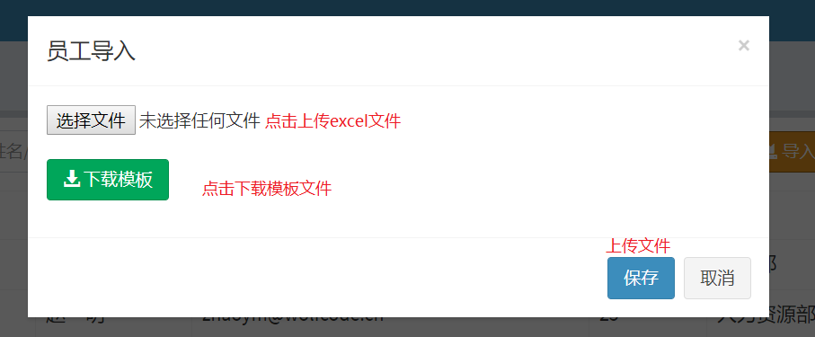
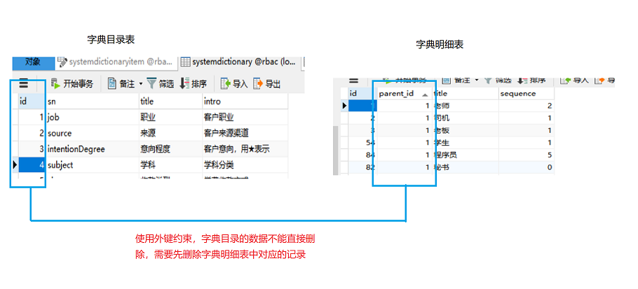

## excel 导入导出操作&数据字典操作

---

### 导入导出

##### 需求分析:
1. 导出文件:将系统数据导出到excel文件中
2. 导入文件:下载文档模板，用户填写完模板后上传xls文档

##### 面向对象的思想来封装excel文件中的内容
* 工作簿: workbook
* 表格:sheet
* 行 : row
* 单元格 : cell

##### POI 工具介绍
* 使用apache poi 工具进行开发,对excel文档进行解析
* 参考文档: http://poi.apache.org/components/spreadsheet/quick-guide.html

#### 导出操作
步骤:
1. 页面上添加导入导出按钮,导出直接发送请求，导入弹出模态框
2. 添加poi 依赖+文件上传的依赖
3. 员工控制器中定义一个exportXls方法
  * |-- 创建工作簿+行+单元格+单元格上填充数据
  * |-- 将工作簿输出到浏览器

不同版本的excel文件使用的api不同
* xls 文件:HSSFWorkbook(2003版本)
* xlsx文件:XSSFWorkbook(2007版本)

```java
// 返回值是void,不进行页面跳转
@RequestMapping("exportXls")
public void exportXls(HttpServletResponce resp){

  //通过响应头指定下载数据的名称
  //设置下载文件的名称
  resp.setHeader("Content-Disposition","attachment;filename=employee.xls");
  // 创建工作簿
  WorkBook book=null;
  //往工作簿中写数据
  book=service.exportXls();
  //将工作簿保存到磁盘中
  book.write(resp.getOutputStream())
}

// -----------service中-----------
public WorkBook exportXls(){
  //创建工作簿
  WorkBook book=new HSSFWorkbook();
  List<Employee> employee=mapper.selectAll();

  //创建表格
  Sheet sheet=book.createSheet("员工信息");
  //创建行
  Row headerRow=sheet.createRow(0);
  //创建单元格
   headerRow.createCell(0).setCelValue("账号");;
   headerRow.createCell(1).setCelValue("年龄");;
   headerRow.createCell(2).setCelValue("邮箱");;
  //在单元格设置数据
  for(int i=0;i<list.size();i++){
    Row headerRow=sheet.createRow(i+1);
    //创建单元格
     headerRow.createCell(0).setCelValue(employee.get(i).getName());
     headerRow.createCell(1).setCelValue(employee.get(i).getAge());
     headerRow.createCell(2).setCelValue(employee.get(i).getEmail());

  }
}

```

<br>
---


### 导入操作

导入对话框



实现步骤:
1. 导入模态框,点击导入按钮，弹出模态框
2. 在webapp 下新建一个template文件夹,存放模板文件,employee_template.xls
3. 下载模板的超链接直接访问文件的路径下载
3. 绑定表单提交事件
4. 文件上传准备工作 :
      * |-- post 请求
      * |-- enctype="multipart/form-data"
      * |-- file 上传控件
5. 定义importXls 方法,使用MultipartFile接收上传数据
      * |-- 参数的名称和上传控件的name应该一致
6. 在Spring MVC 配置文件中添加一个上传解析器,解析器的id必须为multipartResolver


细节:
如果查询列表没有使用左外连接，会导致获取的数据不完整

```java
public String importXls(MultipartFile file){
  service.importXls(file.getInputStream());
  return "redirect:/employee/list.do"
}

//------------service------------
public void importXls(InputStream in){
  //根据文件的输入流创建工作簿
  HSSFWorkbook book=new HSSFWorkbook(in);
  //获取表格
  HSSFSheet sheet=book.getSheet("员工信息");

  int rowNum=sheet.getLastRowNum();//获取最后一行的行号
  //获取行
  for(int i=0;i<rowNum;i++){
    HSSFRow row=sheet.getRow(i+1);
    //获取单元格
    //获取单元格中的数据
    String name=row.getCell(0).getStringCellValue("name");
    int age=Double.valueof(row.getCell(1).getNumericCellValue("age")).intValue();
    String email=row.getCell(2).getStringCellValue("email");

    //获取到的数据保存到数据库中
    Employee e=new Employee();
    e.setName(name);
    e.setAge(age);
    e.setEmail(email);
    e.setPassword(Md5加密);
    mapper.insert(e);
  }
}
```
在spring mvc .xml中配置文件上传解析器
```xml
<!--上传文件解析器-->
<bean id="multipartResolver" class="org.springframework.web.multipart.commons.CommonsMultipartResolver">
	<!--使用表达式设置文件上传最大大小限制-->
	<property name="maxUploadSize" value="#{1024*1024*10}"/>
</bean>
```

<br>
---

### 数据字典
作用:
1. 定义系统中使用的专业术语,存放常量，供其他表引用
  * 字典目录 : Systemdictionary 对字典明细进行分类
  * 字典的明细: SystemdictionaryItem 定义多个常量，通过字典目录进行分类



### 明细查询


* 查询
  * |-- 根据目录的id查询对应的明细表（where parent_id=?）
  * |-- 创建一个SystemDictionaryItemQueryObject封装parent_id(多条件查询)
  * |-- parentId!=null,才执行查询列表
  * |-- 翻页通过提交高级查询表单实现,如果需要查询当前目录下的明细，就必须在表单中添加parentId
  * |-- mybatis 分页插件中有添加了排序功能startPage()中加 '排序字段'
* 添加
  * |-- 在添加表单中添加目录的id,将数据保存到数据库中
* 删除
  * |-- 删除目录时，添加sql外键,先删除目录下的所有明细，才能再删除目录,直接捕获外键异常
* 编辑
  * |-- 在访问systemDictionaryItem/list?parentId=? 查询列表同时，查询目录名和目录的id 返回界面回显
  * |-- 根据parentId 查询目标对象，共享给页面


### 总结

```java
1. 导入和导出
    |-- 需求:
        |-- 导出:将数据库中的数据使用以excel格式文件下载的方式保存到本地
        |-- 导入:将excel文件上传到服务器，由后台服务器解析文件，持久化数据
    |-- 使用开发工具:apache poi 对excel文件进行解析操作
    |-- 导出
        |-- 创建工作簿对象
        |-- 创建表格
        |-- 创建行+单元格+设置单元格的值
        |-- 查询数据库列表数据，将数据封装到工作簿对象，最终以流的方式响应回浏览器
    |-- 导入
        |-- 项目中需要使用文件上传，将文件上传到后台
        |-- 文件上传准备
            |-- post 请求
            |-- enctype="multipart-form/data"
            |-- 文件上传控件
        |-- 后台接收上传文件参数
            |-- 使用MultipartFile接收上传数据
            |-- 配置文件上传解析器
            |-- 参数名和前端控件参数名一致
        |-- 使用poi 工具 解析上传文件信息,并将解析的数据封装到实体类中，持久化到数据库
2. 数据字典
    |-- 定义系统中使用的专业术语,存放常量，供其他表引用
    |-- 在操作数据字典时，需要维护明细和目录表
      |-- 目录表
          |-- 目录表记录删除时，需要先删除明细表中对应的数据，才能删除目录表的数据，避免脏数据的产生
      |-- 明细表
          |-- 编辑和添加时,都需要目录表 id 和name 进行数据回显
```


```java
    |-- freemarker语法
    |-- 异步请求和json格式数据响应
        $.get()  $.post() 方法  $.ajax(url,data,fun,"json")
    |-- @ResponseBody :
          |-- 自动将方法的返回值转换成json字符并响应
          |-- 自动设置响应头信息:response.setContentType("application/json;charset=utf-8")   
    |-- jquery对象.data("json"):在获取json时自动转成js对象
      什么时候使用ajax 异步请求?
        需要响应json数据的时候;可以同时发送多个请求，局部刷新(避免刷新页面时，刷新多个请求),但ajax 不能跨域访问（不能访问其他项目的资源）
      什么时候响应json 格式的数据?
        页面中需要获取后台响应回来的多个数据时
    |-- shiro
        |-- 认证
        |-- 授权
        |-- 加密
        |-- 缓存
    |-- 导入导出
        |-- 上传下载
        |-- Poi 解析文件中的数据
    |-- 数据字典
        |-- 在查询/添加/编辑/删除维护明细和目录的关系(parentId)
```
