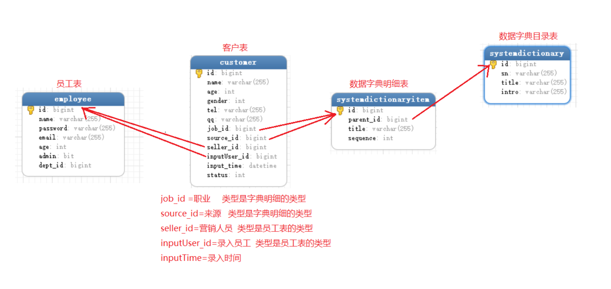
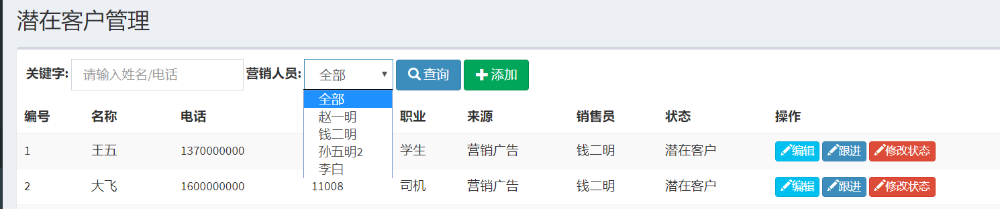
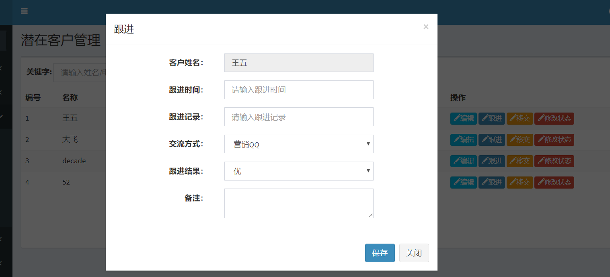

客户管理模块

---

需求分析:
* 用户状态: 潜在客户，正常客户，资源池客户，失败客户，丢失客户
* 通过修改状态修改用户状态,跟进和移交都会有历史记录
* 客户池：客户开发过程中出现问题，移进客户池


#### 潜在客户

 


客户表(主要字段):
job_id =职业     类型是字典明细的类型
source_id=来源   类型是字典明细的类型
seller_id=营销人员  类型是员工表的类型
inputUser_id=录入员工  类型是员工表的类型
inputTime=录入时间

```java
public class Customer {
    private String name;
    private Integer age;
    private Integer gender;
    private String qq;

    private SystemDictionaryItem job; //职业
    private SystemDictionaryItem source; //来源

    private Employee seller; //营销人员
    private Employee inputUser;  // 录入人员

    private Date inputTime;

    //-------客户的状态常量---------
    public static  final int STATUS_POTENTIAL=0; //潜在客户
    public static  final int STATUS_NORMAL=1;
    public static  final int STATUS_POOL=2;
    public static  final int STATUS_FAIL=3;
    public static  final int STATUS_LOSE=4;

    private Integer status=STATUS_POTENTIAL; //默认是潜在客户
}
```

客户关系关联多个表查询:
```sql
SELECT c.id, c.name, c.age, c.gender, c.tel, c.qq,
job.id job_id,
job.title job_title,
source.id source_id,
source.title source_title,
seller.id seller_id,
seller.`name` seller_name,
inputUser.id inputUser_id,
inputUser.`name` inputUser_name
FROM customer c

LEFT JOIN systemdictionaryitem job
 ON c.job_id=job.id

LEFT JOIN systemdictionaryitem source
ON c.source_id=source.id

LEFT JOIN employee seller  //营销人员
ON c.seller_id=seller.id

LEFT JOIN employee inputUser  //录入人员
ON c.inputUser_id=inputUser.id

```

mapper中的关系映射
```xml
<!--关联多表查询-->
<association property="job" javaType="SystemDictionaryItem" columnPrefix="job_">
  <id property="id" column="id"/>
  <result property="title" column="title"/>
</association>
<association property="source" javaType="SystemDictionaryItem" columnPrefix="source_">
  <id property="id" column="id"/>
  <result property="title" column="title"/>
</association>

<association property="seller" javaType="Employee" columnPrefix="seller_">
  <id property="id" column="id"/>
  <result property="name" column="name"/>
</association>
<association property="inputUser" javaType="Employee" columnPrefix="inputUser_">
  <id property="id" column="id"/>
  <result property="name" column="name"/>
</association>
```


#### 多条件查询封装

1. 潜在客户状态条件:
    通过指定status 属性的值，如果是潜在客户状态，只能查询潜在客户的列表
2. 每个营销人员能够看到哪些客户?
普通的营销人员，只能看自己的客户,拼接条件seller_id=?
超管或者是营销部门的经理，可以看到所有的客户
3. 关键字+营销人员
查询到所有营销人员:角色sn为Market_Manager 或者是Marker的员工,页面下拉框显示

##### 条件参数封装
```java
class CustomerQueryObject extends QueryObject{
   private Integer status=Customer.atatus_potential;
   private Long sellerId;//营销人员
   //关键字--> 查询名字和电话
   private String keyword;
}
```

##### controller类中查询多条件方法实现
```java
public String list(CustomerQueryObject qo){
  qo.setStatus(Customer.atatus_potential);
  //判断当前客户是否是超管或者是市场经理
  Employee currentEmp=SecurityUtils.getSubject().getPrincipal();
  boolean isManager=SecurityUtils.getSubject().hasRole("Market_Manager");
  if(!currentEmp.isAdmin()&&isManager){
      qo.setSellerId(currentEmp.getid());
  }

  //查询所有的营销人员---可变参数(页面回显下拉框数据)
  List<Employee> emps=employeeServices.listEmpByRoleSns("Market_Manager","Market");
  model.addAttribute("sellers",emps);
}
```

mapper 多表查询拼接多条件查询
```xml
<where>
<if test="status!=null">
  AND c.status=#{status}
</if>
<if test="sellerId!=-1">
  AND c.seller_id=#{sellerId}
</if>
<if test="keyword!=null">
  AND (c.name like concat('%',#{keyword},'%') or c.tel like concat('%',#{keyword},'%'))
</if>
</where>
```


employee.mapper中根据角色的编号，查询员工信息
```xml
<!-- 根据角色编号查询用户 -->
<select id="selectEmpListByRoleSNs" resultMap="BaseResultMap">
   SELECT * from employee e
   LEFT JOIN employee_role er
   ON e.id=er.employee_id
   LEFT JOIN role r
   ON r.id=er.role_id
   <where>
       <if test="array!=null">
           AND r.sn in
           <foreach collection="array" item="item" open="(" separator="," close=")">
               #{item}
           </foreach>
       </if>
   </where>
</select>
```

注意：
1. button 提交默认是submit 事件，将type=button 防止多次提交
2. 修改seller_id默认值是-1

多条件查询页面如下:



##### 添加操作
步骤：
1. 显示模态框
2. 查询所有的职业，来源，营销人员
  |-- 按照字典目录的编码 关联查询指定的字典数据
3. 返回页面进行回显
4. 保存设置其他参数的默认值
  |-- service SaveOrUpdate 方法上，设置InputUser和InputTime,代码中设置参数


根据字典目录的编码 关联查询指定的字典数据
```sql
//---------查询所有的职业------------
select * from systemdictionaryitem item
left on systemdictory dic on
item.parent_id=dic.id
where dic.sn='job'
```

controller
```java
list(){
  ....
  List<SystemDictionaryItem> jobs=systemdictoryItemService.listitemsByDictionarySn("job");
  List<SystemDictionaryItem> sources=systemdictoryItemService.listitemsByDictionarySn("source");
}
```
注意:
* 每个下拉框的name属性的值
    job.id  source.id seller.id
* 在service中手动封装客户的其他信息(录入人和录入时间)

##### 编辑操作
1. 使用data-* 和jquery对象.data()获取对应的数据，数据在实体类中进行json格式封装
2. 在sql中不需要更新录入人和录入时间时


##### 修改客户状态
1. 显示对话框和填充数据
2. 根据前端传入的客户customerId 和 status 修改

```sql
<!--修改用户状态-->
<update id="updateStatus">
  update customer
  set status=#{status}
  where id = #{customerId}
</update>
```

<br>
---

#### 跟进历史
#### 功能需求:
1. 查询:
    |-- 如果是超管或者是经理查询所有的历史,反之，查询自己的历史(根据用户字段关联的用户信息)
    |-- 根据历史的添加时间进行排序,降序
    |-- 高级查询：关键字查询（客户的姓名和电话）
2. 添加:
    |-- 在客户列表中点击跟进时，添加历史记录数据
    |-- 查询到页面中需要的交流方式，字典目录sn为 communicationMethod ,查询相关字典明细
    |-- 提交到后台，需要springmvc 将日期封装到对应属性中,需要特殊处理
3. 编辑:
    |-- 在跟进历史页面中实现数据的编辑
    |-- fastjson转换日期的时候是毫秒值，需要手动转成字符串，再转成json

#### 表格分析：

| 表字段  | 字段描述  |  映射java对象属性 |
| :------------- | :------------- |:-------------|
| trace_time    | 跟进时间    | Date |
| trace_details    | 跟进记录    |  |
| trace_type_id    | 跟进方式    | SystemDictionaryItem  |
| trace_result    | 跟进结果    | 用数字表示 |
| remark    | 备注    | String |
| customer_id    | 客户id    | Customer |
| input_user_id    | 录入人    | Employee |
| inputTime    | 录入时间    | Date |

#### 查询
1. 查询：使用多表查询关联相关查询字段
  前端页面显示日期: freemark 日期格式显示 time?string("yyyy-MM-dd")

```sql
select
trace.id,
trace.trace_time,
trace.trace_details,
trace.trace_result,
trace.remark,
trace.input_time,

dic.id dic_id,
dic.title dic_title,
c.id c_id,
c.`name` c_name,
emp.id emp_id,
emp.`name` emp_name

from customertracehistory trace
LEFT JOIN systemdictionaryitem dic  
ON dic.id=trace.trace_type_id  // 跟进方式
LEFT JOIN customer c
ON c.id=trace.customer_id   //跟进客户信息
LEFT JOIN employee emp
ON emp.id=trace.input_user_id   //录入人员

ORDER BY trace.input_time desc  //根据录入时间进行排序
```

2. 查询自己的历史

```xml
<where>
  <if test="sellerId!=null">
    AND c.seller_id=#{sellerId}   //根据客户的营销人员来判断
  </if>
  <if test="keyword!=null">
    AND (c.name like concat('%',#{keyword},'%') or c.tel like concat('%',#{keyword},'%'))
  </if>
</where>
```
3. 显示跟进结果

第一种方式
```
<#if e.trace_result==1>
  差
  <#elseif e.trace_result==2>
  中
  <#else>
  优
</#if>
```
第二种方式
```java
public String getTraceResultName(){
    if(traceResult==1){
        traceResultName="差";
    }else if(traceResult==2){
        traceResultName="中";
    }else{
        traceResultName="优";
    }
    return traceResultName;
}
```

#### -------------添加跟进历史-----------
1. 显示添加的模态框,回显客户的名字和信息
2. 交流方式（查询所有的交流方式）
  ```java   
  List<SystemDictionaryItem> traceTypes=systemDictionaryItemService.listItemsByDictionarySn("communicationMethod");
  model.addAttribute("traceTypes",traceTypes);
  ```
3. 表单的action指向 /customerTraceHistory/saveOrUpdate.do
4. 添加日期格式的注解
```java
@DateTimeFormat(pattern = "yyyy-MM-dd")
private Date traceTime;  // 跟进时间
```
5. 在service 保存inputTime 和 inputUser


#### -----------------编辑跟进历史---------------
步骤:
1. 显示编辑的模态框，回显历史记录的数据
2. 时间在界面的显示会出现毫秒值,FastJson 处理日期的时候会将其转成毫秒值
需要手动将日期转成一个字符串


跟进历史添加界面:


总结:
```
下拉框的数据回显直接给select 元素的value属性设值
  不会修改录入人和录入时间，sql 语句中不添加该字段
```
