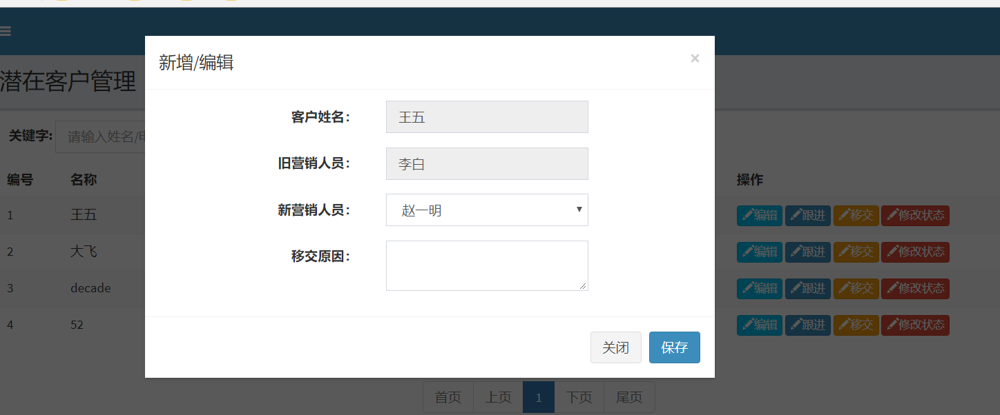
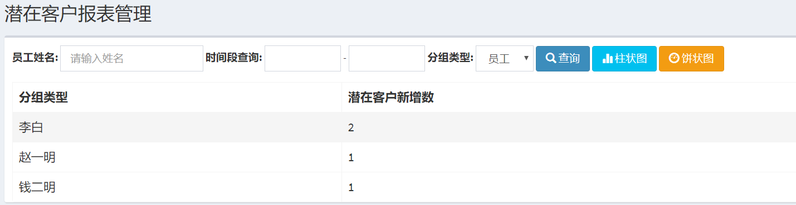
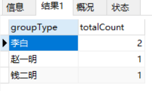
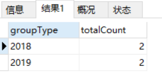
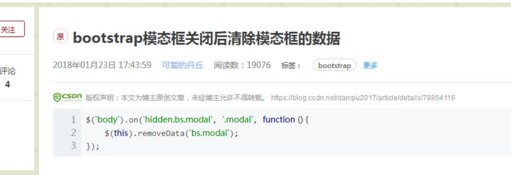
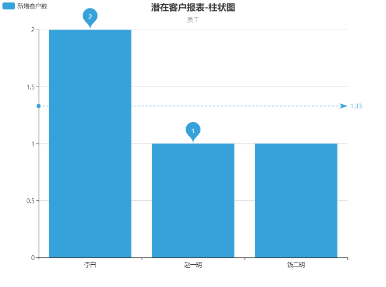
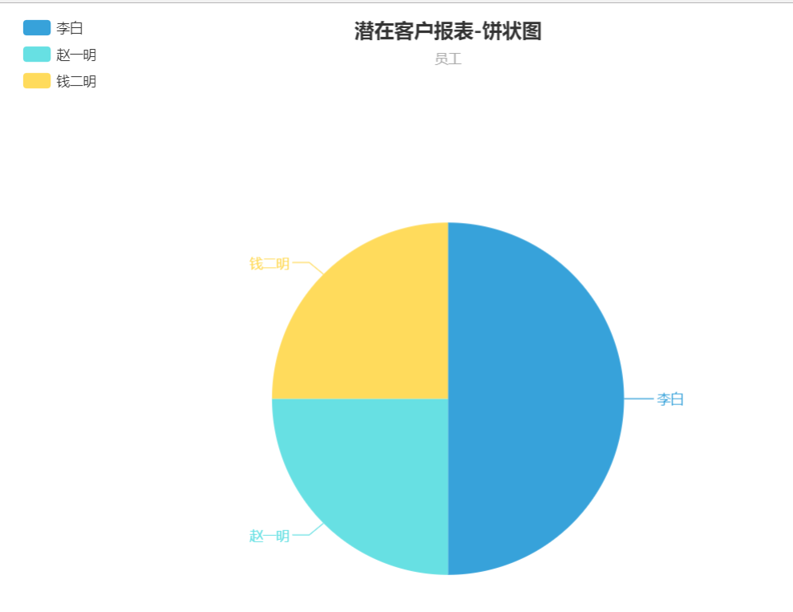

## 移交历史&客户池&报表统计

---


###  移交历史模块

#### 前端页面显示

移交历史界面:


潜在客户移交模态框界面:


#### 表结构分析:

| 字段 |字段描述  | java 关系映射 |
| :------------- | :------------- | :----|
| customer_id       | 客户id  | Customer|
| operator_id       | 操作移交的人员  | Employee |
| operator_time       | 移交时间  | Date |
| oldseller_id       | 旧营销人员  | Employee |
| newseller_id       | 新营销人员  | Employee |
| reason       | 移交的原因  | String |


#### 需求功能和具体实现

1. 书写查询操作,按操作时间进行排序
2. 多条件查询
    * |-- keyword关键字查询客户的姓名和电话
    * |-- 如果不是超管或经理，只能查询自己
       * |-- 根据客户的seller_id查询
3. 潜在客户的移交
    * |-- 添加移交历史记录
      * |-- 需要再代码中默认提交 operator_time,operator_id字段
    * |-- 更新当前客户的营销人员id为新的营销人员             
       * updateSellerById(newseller_id,customer_id)

<br>
---

### 客户池
* 客户开发过程中出现问题，移进客户池，将客户交给其他营销人员处理

### 查询
#### 功能需求与实现：
1. 查询客户池列表
    |-- 根据status 参数查询列表 (STATUS_POOL状态)
2. 查询营销人员列表数据返回页面显示
3. 移交操作
    |-- 保存移交的历史记录
    |-- 修改客户的状态为潜在客户
    |-- 修改客户的营销人员为新的管理人员
    |-- 如果是超管或经理才能进行移交操作
4. 吸纳操作
    |-- 保存移交的历史记录
    |-- 修改客户的状态为潜在客户
    |-- 修改客户的营销人员为当前的管理人员
    需要提交的参数:  customer_id , oldseller_id , newSeller_id(当前管理人员的id) , reason

#### 知识点:
1. 吸纳操作时，需要在freemark中获取当前管理人员的id，使用shiro表达式

```
<@shiro.principal property="id"/>
```
2.如果是超管或经理才能进行移交操作，使用shiro表达式

```
<@shiro.hasRole name="Market_Manager">
   <a>移交</a>
</@shiro.hasRole>
```

<br>
---

### 日期插件(My97DatePick插件)

* 官方网址连接: http://www.my97.net/


日期插件的使用
```js
$("input[name=traceTime]").click(function(){
  WdatePicker({
    readOnly:true,   // 设置只读模式
    maxDate:new Date(),  //最大时间不能选择
    skin:whygreen   //设置皮肤
  })
})
```

<br>
---

### 潜在客户报表统计
报表: 用表格和图标等格式来动态地显示数据
分组报表类型：员工，年，月，日

#### 前端页面显示:


#### 相关sql查询


* 查询每个营销人员的潜在客户数 (按照营销人员进行分组)

```sql
select seller.`name` groupType,count(c.id) totalCount
from customer c
LEFT JOIN employee seller ON seller.id=c.seller_id
WHERE c.`status`=0
GROUP BY seller.`name`
```
查询结果:



* 按年进行分组

```sql
select DATE_FORMAT(now(),'%Y-%m-%d') // 年月日

------------年进行查询----------
select DATE_FORMAT(c.input_time,'%Y'),seller.name,count(c.id)
from customer
left join employee seller on c.seller_id=seller.id
where c.status=0
group by DATE_FORMAT(c.input_time,'%Y')
```

* 查询结果:



<br>
#### 数据的封装:
  * javabean: 一个对象对应一行数据，一个对象的属性对应一列值
  * map 集合: 一个集合对象对应一行记录，一个键值对应一列值

#### 实现步骤
1. 实现分组列表查询
    * |-- 创建相关 mapper 接口和mapper映射文件
    * |-- 查询封装结果使用List<Map>类型进行封装
        * |-- map : {"groupType":分组类型字段,"totalCount":潜在客户新增数}

<br>
#### 创建mapper 接口
```java
public interface CustomerResportMapper{
  List<Map<String,Object>> selectCustomerReport(QueryObject qo);
}
```

CustomerResportMapper.xml
```xml
<select id="selectCustomerReport" resultType="map">
   select
   ${groupType} groupType,  //分组类型字段  
   count(c.id) totalCount

   from customer c
   LEFT JOIN employee seller ON seller.id=c.seller_id
   WHERE c.`status`=0    //潜在客户

   --------------过滤条件拼接------------
   <if test="keyword!=null">
      AND  seller.name like concat('%',#{keyword},'%')
   </if>
   <if test="beginTime!=null">
      AND c.input_time &gt;=#{beginTime}
   </if>
   <if test="endTime!=null">
       AND c.input_time &lt;=#{endTime}
   </if>
   GROUP BY ${groupType}
   </select>
```


2. 过滤条件查询
      * |-- keyword 关键字
      * |-- input_time 时间段范围查询
          * |-- beginTime
          * |-- endTime :需要重新设置为一天的最后一秒

##### ---------多条件拼接--------------
```sql
<if test="keyword!=null">
  AND seller_name like concrt()
</if>

<if test="beginTime!=null">
  AND c.input_time &gt; =${beginTime}
</if>
<if test="endTime!=null">
  AND c.input_time &lt; =${endTime}
</if>
```


细节:
1. 前端页面显示时间时，使用freemark 时间格式回显示
value="${(qo.beginTime?string('yyyy-MM-dd'))!""}"

2. 时间范围细节问题
如果查询2018-09-04(beginTime) --> 2018-09-04 (endTime)范围内需求求同一天
  * 需要使用DateUtil需要重新设置2018-09-04 (endTime) 为一天的最后一秒
  * 重写getTime的方法

```java
---------------DateUtil-----------
/**
  * 获取指定日期的最后一秒时刻
  */
 public static Date getEndDate(Date date) {
     if (date == null) {
         return null;
     }
     Calendar c = Calendar.getInstance();
     c.setTime(date);
     c.set(Calendar.HOUR,23);
     c.set(Calendar.MINUTE,59);
     c.set(Calendar.SECOND,59);
     return c.getTime();
 }

------CustomerReportQueryObject-----
// 需要设置最后的时间是一天中的最后一秒
  public Date getEndTime() {
      return DateUtil.getEndDate(endTime);
  }
```


<br>
3. 分组条件查询
  * |-- 定义分组条件 groupType 参数,在 sql 语句中使用 ${groupType} 拼接分组条件
      * |-- 员工--分组字段---- seller.name
      * |-- 年份--分组字段---- DATE_FORMAT(c.input_time,'%Y')
      * |-- 月--分组字段---- DATE_FORMAT(c.input_time,'%Y-%m')
      * |-- 日--分组字段---- DATE_FORMAT(c.input_time,'%Y-%m-%d')
  * |-- 页面分组数据参数的定义,和分组下拉框的回显

页面分组数据参数的定义,和分组下拉框的回显
```html
<select  id="groupType" name="groupType">
      // 每一个option的值为一个要分组的字段值
     <option value="seller.name">员工</option>
     <option value="DATE_FORMAT(c.input_time,'%Y')">年</option>
     <option value="DATE_FORMAT(c.input_time,'%Y-%m')">月</option>
     <option value="DATE_FORMAT(c.input_time,'%Y-%m-%d')">日</option>
 </select>
 <#--数据回显-->
 <script>
      // 表达式中可能有单引号
     $("#groupType").val("${qo.groupType}")
 </script>
```

参数接收类定义:
```java
@Setter@Getter
public class CustomerReportQueryObject extends QueryObject {

    @DateTimeFormat(pattern = "yyyy-MM-dd")
    private Date beginTime;

    @DateTimeFormat(pattern = "yyyy-MM-dd")
    private Date endTime;

    private String keyword;

    //分组条件
    private String groupType="seller.name";//设置默认值 使用

    public String getKeyword() {
        return StringUtils.isNullOrEmpty(keyword)?null:keyword;
    }
    // 需要设置最后的时间是一天中的最后一秒
    public Date getEndTime() {
        return DateUtil.getEndDate(endTime);
    }

}
```


<br>
---

#### echarts 的简单使用
官方网站: https://echarts.baidu.com/

使用准备:
1. 引入echarts的js文件
2. 创建一个显示图表的页面资源
3. 根据教程和案例选择对应的js Demo代码


#### --------柱状图(reportBybar.ftl)-----------
实现步骤:
1. 在controller定义一个reportByBar()方法--> 跳转到reportBybar.ftl

2. 修改标题(title):  left:"center" 距离容器左侧的距离

3. 修改副标题 (subTitle): 根据查询条件groupType的值判断是哪个子标题，传递到前端显示

4. 修改横坐标下的显示数据
  * |-- 数据是map集合中的groupType 字段，封装成json array 返回前端
  * |-- 如 ["李白", "赵一明", "钱二明"]

5. 修改总坐标的显示数据
  * |--数据是map集合中的totalCount字段，(客户的个数)封装成json array 返回前端
  * |-- 如 ["2", "1", "1"]

代码示例:
```java
--------------CustomerReportQueryObject--------
/**
 *  根据分组条件返回分组标题
 * @return
 */
public String getGroupTypeName(){
    String groupTypeName="";
    if("DATE_FORMAT(c.input_time,'%Y')".equals(groupType)){
        groupTypeName="年";
    }else if("DATE_FORMAT(c.input_time,'%Y-%m')".equals(groupType)){
        groupTypeName="月";
    }else if("DATE_FORMAT(c.input_time,'%Y-%m-%d')".equals(groupType)){
        groupTypeName="日";
    }else{
        groupTypeName="员工";
    }
    return groupTypeName;
}


--------------CustomerReportController-----------
@RequestMapping("/reportBar")
public String reportBar(@ModelAttribute("qo") CustomerReportQueryObject qo,Model model){
    List<Map<String, Object>> list = service.queryList(qo);
    //获取横坐标数据 -- groupType 的集合
    List<String> groupTypeList=new ArrayList<>();
    List<Object> totalCountList=new ArrayList<>();
    for(Map<String, Object> map:list){
        groupTypeList.add(map.get("groupType").toString());
        totalCountList.add(map.get("totalCount").toString());
    }
    model.addAttribute("groupTypeList", JSON.toJSONString(groupTypeList));
    model.addAttribute("totalCountList", JSON.toJSONString(totalCountList));

    return "customerReport/reportbar";
}
```

柱状图核心代码:
```js
// 基于准备好的dom，初始化echarts实例
var myChart = echarts.init(document.getElementById('main'),'light');

// 指定图表的配置项和数据
option = {
    title: {
        text: '潜在客户报表-柱状图',
        subtext: '${qo.groupTypeName}',  // 获取子标题
        left: 'center'
    },
    xAxis: [
        {
            type: 'category',
            data: ${groupTypeList}   // 获取分组数据
        }
    ],
    series: [
        {
            name: '新增客户数',
            type: 'bar',
            data: ${totalCountList},   //获取潜在客户数量
            ...
        }
    ]
};
```

#### --------------饼状图----------------
1. 具体步骤和柱状图相似,数据需要重新封装map集合数据返回页面进行显示
  需要数据格式如下 分组字段 name 和 总数 value
  [{"name":"李白","value":2},
  {"name":"赵一明","value":1},
  {"name":"钱二明","value":1}]


```java
@RequestMapping("/reportPie")
public String reportPie(@ModelAttribute("qo") CustomerReportQueryObject qo,Model model){
    List<Map<String, Object>> list = service.queryList(qo);

    //需要创建一个新的map集合 用于封装 分组字段 name 和 总数 value
    List<Map<String,Object>> valueList=new ArrayList<>();
    //获取分组的 groupType字段的列表数据
    List<Object> groupTypeList=new ArrayList<>();

    for(Map<String, Object> map:list){
        groupTypeList.add(map.get("groupType"));

        Map<String,Object> value=new HashMap<>();
        value.put("name",map.get("groupType"));
        value.put("value",map.get("totalCount"));
        valueList.add(value);
    }
    model.addAttribute("groupTypeList", JSON.toJSONString(groupTypeList));
    model.addAttribute("valueList", JSON.toJSONString(valueList));

    return "customerReport/reportpie";
}
```

前端页面核心代码:
```js
// 指定图表的配置项和数据
   option = {
       title : {
           text: '潜在客户报表-饼状图',
           subtext: '${qo.groupTypeName}',
           x:'center'
       },
       ...
       legend: {
           orient: 'vertical',
           left: 'left',
           data: ${groupTypeList}
       },
       series : [
           {
               name: '新增客户数',
               type: 'pie',
               data:${valueList}, // value 和 name 格式数据
               ...
           }
       ]
   };
```

#### -----------合并图形报表----------
1. 使用访问的资源路径，将要资源输出到模态框中
    |-- 使用模态框 remote 属性:从指定 URL 地址加载要展示的内容(模态框只加载一次,因此需要清除缓存)
    |-- 路径需要携带条件查询请求参数
    |-- 使用jquery serializas 将表单内容数据序列化成字符串，用于ajax请求
2. 模态框关闭后需要清除模态框中的数据

核心代码示例:
```js
//点击显示模态框，使用访问的资源路径，将要资源输出到模态框中
 $(".chart_btn").click(function () {
     //清除模态框的缓存
     $("#chartModal").removeData("bs.modal");

     //获取请求表单中的参数，使用jquery 序列化函数
     var params=$("#searchForm").serialize();

     //获取访问资源
     var path=$(this).data("url");

     $("#chartModal").modal({
         remote:path+"?"+params      //拼接表单请求参数
     })
 })
```



<br>
----
柱状图界面显示:



