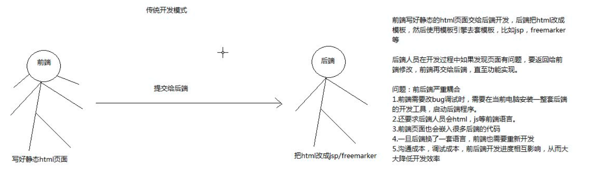
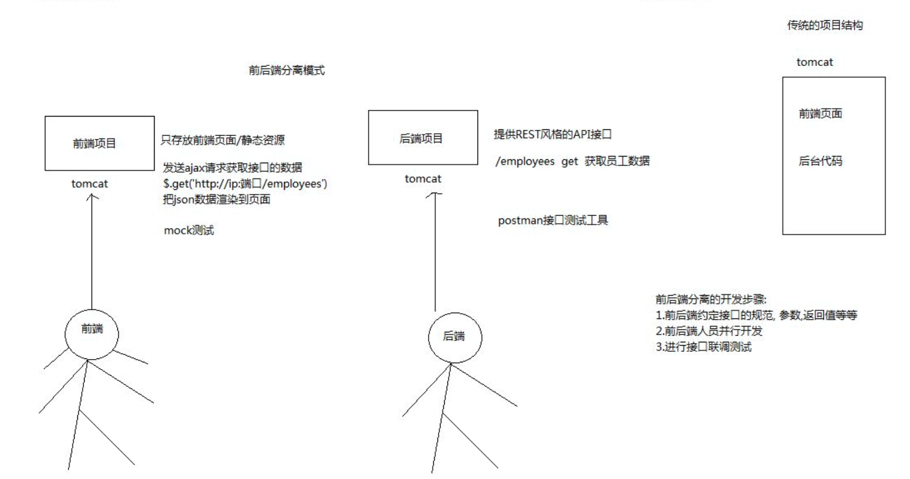

### RESTful 接口设计

---

参考网站:

对于Rest和Restful api的理解:
https://www.cnblogs.com/shamo89/p/8097882.html
极光接口设计参考:
http://docs.jiguang.cn/jmessage/server/rest_api_im/

<br>
---

#### REST 和 Restful区别
* REST(【Resource】Representational State Transfer):表现层状态转化

通俗的说: URL定位资源，用HTTP动词（GET,POST,DELETE,DETC）描述操作

* REST指的是一组架构约束条件和原则。满足这些约束条件和原则的应用程序或设计就是 RESTful


综合上面的解释，我们总结一下什么是RESTful架构：
（1）每一个URI代表一种资源；
（2）客户端和服务器之间，传递这种资源的某种表现层；
（3）客户端通过HTTP提供的统一接口，对服务器端资源进行操作，实现"表现层（使用HTTP动词去促使服务器端资源的）状态转化"。


### Restful 概述
* Resource(资源): 网络上的资源，每一个资源都有一个URI

* Representation(表现层): 资源呈现的形式,如文本可以是 html,xml,json等格式,具体表现形式在Accept和Content-Type请求头信息设置

* State Transfer(状态转换):Http是一个无状态协议，因此，所有的状态都保存在服务器端,因此，如果客户端想要操作服务器，必须通过某种手段，让服务器端发生"状态转化"（State Transfer）

* Uniform Interface(统一接口):使用统一的接口对资源执行各种操作,对于每个资源只能执行一组有限的操作。
  以前
  http://www.wolfcode.cn/employee/saveOrUpdate.do?id=1&name=xx
  现在
  http://www.wolfcode.cn/employees


<br>
---


### Restful 接口设计

#### 资源设计（路径设计）
在RESTful架构中，每个网址代表一种资源（resource），所以网址中不能有动词，只能有名词，而且所用的名词往往与数据库的表名对应。
一般来说，数据库中的表都是同种记录的"集合"（collection），所以URI中的名词也应该使用复数。

例如，针对一个动物园应用，可能涉及到的资源就应该有：
https://api.example.com/v1/zoos：动物园资源
https://api.example.com/v1/animals：动物资源
https://api.example.com/v1/employees：饲养员资源


<br>
---

### 动作设计

#### http动作
先来看看REST中针对HTTP常用动作的一些固定的含义：

GET（SELECT）：表示从服务器取出资源（一项或多项）。
POST（CREATE）：表示在服务器新建一个资源。
PUT（UPDATE）：表示在服务器更新资源（客户端需要提供改变后的完整资源）。更新整个对象
PATCH（UPDATE）：表示在服务器更新资源（客户端需要提供改变的属性【可以简单理解为补丁】）。更新个别属性
DELETE（DELETE）：表示从服务器删除资源。

以上五个是最常用的请求方式；另外还有两个：

HEAD：获得一个资源的元数据，比如一个资源的hash值或者最后修改日期；获取单个属性
OPTIONS：获得客户针对一个资源能够实施的操作；这个主要是作为Hypermedia 存在（在最佳实践中介绍）, 获取一个资源的api 能够执行的操作

#### 动作示例

下面列几个简单的动作示例，示例格式 HTTP动作 URL：说明

GET /zoos：列出所有动物园
POST /zoos：新建一个动物园
GET /zoos/ID：获取某个指定动物园的信息（ID即指定动物园id）
PUT /zoos/ID：更新某个指定动物园的信息（浏览器端需要提供该动物园的全部信息）
PATCH /zoos/ID：更新某个指定动物园的信息（浏览器端需要提供该动物园的部分信息）
DELETE /zoos/ID：删除某个动物园
GET /zoos/ID/animals：列出某个指定动物园的所有动物（animals为二级资源路径）
DELETE /zoos/ID/animals/ID：删除某个指定动物园的指定动物animals为二级资源路径，前面一个id是指定动物园id，后面一个id是指定动物id）


<br>
---


#### Accept和ContentType 区别
1.Accept属于请求头， Content-Type属于实体头。
Http报头分为通用报头，请求报头，响应报头和实体报头。
请求方的http报头结构：通用报头|请求报头|实体报头
响应方的http报头结构：通用报头|响应报头|实体报头

Accept代表发送端（客户端）希望接受的数据类型。  
比如：Accept：application/json;
代表客户端希望接受的数据类型是json类型,后台返回json数据

Content-Type代表发送端（客户端|服务器）发送的实体数据的数据类型。
比如：Content-Type：application/json;
代表发送端发送的数据格式是json, 后台就要以这种格式来接收前端发过来的数据。

二者合起来，
Accept:application/json；
Content-Type:application/json;
即代表希望接受的数据类型是json格式，本次请求发送的数据的数据格式也是json格式。

<br>
---


### Restful 服务开发
* java 常见的restful 开发框架 : jersey ,play ,Spring MVC

#### 使用SpringMVC 开发Restful 服务

接口设计:
1. 资源地址(看数据库表名)
2. 请求动作
3. 请求参数
4. 返回结果

需求:
1. 获取所有的员工(集合)
/employees   get   返回员工集合
2. 获取某个员工的信息
/employee/{id} get 员工对象
3. 删除一个员工
/employee/{id} delete void
4. 获取某个员工某个月的薪资记录
/employees/{id}/salaries/{date}  get
无参  
返回:薪资对象
5. 给某个员工添加一条薪资记录
/salaries  post
参数:id salary  
返回:新生成的薪资对象

使用注解:
```java
@RestController : Controller + ResponseBody结合
@GetMapping :  @RequestMapping(RequestMethod.GET) 指定get请求
@PathVariable :将路径上的值注入到方法的形参上，路径占位符上名称相同的参数
@DateTimeFormat : 前端传日期参数到后台参数接收时使用
@JsonFormat : 后台返回json 给前端，日期会编程毫秒值,使用注解格式化，需要添加时区
```

1. 获取所有的员工(集合)
/employees   get   返回员工集合

```java
// @RequestMapping(value="employee",method={RequestMethod.GET})
@GetMapping("employee")
@ResponseBody
public List<Employee> list(){
  List<Employee> emps=new ArrayList()；
  emps.add(..);
  return emps;
}
```


2. 获取某个员工的信息

```java
// PathVariable 将路径上的值注入到方法的形参上，路径占位符上名称相同的参数
@GetMapping("{id}")
public Employee get(@PathVariable Long id){
  return new Employee(id,"decade");
}
// 如果使用对象接收，会直接封装到对象中的属性,不需要添加注解
@GetMapping("{id}")
public Employee get(Employee e){
  return e;
}
```

3. 删除一个员工

```java
@DeleteMapping("{id}")
public void delete(@PathVariable Long id,HttpServletResponse resp){
  System.out.print("删除"+id);
  resp.setStatus(204); //响应状态码
}
```

4. 获取某个员工某个月的薪资记录

```java
// DateTimeFormat : 前端传日期参数到后台参数接收时使用
@GetMapping("{id}/salaries/{date}")
public Salary get(@PathVariable Long id,@PathVariable @DateTimeFormat(pattern="yyyy-MM") Date date){
  return new Salary(2L,id,new BigDecimal(10),date);
}
// JsonFormat : 后台返回json 给前端，日期会编程毫秒值,使用注解格式化，需要添加时区
class Salary{
  @JsonFormat(pattern="yyyy-MM",timezone="GMT+8")
  private Date date;
}
```

5. 给某个员工添加一条薪资记录

```java
@GetMapping("{employeeId}/salaries/{money}")
public Salary get(Salary salary){
  salary.setId(10L);
  return salary;
}
//------------如果对象中有对象时--------
@GetMapping("{e.id}/salaries/{money}")
public Salary get(Salary salary){
  salary.setId(10L);
  return salary;
}
```


<br>
---


#### RequestMapping的属性

* RequestMapping 注解:
  * |-- params="name=admin" 要求请求时需要携带指定的参数名和参数值
  * |-- header 要求请求时必须携带指定的头信息
  * |-- consumes:  和 headers 配置contentType的作用一样
  * |-- produces 和 headers 配置Ascept的作用一样

```java
@RequestMapping(params="name=admin")
public String testParam(){
  return "decade";
}

@RequestMapping(values="headers",headers="content-type=text/xml")
public String testParam(){
  return "header";
}

//-----headers：如果方法的映射都一致，时，启动会报错
@RequestMapping(values="headers",headers="content-type=application/json")
public String testParam(){
  return "header";
}

// 消费前台传递的数据
//--------consumes 和 headers 配置contentType的作用一样
@RequestMapping(values="consumes",consumes="text/xml")
public String testParam(){
  return "consumes";
}

//-----------该方法生产的数据的格式----------
// produces 和 headers 配置Ascept的作用一样
// 前台需要传递 Ascept=application/json
// Ascept表示前台希望接收的数据格式
@RequestMapping(values="produces",produces="application/json")
public String testParam(){
  return "produces";
}


```


<br>
---

#### RequestBody 注解
* RequestBody : 一般在content-type=application/json 或 text/xml 等类型会用到
    * |-- 默认接收json格式的请求数据
    * |-- 接收xml 的数据时,需要设置 jaxb 支持解析xml

注意: 使用文件上传形式，需要配置文件上传解析器才能获取数据

```java
//-------前端使用json文本传递参数-------
@RequestMapping(values="requestBody")
@ResponseBody
public String testParam(@RequestBody Employee employee){
  return employee;
}

//----------前端使用xml 传递参数,返回数据格式也是xml----
@XmlRootElement(name="xml")  指定根元素
class Employee{

  @XmlElemeny(name="name1") 取别名
  private String name;

}
```


<br>
---

#### ajax 发送请求

需求: 更新员工数据

接口设计:

| 资源地址        | 请求动作 | 请求参数  |返回结果|
| :------------- | :-------:|:-------- |:------|
| /employees/{id} | put     |  员工参数 | 返回员工对象,201状态码|


```java
@PutMapping("{id}")
public Employee update(Employee e){
  return e;
}
```

* PutMapping : 默认put/patch请求接收不了参数,需要在web.xml中添加一个httpPutFormContentFilter
* httpPutFormContentFilter过滤器: 如果时put和patch会对请求对象进行参数分装

```xml
<!-- 为put/patch 请求方式设置参数  -->
<filter>
	<filter-name>httpPutFormContentFilter</filter-name>
	<filter-class>org.springframework.web.filter.HttpPutFormContentFilter</filter-class>
</filter>
<filter-mapping>
	<filter-name>httpPutFormContentFilter</filter-name>
	<servlet-name>springMVC</servlet-name>
</filter-mapping>
```
需求: 删除指定id 的employee
```js
$function(){
  $("#delBtn").click(function(){
    $.ajax({
      method="delete",
      url="/employees/1"
    })
  })
}
```
需求: 修改员工的数据
```js
$function(){
  $("#putBtn").click(function(){
    $.ajax({
      method:"put",
      url:"/employees/1",
      data:{
        name:"decade"
      }
    })
  })
}
```

<br>
---

#### 使用form 表单提交请求
form 表单只有get和post请求
可以使用过滤器对请求方法进行修改：
1，在请求中使用_method=PUT来提交请求方法；
2，使用SpringMVC提供的org.springframework.web.filter.HiddenHttpMethodFilter转化

* 在表单中添加一个hidden域，默认名称为_method，value设置为我们想要的请求方式：

```html
<form action="/emps/4" method="POST">
    <input type="hidden" name="_method" value="put" />
    <input type="submit" value="提交" />
</form>
</body>
```

* 处理form 不能直接提交 put,patch,delte 请求的过滤器

```xml
<filter>
    <filter-name>HiddenHttpMethodFilter</filter-name>
    <filter-class>org.springframework.web.filter.HiddenHttpMethodFilter</filter-class>
</filter>

<filter-mapping>
    <filter-name>HiddenHttpMethodFilter</filter-name>
    <servlet-name>springMVC</servlet-name>
</filter-mapping>
```

源码分析
```java
public class HiddenHttpMethodFilter extends OncePerRequestFilter {

/** Default method parameter: {@code _method} */
public static final String DEFAULT_METHOD_PARAM = "_method";

private String methodParam = DEFAULT_METHOD_PARAM;
@Override
protected void doFilterInternal(HttpServletRequest request, HttpServletResponse response, FilterChain filterChain)
        throws ServletException, IOException {

    String paramValue = request.getParameter(this.methodParam);
    // 如果是post 请求
    if ("POST".equals(request.getMethod()) && StringUtils.hasLength(paramValue)) {
        String method = paramValue.toUpperCase(Locale.ENGLISH);
        //使用请求包装类
        HttpServletRequest wrapper = new HttpMethodRequestWrapper(request, method);
        filterChain.doFilter(wrapper, response);
    }
    else {
        filterChain.doFilter(request, response);
    }
}
   //...其余代码
}
```

<br>
---

### 前后端分离

#### 传统开发模式


#### 前后端分离模式



* 前后端分离并不只是开发模式，也是web应用的一种架构模式。
* 在开发阶段，前后端人员约定好数据交互接口，即可并行开发与测试。

* 前端开发完成可以独自进行mock测试，后端也可以使用postman等接口测试工具进行测试。
* 最后可进行功能联调测试。

优点：
1.前后端责任清晰，后端专注于数据上，前端专注于视觉上。
2.无需等待对方的开发工作结束，提高开发效率。
3.可应对复杂多变的前端需求。
4.增强代码可维护性

<br>
---
### 前后台分离的问题

##### 1. 请求跨域问题
浏览器发送ajax请求时都有同源策略限制，符合“协议+域名+端口”三者都相同，就是同源，若不同源，就是跨域。

http://localhost:8088 和  http://localhost:8080 相互访问属于跨域

常见解决跨域的方式：
1.cors
2.nginx
3.jsonp

##### 2. 图片共享问题
解决方案:
阿里云: 对象存储 oss
cdn

总结:
```java
1. restful 概念
    |-- rest(资源表现层状态转移)
      |--rest 实现 URL定位资源，用HTTP动词（GET,POST,DELETE,DETC）描述操作
    |-- 资源: 网络资源
    |-- 表现层: 资源的呈现形式,通过content-type 和aspect来实现
    |-- 状态: http 是无状态协议，通过使用http 动词改变服务器资源的状态
    |-- 统一接口:使用统一的接口对资源进行操作

2. restful 接口设计
    * |-- 资源设计(路径设计): 网址使用名词不使用动词，名词使用复数
    * |-- 动作设计 : http动作
      * |-- get : 获取资源
      * |-- post: 创建资源
      * |-- delete: 删除资源
      * |-- put: 更新资源 (修改整个对象)
      * |-- patch: 更新资源(修改某个字段)
    * |-- 返回结果:
        * |-- 返回类型
        * |-- 响应状态码
        * |-- Content-Type
3. Restful 服务开发
  常见的resultfuel开发框架
      |--  jersey ,play ,Spring MVC
  使用SpringMVC 开发Restful 服务
      |-- 接口设计
        |-- 资源地址
        |-- 请求动作
        |-- 请求参数
        |-- 返回结果
4. springmvc 的注解
  |--- @RestController  相当于@Controller + @ResponseBody
  |--- @GetMapping ("{id}") : 相当于 RequestMapping("get") , 传入参数占位符,和方法参数保持一致
  |--- @PathVariable : 将资源路径携带的参数值，封装到修饰的形参上，占位符名称相同的参数
  |--- @DateTimeFormat: 接收请求参数时，指定日期格式
  |--- @JsonFormat : 返回日期数据时，指定返回的日期格式


Accept和ContentType 区别
Accept: 在请求中发送，告诉服务器,浏览器期望接收的数据格式
ContentType:
    |-- 在请求中发送，告诉服务器，浏览器发送请求的数据格式
    |-- 在响应中发送，告诉浏览器，服务器响应的数据格式类型


RequestMapping 注解:
  * |-- params="name=admin" 要求请求时需要携带指定的参数名和参数值
  * |-- header 要求请求时必须携带指定的头信息
  * |-- consumes:  和 headers 配置contentType的作用一样
  * |-- produces 和 headers 配置Ascept的作用一样


RequestBody : 一般在content-type=application/json 或 text/xml 等类型会用到
  * |-- 默认接收json格式的请求数据
  * |-- 接收xml 的数据时,需要设置 jaxb 支持解析xml


ajax 使用put请求时，springMVC 不会对请求体中的参数进行封装,需要配置过滤器 HttpPutFormContentFilter,过滤器对请求进行封装

form 表单只能使用post 和 get 俩种请求方式，需要配置 HiddenHttpMethodFilter过滤器
  |-- 在form 中配置隐藏域 _method=put
  |-- 在web.xml 中配置HiddenHttpMethodFilter过滤器

前后端分离的特性与好处
1. 前后端分离开发，分工明确
2. 后期项目维护工作更简单

```
2. 区分公私用接口和公共接口
3. 掌握接口资源和动作设计，了解返回结果
4. restful的开发框架
5. 掌握springmvc 的注解
6. 理解前后端分离的特性与好处
