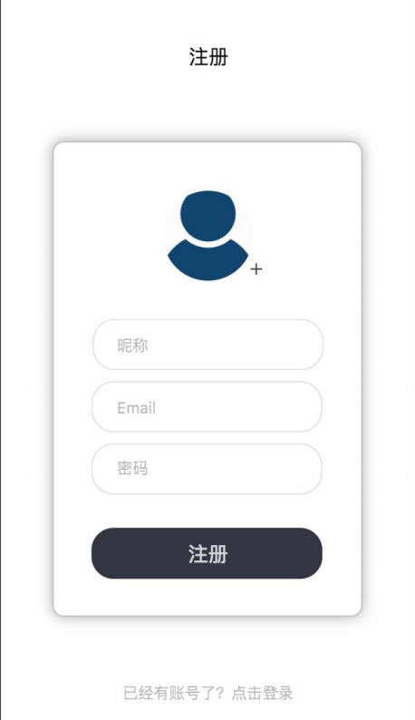

## 用户注册

---

需求：
1， 昵称：用户在应用中的昵称，必填，长度 2~6 位；昵称允许重复；

2， email：用户注册使用邮箱注册。按照正常情况，应该是发送一封验证邮件，通过验证邮件注册，本项目中，email 作为登录账号，在应用中不允许重复；必须符合 email 格；

3， 密码：用户登录的密码；长度在 4~16 位；

4， 如果注册信息错误，重新填写注册信息，如果注册 email 冲突，提示邮箱已被注册，否则注册成功，注册成功直接跳转到登录界面登录；

5， 点击【已经有账号了？点击登录】，直接跳转到登录页面；





#### user 表设计
id
邮箱  email
昵称  nickname
性别  sex   
  gender_sercret(保密) ---- gender_man(1) --- gender_womian(0)
密码  password
地区  place
头像url coverImgUrl
背景url sign

#### 注册用户接口
1. 资源路径 /users
2. 请求动作 post
3. 请求参数 昵称/邮箱/密码(用user对象接收)
4. 返回结果 JsonResult

#### 注册用户资源控制器

```java
@RestController
@RequestMapping("users")
public class UserController{

  @Autowired
  private IUserService userService;

  @PostMapping
  public JsonResult register(User user){
    JsonResult result=new JsonResult();
    try {
        userService.register(user);
    } catch (Exception e) {
        e.printStackTrace();
        result.sendErrorMsg(e.getMessage());
    }
    return result;
  }
}
```

service 操作
1. 非空校验: 邮箱或密码不能为空
2. 获取邮箱,检查是否被注册
3. 没有注册时,保存用户信息

```java
@Service
public interface UserServiceImpl{
  @Autowired
  UserMapper userMapper;

  void register(User user){
    if(!StringUtils.hasLength(user.getEmail())){
      throw new RunTimeException("邮箱或密码不能为空");
    }
    // 获取邮箱，检查是否被注册    email 和 password
    User temp=userMapper.selectByEmail(user.getEmail(),null);
    if(temp!=null){
      throw new RunTimeException("邮箱已被注册");
    }
    user.setHeadImgUrl();//头像
    user.setCoverIMgUrl();//封面
    userMapper.insert(temp);
  }
}
```


<br>
---

#### 页面显示

* 需要使用网页Dialog 移动端弹窗插件弹框:
http://sufangyu.github.io/project/dialog2/dist/demos/

* ajax 有一个同源策略,能访问资源,但无法拿到不同源的数据
* ajax 不会携带cookie到外域


----- register.html 页面显示--------
```js
$(function(){
  $("#registerBtn").ajaxForm({
    url:baseUrl+"/users",
    success:function(data){
      // 使用移动端弹窗  
      if(data.success){
          //注册成功，跳转到登陆
          $(document).dialog({
              type : 'confirm',
              titleText: '温馨提示',
              content: '恭喜你，注册成功!!',
              buttons: [
                  {
                      name: '马上登陆',
                      callback: function() {
                          window.location.href="/login.html";
                      }
                  },
              ]
          });
      }else{
          //注册失败，提示注册失败
          $(document).dialog({
              titleText: '温馨提示',
              content:data.errorMsg
          });
      }
    }
  })
})

--------common.js 配置api的域名和端口------------
var baseUrl="http://localhost:8888";
```

<br>
---

#### ajax 解决跨域访问的问题
使用cors的方式
```xml
浏览器发现这是一个跨域请求，会先发送一个OPTIONS请求询问后台是否可以跨域访问该资源，这个过程我们可以称之为”预检“。

api mvc.xml spring mvc 4.2以上版本才有
<!--
        allowed-origins ：  授权可以访问的客户端域名(多个用,分开)
        allowed-methods ：  表明服务器支持的请求的方法
        allowed-headers ：  表明服务器支持的头信息字段
        allow-credentials:  允许客户端携带跨域cookie，此时origin值不能为“*”
        max-age ：          授权的有效期时间
    -->
<mvc:cors>
    <mvc:mapping
     path="/**"
     allowed-origins="http://localhost"
     allowed-methods="GET, POST, PUT, DELETE, OPTIONS"
     allowed-headers="Content-Type,Origin,Accept,Access-Control-Allow-Headers, Authorization, X-Requested-With"
     allow-credentials="true"
     max-age="180" />
</mvc:cors>

--------------------------------------------------------
common.js
ajaxSetup：为所有AJAX请求设置默认属性
$.ajaxSetup({crossDomain: true, xhrFields: {withCredentials: true}});

crossDomain：是否允许跨域
withCredentials 为true，发ajax请求时会带上跨域的cookie
```
