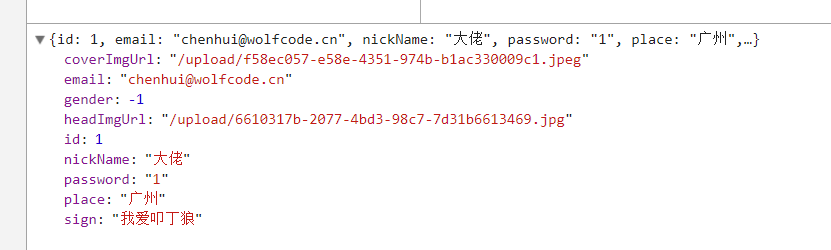
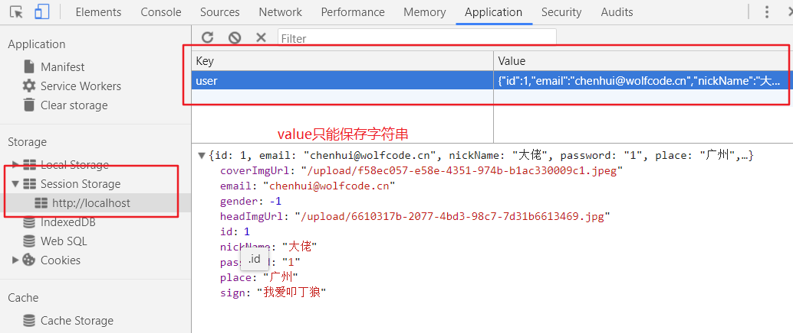

### 用户登陆

---

#### 登陆 (新增会话)
##### 接口设计
1. 资源路径 /sessions
2. 请求动作 post
3. 请求参数 邮箱/密码(用user对象接收)
4. 返回结果 JsonResult

##### sessionController

```java
@RestController
@RequestMapping("sessions")
public class SessionController{

  @Autowired
  private IUserService userService;

  @PostMapping
  public JsonResult login(User user){
    JsonResult result=new JsonResult();
    User existUser=userService.register(user);
    //使用jsonResult data 字段，传递查询的用户的数据
    result.setData(existUser);
    return result;
  }
}
```

返回的数据结果:


<br>
service 步骤分析:
* service 中
  * |-- 校验邮箱密码
  * |-- 查询是否存在
  * |-- 存在，将登陆数据保存在session中，使用UserContextHolder

```java
@Override
public User login(User user) {
   // 非空校验
   if(!(StringUtils.hasLength(user.getEmail())&&StringUtils.hasLength(user.getPassword()))){
       throw new RuntimeException("邮箱或密码不能为空");
   }
   // 查询用户是否存在
   User existUser = userMapper.selectByEmailAndPassword(user.getEmail(), user.getPassword());
   //   不存在，抛出异常
   if(existUser==null){
       throw new RuntimeException("用户不存在");
   }
   //    存在，保存数据到session作用域中,返回查询到的对象
   UserContext.setUserSession(existUser);
   return existUser;
}
```

* 前端页面
  * |-- 登陆成功跳转到主页
  * |-- 登陆失败提示信息
  * |-- 从data中获取用户数据，存放到sessionStorge中

```js
$("#loginForm").ajaxForm({
	url:baseUrl+"/sessions",
	success:function (data) {
		//登陆成功，跳转到首页,保存数据到sessionStorage中
		if(data.success){
			//将对象装成json保存在 sessionStorage
			window.sessionStorage.setItem("user",JSON.stringify(data.data));
			window.parent.location.href="/index.html";
		}else{
			//注册失败，提示注册失败
			$(document).dialog({
				titleText: '温馨提示',
				content:data.errorMsg
			});
		}
		console.log(data);
	}
})
```

<br>
---

### SessionStorge存储技术

　　sessionStorage 是HTML5新增的一个会话存储对象，用于临时保存同一窗口(或标签页)的数据，在关闭窗口或标签页之后将会删除这些数据。本篇主要介绍 sessionStorage(会话存储)的使用方式。包括添加、修改、删除等操作

参考网站 : https://www.cnblogs.com/polk6/p/5512979.html

在浏览器上保存用户信息:


##### sessionStorage对象方法使用:
```js
// 存数据 -- value值只能存字符串
sessionStorage.setItem("name","hello");

//存对象-->先将对象转换成json格式的字符串
sessionStorage.setItem("user",JSON.stringifg(user));

// 取对象--> 使用json。parse 将字符串转换成json对象
user = JSON.parse(sessionStorage.getItem("user"));
```


<br>
---

### 侧边栏显示
创建一个mine文件，存放需要登陆才能访问的资源文件

jrender插件:基于jquery 的json数据快速展示系统
render-html : $("xxx").html("ddd")
render-src : $("xxx").attr("src","ddd")

```js
var user=JSON.parse(sessionStorage.getItem("user"));
if(user){
  $(".simplePerson").renderValues(user);//渲染数据
}

-----------html 设置-----------

<p render-html="nickName"></p>
```


<br>
---

#### 注销
##### 接口设计
1. 资源路径 /sessions
2. 请求动作 delete
3. 请求参数 无
4. 返回结果 JsonResult 或 204 状态码

注销控制器方法实现
```java
@DeleteMapping
public void logout(HttpSession session,HttpSerResp resp){
  session.invalidate();
  resp.setStatus(204);
}
```

前端方法实现:
```js
$("#logout").click(function(){
  $.ajax({
    url:baseUrl+"/sessions",
    method:"delete",
    success:function(){
      //清除浏览器上保存的数据
      sessionStorage.removeItem("user";)
      // 需要整个页面去跳转-->到首页--> 否则会出现重叠
      window.parent.location.href="index.html";
    }
  })
})
```

<br>
---

#### 控制页面跳转
需求: 判断是否是登陆状态，是登陆时显示个人信息，否则显示登陆页面(使用前端路由的方式)
后端路由: 通过java代码控制页面跳转
前端路由:在前端控制页面跳转

创建一个checkLogin.js
```java
// 如果sessionStorge中有用户信息，就是登陆,如果没有旧休要登陆页面
var userStr=sessionStorage.getItem("user")
var user;
if(userStr){
  user=JSON.parse(user);
}else{
  window.location.href="login.htlm";
}
```
