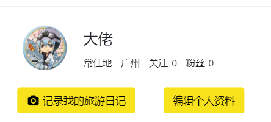
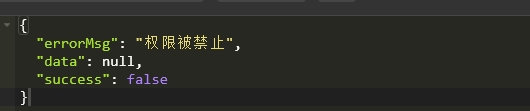

## admin 注册管理页面和app 个人信息编辑页面

---

### 后台注册用户管理页面
步骤:
1. 导入web.xml,mvc.xml,静态资源
2. 书写UserController: 分页+关键字查询

### app 我的功能页面搭建
步骤:
0. 引用checkLogin.js
1. 打开我的页面需要设置 a 标签 target="_ parent",实现父窗口跳转
2. 使用jrender显示数据



<br>
---

### 个人资料页面

#### 数据回显
1. 使用jrender显示数据
2. 使用js 设置背景图片

```js
$(".myBg").css('backgroud-image','url("'+user.coverImgUrl+'")')
```

#### app完成个人资料设置
接口设计:
1. 资源路径 /users
2. 请求动作 /put
3. 请求参数 user
4. 返回结果 user

```java
@PutMapping
public JsonResult update(User user){
   JsonResult result=new JsonResult();

   try {
       //更新操作需要判断当前的用户id 是否和传入的id 一样
       if(user.getId()!= UserContext.getUser().getId()){
           throw new RuntimeException("权限被禁止");
       }
       userService.update(user);
       result.setData(user);  //将参数返回前端进行数据缓存
   } catch (Exception e) {
       e.printStackTrace();
       result.sendErrorMsg(e.getMessage());
   }
   return result;
}
```

#### 个人资料保存(前端页面)
步骤:
1. 在表单中添加隐藏域，避免图片丢失
2. 保存按钮提交数据
3. 设置form表单put提交

```js
//点击保存用户信息
$("#saveBtn").click(function () {
	$("#infoForm").submitForm({
		url:baseUrl+"/users",
		success:function (result) {
			//返回数据不包含email,手动设置email
			result.data.email=user.email;

			if(result.success){  	//判断是否更新成功
					//保存数据到本地缓存
				sessionStorage.setItem("user",JSON.stringify(result.data));
            //返回上一个页面
				window.location.href="/mine/profiles.html";
			}else{
				//提示更新失败
				$(document).dialog({
					titleText: '温馨提示',
					content:data.errorMsg
				});
			}
		}
	})
})
```

4. 上传头像
  |-- 点击弹出选择文件对话框
  |-- 监听文件上传控件值改变事件
  |-- 获取上传的文件名，如果不为空时上传
  |-- 上传成功，回显数据，设置提交参数保存到数据库

```js

//标记是上传头像还是上传背景
var flag;

$("#headBtn").click(function(){
  flag=true;
  $("#inputFile").click();//不传function触发点击事件
})

$("#coverBtn").clcik(function(){
  flag=false;
  $("#inputFile").click();//不传function触发点击事件
})

//文件框的值改变事件
$("#inputFile").change(function(){
  if($(this).val()){//有值才提交
      $("#fileForm").ajaxSubmit({
        url:baseUrl+"/images",
        success:function(){
            if(data.status==1){
                if(flag){//头像上传
                  //  更新头像
                  $("#headImg").attr("src",data.url);
                  $("input[name=headImgUrl]").val(data.url);
                }else{
                  //更新背景图
                  $(".myBg").css("background-image",'url("'+data.url+'")');
                  $("input[name=coverImgUrl]").val(data.url);
                }

            }
        }
      })
  }
})

------
上传文件表单
<form id="fileForm" enctype="multipart/form-data" style="display:none">
  <input id="inputFile" type="file"></input>
</form>

```

### 解决图片共享问题
问题:多个tomcat 项目需要共享图片资源，需要通过第三方服务器共享图片资源

1.使用图片服务器（自定义/第三方）
2.使用nginx

### 使用oos 做文件上传(第三方)
实现步骤:
 * |-- core 项目中引入阿里云文件上传依赖
 * |-- 定义UploadUtil文件上传工具类
    * |-- 使用上传文件流方式
    * |-- 修改endPoint (地域节点)
    * |-- 修改id 和 密钥
    * |-- 使用MultipartFile 获取文件流
    * |-- bucktName(空间名称) + 文件名
    * |-- 定义一个阿里域名，返回 域名(buckt域名)+文件名做为图片的访问路径


```java
public static String uploadAli(MultipartFile file) throws Exception {

      private static final String BASE_URL="https://kiva.oss-cn-shenzhen.aliyuncs.com";

       //获取文件名
       String fileName=getFileName(file);

       // Endpoint以杭州为例，其它Region请按实际情况填写。
       String endpoint = "https://oss-cn-shenzhen.aliyuncs.com";
       // 云账号AccessKey有所有API访问权限，建议遵循阿里云安全最佳实践，
       // 创建并使用RAM子账号进行API访问或日常运维，请登录 https://ram.console.aliyun.com 创建。
       String accessKeyId = "LTAIppTCjGL1PNc6";
       String accessKeySecret = "6Kx6u4VVRdwcqt0Sm4Q7YZMb6Ofajn";

       // 创建OSSClient实例。
       OSSClient ossClient = new OSSClient(endpoint, accessKeyId, accessKeySecret);

       // 上传文件流。
       ossClient.putObject("kiva", fileName, file.getInputStream());

       // 关闭OSSClient。
       ossClient.shutdown();

       return BASE_URL+"/"+fileName;
   }


   public static String getFileName(MultipartFile file){
       String uuid = UUID.randomUUID().toString();

       String orgFileName = file.getOriginalFilename();
       String ext = "." + FilenameUtils.getExtension(orgFileName);
       String fileName = uuid + ext;
       return "trip/"+fileName;
   }
```

<br>
---


### 上传图片接口

接口设计:
1. 资源路径 /images
2. 请求动作 post
3. 请求参数 file
4. 返回结果 jsonresult

注意: 由于富文本也需要上传文件，所以需要指定返回内容的格式

```java
class ImageController{

  @PostMapping
  public Map upload(MultipartFile file){
    Map<String,Object> map=new HashMap<>();

    try {
      String url=UploadUtil.uploadAli(file);
      map.put("status",1);
      map.put("url",url);
    } catch(Exception e) {
      map.put("status",0);
      map.put("msg","上传失败");
    }
    return map;
  }

}
```


<br>
---

### 接口安全问题
需求: 如果通过用户获取修改用户的接口，使用参数暴力修改其他用户的信息时，出现接口安全问题

实现步骤:
* 限制接口需要登陆之后才能访问
* 定义注解，注解贴的接口方法需要登陆后才能访问
* 在修改方法上判断用户操作的id是否是当前登陆用户的id


##### 接口设计

```java
@Target({ElementType.METHOD})
@Retention(RetentionPolicy.RUNTIME)
public @interface RequiredLogin {
}
```

##### 登陆拦截器
```java
/**
 * 检查用户登陆拦截器
 */
public class CheckLoginInterceptor extends HandlerInterceptorAdapter {

    @Override
    public boolean preHandle(HttpServletRequest request, HttpServletResponse response, Object handler) throws Exception {
        //如果时静态资源，不拦截
        if(handler instanceof HandlerMethod ){
            HandlerMethod methodHandle= (HandlerMethod ) handler;
            boolean isNeedLogin=methodHandle.getMethod().isAnnotationPresent(RequiredLogin.class);
            boolean hasLogin=UserContext.getUser()==null;

            if(isNeedLogin&&hasLogin){//需要登陆 & 没有登陆 需要拦截, 返回状态码401: 没有权限
                response.setStatus(HttpServletResponse.SC_UNAUTHORIZED);
                return false;
            }
        }
        return super.preHandle(request, response, handler);
    }
}
```

##### 在mvc.xml中进行配置

```xml
<!--配置登陆授权拦截-->
<mvc:interceptors>
	<mvc:interceptor>
		<mvc:mapping path="/**"/>
		<bean class="com.kiva.trip.api.web.interceptor.CheckLoginInterceptor"/>
	</mvc:interceptor>
</mvc:interceptors>
```


在修改之前判断是否为当前登陆用户
```java
@PutMapping
@RequiredLogin
public JsonResult update(User user){
  .... // 省略其他代码
  if(UserContext.getCurrentUser().getId()!=user.getId()){
    throw new RunTimeException("访问被禁止");
  }
  .... // 省略其他代码
}
```

出现异常访问结果如下:



<br>
---

### 地区管理

#### 地区表设计 (region)

| 字段 | 描述     | 对应实体类属性 |
| :------------- | :------------- | :------------- |
| id         | 地区id      | id(Long)  |
| name       | Item Two    | name(String) |
| status     | 是否推荐     | Integer <br>state_disable=-1;//禁用<br>state_common=0;//普通 <br>state_hot=1;//推荐 |
| parent_ids | 上一级地区id | parent(Region)  |

<br>
#### 前端页面显示

前端使用treeview插件,显示地区
开发步骤:
1. 导入css和js
2. 导入treeview html
3. 修改全局属性data，显示根节点
4. 全局配置中，配置lazyLoad(),供懒加载调用
第一次展开可延迟加载的节点时调用此函数,该函数第一次参数时当前点击的节点
去除节点的id发送请求即可

```js
lazyLoad:function(node){
  $.get("/..",{parentId:node.id},function(data){
        // 获取到的子标签添加到节点上// 1. 要添加的自地区
        //2. 添加的上级地区的位置
        $("#treeView1").treeview('addNode',[data,node])
    })
}
```

##### 后台接口实现:

细节: 如果mapper中用到了一个参数,在判断中使用，需要在参数中添加注解

```java
@RequestMapping("selectByParent")
@ResponseBody
public List<Region> selectByParent(Long parentId){
  List<Region> region=service.selectByParent(parentId);
  ArrayList<Map<String,Object>> data=new ArrayList<>();
  // 转换成treeview插件需要的格式
  for (Region re : region) {
    Map<String,Object> map=new HashMap<>();
    map.put("text",re.getName());
    map.put("id",re.getRegion());
    if(re.getState==Region.hot()){
        map.put("tags",new String[]{"推荐"});
    }
    //调用lazyLoad(),设置子节点懒加载,给节点添加一个展开图标
    map.put("lazyLoad",true);
    data.add(map);
  }
  return data;
}
```
查询的sql语句
```sql
select * from region where parent_id is null
select * from  region where parent_id=1
```

mapper设计
```xml
<!-- 根据地区的父级id查询 地区列表-->
<select id="selectByParentId" resultMap="BaseResultMap">
   SELECT * from region
   <where>
       <choose>
           <when test="parentId == null">
               parent_id is null
           </when>
           <otherwise>
               parent_id=#{parentId}
           </otherwise>
       </choose>
   </where>
</select>

-----mapper 方法设计---------
List<Region> selectByParentId(@Param("parentId") Long parentId);
```

前端js实现

```js

$.get("/region/selectByParentId.do",function (data) { //获取所有的根地区
   $('#treeview1').treeview({
       data:[{text:'全部地区',nodes: data}],
       showTags:true, // 显示标签
       lazyLoad:function (ele) {  //设置懒加载，发请求访问子级目录
           $.get("/region/selectByParentId.do",{parentId:ele.id},function (data) {
               //添加结点
               // 1. 要添加的地区数据  2. 父节点
               $('#treeview1').treeview('addNode', [ data, ele ]);
           })
       }
   });
})


```


<br>
---

总结:
```
1. 注册用户管理
  |-- 使用分页+关键字查询

2. App我的功能页面的渲染
  |-- a 标签使用父窗口跳转 target=_ partent

3. app 编辑个人资料
  |-- 背景需要通过css方法回显
  |-- 表单隐藏域：id,_ method,headImgUrl,coverImgUrl
  图片上传
  js: 在也年添加隐藏的表单，包括文件框，点击按钮促发文件框的点击动作，利用文件框的值改变事件提交表单
  在表单的回调函数，url 回显到img,以及表单的隐藏域.利用一个标记是修改头像还是背景

  后台: 使用使用阿里云oos 图片服务器，直接用提供的文件上传工具，最后需要根据规定的结果返回  Map(status:0/1,msg) : 富文本插件会用到

  更新用户信息时，sql 不需要email和password字段

  更新成功后，将user对象重新设置到sessionStorage

4. 接口安全处理
  1. 自定义注解，利用拦截器，判断执行的方法是否需要检查session
      |-- 需要检查，没有session,返回401状态码
  2. 更新用户信息的接口，需要判断是否是当前用户


5. admin 地区管理界面
  利用treeview 插件显示地区，进入页面先查询所有根地区，利用懒加载来查询自地区
  插件必须使用规定的格式显示，在controller处理好疏忽再返回(id,text,tags)

  懒加载：
  1. 在节点属性添加lazyLoad:true(controller 返回的数据的map中)(才会出现+号)
  2. 点击+号会自动调用lazyLoad的喊出，在list.ftl的treeview中声明(全局属性)

  通过以下方法将子节点添加到父节点上
```


AccessKey ID
LTAIin7IUD7RSERC

Access Key Secret
fxynNUISUnXvVEm2PS0M3SvxbZVfGT


//----------decade--------
AccessKeyID：
LTAIppTCjGL1PNc6

AccessKeySecret：
6Kx6u4VVRdwcqt0Sm4Q7YZMb6Ofajn
