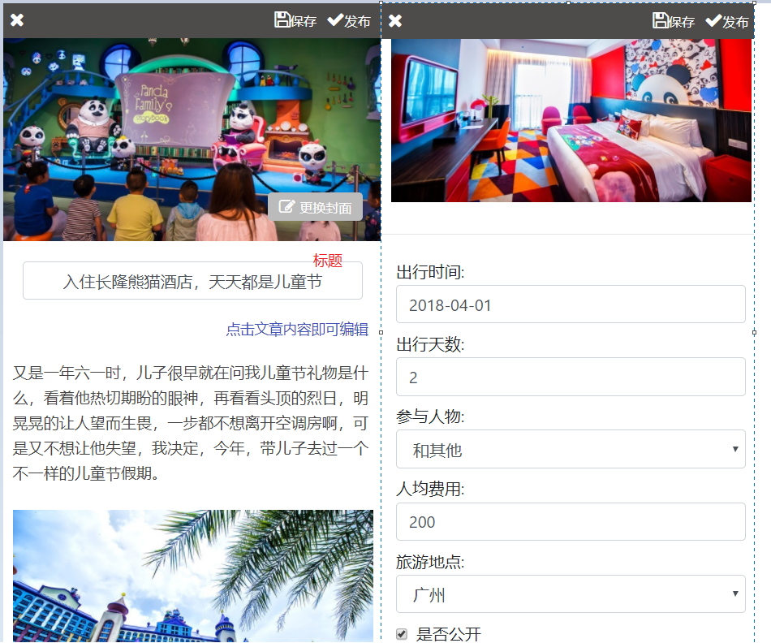
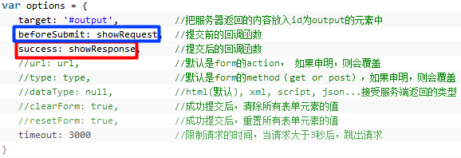
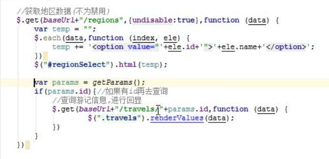

### 游记编辑界面

---
### 编辑游记

#### 需求分析
1. 可以直接更换游记封面；
2. 所有的标题/文字内容/图片，均可以采用直接编辑的方式交互完成。
3. 在游记中还需要填写：
	* a) 出发时间：选择的具体出行时间；
	* b) 人均费用：填写的本次旅行的人均费用，可以不填；
	* c) 人物：本次出行的同行人员；
	* d) 出行天数：本次出行的时间；
4. 点击右上角保存，完成本次对游记的编辑操作；
5. 点击发布，把一个游记发布到后台，后台审核通过之后，才能在前台展示；

实现效果图:


<br>
---

### 前端app实现

#### 更换封面

实现步骤:
|-- 添加文件上传表单
|-- 设置点击事件,触发文件input控件的点击事件
|-- 监听文件控件的值改变事件
|-- 如果文件名存在，提交文件表单
|-- 返回结果，回显图片数据

示例代码:
```js
<!--文件上传表单 : 设置post/多字段文件上传格式 -->
<form id="uploadForm" method="post" enctype="multipart/form-data" style="display: none">
    <input type="file" name="file" id="uploadFile">
</form>

//点击设置文件点击
$("#changeBtn").click(function () {
	 $("#uploadFile").click();
})

//监听文件上传控件的值改变事件
$("#uploadFile").change(function () {
	 //上传文件不为空
	 if($(this).val()){
			 $("#uploadForm").ajaxSubmit({
					 url:baseUrl+"/images",
					 success:function(data){
							 if(data.status){  // 回显数据
									 $("#coverUrl").attr("src",data.url);
							 }
					 }
			 })
	 }
})

```


<br>
---

### 富文本编辑器
需求:
在编辑富文本内容，这里引入Eleditor，针对移动端的富文本编辑器

参考官方文档: https://www.kancloud.cn/hihwp/eleditor/549992

1. 引入js插件

```js
<!-- 引入jQuery -->
<script src="Eleditor目录/jquery.min.js"></script>
<!-- 引入百度上传插件 -->
<script src="Eleditor目录/webuploader.min.js"></script>
<!-- 插件核心 -->
<script src="Eleditor目录/Eleditor.js"></script>
```

2. 引入富文本编辑器

```js
<!-- 内容编辑区域 -->
<div id="contentEditor"></div>

<script>
/*实例化一个编辑器*/
var artEditor = new Eleditor({
						el: '#contentEditor', // 使用编辑器的位置
						upload:{
							server: baseUrl+'/images' //文件上传的地址
						}
					});
</script>
```


* 问题:Editor 上传数据时，需要有登陆权限才能访问,需要设置Editor携带cookie的属性

```
携带cookie参数的解决方法
webuploader.create({
  withCredentials:true;
})
```

<br>
---

### 旅游地点

获取旅游地区的接口设计

| 设计项   | 设计     |
| :------------- | :------------- |
| 资源路径       | /regions/disable    |
| 请求动作       | get    |
| 请求参数       | state ！=-1（状态参数）<br> enable :是否按照禁用状态查询 |
| 返回结果       | List< Region >    |


参数封装
```java
class RegionQuery extends QueryObject{
  private Interger state; //根据状态查询
  private boolean enable; //是否按照禁用状态查询
}
```

旅游地区控制器RegionController
```java
@GetMapping
public List<Region> getListByState(RegionQueryObject qo){
	 List<Region> list=regionService.selectListByState(qo);
	 return list;
}
```
查询sql语句设计
```sql
select * from region
<where>
  <if test="state!=null">
    and state=#{state}
  </if>
  <if test="enable==true">
    and state!=-1
  </if>
</where>
```

前端页面显示
```js
//加载地区数据
 $(function () {
	 $.get(baseUrl+"/regions",{enable:true},function (data) {
			var optionHtml;
			//遍历地区列表拼接html
			$.each(data,function (index, ele) {
				 optionHtml+="<option value="+ele.id+">"+ele.name+"</option>"
			})
			$("#placeSelect").html(optionHtml);
	 })
 })
```

<br>
---

#### 保存操作
* 使用 ajaxSubmit 函数，beforSubmit属性，在表单提交之前设置封面，标题，富文本，状态添加到表单参数中




```js
//发布按钮
$("#release").click(function(){
  $("#detailForm").ajaxSubmit({
      url:baseUrl+"/travels",
      beforSubmit:function(arr){//提交之前回执行的函数
        // 作用1. 用于验证表单(可以控制表单是否提交)
        // if(!$("input[name=days]").val()){
        //   alert("出行天数不为空");
        //   return false;//不提交表单
        // }
        // return true;

        // 作用2. 在提交表单前添加表单参数
        // arr 将表单中的字段，可以将参数添加到这个数组中
        arr.push({name:"coverUrl",value:${#coverUrl}.attr("src")}),//内容
        arr.push({name:"title",value:${#title}.val()})//标题
        arr.push({name:"travalContent.content",value:artEditor.getContent);
        arr.push({name:"state",value:1);//状态
        //文章的内容
      },
      success:function(data){
				// 返回我的游记列表页面
      }
  })
})
```

<br>
---

### 新增游记文章

#### 接口设计

1. 资源路径:/travels
2. 请求动作: post
3. 请求参数: 游记travel对象
4. 返回结果: jsonResult

代码实现:
```java
//保存操作
@PostMapping
@RequiredLogin
public JsonResult save(Travel travel){
	JsonResult jsonResult=new JsonResult();
	try {
		 travelService.saveOrUpdate(travel);
	} catch (Exception e) {
		 e.printStackTrace();
		 jsonResult.sendErrorMsg(e.getMessage());
	}
	return jsonResult;
}
```

service 业务层实现:

1. 修改数据库时间字段默认是current_timestamp(创建时间和最近更新时间)
2. 设置authorId=UserContext.getUser();
3. 更新时，设置最后更新时间
4. 内容表的id需要和游记表的id保存一致，不需要使用主键自增长

代码实现
```java
public void saveOrUpdate(Travel travel) {
	if(travel.getId()==null){//增加
		 travel.setAuthor(UserContext.getUser());//保存作者
		 travelMapper.insert(travel);
		 //保存游记内容
		 TravelContent travelContent=travel.getTravelContent();
		 travelContent.setId(travel.getId()); //主键关联
		 contentMapper.insert(travelContent);
	}else{//更新
		 // 更新需要设置最后更新时间
		 travel.setLastUpdateTime(new Date());
		 travelMapper.updateByPrimaryKey(travel);

		 //更新内容
		 TravelContent travelContent=travel.getTravelContent();
		 travelContent.setId(travel.getId());
		 contentMapper.updateByPrimaryKey(travelContent);
	}
}
```


<br>
---

### 更新游记

根据游记的id 获取游记的详细信息
1. 资源路径: /travels/id
2. 请求动作: get
3. 请求参数: 无
4. 返回结果: Travel

数据回显:
1. 使用多表查询: travel(游记表)+travelContent(游记内容表)+region(地区表)

```java
@GetMapping("{id}")
public Travel getById(@PathVialiable Long id){
	return travelService.selectTravelById(id);
}
```

更新操作:
1. 不需要更新createTime,author字段
2. 更新需要设置最后更新时间，见如上service

```java
@PutMapping
public JsonResult update(Travel travel){
    JsonResult jsonResult=new JsonResult();
    try {
        travelService.saveOrUpdate(travel);
    } catch (Exception e) {
        e.printStackTrace();
        jsonResult.sendErrorMsg(e.getMessage());
    }
    return jsonResult;
}
```

<br>
---

#### 前端页面
1. 游记列表跳转编辑页面时，需要携带id 参数,使用render插件的方法，动态添加?id

```js
// render-key：代表要传递的参数
// render-fun: 代表设置参数会调用的函数
<a render-key="list.id" render-fun="getHref"/>

//在设置render值时，设置第二个参数定义函数
renderValues(..,{
	// item: 代表当前的标签
	// value: 代表需要使用的值(render-key 获取的值)
	getHref:function(item,value){
			$(item).attr('href','/mine/editTravels.html?id='+value);
	}
})
```

common.js中
获取url上的请求参数
```js
//获取url上的请求参数
function getParams() {
    //获取问号及问号后面的内容
    var url = window.location.search;
    var params = new Object();
    if (url.indexOf("?") != -1) {
        //截取问号后面的内容,再使用&分割多个属性
        var arr = url.substr(1).split("&");
        for (var i = 0; i < arr.length; i++) {
            //使用=分割为keyvalue
            var keyValue = arr[i].split("=");
            params[keyValue[0]] = keyValue[1];
        }
    }
    return params;
}
```

查询游记信息，进行回显

```js

//获取页面传递过来的游记id
var params=getParams();
if(params.id){//如果有id再去查询
	 //编辑时，需要设置请求表单为put提交
	 $("#detailForm input[name=_method]").val("put");
	 $.get(baseUrl+"/travels/"+params.id,function (data) {
			 //设置数据到render进行数据回显
			 $(".travels").renderValues(data.data);
			 //数据回显后才设置编辑文本
			 // artEditor.append(data.data.travelContent.content);
	 })
}

富文本显示:render-html("travel.content")
<div id="contentEditor" render-html="travelContent.content">


checkBox 回显: render-attr="checked=isPublic"
<input type="checkbox"  name="isPublic" render-attr="checked=isPublic">是否公开


place 回显:
使用多表查询地区列表,需要在查询列表之后才能进行数据显示，因此，获取数据的请求代码存放在获取地区列表之后

```
处理地区数据异步请求的问题


<br>
---

#### 细节:
前端页面:
问题1: 在编辑页面，需要设置表单提交方式为put
> 设置put请求只设置 _method ,value值在获取url 参数 id 时进行设置

问题2 : 先创建了edit对象，在请求后渲染数据后
向编辑器添加内容，而不直接使用render-html,否则会导致编辑器不生效
> 在渲染数据之后,使用富文本插件设置内容
Edr.append(data.travelContent.content);

后台:
在queryObject 添加一个orderBy字段，设置排序
> // 按照更新时间倒序
qo.setOrderBy("lastUpdateTime desc");
