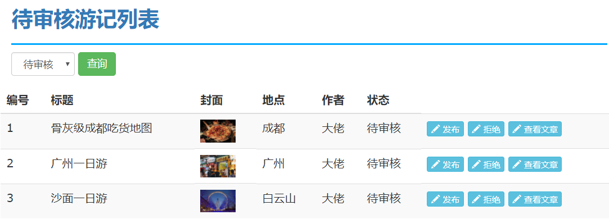
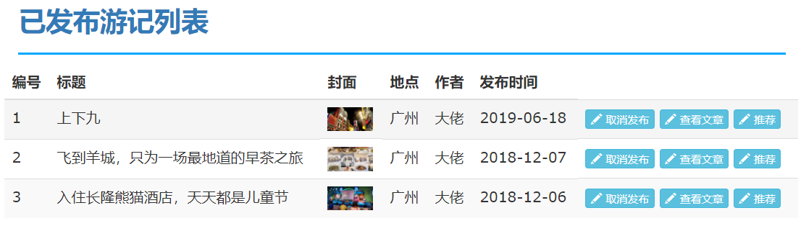

## 游记管理

### 需求分析
##### admin 待审核游记列表
* 默认查询待审核游记,并且是公开的,也可以使用下拉框查询已拒绝的游记
* 按照最后更新时间正序排序



##### admin已发布游记页面
* 只查询已经发布状态的
* 按照发布时间倒序排序



<br>
---
### 待审核列表

admin 待审核游记列表 contoller
```java
@GetMapping("/list")
public String list(@ModelAttribute("qo") TravelQuery qo, Model model){
   //默认是待审核 并且是公布的才能查询
   if(qo.getState()==null){
       qo.setState(Travel.STATE_WAIT);
   }
   qo.setIsPublic(true);
   qo.setOrderBy("lastUpdateTime asc"); // 按照更新时间进行排序
   PageInfo<Travel>  pageInfo =travelService.selectByState(qo);
   model.addAttribute("pageInfo",pageInfo);
   return "travel/list";
}
```

前端页面显示
1. 设置下拉框 option=1 待审核  option=-1已拒绝
2. 根据状态回显下拉框
    $("#stateSelect").val(qo.state);
3. 多表关联查询place,author字段
4. 状态名称的回显,在domain 类中添加getStateName()
5. 添加操作按钮：发布  拒绝  查看文章
6. 查看文章
    |-- 显示模态框，将查询的游记内容显示在模态框中
    |-- 设置图片填充样式


```js
// ------查看文章---------
<a class=".btn-book" data-id=${e.id}>查看文章</a> 设置id

//----------设置点击事件-----
$(".btn-book").click(function(){
  var id=$(this).data("id");
  $.get("/travel/getContentById.do",{id:id},function(data){
      //交由模态框中显示
      $("#inputModel .model-body").html(data.content);
      $("#inputModel").model("show");
    })
})
```

设置模态框的图片100%

```css
<style>
.model-body img{
  width:100%
}
</style>
```

controller 接口设计
```java
@RequestMapping("getContentById")
@ResponseBody
public TravelContent getContentById(Long id){
  return service.getContentById(id);
}
```


#### 发布/拒绝操作

* 发布：
  * 设置状态为发布状态 btn-state=2
  * 如果是对游记进行发布，设置游记的发布时间
* 拒绝:
  * 设置状态为拒绝状态 btn-state=-1


```js
$(".changeState").click(function () {
    var id=$(this).data("id");  //获取游记id
    var state=$(this).data("state");//获取状态
    $.get("/travel/updateState.do",{id:id,state:state},function (data) {
        showResult(data);
    })
})
```


---------controller--------

```java
@RequestMapping("/updateState")
@ResponseBody
public JsonResult updateState(Travel travel){
  ...//省略多行
    // 发布状态: 设置 发布状态 +发布时间
    // 拒绝状态: 设置拒绝状态
    // 判断是否是发布状态,-->添加发布时间
    if(travel.getState()==Travel.STATE_RELEASE){
        travel.setReleaseTime(new Date());
    }
    travelService.updateState(travel);
    ...
}
```
sql语句
```sql
update travel set state=#{state}
where id=#{id}
```


<br>
---

### 已发布游记界面

步骤:
1. 查询已经发布状态的公开的游记
2. 按照发布时间排序
3. 取消发布: 修改状态为拒绝状态

```java
@GetMapping("/releaseList")
public String releaseList(@ModelAttribute("qo") TravelQuery qo, Model model){
    //默认是发布状态 并且是公布的才能查询
    qo.setState(Travel.STATE_RELEASE);
    qo.setIsPublic(true);
    // 按照发布时间倒序
    qo.setOrderBy("releaseTime desc");
    PageInfo<Travel>  pageInfo =travelService.selectByState(qo);
    model.addAttribute("pageInfo",pageInfo);
    return "travel/releaseList";
}
```

总结:
1. app 游记的新增和编辑页面
    |-- 显示的地区不能显示已经禁用的数据
    |-- 利用beforeSubmit方法，添加额外添加的数据(封面，标题，内容 content,状态)
    |-- 新增游记时，设置作者,先保存游记表，再保存内容表
    |-- 更新
    编辑游记
    |-- 编辑前需要先回显数据，通过前一个页面传递id,
    |-- 设置表单的提交方式，设置富文本的回显内容，地区数据的回显

2. admin 待审核游记界面(发布，拒绝，查看文章)
