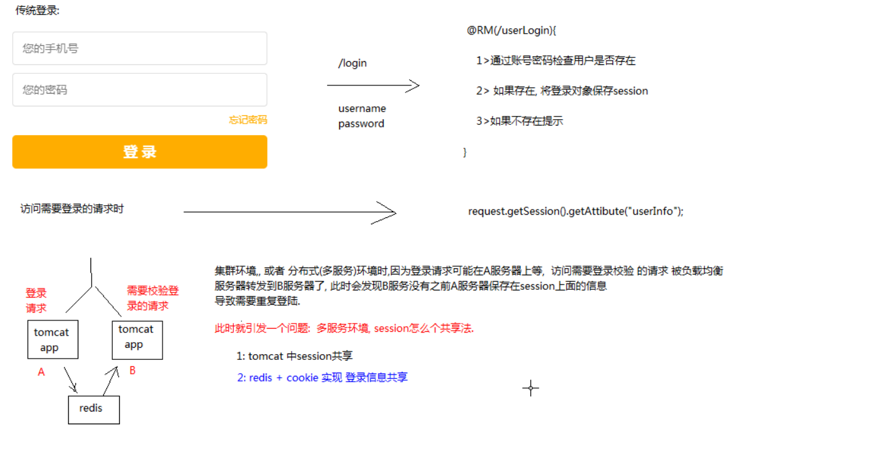
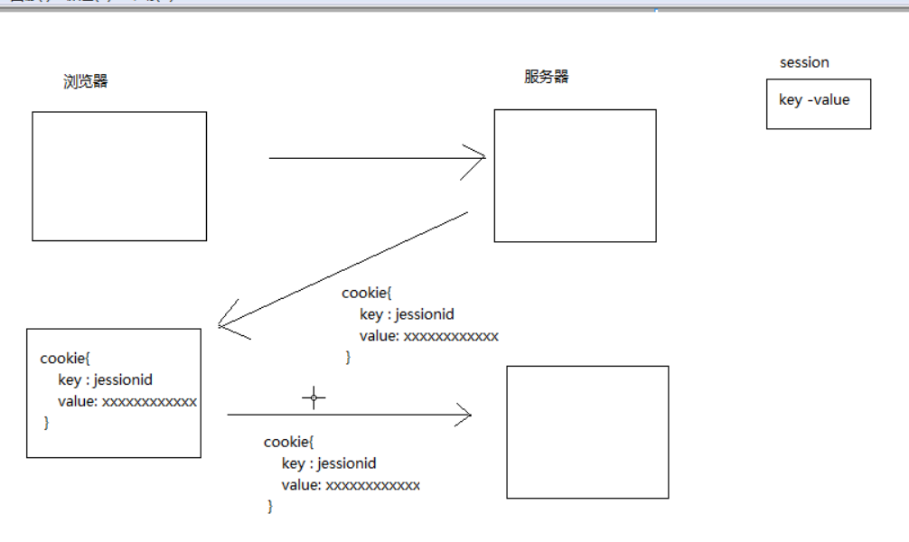
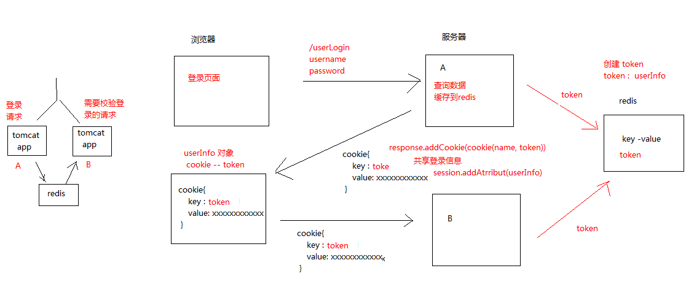

## 登陆操作

>集群环境或者是分布式环境下,登陆请求可能在A服务器上，访问需要登陆校验的请求时被负载均衡服务器转发到B服务器了，此时会发现B服务没有之前A服务保存在session上面的信息,导致需要重复登陆

>问题: 多服务环境下,session 怎么共享?

```java
1. tomcat 中session共享
    |-- ngnix 可以根据ip将去访问同一个服务器
    |-- tomcat 可以实现一次访问去其他服务器更新session
2. redis + cookie 实现登陆信息共享
    |-- redis保存:
        |-- key : 用户登陆token  (前缀+UUID)
        |-- value : 登陆信息  (UserInfo)
    |-- cookie 将登陆token保存在浏览器(同一浏览器访问不同服务器)
      |-- key：cookiename
      |-- value :  用户登陆token
```



#### 传统cookie-session
* 使用浏览器发送登陆请求,服务器端校验登陆信息
* 登陆成功，保存用户信息到session中,返回浏览器一个cookie对象
* cookie 对象时保存用户使用的是哪一个session对象
    |-- key : JSessionId
    |-- value : 具体的session对象的地址值(sessionId值)




#### 分布式cookie-session原理

分布式环境下存在session不能在俩个服务器共享的问题，这里使用redis缓存登陆后的用户信息
1. 使用浏览器发送登陆请求,服务器端校验登陆信息
2. 登陆成功，保存用户信息到redis中
      |-- key : 用户登陆token  (前缀+UUID)
      |-- value : 登陆信息  (UserInfo)
3. cookie 将登陆token保存在浏览器(同一浏览器访问不同服务器)
      |-- key：cookieName
      |-- value :  用户登陆token




#### 用户登陆分析:
1. 登陆判断与登陆信息缓存
2. 将缓存token通过cookie返回浏览器中
3. 登录校验

步骤:
```
LoginController.userLogin
    |-- 调用service登陆方法，返回token
    |-- 添加cookie,封装CookieUtil,保存token到浏览器上
    |-- 从redis查询数据，将用户信息保存到session中，方便下一个页面获取数据

UserInfoServiceImpl.userLogin方法,返回token
    |-- 查询数据库判断账号和密码是否存在
        |-- 不存在时抛出异常
    |-- 缓存登陆信息(调用userInfoRedisService的方法)
        |-- key：用户登陆前缀+ token,一个随机uuid值
        |-- value: 用户信息对象

trip-cache-api 中创建userInfoKeyPrefix
    |-- 设置session保存时间为30分钟

trip-cache-api 中创建 IUserinfoRedisService
    |-- addToken方法保存 token-userinfo
    |-- 修改RedisServiceImpl.set方法
        |-- set方法设置value 接收类型是泛型
          |-- 可以用于接收任意类型
        |-- 定义beanToString用于转换,将value对象值转换成json字符串类型
          |-- 方便类型转换
    |-- 定义一个getUserInfoByToken
        |-- 每次获取时,重新 key 的存活时间
        |-- 调用redisService的expire方法
```

#### RedisServiceImpl 代码重构
```java
@Autowired
RedisTemplate redisTemplate;

// 保存数据
@Override
public <T> void set(BaseKeyPrefix prefix, T value) {
    ValueOperations valueOperations = redisTemplate.opsForValue();
    String valueStr=bean2String(value);
    if(prefix.getTime()>=0){
        //保存数据设置超时时间
        valueOperations.set(prefix.getKey(),valueStr,prefix.getTime(), TimeUnit.MINUTES);
    }else{
        valueOperations.set(prefix.getKey(),valueStr);
    }
}

// 将传递的对象转换成json字符串类型
private <T> String bean2String(T value) {
    Class clazz = value.getClass();
    if(clazz==int.class||clazz==Integer.class){
        return value+"";
    }else if(clazz==float.class||clazz==Float.class){
        return value+"";
    }else if(clazz==double.class||clazz==Double.class){
        return value+"";
    }else if(clazz==byte.class||clazz==Byte.class){
        return value+"";
    }
    return JSON.toJSONString(value);
}

//判断是否存在
@Override
public boolean exist(BaseKeyPrefix prefix) {
    return redisTemplate.hasKey(prefix.getKey());
}

// 获取数据时，将json数据转换成对象
@Override
public <T> T get(String key,Class<T> clazz) {
    Object value = redisTemplate.opsForValue().get(key);
    if(value!=null){//将value作为json转成String
        return JSON.parseObject(value+"",clazz);
    }
    return null;
}

//设置过期时间--> 每次获取用户信息时都需要重新设置过期时间
@Override
public void expire(BaseKeyPrefix prefix) {
    redisTemplate.expire(prefix.getKey(),prefix.getTime(),TimeUnit.SECONDS);
}
```

<br>
---
#### Cookie 添加操作

```java

@RequestMapping("/userLogin")
public JsonResult userLogin(HttpSession session, HttpServletResponse resp, String username, String password) throws DisableException {

    String token = userService.userLogin(username, password);

    // 添加cookie
    CookieUtils.addCookie(CookieUtils.USER_TOKEN_IN_SESSION,token,resp);

    //登陆成功之后信息放在redis,所以登陆成功返回页面上没有登陆信息，需要额外指定
    session.setAttribute("userInfo",userInfoRedisService.getToken(token));

    return new JsonResult();
}

//-------- CookieUtils 的封装----------------
public class CookieUtils {

    public static final String USER_TOKEN_IN_SESSION  = "user_token_in_session";

    public static void addCookie(String cookiename, String value, HttpServletResponse resp) {
        //保存token到cookie中
        Cookie cookie=new Cookie(cookiename,value);
        cookie.setPath("/");
        cookie.setMaxAge(ConstantsConn.USER_INFO_TOKEN_TIME*60); //单位是秒
        resp.addCookie(cookie);
    }
}
```


<br>
---
#### 首页界面
```
1. 添加
  IndexController.index方法，跳转到index页面
    |-- 需要设置RequestMapping("")  //默认跳转
    |-- 引入common+index静态模板资源
```


总结:

```
1. redis 服务整合
2. redis 结构构建
    BasePrefix : redis 保存key需要设置前缀信息
    VerifyCodePrefix: 子前缀包装类

    IRedisService :  redis 命令操作,不涉及业务逻辑
    IVerifyCodeRedisService : 业务缓存逻辑服务
3. 验证码的操作流程
4. java 发送http请求
5. 真实短信发送
6. 用户登陆
  |-- 传统用户登陆逻辑(原理)
  |-- 分布式的用户登陆原理
    |-- redis get set 泛型封装操作
    |-- redis 设置时间操作
    |-- cookie操作
```
