## 前端目的地

### 热门目的地

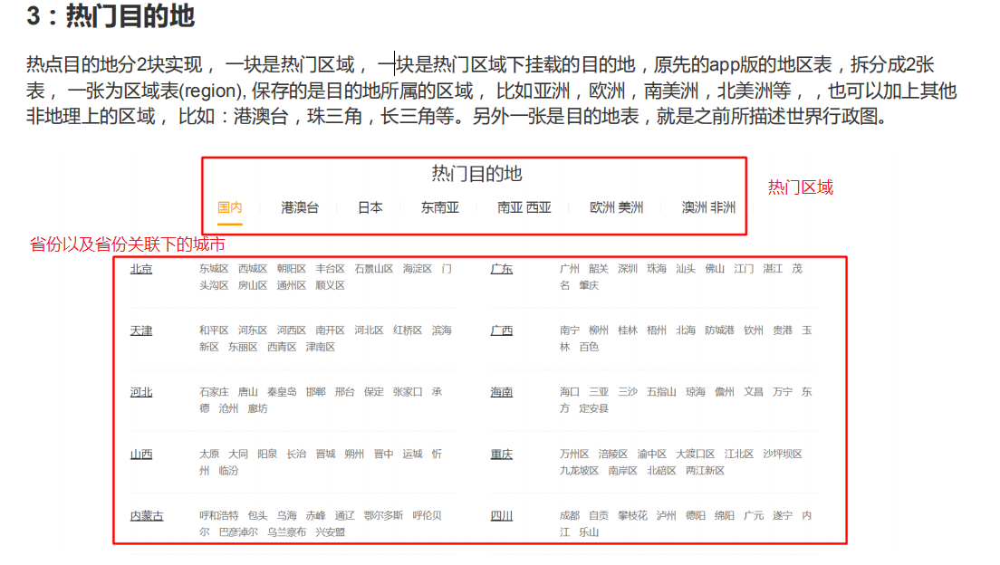

目的地切换
```
目的地页面跳转
@RequestMapping("")
DestincationController.index()
查询热门区域
    |-- 查询热门区域，按照序号进行先后排序
    |-- queryHotList(isHot=1 , order by enqueue)

查询目的地
步骤1： 通过regionId查询目的地数据,如果是-1显示国内数据
步骤2： 将查询出来拼接出想要的格式(html块,使用freemark)
步骤3： 将拼接的指定格式数据html块，拼接到页面上
    |-- Destination(目的地) -->List<Destination> children
        |---额外sql查询相关的子目的地
    |-- 查询国内分支:如果 rid=-1的数据
        |-- rid 是-1, 查询目的地中parent_id=1的数据
    |-- 将查询出来的数据进行分半切割(页面进行俩个列表的显示)
        |-- leftDest---->list.subList(0,size/2+1);
        |-- rightDest---->list.subList(size/2+1,size);
```
相关代码
```java
//根据区域id查询热门目的地
@RequestMapping("/getHotDestByRegionId")
public String getHotDestByRegionId(Model model,Long regionId){

  // 根据区域查询关联的目的地的数据 ， 如果是-1需要查询 parent_id=1 的目的地数据
  List<Destination> destinations = destinationService.queryByRegionId(regionId);
  int size = destinations.size();
  //leftDests
  model.addAttribute("leftDests",destinations.subList(0,size/2+1));
  //rightDests
  model.addAttribute("rightDests",destinations.subList(size/2+1,size));
  model.addAttribute("regionId",regionId);
  //返回 html格式数据
  return "destination/hotdestTpl";
}
```

### 目的地导航
需求分析:
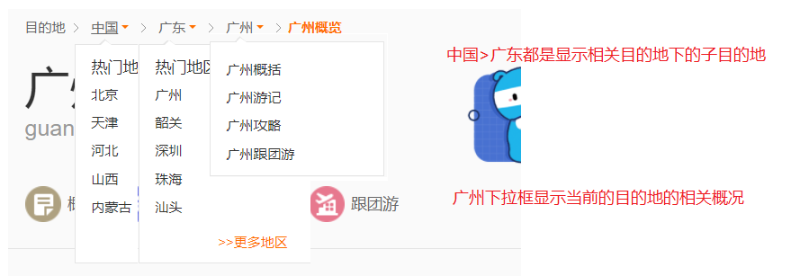

步骤分析:
```
  |-- 点击目的地跳转到guide.ftl页面
      |-- guide.ftl页面中引用目的地导航页面 toast.ftl
  |-- 返回/guide页面时需要返回 toast 数据 和 dest 数据
      |-- toast: 根据当前的目的地id查询上一级目录列表数据(广州->广东->中国)
          |-- 需要移除列表最后一个数据(广东->中国)
      |-- dest:是最后一个数据(显示广州)
```

相关代码逻辑:
```java
//跳转到目的地明细页面
 @RequestMapping("/guide")
 public String guide(Model model,Long id){
     List<Destination> toast = destinationService.getToast(id);
     Destination dest = toast.remove(toast.size() - 1);

     // 返回toasts数据进行导航栏显示(需要回显子地区)，不包括最后一级
     model.addAttribute("toasts",toast);
     //返回dest数据，最后一级的数据
     model.addAttribute("dest",dest);

     return "destination/guide";
 }
```

### 攻略管理页面
### 大攻略
一个大攻略主要用于管理攻略分类数据
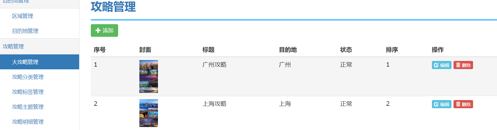

#### 实体类设计
```java
@Getter
@Setter
public class Strategy extends BaseDomain {

    public static final int STATE_NORMAL = 0; //正常
    public static final int STATE_COMMEND= 1;   //推荐

    private Destination dest; //绑定目的地

    private String title;  //标题
    private String subTitle; //副标题
    private String coverUrl; //封面图片
    private int state = STATE_NORMAL;  //状态
    private int sequence;  //排序

    public String getStateDisplay(){
        return state == STATE_NORMAL ? "正常" : "热门";
    }
}
```

#### 添加/编辑操作

需求分析:
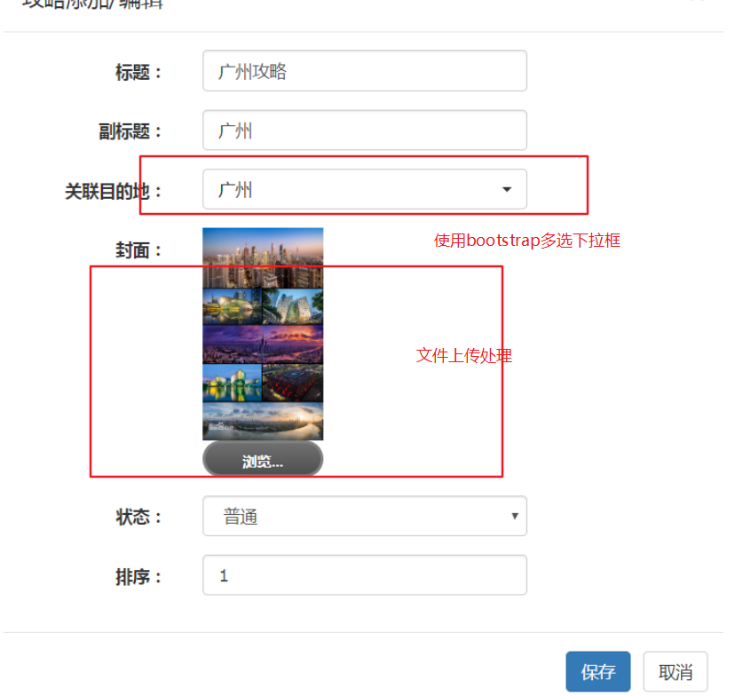

1. 文件上传
使用uploadifive文件上传js插件
  |-- 后台定义文件上传控制器 upload(MultipartFile pic)
  |-- 如果是保存本地: spring boot 需要在properties中配置保存路径
  |-- @Value注入文件路径

2. 查询关联目的地 getDestByDeep()
  |-- 使用bootstrap多选下拉框样式


前端页面文件上传设置
```js
//图片上传
$('.imgBtn').uploadifive({
    'auto' : true, //自动提交
    'uploadScript' : '/uploadImg', // 文件上传的路径
    buttonClass:"btn-link",
    'fileObjName' : 'pic', //图片上传后，早springmvc映射方法接收的参数名
    'buttonText' : '浏览...', //按钮文本
    'fileType' : 'image', // 指定上传的图片
    'multi' : false,  // 是否多文件上传
    'fileSizeLimit'   : 5242880,  //上传图片大小
    'removeCompleted' : true, //取消上传完成提示
    'uploadLimit' : 1, //一次允许上传文件个数
    //'queueSizeLimit'  : 10,
    'overrideEvents': ['onDialogClose', 'onError'],    //onDialogClose 取消自带的错误提示
    'onUploadComplete' : function(file, data) {
        console.log(data);
        $("#imgUrl").attr("src" , "/" + data); // 返回数据需要加 / 表示绝对路径
        $("#coverUrl").val("/" + data);
    },
    onFallback : function() {
        $.messager.alert("温馨提示","该浏览器无法使用!");
    }
});
```
```
|-- 文件上传插件:Uploadify
|-- 图片上传
    |-- auto
    |-- uoloadScript:图片上传过来处理路径
    |-- fileObjName:图片上传后，早springmvc映射方法接收的参数名
    |-- buttext：按钮文本
    |-- fileType:指定上传的图片
    |-- multi: 是否为多文件上传，设置为单文件
    |-- fileSizelimit: 问价上传大小
    |-- removeCompleted:取消上传完成提示
    |-- uploadKimit: 一次允许上传文件个数
    |-- queueSizeLimit: 文件上传等待队列大小
    |-- overrideEvents ： 取消自带错误提示
    |-- onUploadComplete:文件上传成功调用
        |-- data请求方法处理完之后，传回来的数据,约定图片的路径
```

配置文件上传路径
```properties
file.path=f:/img/upload
spring.resources.static-locations=classpath:/META-INF/resources/,classpath:/resources/,classpath:/static/,classpath:/public/,file:${file.path}
```

文件上传相关代码
```java
// 获取文件上传的路径
@Value("${file.path}")
private String basePath;

//单文件上传
@RequestMapping("/uploadImg")
@ResponseBody
public String uploadImg(MultipartFile pic){
    return UploadUtil.upload(pic,basePath);
}
```

### 攻略分类

攻略分类， 对所有攻略的归类，没有固定现在， 一般分：概况，路线，景点，人文，美食，交通等。只要与衣食住行相关都可以称为一个类， 由系统后端客服/运营维护。

1. 攻略分类实体类设计

```java
/**
 * 攻略分类： 从属于某个目的地
 */
@Setter
@Getter
public class StrategyCatalog extends BaseDomain {

    public static final int STATE_NORMAL = 0;  //显示
    public static final int STATE_DISABLE = 1;  //禁用

    private Strategy strategy;  //大攻略管理
    private Long destId;  //目的地
    private int state = STATE_NORMAL;  //状态
    private String name;  //分类名
    private int sequence; //排序

    private List<StrategyDetail> details = new ArrayList<>();

    public String getStateDisplay(){
        return state == STATE_NORMAL ? "正常" : "禁用";
    }
    ...
}
```

#### 1. 攻略分类列表
查询列表
  * |-- 攻略分类分页列表 (可以使用JPA或mybatisplus)
  * |-- 大攻略列表数据(用于编辑时进行界面下拉框数据回显)

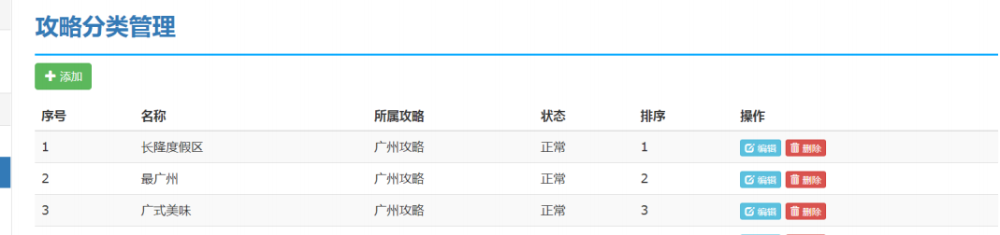

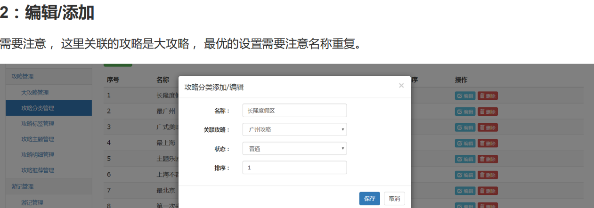

<br>
---
## 攻略标签


* 列表查询:只做简单的分页查询

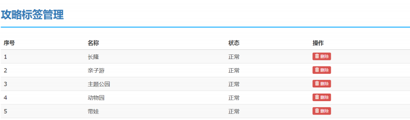

<br>
---
## 攻略主题

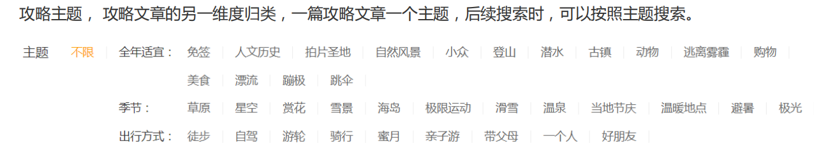

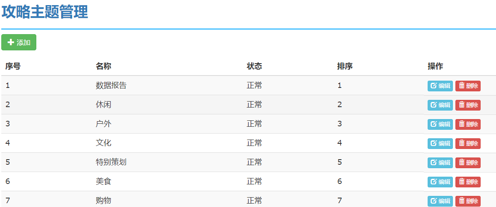

<br>
---
## 攻略明细(文章)
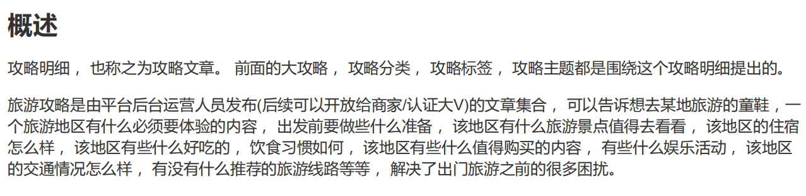

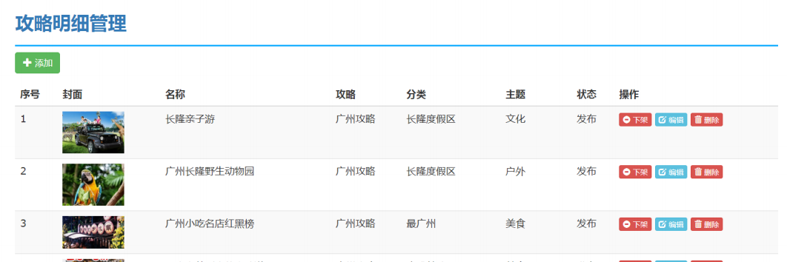

#### 编辑页面
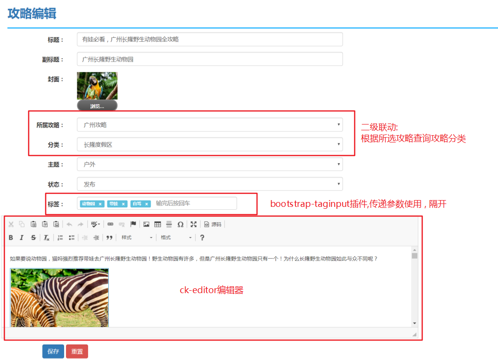

攻略内容表:id+content 其中 id 和detail 中的id一致

```
1. 修改下架状态  updateState(id,state)
2. 添加/编辑文章 input(Model model,Long id)
  |-- 根据id 查询明细对象
  |-- 根据id 查询明细内容
  |-- 查询大攻略列表数据
  |-- 查询攻略主题列表数据
  |-- 查询攻略分类()
    |-- 监听大攻略下拉框的值改变事件
    |-- 根据所选大攻略查询分类集合
    getCatalogByStrategyId()

bootstrap-taginput插件 : 使用tags返回标签数据，使用 , 隔开
ck-edictor 富文本编辑器: 需要定义返回结果的数据

saveOrUpdate(StrategyDetail,String tags)
  |-- 处理关联的目的地
    |-- 根据大攻略的id查询出关联的目的地
  |-- 作者
  |-- 摘要:summary
    |-- 1.运营人员自己添加的
    |-- 2. 截取文章中的前200字
        |-- 判断文章是否大于200字
        |-- 大于200时，截取设置summary
        |-- 其他<200,直接设置
  |-- 当前创建的时间(创建时设置)
  |-- isabroad是否国外(调用destination.isAbroad(Long id))
      |-- 根据查询出的目的地判断是否是海外
      |-- 查询目的地的上一级目录，根目录是否是中国来判断
  |-- 保存时需要添加文本内容    
  |-- 编辑时需要修改文本内容
  |-- 处理标签(处理重复功能)
      |-- 先删除所有标签的关联关系，再进行添加或更新动作(deleteRelation)
      |-- 根据 , 进行切割,迭代标签数组
      |-- 保存标签数据
      |-- 维护标签和明细的多对多关系(中间表)

```

标签回显
```sql
SELECT GROUP_CONCAT(st.`name`)
from strategy_tag st
LEFT JOIN strategy_tag_relation str
on st.id=str.tag_id
WHERE str.detail_id=1
```

## 前端
### 目的地概况
需求：查询当前目的地下的所有攻略分类，同时关联查询各个分类下的所有攻略：


 #### 概况查询(guide页面)
 ```
 |-- 查询出当前目的地的攻略分类 queryCatalogByDestId(destId)
 |-- 分类中关联明细列表(额外sql 查询) selectDetailByCatalogId 只查询id和title
 |-- 点击概况: 跳转到概况详情页面
 |-- 点击文章：跳转到文章明细
```

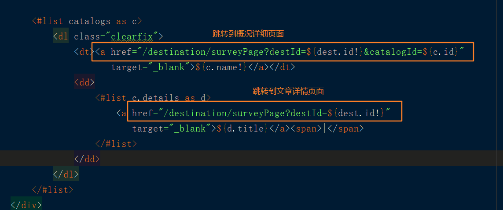


### 概况详情页面(/surveyPage页面)
需求分析:

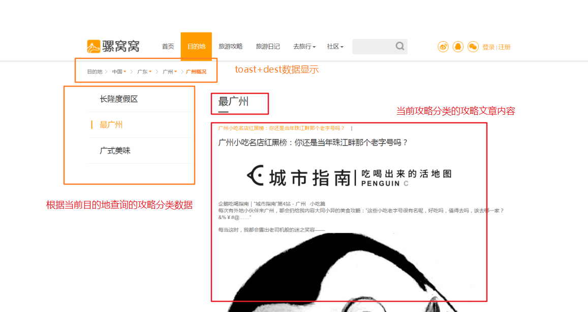

步骤分析:
```java
|-- StrategyCatalogQuery接收参数：destId,catalogId
|-- 页面导航栏需要共享toasts和dest数据
    |-- 返回/survey模板页面数据回显
|-- catalogs :左边的分类列表数据（destId查询）
|-- catalog :查询分类的单个数据(catalogId查询)
|-- detail : 默认查询第一个明细数据
     |-- 根据catalog获取第一个攻略文章，查询文本内容
```


### 目的地下攻略
需求分析:

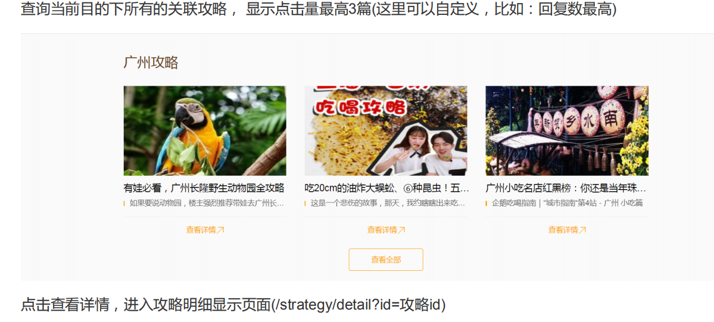

步骤分析:
  * |-- 显示目的地下点击量最高的攻略3个
  * |-- guide 方法上调用detailService.getDetailTop3(destId)

```sql
<!-- 查询指定目的地的文章明细点击量最高的3条数据 -->
<select id="selectDetailTop3" resultMap="BaseResultMap">
  select id,title,coverUrl,summary from strategy_detail where dest_id=#{id} order by viewnum desc limit 3
</select>
```

攻略操作(StrategyController)
  |-- /detail(id)? 根据id查询明细和明细内容


查看更多
StrategyDetail
  |-- list?destId
  |-- 查询标签数据
  |-- 条件查询--> tag.id !=-1 destId!=-1
  |-- toastId

  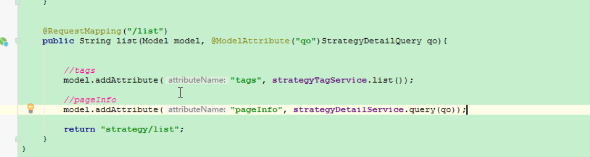
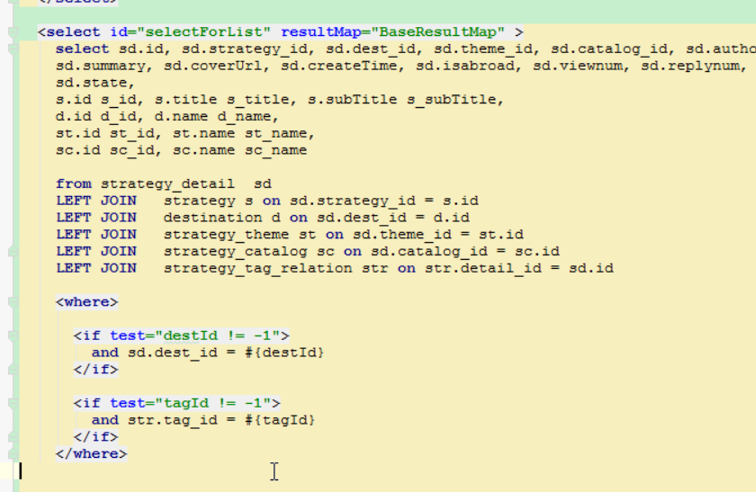
